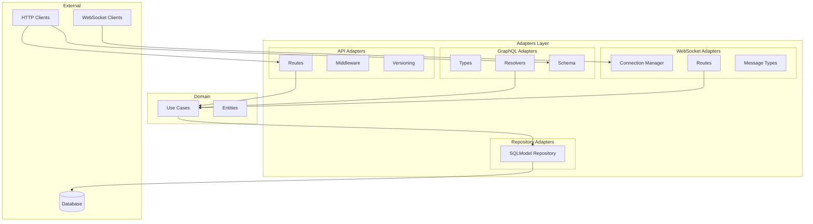

# Design Document: Adapters Code Review

## Overview

Este documento descreve o design das melhorias e correções identificadas no code review da camada de adapters (`src/my_api/adapters`). A camada segue o padrão de arquitetura hexagonal (Ports and Adapters), onde os adapters são responsáveis por traduzir entre o mundo externo (HTTP, WebSocket, banco de dados) e o domínio da aplicação.

### Escopo do Code Review

A análise abrange:
- **API Layer**: Routes, middleware, versioning
- **GraphQL Layer**: Types, resolvers, schema
- **WebSocket Layer**: Connection manager, message types, routes
- **Repository Layer**: SQLModel repository implementation

### Problemas Identificados

| Severidade | Componente | Problema |
|------------|------------|----------|
| High | `sqlmodel_repository.py` | Comparação booleana com `== False` pode causar problemas |
| Medium | `rate_limiter.py` | Validação de IP pode ser bypassada com headers malformados |
| Medium | `request_id.py` | Falta validação do formato do X-Request-ID |
| Medium | `auth/constants.py` | Senhas hardcoded em texto plano |
| Low | `versioning.py` | Extração de versão não valida formato estritamente |
| Low | `types.py` (GraphQL) | Cursor decode não trata todos os casos de erro |
| Low | `manager.py` (WebSocket) | Rooms vazias não são limpas automaticamente |

## Architecture



## Components and Interfaces

### 1. SQLModelRepository Improvements

**Problema**: Uso de `== False` para comparação booleana pode causar warnings e comportamento inesperado.

**Solução**: Usar `is_(False)` do SQLAlchemy para comparações booleanas explícitas.

```python
# Antes (problemático)
.where(self._model_class.is_deleted == False)  # noqa: E712

# Depois (correto)
from sqlalchemy import false
.where(self._model_class.is_deleted.is_(false()))
```

### 2. Rate Limiter IP Validation

**Problema**: A validação de IP pode ser bypassada com headers malformados.

**Solução**: Adicionar validação mais robusta e logging de tentativas suspeitas.

```python
def _is_valid_ip(ip: str) -> bool:
    """Validate IP address format with strict checks."""
    if not ip or len(ip) > 45:  # Max IPv6 length
        return False
    try:
        ipaddress.ip_address(ip)
        return True
    except ValueError:
        return False
```

### 3. Request ID Validation

**Problema**: O middleware aceita qualquer valor no header X-Request-ID sem validação.

**Solução**: Validar formato UUID ou gerar novo ID se inválido.

```python
import re

UUID_PATTERN = re.compile(
    r'^[0-9a-f]{8}-[0-9a-f]{4}-[0-9a-f]{4}-[0-9a-f]{4}-[0-9a-f]{12}$',
    re.IGNORECASE
)

def _is_valid_request_id(request_id: str) -> bool:
    """Validate request ID format (UUID)."""
    return bool(UUID_PATTERN.match(request_id))
```

### 4. Auth Constants Security

**Problema**: Senhas de demo hardcoded em texto plano.

**Solução**: Mover para variáveis de ambiente ou remover em produção.

```python
# Adicionar warning em produção
import warnings
from my_api.core.config import get_settings

if not get_settings().debug:
    warnings.warn(
        "Demo users should not be used in production",
        UserWarning,
        stacklevel=2
    )
```

### 5. GraphQL Cursor Handling

**Problema**: `decode_cursor` pode expor informações internas em erros.

**Solução**: Melhorar tratamento de erros com mensagens genéricas.

```python
def decode_cursor(cursor: str, prefix: str = "cursor") -> str:
    """Decode cursor with safe error handling."""
    if not cursor:
        raise ValueError("Cursor cannot be empty")
    try:
        decoded = base64.b64decode(cursor.encode()).decode()
        parts = decoded.split(":", 1)
        if len(parts) != 2 or parts[0] != prefix:
            raise ValueError("Invalid cursor")
        return parts[1]
    except Exception:
        raise ValueError("Invalid cursor format")
```

### 6. WebSocket Room Cleanup

**Problema**: Rooms vazias permanecem na memória após todos os clientes saírem.

**Solução**: Implementar limpeza automática de rooms vazias.

```python
def leave_room(self, client_id: str, room: str) -> bool:
    """Remove client from room and cleanup if empty."""
    if room in self._rooms:
        self._rooms[room].discard(client_id)
        # Cleanup empty rooms
        if not self._rooms[room]:
            del self._rooms[room]
        return True
    return False
```

## Data Models

### Error Response Model (RFC 7807)

```python
class ProblemDetail(BaseModel):
    """RFC 7807 Problem Details for HTTP APIs."""
    type: str = Field(description="URI reference identifying problem type")
    title: str = Field(description="Short human-readable summary")
    status: int = Field(description="HTTP status code")
    detail: str | None = Field(default=None, description="Explanation")
    instance: str | None = Field(default=None, description="URI reference")
    errors: list[dict] | None = Field(default=None, description="Validation errors")
```

### WebSocket Message Model

```python
class WebSocketMessage(BaseModel):
    """Base WebSocket message with validation."""
    type: str = Field(min_length=1, max_length=50)
    timestamp: datetime = Field(default_factory=lambda: datetime.now(tz=timezone.utc))
    
    model_config = {"extra": "forbid"}  # Reject unknown fields
```

## Correctness Properties

*A property is a characteristic or behavior that should hold true across all valid executions of a system-essentially, a formal statement about what the system should do. Properties serve as the bridge between human-readable specifications and machine-verifiable correctness guarantees.*

### Property Reflection

Após análise do prework, as seguintes propriedades foram consolidadas:

- Properties 1.1 e 1.3 podem ser combinadas em uma propriedade de integridade de dados
- Properties 2.3 e 2.4 são complementares (mascaramento e formato de erro)
- Properties 5.1, 5.3 e 5.5 podem ser combinadas em uma propriedade de gerenciamento de conexões
- Properties 3.1 e 3.4 são relacionadas a deprecation headers

### Propriedades Finais

**Property 1: Repository Data Integrity**
*For any* valid CreateDTO, when the repository creates an entity, the returned entity SHALL contain all fields from the input with proper validation applied.
**Validates: Requirements 1.1, 1.3**

**Property 2: Security Headers Completeness**
*For any* HTTP response processed by SecurityHeadersMiddleware, the response SHALL contain all OWASP-recommended security headers (X-Frame-Options, X-Content-Type-Options, X-XSS-Protection, Strict-Transport-Security, Referrer-Policy).
**Validates: Requirements 2.1**

**Property 3: IP Validation Correctness**
*For any* string input to the IP validator, the function SHALL return True only for valid IPv4 or IPv6 addresses and False for all other inputs including malformed headers.
**Validates: Requirements 2.2**

**Property 4: Sensitive Data Masking**
*For any* dictionary containing keys from the SENSITIVE_FIELDS set, the mask_dict function SHALL replace all corresponding values with the MASK_VALUE constant.
**Validates: Requirements 2.3**

**Property 5: Error Response RFC 7807 Compliance**
*For any* exception handled by the error handler, the response SHALL contain the required RFC 7807 fields (type, title, status) and SHALL NOT contain stack traces or internal implementation details.
**Validates: Requirements 2.4**

**Property 6: Request ID Format Validation**
*For any* X-Request-ID header value, the middleware SHALL either use it if it matches UUID format or generate a new valid UUID.
**Validates: Requirements 2.5**

**Property 7: Deprecation Headers RFC 8594 Compliance**
*For any* deprecated API version configuration, the response SHALL include the Deprecation header set to "true" and optionally the Sunset header in HTTP-date format.
**Validates: Requirements 3.1, 3.4**

**Property 8: Version Extraction Safety**
*For any* URL path string, the version extraction function SHALL return a valid version string (v followed by digits) or None, never returning malformed or potentially dangerous values.
**Validates: Requirements 3.2**

**Property 9: Cursor Encoding Round Trip**
*For any* valid cursor value, encoding then decoding SHALL produce the original value.
**Validates: Requirements 4.1**

**Property 10: Pagination Boundary Correctness**
*For any* list of items and ConnectionArgs, the connection_from_list function SHALL correctly set has_previous_page and has_next_page based on the actual data boundaries.
**Validates: Requirements 4.2**

**Property 11: WebSocket Connection Uniqueness**
*For any* sequence of connect operations with the same client_id, the ConnectionManager SHALL maintain only one active connection per client_id.
**Validates: Requirements 5.1**

**Property 12: Broadcast Fault Tolerance**
*For any* broadcast operation where some connections fail, the operation SHALL successfully deliver to all healthy connections and return the count of successful deliveries.
**Validates: Requirements 5.2**

**Property 13: Room Cleanup Invariant**
*For any* room in the ConnectionManager, after all clients leave, the room SHALL be removed from internal state (no empty rooms).
**Validates: Requirements 5.3**

**Property 14: Disconnect Atomicity**
*For any* client disconnect operation, the client SHALL be removed from all rooms in a single atomic operation.
**Validates: Requirements 5.5**

**Property 15: Repository Pagination Correctness**
*For any* skip and limit values, the repository get_all SHALL return exactly min(limit, total - skip) items when skip < total, and empty list when skip >= total.
**Validates: Requirements 9.4**

## Error Handling

### Error Categories

| Category | HTTP Status | Error Code | Description |
|----------|-------------|------------|-------------|
| ValidationError | 422 | VALIDATION_ERROR | Input validation failed |
| NotFoundError | 404 | NOT_FOUND | Resource not found |
| AuthenticationError | 401 | AUTHENTICATION_ERROR | Invalid credentials |
| RateLimitExceededError | 429 | RATE_LIMIT_EXCEEDED | Too many requests |
| InternalError | 500 | INTERNAL_ERROR | Unexpected server error |

### Error Response Format

Todas as respostas de erro seguem RFC 7807:

```json
{
  "type": "https://api.example.com/errors/VALIDATION_ERROR",
  "title": "Validation Error",
  "status": 422,
  "detail": "Request validation failed",
  "instance": "/api/v1/items",
  "errors": [
    {"field": "price", "message": "must be positive", "code": "value_error"}
  ]
}
```

## Testing Strategy

### Dual Testing Approach

O projeto utiliza tanto testes unitários quanto testes baseados em propriedades (PBT) para garantir cobertura completa.

### Property-Based Testing Framework

**Framework**: Hypothesis (Python)
**Configuração**: Mínimo de 100 iterações por propriedade

### Test Organization

```
tests/
├── properties/
│   └── test_adapters_properties.py  # Property-based tests
├── unit/
│   └── adapters/
│       ├── test_repository.py
│       ├── test_middleware.py
│       ├── test_graphql.py
│       └── test_websocket.py
└── integration/
    └── test_api_integration.py
```

### Property Test Examples

```python
from hypothesis import given, strategies as st

@given(st.dictionaries(
    keys=st.sampled_from(list(SENSITIVE_FIELDS)),
    values=st.text()
))
def test_sensitive_data_masking(data: dict):
    """
    **Feature: adapters-code-review, Property 4: Sensitive Data Masking**
    **Validates: Requirements 2.3**
    """
    result = mask_dict(data)
    for key in data:
        if key.lower() in SENSITIVE_FIELDS:
            assert result[key] == MASK_VALUE
```

### Unit Test Coverage Requirements

- Repository: CRUD operations, error handling, pagination
- Middleware: Header injection, request processing, error responses
- GraphQL: Type conversion, cursor encoding, pagination
- WebSocket: Connection lifecycle, room management, broadcasting
