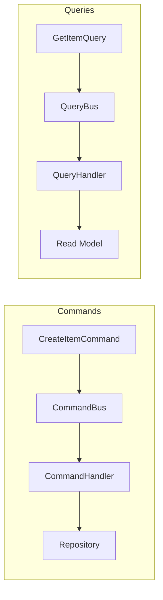
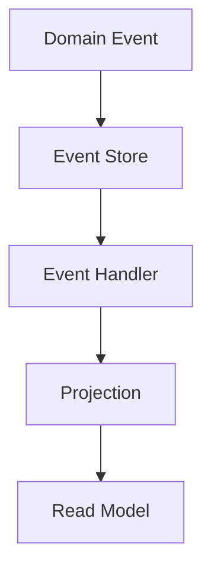
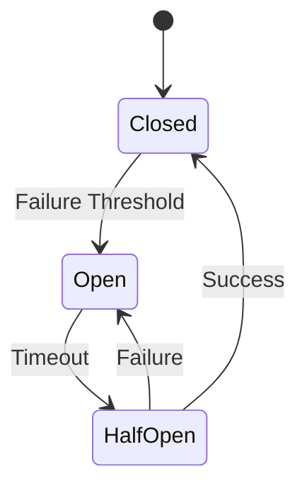

# Design Document - Advanced Patterns & Best Practices

## Overview

Este documento descreve o design dos padrões avançados implementados no projeto my-api para suportar aplicações enterprise-grade.

## Architecture

### CQRS Pattern



### Event Sourcing



### Circuit Breaker States



## Components and Interfaces

### CQRS

```python
class Command(ABC):
    @abstractmethod
    async def execute(self) -> Result[T, E]: ...

class Query(ABC):
    @abstractmethod
    async def execute(self) -> Result[T, E]: ...

class CommandBus:
    def register(self, command_type: type[Command], handler: CommandHandler) -> None: ...
    async def dispatch(self, command: Command) -> Result[T, E]: ...
```

### Specification Pattern

```python
class Specification(ABC, Generic[T]):
    @abstractmethod
    def is_satisfied_by(self, candidate: T) -> bool: ...
    
    def and_spec(self, other: Specification[T]) -> Specification[T]: ...
    def or_spec(self, other: Specification[T]) -> Specification[T]: ...
    def not_spec(self) -> Specification[T]: ...
```

### Caching

```python
class CacheProvider(Protocol):
    async def get(self, key: str) -> T | None: ...
    async def set(self, key: str, value: T, ttl: int | None = None) -> None: ...
    async def delete(self, key: str) -> None: ...
    async def invalidate_pattern(self, pattern: str) -> int: ...
```

### Circuit Breaker

```python
class CircuitBreaker:
    def __init__(self, failure_threshold: int, recovery_timeout: float): ...
    
    async def call(self, func: Callable[..., Awaitable[T]], *args, **kwargs) -> T: ...
    
    @property
    def state(self) -> CircuitState: ...
```

## Data Models

### Domain Event

```python
class DomainEvent(BaseModel):
    event_id: str
    event_type: str
    aggregate_id: str
    aggregate_type: str
    timestamp: datetime
    version: int
    payload: dict[str, Any]
```

### Cache Entry

```python
class CacheEntry(Generic[T]):
    value: T
    created_at: datetime
    expires_at: datetime | None
    
    @property
    def is_expired(self) -> bool: ...
```

## Correctness Properties

*A property is a characteristic or behavior that should hold true across all valid executions of a system.*

### Property 1: Specification Composition
*For any* two specifications A and B, `A.and_spec(B).is_satisfied_by(x)` SHALL equal `A.is_satisfied_by(x) and B.is_satisfied_by(x)`.
**Validates: Requirements 1.4**

### Property 2: Cache Round-Trip
*For any* value stored in cache, retrieving it before expiration SHALL return the same value.
**Validates: Requirements 4.1, 4.2**

### Property 3: Circuit Breaker State Transitions
*For any* circuit breaker, after `failure_threshold` consecutive failures, the state SHALL transition to OPEN.
**Validates: Requirements 5.1**

### Property 4: Event Ordering
*For any* aggregate, events SHALL be ordered by version number in ascending order.
**Validates: Requirements 6.1**

### Property 5: CQRS Command Dispatch
*For any* registered command type, dispatching a command SHALL invoke the corresponding handler.
**Validates: Requirements 2.3**

### Property 6: Retry Backoff
*For any* retry attempt n, the delay SHALL be `base_delay * (2 ^ n) + jitter`.
**Validates: Requirements 5.2**

## Error Handling

- Circuit breaker open: Return fallback or raise CircuitOpenError
- Cache miss: Proceed to data source
- Event store failure: Retry with backoff, then fail
- Command validation failure: Return validation errors

## Testing Strategy

### Unit Tests
- Specification composition logic
- Circuit breaker state transitions
- Cache TTL expiration

### Property-Based Tests
- Specification boolean algebra properties
- Cache round-trip consistency
- Event version ordering
- Retry delay calculation

### Integration Tests
- Redis cache operations
- Event store persistence
- CQRS end-to-end flow
