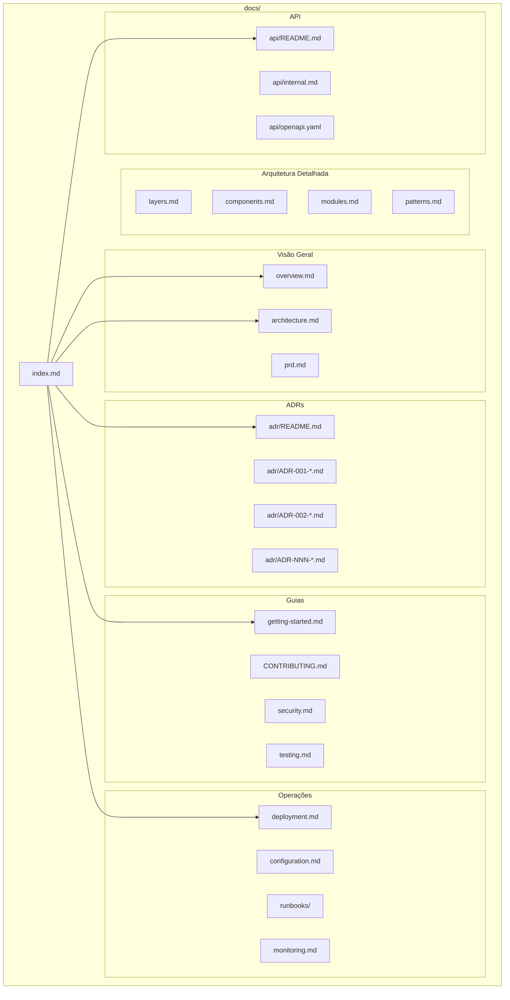
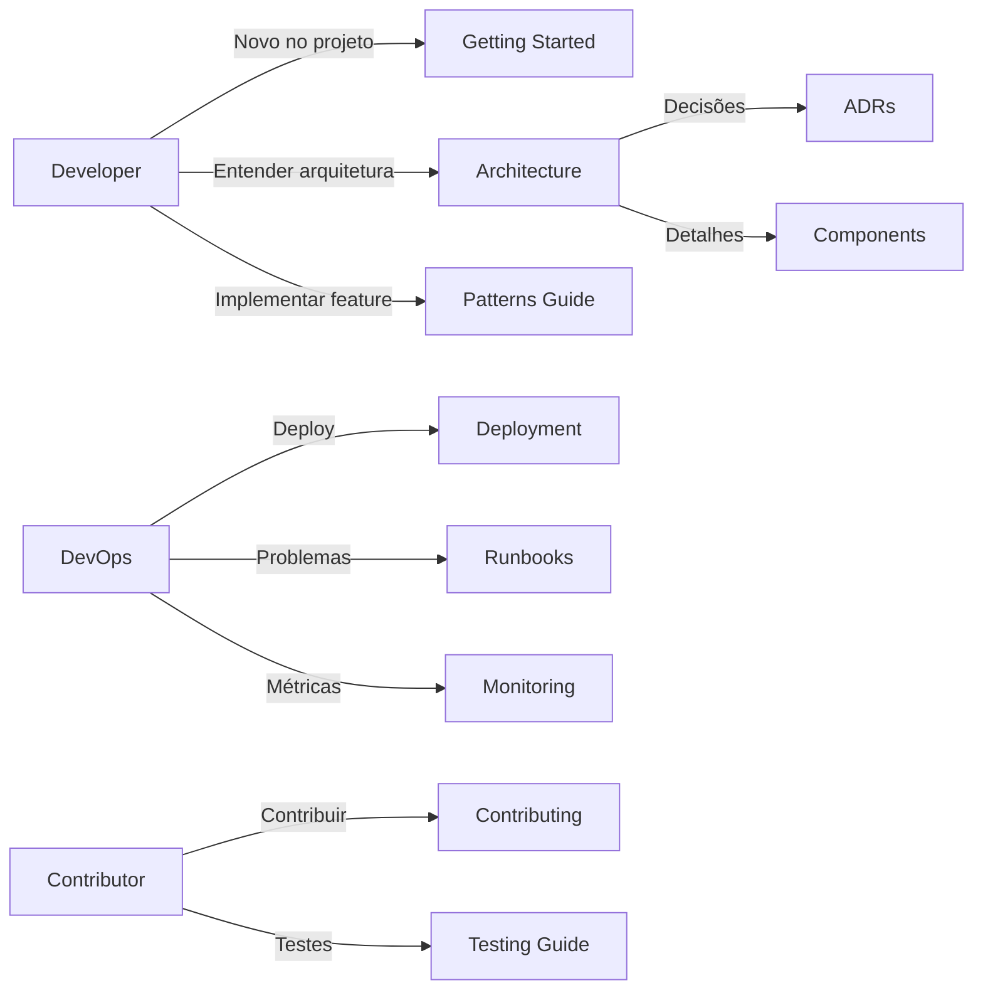

# Design Document: Advanced System Documentation

## Overview

Este documento descreve o design para criação de documentação avançada do Python API Base Framework. A documentação será estruturada seguindo o padrão Documentation-Driven Development (DDDoc), com foco em diagramas visuais, ADRs completos, guias de implementação, e documentação operacional.

A documentação será organizada em uma estrutura hierárquica clara, utilizando Mermaid para diagramas, seguindo convenções de nomenclatura consistentes, e mantendo links bidirecionais entre documentos relacionados.

## Architecture

### Estrutura de Documentação



### Fluxo de Navegação



## Components and Interfaces

### 1. Documentos de Arquitetura

#### 1.1 architecture.md (Atualização)

Adicionar seções:
- C4 Model Diagrams (Context, Container, Component)
- Data Flow Diagrams para principais use cases
- Dependency Graph entre camadas
- Infrastructure Integration Diagram

#### 1.2 patterns.md (Novo)

```markdown
# Padrões de Implementação

## Specification Pattern
- Operadores disponíveis
- Composição de specifications
- Conversão para SQLAlchemy

## CQRS Pattern
- Command structure
- Query structure
- Handler implementation

## Repository Pattern
- Interface definition
- SQLAlchemy implementation
- In-memory implementation

## Resilience Patterns
- CircuitBreaker configuration
- Retry with backoff
- Bulkhead limits
- Timeout handling
```

### 2. ADR Structure

#### 2.1 ADR Template

```markdown
# ADR-NNN: [Title]

## Status
[Proposed | Accepted | Deprecated | Superseded]

## Context
[Problema ou situação que motivou a decisão]

## Decision
[A decisão tomada]

## Consequences

### Positive
- [Benefício 1]
- [Benefício 2]

### Negative
- [Trade-off 1]
- [Trade-off 2]

### Neutral
- [Observação 1]

## Alternatives Considered
1. [Alternativa 1] - [Razão para rejeição]
2. [Alternativa 2] - [Razão para rejeição]

## References
- [Link para código relevante]
- [Link para documentação externa]

## History
| Date | Status | Notes |
|------|--------|-------|
| YYYY-MM-DD | Proposed | Initial proposal |
| YYYY-MM-DD | Accepted | Approved by team |
```

#### 2.2 ADRs Necessários

| ADR | Título | Status |
|-----|--------|--------|
| ADR-001 | JWT Authentication Strategy | A criar |
| ADR-002 | RBAC Implementation | A criar |
| ADR-003 | API Versioning Strategy | A criar |
| ADR-004 | Token Revocation via Redis | A criar |
| ADR-005 | Generic Repository Pattern | A criar |
| ADR-006 | Specification Pattern | A criar |
| ADR-007 | CQRS Implementation | A criar |
| ADR-008 | Cache Strategy (Redis + Memory) | A criar |
| ADR-009 | Resilience Patterns | A criar |
| ADR-010 | Error Handling (RFC 7807) | A criar |
| ADR-011 | Observability Stack | A criar |
| ADR-012 | Clean Architecture Layers | A criar |

### 3. Guias de Implementação

#### 3.1 bounded-context-guide.md (Novo)

```markdown
# Guia: Criando um Bounded Context

## 1. Domain Layer
### 1.1 Entity
### 1.2 Repository Interface
### 1.3 Value Objects
### 1.4 Domain Events

## 2. Application Layer
### 2.1 DTOs
### 2.2 Commands
### 2.3 Queries
### 2.4 Mappers

## 3. Infrastructure Layer
### 3.1 SQLAlchemy Model
### 3.2 Repository Implementation

## 4. Interface Layer
### 4.1 Router
### 4.2 Request/Response Models
### 4.3 Dependencies
```

#### 3.2 integration-guide.md (Novo)

```markdown
# Guia: Adicionando Integrações

## Protocol-First Approach
1. Definir Protocol em core/protocols/
2. Implementar Provider em infrastructure/
3. Registrar no DI Container
4. Criar testes

## Exemplos
- Cache Provider
- Storage Provider
- Messaging Provider
```

### 4. Documentação Operacional

#### 4.1 configuration.md (Atualização)

Estrutura completa de variáveis de ambiente:

```markdown
# Configuração

## Database
| Variable | Type | Default | Description |
|----------|------|---------|-------------|
| DATABASE_URL | str | - | PostgreSQL connection string |
| DB_POOL_SIZE | int | 10 | Connection pool size |
| DB_MAX_OVERFLOW | int | 20 | Max overflow connections |

## Security
| Variable | Type | Default | Description |
|----------|------|---------|-------------|
| SECRET_KEY | str | - | JWT signing key (min 32 chars) |
| ACCESS_TOKEN_EXPIRE_MINUTES | int | 30 | Token expiration |

## Redis
...

## Kafka
...

## Observability
...
```

#### 4.2 runbooks/ (Novo Diretório)

```
docs/runbooks/
├── README.md
├── database-connection-issues.md
├── cache-failures.md
├── circuit-breaker-open.md
├── high-latency.md
├── memory-issues.md
└── kafka-lag.md
```

#### 4.3 monitoring.md (Novo)

```markdown
# Monitoramento

## Prometheus Metrics
### HTTP Metrics
- http_requests_total
- http_request_duration_seconds
- http_requests_in_progress

### Business Metrics
- users_created_total
- authentication_attempts_total

## OpenTelemetry Traces
### Span Naming Convention
### Attributes

## Structured Logs
### Log Format (JSON)
### Log Levels
### Correlation ID

## Grafana Dashboards
### API Overview
### Database Performance
### Cache Hit Rate
```

### 5. Documentação de Testes

#### 5.1 testing.md (Novo)

```markdown
# Guia de Testes

## Estrutura
tests/
├── unit/           # Testes unitários
├── integration/    # Testes de integração
├── properties/     # Property-based tests
├── e2e/           # End-to-end tests
├── factories/     # Test factories
└── conftest.py    # Fixtures compartilhadas

## Unit Tests
### Estrutura
### Fixtures
### Mocking

## Property-Based Tests (Hypothesis)
### Strategies
### Custom Generators
### Domain Invariants

## Integration Tests
### Database Setup
### Async Patterns
### External Services

## Coverage
### Requisitos (80%)
### Exclusões
### CI/CD
```

### 6. Documentação de Segurança

#### 6.1 security.md (Atualização)

```markdown
# Segurança

## Authentication
### JWT Flow
### Refresh Token Rotation
### Token Revocation

## Authorization
### RBAC Model
### Role Definitions
### Permission Composition

## Security Headers
### CSP
### HSTS
### X-Frame-Options

## Input Validation
### Pydantic Validation
### Sanitization

## Sensitive Data
### PII Handling
### Log Redaction
### Secrets Management

## OWASP Compliance
### API Security Top 10
### Mitigations
```

## Data Models

### Documentation File Structure

```python
@dataclass
class DocumentationFile:
    path: str                    # Caminho relativo a docs/
    title: str                   # Título do documento
    category: DocumentCategory   # Categoria
    dependencies: list[str]      # Documentos relacionados
    last_updated: datetime       # Última atualização
    
class DocumentCategory(Enum):
    OVERVIEW = "overview"
    ARCHITECTURE = "architecture"
    ADR = "adr"
    GUIDE = "guide"
    OPERATIONS = "operations"
    API = "api"
    TESTING = "testing"
    SECURITY = "security"
```

### ADR Structure

```python
@dataclass
class ADR:
    number: int                  # Número sequencial
    title: str                   # Título descritivo
    status: ADRStatus           # Status atual
    context: str                # Contexto/problema
    decision: str               # Decisão tomada
    consequences: Consequences  # Consequências
    alternatives: list[Alternative]  # Alternativas consideradas
    references: list[str]       # Links para código/docs
    history: list[HistoryEntry] # Histórico de mudanças

class ADRStatus(Enum):
    PROPOSED = "Proposed"
    ACCEPTED = "Accepted"
    DEPRECATED = "Deprecated"
    SUPERSEDED = "Superseded"

@dataclass
class Consequences:
    positive: list[str]
    negative: list[str]
    neutral: list[str]

@dataclass
class HistoryEntry:
    date: date
    status: ADRStatus
    notes: str
```

## Correctness Properties

*A property is a characteristic or behavior that should hold true across all valid executions of a system-essentially, a formal statement about what the system should do. Properties serve as the bridge between human-readable specifications and machine-verifiable correctness guarantees.*

Based on the prework analysis, the following correctness properties must be validated:

### Property 1: ADR Format Compliance

*For any* ADR file in docs/adr/, the file SHALL contain all required sections: Title (H1), Status, Context, Decision, Consequences (with Positive/Negative subsections), and Alternatives Considered.

**Validates: Requirements 2.1**

### Property 2: ADR Code Reference Validity

*For any* ADR that contains code references (links to src/ files), all referenced file paths SHALL exist in the codebase.

**Validates: Requirements 2.3**

### Property 3: ADR History Tracking

*For any* ADR with status other than "Proposed", the History section SHALL contain at least one entry with date and status transition notes.

**Validates: Requirements 2.4**

### Property 4: Protocol Documentation Coverage

*For any* public Protocol class defined in src/core/protocols/, there SHALL exist corresponding documentation in docs/ that describes the protocol's purpose, methods, and usage examples.

**Validates: Requirements 3.1**

### Property 5: Environment Variable Documentation

*For any* environment variable referenced in src/core/config/settings.py, there SHALL exist documentation in docs/configuration.md with variable name, type, default value, and description.

**Validates: Requirements 5.2**

### Property 6: Mermaid Diagram Syntax Validity

*For any* Mermaid code block in documentation files, the diagram syntax SHALL be valid and parseable by Mermaid renderer.

**Validates: Requirements 1.1**

## Error Handling

### Documentation Validation Errors

| Error Type | Description | Resolution |
|------------|-------------|------------|
| MissingSection | ADR missing required section | Add missing section |
| InvalidLink | Broken link to code/doc | Fix or remove link |
| InvalidMermaid | Mermaid syntax error | Fix diagram syntax |
| MissingDocumentation | Protocol without docs | Create documentation |
| UndocumentedEnvVar | Env var without docs | Add to configuration.md |

### Validation Script

```python
# scripts/validate-docs.py
def validate_documentation() -> list[ValidationError]:
    errors = []
    
    # Validate ADRs
    for adr_file in glob("docs/adr/ADR-*.md"):
        errors.extend(validate_adr_format(adr_file))
        errors.extend(validate_adr_links(adr_file))
    
    # Validate Mermaid diagrams
    for doc_file in glob("docs/**/*.md"):
        errors.extend(validate_mermaid_syntax(doc_file))
    
    # Validate protocol coverage
    errors.extend(validate_protocol_documentation())
    
    # Validate env var documentation
    errors.extend(validate_env_var_documentation())
    
    return errors
```

## Testing Strategy

### Dual Testing Approach

A documentação será validada através de:

1. **Unit Tests**: Verificação de estrutura e formato de arquivos individuais
2. **Property-Based Tests**: Validação de propriedades universais usando Hypothesis

### Property-Based Testing Framework

**Framework**: pytest + Hypothesis

**Configuration**: Minimum 100 iterations per property test

### Test Structure

```
tests/
├── properties/
│   └── test_documentation_properties.py  # Property-based tests
└── unit/
    └── docs/
        └── test_documentation_validation.py  # Unit tests
```

### Property Test Examples

```python
# tests/properties/test_documentation_properties.py
from hypothesis import given, strategies as st, settings
import pytest

class TestADRProperties:
    """
    **Feature: advanced-system-documentation, Property 1: ADR Format Compliance**
    """
    
    @settings(max_examples=100)
    @given(adr_file=st.sampled_from(get_all_adr_files()))
    def test_adr_has_required_sections(self, adr_file: Path):
        """For any ADR file, all required sections must exist."""
        content = adr_file.read_text()
        
        assert "# ADR-" in content, "Missing title"
        assert "## Status" in content, "Missing Status section"
        assert "## Context" in content, "Missing Context section"
        assert "## Decision" in content, "Missing Decision section"
        assert "## Consequences" in content, "Missing Consequences section"
        assert "## Alternatives" in content, "Missing Alternatives section"

class TestMermaidProperties:
    """
    **Feature: advanced-system-documentation, Property 6: Mermaid Diagram Syntax Validity**
    """
    
    @settings(max_examples=100)
    @given(doc_file=st.sampled_from(get_all_doc_files_with_mermaid()))
    def test_mermaid_diagrams_are_valid(self, doc_file: Path):
        """For any Mermaid diagram, syntax must be valid."""
        diagrams = extract_mermaid_blocks(doc_file)
        
        for diagram in diagrams:
            assert validate_mermaid_syntax(diagram), f"Invalid Mermaid in {doc_file}"
```

### Unit Test Examples

```python
# tests/unit/docs/test_documentation_validation.py
import pytest

class TestADRExistence:
    """Verify required ADRs exist."""
    
    REQUIRED_ADRS = [
        "ADR-001-jwt-authentication.md",
        "ADR-002-rbac-implementation.md",
        "ADR-003-api-versioning.md",
        # ... more ADRs
    ]
    
    @pytest.mark.parametrize("adr_file", REQUIRED_ADRS)
    def test_required_adr_exists(self, adr_file: str):
        adr_path = Path("docs/adr") / adr_file
        assert adr_path.exists(), f"Missing required ADR: {adr_file}"

class TestDocumentationCompleteness:
    """Verify documentation completeness."""
    
    def test_architecture_has_c4_diagrams(self):
        content = Path("docs/architecture.md").read_text()
        assert "```mermaid" in content
        assert "graph" in content or "flowchart" in content
    
    def test_configuration_documents_all_env_vars(self):
        # Extract env vars from settings
        env_vars = extract_env_vars_from_settings()
        config_content = Path("docs/configuration.md").read_text()
        
        for var in env_vars:
            assert var in config_content, f"Undocumented env var: {var}"
```

### Coverage Requirements

- Documentation validation tests: 100% of properties covered
- ADR format validation: All ADR files
- Mermaid syntax validation: All documentation files with diagrams
- Environment variable documentation: All variables in settings.py

