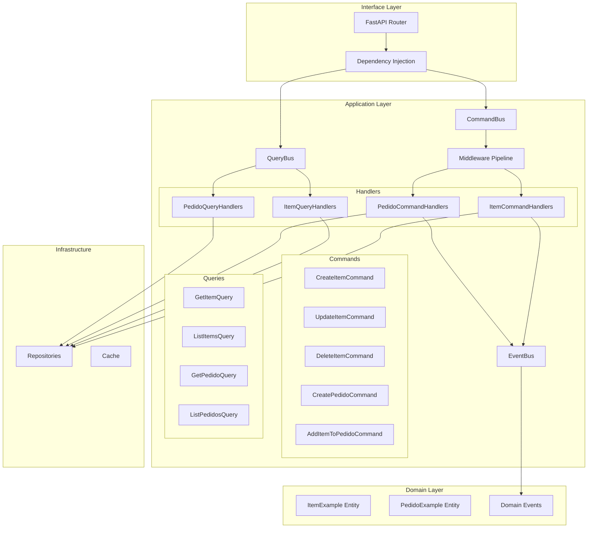

# Design Document: Application Common Integration

## Overview

This design integrates the `src/application/common` infrastructure with `ItemExample` and `PedidoExample` bounded contexts. The integration follows Clean Architecture principles, using CQRS pattern for command/query separation, middleware pipeline for cross-cutting concerns, and standardized interfaces for mappers and repositories.

## Architecture



## Components and Interfaces

### 1. Command/Query Definitions

```python
# src/application/examples/item/commands.py
@dataclass(frozen=True)
class CreateItemCommand(BaseCommand):
    name: str
    sku: str
    price_amount: Decimal
    price_currency: str = "BRL"
    quantity: int = 0
    category: str = ""
    tags: list[str] = field(default_factory=list)
    created_by: str = "system"

@dataclass(frozen=True)
class UpdateItemCommand(BaseCommand):
    item_id: str
    name: str | None = None
    price_amount: Decimal | None = None
    quantity: int | None = None
    updated_by: str = "system"

@dataclass(frozen=True)
class DeleteItemCommand(BaseCommand):
    item_id: str
    deleted_by: str = "system"
```

### 2. Command Handlers

```python
# src/application/examples/item/handlers.py
class CreateItemCommandHandler(CommandHandler[CreateItemCommand, ItemExampleResponse]):
    def __init__(self, repository: IItemRepository, event_bus: TypedEventBus):
        self._repo = repository
        self._event_bus = event_bus
    
    async def handle(self, command: CreateItemCommand) -> Result[ItemExampleResponse, Exception]:
        # Create entity, persist, publish events
        ...
```

### 3. Mapper Interface Implementation

```python
# src/application/examples/item/mapper.py
class ItemExampleMapper(IMapper[ItemExample, ItemExampleResponse]):
    def to_dto(self, entity: ItemExample) -> ItemExampleResponse:
        return ItemExampleResponse(
            id=entity.id,
            name=entity.name,
            # ... all fields
        )
    
    def to_entity(self, dto: ItemExampleResponse) -> ItemExample:
        # Reverse mapping for import scenarios
        ...
```

### 4. Middleware Pipeline Configuration

```python
# src/infrastructure/di/examples_bootstrap.py
def configure_example_command_bus() -> CommandBus:
    bus = CommandBus()
    
    # Add middleware in order
    bus.add_middleware(LoggingMiddleware(LoggingConfig(log_duration=True)))
    bus.add_middleware(ValidationMiddleware(validators))
    bus.add_middleware(RetryMiddleware(RetryConfig(max_retries=3)))
    bus.add_middleware(CircuitBreakerMiddleware(CircuitBreakerConfig(failure_threshold=5)))
    
    # Register handlers
    bus.register(CreateItemCommand, create_item_handler)
    bus.register(UpdateItemCommand, update_item_handler)
    bus.register(DeleteItemCommand, delete_item_handler)
    
    return bus
```

### 5. API Router with DI

```python
# src/interface/v1/examples/router.py
@router.post("/items", response_model=ApiResponse[ItemExampleResponse])
async def create_item(
    data: ItemExampleCreate,
    command_bus: CommandBusDep,
    x_user_id: str = Header(default="system"),
) -> ApiResponse[ItemExampleResponse]:
    command = CreateItemCommand(
        name=data.name,
        sku=data.sku,
        price_amount=data.price.amount,
        created_by=x_user_id,
    )
    result = await command_bus.dispatch(command)
    if result.is_err():
        raise handle_result_error(result.unwrap_err())
    return ApiResponse(data=result.unwrap(), status_code=201)
```

## Data Models

### Command/Query DTOs

| Type | Fields | Purpose |
|------|--------|---------|
| CreateItemCommand | name, sku, price_amount, price_currency, quantity, category, tags, created_by | Create new item |
| UpdateItemCommand | item_id, name?, price_amount?, quantity?, updated_by | Update existing item |
| DeleteItemCommand | item_id, deleted_by | Soft delete item |
| GetItemQuery | item_id | Retrieve single item |
| ListItemsQuery | page, size, category?, status?, sort_by?, sort_order | List with pagination |

### Response DTOs

Existing DTOs (`ItemExampleResponse`, `PedidoExampleResponse`) remain unchanged but are now produced by `IMapper` implementations.

## Correctness Properties

*A property is a characteristic or behavior that should hold true across all valid executions of a system-essentially, a formal statement about what the system should do. Properties serve as the bridge between human-readable specifications and machine-verifiable correctness guarantees.*

### Property 1: Error Hierarchy Consistency
*For any* error raised in ItemExample or PedidoExample use cases, the error SHALL be an instance of ApplicationError from `application.common.base.exceptions`
**Validates: Requirements 1.1**

### Property 2: NotFoundError Contains Entity Information
*For any* NotFoundError raised with entity_type and entity_id, the error.details dict SHALL contain both "entity_type" and "entity_id" keys with the provided values
**Validates: Requirements 1.2**

### Property 3: ValidationError Contains Field Errors
*For any* ValidationError raised with field-level errors, the error.errors list SHALL contain dicts with "field" and "message" keys
**Validates: Requirements 1.3**

### Property 4: Command Dispatch Invokes Handler
*For any* registered command type and command instance, dispatching through CommandBus SHALL invoke the registered handler exactly once
**Validates: Requirements 2.1, 2.2, 2.3, 3.1, 3.2, 3.3, 3.4**

### Property 5: Query Dispatch Returns Handler Result
*For any* registered query type and query instance, dispatching through QueryBus SHALL return the result from the registered handler
**Validates: Requirements 2.4, 2.5, 3.5, 3.6**

### Property 6: Successful Command Publishes Events
*For any* command that succeeds and produces domain events, the EventBus SHALL receive all events from the command result
**Validates: Requirements 2.6**

### Property 7: Mapper Round-Trip Preserves Data
*For any* ItemExample entity, mapping to DTO and back (where applicable) SHALL preserve all essential fields
**Validates: Requirements 4.1, 4.2**

### Property 8: Batch Mapping Preserves Count
*For any* list of N entities, to_dto_list SHALL return exactly N DTOs in the same order
**Validates: Requirements 4.3**

### Property 9: Retry Middleware Retries Transient Failures
*For any* command that fails with a retryable exception, RetryMiddleware SHALL retry up to max_retries times before failing
**Validates: Requirements 5.2**

### Property 10: Circuit Breaker Opens After Threshold
*For any* sequence of N consecutive failures where N >= failure_threshold, CircuitBreakerMiddleware SHALL transition to OPEN state
**Validates: Requirements 5.3**

### Property 11: Validation Middleware Rejects Invalid Commands
*For any* command with registered validators that fails validation, ValidationMiddleware SHALL return Err with ValidationError before handler execution
**Validates: Requirements 5.4**

### Property 12: Batch Operations Process All Items
*For any* batch operation with CONTINUE strategy, BatchResult.total_processed SHALL equal the input list length
**Validates: Requirements 6.5**

### Property 13: Export-Import Round Trip
*For any* list of ItemExample entities exported to JSON/CSV/JSONL and imported back, the imported records SHALL match the original data
**Validates: Requirements 7.1, 7.2, 7.3, 7.4**

### Property 14: Export Checksum Integrity
*For any* export operation, the checksum in ExportResult SHALL be a valid 16-character hex string derived from SHA-256
**Validates: Requirements 7.5**

### Property 15: API Response Wrapper Consistency
*For any* successful API response, the response body SHALL contain "data", "message", "status_code", and "timestamp" fields
**Validates: Requirements 8.2**

### Property 16: Pagination Metadata Correctness
*For any* paginated response with total T, page P, and size S, the computed pages SHALL equal ceil(T/S) and has_next SHALL be P < pages
**Validates: Requirements 8.4**

## Error Handling

### Error Mapping Strategy

| Domain Error | HTTP Status | ProblemDetail Type |
|--------------|-------------|-------------------|
| NotFoundError | 404 | `/errors/not-found` |
| ValidationError | 422 | `/errors/validation` |
| ConflictError | 409 | `/errors/conflict` |
| UnauthorizedError | 401 | `/errors/unauthorized` |
| ForbiddenError | 403 | `/errors/forbidden` |
| CircuitBreakerOpenError | 503 | `/errors/service-unavailable` |
| RetryExhaustedError | 503 | `/errors/service-unavailable` |

### Error Handler Implementation

```python
def handle_result_error(error: Exception) -> HTTPException:
    if isinstance(error, NotFoundError):
        return HTTPException(
            status_code=404,
            detail=ProblemDetail(
                type="/errors/not-found",
                title="Not Found",
                status=404,
                detail=error.message,
            ).model_dump()
        )
    # ... other error types
```

## Testing Strategy

### Dual Testing Approach

This implementation uses both unit tests and property-based tests:

- **Unit tests**: Verify specific examples and edge cases
- **Property-based tests**: Verify universal properties across all valid inputs

### Property-Based Testing Library

**Library**: `hypothesis` (Python)

**Configuration**:
```python
from hypothesis import settings, given, strategies as st

@settings(max_examples=100)
@given(...)
def test_property_name(...):
    ...
```

### Test Organization

```
tests/
├── unit/
│   └── application/
│       └── examples/
│           ├── test_item_commands.py
│           ├── test_item_queries.py
│           ├── test_pedido_commands.py
│           └── test_pedido_queries.py
├── integration/
│   └── examples/
│       ├── test_item_api.py
│       └── test_pedido_api.py
└── properties/
    └── test_application_common_integration_properties.py
```

### Property Test Annotations

Each property-based test MUST include:
```python
"""
**Feature: application-common-integration, Property {number}: {property_text}**
**Validates: Requirements X.Y**
"""
```
