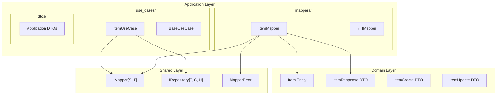

# Design Document: Application Layer Code Review V2

## Overview

Este documento descreve o design para melhorias avançadas na camada Application (`src/my_api/application`). O foco está em structured logging, validação de tipos, round-trip safety, e conformidade com boas práticas Python modernas.

## Architecture



## Components and Interfaces

### 1. Current State Analysis

#### ItemMapper (Current Implementation)
```python
class ItemMapper(IMapper[Item, ItemResponse]):
    def to_dto(self, entity: Item) -> ItemResponse:
        try:
            logger.debug(f"Mapping Item to ItemResponse: id={getattr(entity, 'id', None)}")
            return ItemResponse.model_validate(entity)
        except Exception as e:
            logger.error(f"Failed to map Item to ItemResponse: {e}")
            raise MapperError(...) from e
```

**Issues Identified:**
1. ❌ No input type validation before conversion
2. ❌ f-string logging (not structured)
3. ❌ No correlation ID support
4. ❌ Catches broad Exception instead of specific types
5. ⚠️ Debug log exposes entity ID (potential PII)

#### ItemUseCase (Current Implementation)
```python
class ItemUseCase(BaseUseCase[Item, ItemCreate, ItemUpdate, ItemResponse]):
    def __init__(self, repository, mapper) -> None:
        super().__init__(repository, mapper, entity_name="Item")
```

**Assessment:**
- ✅ Follows Clean Architecture
- ✅ Uses dependency injection
- ✅ Minimal and focused
- ⚠️ No custom validation hooks implemented

### 2. Proposed Improvements

#### Enhanced ItemMapper with Structured Logging

```python
"""Item mapper implementation with structured logging.

**Feature: application-layer-code-review-v2, Task 1.1**
"""

import logging
from datetime import datetime, timezone
from typing import Final

from pydantic import ValidationError

from my_api.domain.entities.item import Item, ItemResponse
from my_api.shared.mapper import IMapper, MapperError

logger: Final[logging.Logger] = logging.getLogger(__name__)


class ItemMapper(IMapper[Item, ItemResponse]):
    """Mapper for Item entity to ItemResponse DTO.
    
    Thread-safe, stateless mapper with structured logging
    and comprehensive error handling.
    """

    def to_dto(self, entity: Item) -> ItemResponse:
        """Convert Item entity to ItemResponse DTO.
        
        Args:
            entity: Item entity to convert.
            
        Returns:
            ItemResponse DTO with all entity fields mapped.
            
        Raises:
            TypeError: If entity is not an Item instance.
            ValueError: If entity is None.
            MapperError: If conversion fails due to validation.
        """
        # Input validation
        if entity is None:
            raise ValueError("entity parameter cannot be None")
        if not isinstance(entity, Item):
            raise TypeError(
                f"Expected Item instance, got {type(entity).__name__}"
            )
        
        # Structured logging context
        log_context = {
            "entity_type": "Item",
            "operation": "to_dto",
            "entity_id": getattr(entity, "id", None),
            "timestamp": datetime.now(timezone.utc).isoformat(),
        }
        
        try:
            logger.debug(
                "Mapping entity to DTO",
                extra={"context": log_context}
            )
            result = ItemResponse.model_validate(entity)
            logger.debug(
                "Mapping completed successfully",
                extra={"context": {**log_context, "success": True}}
            )
            return result
            
        except ValidationError as e:
            logger.error(
                "Validation failed during mapping",
                extra={
                    "context": {
                        **log_context,
                        "error_type": "ValidationError",
                        "error_count": len(e.errors()),
                    }
                },
                exc_info=True,
            )
            raise MapperError(
                message=f"Failed to convert Item to ItemResponse: {e}",
                context={"entity_id": log_context["entity_id"]},
            ) from e

    def to_entity(self, dto: ItemResponse) -> Item:
        """Convert ItemResponse DTO to Item entity.
        
        Args:
            dto: ItemResponse DTO to convert.
            
        Returns:
            Item entity with all DTO fields mapped.
            
        Raises:
            TypeError: If dto is not an ItemResponse instance.
            ValueError: If dto is None.
            MapperError: If conversion fails due to validation.
        """
        # Input validation
        if dto is None:
            raise ValueError("dto parameter cannot be None")
        if not isinstance(dto, ItemResponse):
            raise TypeError(
                f"Expected ItemResponse instance, got {type(dto).__name__}"
            )
        
        log_context = {
            "entity_type": "ItemResponse",
            "operation": "to_entity",
            "dto_id": getattr(dto, "id", None),
            "timestamp": datetime.now(timezone.utc).isoformat(),
        }
        
        try:
            logger.debug(
                "Mapping DTO to entity",
                extra={"context": log_context}
            )
            # Exclude computed fields from conversion
            data = dto.model_dump(exclude={"price_with_tax"})
            result = Item.model_validate(data)
            logger.debug(
                "Mapping completed successfully",
                extra={"context": {**log_context, "success": True}}
            )
            return result
            
        except ValidationError as e:
            logger.error(
                "Validation failed during mapping",
                extra={
                    "context": {
                        **log_context,
                        "error_type": "ValidationError",
                        "error_count": len(e.errors()),
                    }
                },
                exc_info=True,
            )
            raise MapperError(
                message=f"Failed to convert ItemResponse to Item: {e}",
                context={"dto_id": log_context["dto_id"]},
            ) from e
```

#### Enhanced ItemUseCase with Custom Validation

```python
"""Item use case with custom validation hooks.

**Feature: application-layer-code-review-v2, Task 2.1**
"""

from my_api.core.exceptions import ValidationError
from my_api.domain.entities.item import Item, ItemCreate, ItemResponse, ItemUpdate
from my_api.shared.mapper import IMapper
from my_api.shared.repository import IRepository
from my_api.shared.use_case import BaseUseCase


class ItemUseCase(BaseUseCase[Item, ItemCreate, ItemUpdate, ItemResponse]):
    """Use case for Item entity operations with custom validation."""

    # Business rule constants
    MIN_PRICE: float = 0.01
    MAX_PRICE: float = 1_000_000.00
    MAX_NAME_LENGTH: int = 255

    def __init__(
        self,
        repository: IRepository[Item, ItemCreate, ItemUpdate],
        mapper: IMapper[Item, ItemResponse],
    ) -> None:
        """Initialize Item use case with dependencies."""
        super().__init__(repository, mapper, entity_name="Item")

    def _validate_create(self, data: ItemCreate) -> None:
        """Validate item creation data.
        
        Args:
            data: Item creation DTO.
            
        Raises:
            ValidationError: If business rules are violated.
        """
        errors: list[dict] = []
        
        if data.price < self.MIN_PRICE:
            errors.append({
                "field": "price",
                "message": f"Price must be at least {self.MIN_PRICE}",
            })
        
        if data.price > self.MAX_PRICE:
            errors.append({
                "field": "price",
                "message": f"Price cannot exceed {self.MAX_PRICE}",
            })
        
        if data.name and len(data.name) > self.MAX_NAME_LENGTH:
            errors.append({
                "field": "name",
                "message": f"Name cannot exceed {self.MAX_NAME_LENGTH} characters",
            })
        
        if errors:
            raise ValidationError(
                message="Item validation failed",
                errors=errors,
            )

    def _validate_update(self, data: ItemUpdate) -> None:
        """Validate item update data.
        
        Args:
            data: Item update DTO.
            
        Raises:
            ValidationError: If business rules are violated.
        """
        errors: list[dict] = []
        
        if data.price is not None:
            if data.price < self.MIN_PRICE:
                errors.append({
                    "field": "price",
                    "message": f"Price must be at least {self.MIN_PRICE}",
                })
            if data.price > self.MAX_PRICE:
                errors.append({
                    "field": "price",
                    "message": f"Price cannot exceed {self.MAX_PRICE}",
                })
        
        if data.name is not None and len(data.name) > self.MAX_NAME_LENGTH:
            errors.append({
                "field": "name",
                "message": f"Name cannot exceed {self.MAX_NAME_LENGTH} characters",
            })
        
        if errors:
            raise ValidationError(
                message="Item update validation failed",
                errors=errors,
            )
```

## Data Models

A camada Application utiliza os seguintes modelos:

| Model | Layer | Purpose |
|-------|-------|---------|
| Item | Domain | Database entity |
| ItemCreate | Domain | Creation DTO |
| ItemUpdate | Domain | Update DTO |
| ItemResponse | Domain | Response DTO with computed fields |

### Computed Fields Handling

O `ItemResponse` possui o campo computado `price_with_tax`. Durante a conversão reversa (DTO → Entity), este campo deve ser excluído pois não existe na entidade.


## Correctness Properties

*A property is a characteristic or behavior that should hold true across all valid executions of a system-essentially, a formal statement about what the system should do. Properties serve as the bridge between human-readable specifications and machine-verifiable correctness guarantees.*

### Property 1: Mapper Round-Trip Consistency

*For any* valid Item entity with all required fields populated, converting to ItemResponse DTO and back to Item entity should preserve the essential fields (id, name, description, price, tax, created_at, updated_at).

**Validates: Requirements 5.1**

### Property 2: Input Type Validation

*For any* input that is not an instance of the expected type (Item for to_dto, ItemResponse for to_entity), the mapper should raise TypeError with a descriptive message containing the actual type name.

**Validates: Requirements 2.1**

### Property 3: Structured Logging Context

*For any* successful or failed mapping operation, the logger should be called with structured context containing entity_type, operation, and timestamp fields.

**Validates: Requirements 1.1, 1.2**

### Property 4: Validation Hook Invocation

*For any* create or update operation on a use case, the corresponding validation hook (_validate_create or _validate_update) should be invoked before the repository operation.

**Validates: Requirements 3.1, 3.2**

### Property 5: Mapper Statelessness

*For any* sequence of mapping operations on the same mapper instance, each operation should produce the same result for the same input, regardless of previous operations.

**Validates: Requirements 6.2**

### Property 6: JSON Serialization Round-Trip

*For any* valid ItemResponse DTO, serializing to JSON and parsing back should produce an equivalent DTO with all fields preserved.

**Validates: Requirements 7.3**

### Property 7: Timestamp Timezone Preservation

*For any* Item entity with timezone-aware timestamps, the mapper should preserve the timezone information during conversion to DTO and back.

**Validates: Requirements 5.3**

### Property 8: Computed Field Exclusion

*For any* ItemResponse DTO with computed fields (price_with_tax), converting to Item entity should exclude computed fields and not raise validation errors.

**Validates: Requirements 5.2**

## Error Handling

### Mapper Error Hierarchy

```
Exception
├── TypeError          # Invalid input type
├── ValueError         # None input
└── MapperError        # Conversion/validation failure
    └── context: dict  # Entity/DTO identifiers
```

### Error Context Structure

```python
{
    "entity_id": str | None,      # For to_dto errors
    "dto_id": str | None,         # For to_entity errors
    "error_type": str,            # Exception class name
    "error_count": int,           # Number of validation errors
}
```

### Use Case Error Handling

```
Exception
├── ValidationError    # Business rule violation
│   └── errors: list   # Field-level errors
├── EntityNotFoundError # Entity not found
└── RepositoryError    # Data access failure
```

## Testing Strategy

### Property-Based Testing

- **Framework**: Hypothesis (Python)
- **Minimum iterations**: 100 per property
- **Tag format**: `**Feature: application-layer-code-review-v2, Property {N}: {description}**`

### Test Categories

| Category | Properties | Focus |
|----------|------------|-------|
| Round-Trip | P1, P6 | Data integrity |
| Type Safety | P2, P8 | Input validation |
| Observability | P3 | Logging behavior |
| Behavior | P4, P5 | Use case/mapper behavior |
| Data Handling | P7 | Timezone preservation |

### Unit Tests

1. **Mapper Tests**
   - Test TypeError for invalid input types
   - Test ValueError for None inputs
   - Test MapperError for validation failures
   - Test successful conversions

2. **Use Case Tests**
   - Test validation hook invocation
   - Test ValidationError structure
   - Test business rule enforcement

### Test Generators (Hypothesis)

```python
from hypothesis import strategies as st
from datetime import datetime, timezone

# Item entity generator
item_strategy = st.builds(
    Item,
    id=st.text(min_size=26, max_size=26, alphabet="0123456789ABCDEFGHJKMNPQRSTVWXYZ"),
    name=st.text(min_size=1, max_size=255),
    description=st.text(max_size=1000) | st.none(),
    price=st.floats(min_value=0.01, max_value=1_000_000, allow_nan=False),
    tax=st.floats(min_value=0, max_value=100_000, allow_nan=False) | st.none(),
    created_at=st.datetimes(timezones=st.just(timezone.utc)),
    updated_at=st.datetimes(timezones=st.just(timezone.utc)),
    is_deleted=st.booleans(),
)

# Invalid type generator
invalid_type_strategy = st.one_of(
    st.integers(),
    st.text(),
    st.lists(st.integers()),
    st.dictionaries(st.text(), st.integers()),
)
```

### Dual Testing Approach

- **Unit tests**: Verify specific examples, edge cases, error conditions
- **Property tests**: Verify universal properties across all valid inputs
- Both are complementary and required for comprehensive coverage
