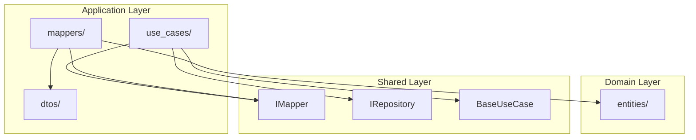

# Design Document: Application Layer Review

## Overview

Este documento descreve o design para melhorias na camada Application (`src/my_api/application`). A análise identificou que a estrutura atual está bem organizada, mas pode ser aprimorada com exports explícitos, logging em mappers e organização de DTOs.

## Architecture



## Components and Interfaces

### 1. Current State Analysis

#### ItemMapper (Current)
```python
class ItemMapper(IMapper[Item, ItemResponse]):
    def to_dto(self, entity: Item) -> ItemResponse:
        return ItemResponse.model_validate(entity)

    def to_entity(self, dto: ItemResponse) -> Item:
        return Item.model_validate(dto.model_dump())
```

**Issues Identified:**
- No error handling for validation failures
- No logging for debugging
- Missing docstrings

#### ItemUseCase (Current)
```python
class ItemUseCase(BaseUseCase[Item, ItemCreate, ItemUpdate, ItemResponse]):
    def __init__(
        self,
        repository: IRepository[Item, ItemCreate, ItemUpdate],
        mapper: IMapper[Item, ItemResponse],
    ) -> None:
        super().__init__(repository, mapper, entity_name="Item")
```

**Assessment:**
- ✅ Follows Clean Architecture
- ✅ Uses dependency injection
- ✅ Implements interface abstraction
- ✅ Minimal and focused

### 2. Proposed Improvements

#### Enhanced ItemMapper
```python
"""Item mapper implementation."""

import logging
from typing import Final

from my_api.domain.entities.item import Item, ItemResponse
from my_api.shared.mapper import IMapper, MapperError

logger: Final[logging.Logger] = logging.getLogger(__name__)


class ItemMapper(IMapper[Item, ItemResponse]):
    """Mapper for Item entity to ItemResponse DTO.
    
    Handles conversion between domain entities and response DTOs
    with proper error handling and logging.
    """

    def to_dto(self, entity: Item) -> ItemResponse:
        """Convert Item entity to ItemResponse DTO.
        
        Args:
            entity: Item entity to convert.
            
        Returns:
            ItemResponse DTO.
            
        Raises:
            MapperError: If conversion fails.
        """
        try:
            return ItemResponse.model_validate(entity)
        except Exception as e:
            logger.error(f"Failed to map Item to ItemResponse: {e}")
            raise MapperError(
                message=f"Failed to convert Item to ItemResponse: {e}",
                context={"entity_id": getattr(entity, "id", None)},
            ) from e

    def to_entity(self, dto: ItemResponse) -> Item:
        """Convert ItemResponse DTO to Item entity.
        
        Args:
            dto: ItemResponse DTO to convert.
            
        Returns:
            Item entity.
            
        Raises:
            MapperError: If conversion fails.
        """
        try:
            return Item.model_validate(dto.model_dump())
        except Exception as e:
            logger.error(f"Failed to map ItemResponse to Item: {e}")
            raise MapperError(
                message=f"Failed to convert ItemResponse to Item: {e}",
                context={"dto_id": getattr(dto, "id", None)},
            ) from e
```

#### Enhanced Module Exports

**application/__init__.py**
```python
"""Application layer - Use cases, DTOs, mappers.

This module provides the application layer components following
Clean Architecture principles.
"""

from my_api.application.mappers.item_mapper import ItemMapper
from my_api.application.use_cases.item_use_case import ItemUseCase

__all__ = [
    "ItemMapper",
    "ItemUseCase",
]
```

**application/mappers/__init__.py**
```python
"""Application mappers for entity-DTO conversion."""

from my_api.application.mappers.item_mapper import ItemMapper

__all__ = [
    "ItemMapper",
]
```

**application/use_cases/__init__.py**
```python
"""Application use cases for business logic."""

from my_api.application.use_cases.item_use_case import ItemUseCase

__all__ = [
    "ItemUseCase",
]
```

## Data Models

A camada Application não define novos data models - ela utiliza:
- Entities do Domain Layer (Item, ItemCreate, ItemUpdate)
- Response DTOs do Domain Layer (ItemResponse)
- Interfaces do Shared Layer (IMapper, IRepository)

## Correctness Properties

*A property is a characteristic or behavior that should hold true across all valid executions of a system-essentially, a formal statement about what the system should do. Properties serve as the bridge between human-readable specifications and machine-verifiable correctness guarantees.*

### Property 1: Mapper Round-Trip Consistency

*For any* valid Item entity, converting to DTO and back to entity should preserve essential data fields (id, name, description, price, tax)

**Validates: Requirements 1.1**

### Property 2: Module Export Completeness

*For any* public class in the application layer, it should be accessible via the module's __all__ export

**Validates: Requirements 3.1, 3.2**

### Property 3: Use Case Validation Invocation

*For any* create or update operation, the use case should invoke validation hooks before repository operations

**Validates: Requirements 2.1, 2.2**

## Error Handling

### Mapper Errors
- MapperError raised on conversion failures
- Logged with context (entity_id, dto_id)
- Original exception preserved in chain

### Use Case Errors
- EntityNotFoundError for missing entities
- ValidationError for invalid data
- Propagated from BaseUseCase

## Testing Strategy

### Property-Based Testing

- **Framework**: Hypothesis
- **Minimum iterations**: 100 per property
- **Tag format**: `**Feature: application-layer-review, Property {N}: {description}**`

### Test Categories

1. **Mapper Properties** (P1): Test round-trip consistency
2. **Export Properties** (P2): Test module completeness
3. **Validation Properties** (P3): Test hook invocation

### Unit Tests

- Test mapper error handling
- Test use case validation
- Test module imports
