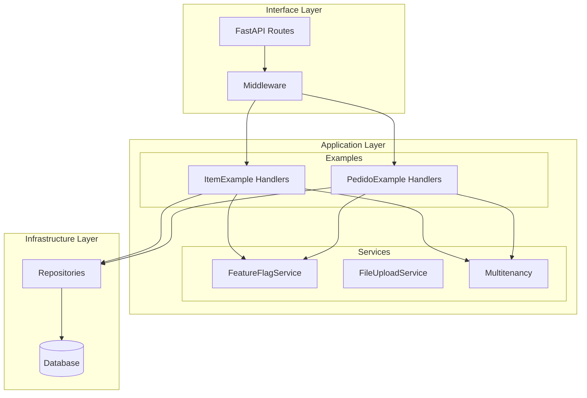

# Design Document: Application Services Integration

## Overview

Este design documenta a integração dos serviços cross-cutting de `src/application/services` ao workflow do projeto. O objetivo é corrigir os imports quebrados nos testes, integrar os serviços com os exemplos ItemExample e PedidoExample, e garantir que todos os testes executem corretamente.

## Architecture



## Components and Interfaces

### 1. Test Import Corrections

Os arquivos de teste precisam ser atualizados para usar os imports corretos:

```python
# ANTES (incorreto)
from my_app.application.multitenancy import TenantContext, get_current_tenant

# DEPOIS (correto)
from my_app.application.services.multitenancy import TenantContext, get_current_tenant
```

### 2. Multitenancy Integration

O `TenantContext` será integrado aos handlers de exemplo:

```python
# Interface para handlers tenant-aware
class TenantAwareHandler(Protocol):
    async def handle(self, command: Command, tenant_id: str) -> Result: ...
```

### 3. Feature Flag Integration

O `FeatureFlagService` será usado para controlar funcionalidades:

```python
# Exemplo de uso em handler
class CreateItemCommandHandler:
    def __init__(self, repository: IItemRepository, feature_flags: FeatureFlagService):
        self._repository = repository
        self._feature_flags = feature_flags
    
    async def handle(self, command: CreateItemCommand) -> ItemDTO:
        if self._feature_flags.is_enabled("item_validation_v2"):
            # Nova lógica de validação
            pass
```

## Data Models

### TenantContext (existente)
```python
@dataclass
class TenantContext:
    tenant_id: str
    
    def __enter__(self) -> "TenantContext": ...
    def __exit__(self, exc_type, exc_val, exc_tb) -> None: ...
    async def __aenter__(self) -> "TenantContext": ...
    async def __aexit__(self, exc_type, exc_val, exc_tb) -> None: ...
```

### EvaluationContext (existente)
```python
@dataclass
class EvaluationContext:
    user_id: str | None = None
    groups: list[str] = field(default_factory=list)
    attributes: dict[str, Any] = field(default_factory=dict)
```

## Correctness Properties

*A property is a characteristic or behavior that should hold true across all valid executions of a system-essentially, a formal statement about what the system should do. Properties serve as the bridge between human-readable specifications and machine-verifiable correctness guarantees.*

### Property 1: Tenant Query Isolation
*For any* tenant context and any query operation, all returned results should belong exclusively to the current tenant.
**Validates: Requirements 2.1, 2.4**

### Property 2: Tenant Assignment on Create
*For any* tenant context and any create operation, the created entity should have its tenant_id field set to the current tenant.
**Validates: Requirements 2.2**

### Property 3: Feature Flag Evaluation Consistency
*For any* user ID and any percentage rollout, multiple evaluations of the same flag should return the same result.
**Validates: Requirements 3.2**

## Error Handling

### Import Errors
- Se um import falhar, o teste deve reportar claramente qual módulo está faltando
- O `conftest.py` deve registrar corretamente os submódulos de `application.services`

### Tenant Context Errors
- Se nenhum tenant estiver definido, lançar `ValueError` com mensagem clara
- Se tenant inválido for fornecido, rejeitar com erro de validação

### Feature Flag Errors
- Se flag não existir, retornar valor default (False)
- Se avaliação falhar, logar erro e retornar valor default

## Testing Strategy

### Property-Based Testing Framework
- **Framework**: Hypothesis (já configurado no projeto)
- **Configuração**: `max_examples=100` para cobertura adequada

### Unit Tests
- Testar imports corretos em cada arquivo de teste
- Testar integração básica dos serviços com handlers

### Property Tests
- **Property 1**: Gerar tenant IDs aleatórios, criar dados, verificar isolamento
- **Property 2**: Gerar entidades aleatórias, criar com tenant context, verificar assignment
- **Property 3**: Gerar user IDs e percentagens, avaliar múltiplas vezes, verificar consistência

### Test Annotations
Cada teste de propriedade deve ser anotado com:
```python
# **Feature: application-services-integration, Property {number}: {property_text}**
# **Validates: Requirements X.Y**
```
