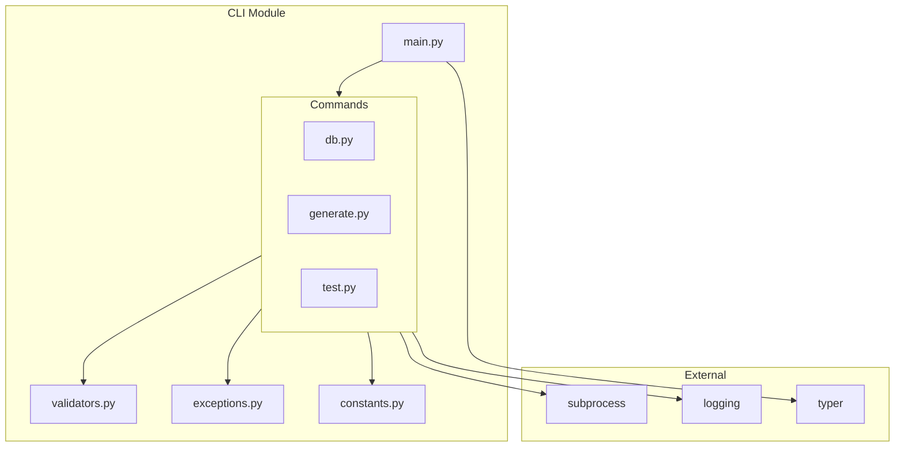

# Design Document: CLI Security Improvements

## Overview

Este documento descreve o design para melhorias de segurança e qualidade no módulo CLI (`src/my_api/cli`). As melhorias incluem controles de segurança para subprocess, validação de entrada, tratamento de erros padronizado, logging estruturado e geração de código seguindo boas práticas.

## Architecture



## Components and Interfaces

### 1. CLI Exceptions Module (`src/my_api/cli/exceptions.py`)

```python
from typing import Final

class CLIError(Exception):
    """Base exception for CLI errors."""
    exit_code: Final[int] = 1
    
    def __init__(self, message: str, exit_code: int = 1) -> None:
        super().__init__(message)
        self.exit_code = exit_code

class ValidationError(CLIError):
    """Input validation error."""
    pass

class CommandError(CLIError):
    """Command execution error."""
    pass

class TimeoutError(CLIError):
    """Command timeout error."""
    exit_code: Final[int] = 124
```

### 2. CLI Constants Module (`src/my_api/cli/constants.py`)

```python
from typing import Final
import re

# Timeouts
SUBPROCESS_TIMEOUT: Final[int] = 300  # 5 minutes

# Validation patterns
REVISION_PATTERN: Final[re.Pattern] = re.compile(r'^[a-zA-Z0-9_\-]+$|^head$|^base$')
ENTITY_NAME_PATTERN: Final[re.Pattern] = re.compile(r'^[a-z][a-z0-9_]*$')
FIELD_NAME_PATTERN: Final[re.Pattern] = re.compile(r'^[a-z][a-z0-9_]*$')
PATH_TRAVERSAL_PATTERN: Final[re.Pattern] = re.compile(r'\.\.[\\/]|[\\/]\.\.') 

# Limits
MAX_ENTITY_NAME_LENGTH: Final[int] = 50
MAX_FIELD_NAME_LENGTH: Final[int] = 50

# Whitelists
ALLOWED_ALEMBIC_COMMANDS: Final[frozenset[str]] = frozenset({
    "upgrade", "downgrade", "revision", "current", "history", "heads"
})

ALLOWED_FIELD_TYPES: Final[frozenset[str]] = frozenset({
    "str", "int", "float", "bool", "datetime", "date", "uuid", "list", "dict"
})

# Exit codes
EXIT_SUCCESS: Final[int] = 0
EXIT_ERROR: Final[int] = 1
EXIT_TIMEOUT: Final[int] = 124
```

### 3. CLI Validators Module (`src/my_api/cli/validators.py`)

```python
from my_api.cli.constants import (
    REVISION_PATTERN,
    ENTITY_NAME_PATTERN,
    FIELD_NAME_PATTERN,
    PATH_TRAVERSAL_PATTERN,
    MAX_ENTITY_NAME_LENGTH,
    MAX_FIELD_NAME_LENGTH,
    ALLOWED_ALEMBIC_COMMANDS,
    ALLOWED_FIELD_TYPES,
)
from my_api.cli.exceptions import ValidationError

def validate_revision(revision: str) -> str:
    """Validate database revision format."""
    if not REVISION_PATTERN.match(revision):
        raise ValidationError(f"Invalid revision format: {revision}")
    return revision

def validate_entity_name(name: str) -> str:
    """Validate entity name format and length."""
    if not name or len(name) > MAX_ENTITY_NAME_LENGTH:
        raise ValidationError(f"Entity name must be 1-{MAX_ENTITY_NAME_LENGTH} characters")
    if not ENTITY_NAME_PATTERN.match(name):
        raise ValidationError(f"Invalid entity name: {name}. Use snake_case.")
    return name

def validate_path(path: str) -> str:
    """Validate path does not contain traversal sequences."""
    if PATH_TRAVERSAL_PATTERN.search(path):
        raise ValidationError(f"Path traversal detected: {path}")
    return path

def validate_alembic_command(command: str) -> str:
    """Validate alembic command against whitelist."""
    if command not in ALLOWED_ALEMBIC_COMMANDS:
        raise ValidationError(f"Invalid alembic command: {command}")
    return command

def validate_field_definition(field_str: str) -> tuple[str, str]:
    """Validate and parse field definition."""
    parts = field_str.strip().split(":")
    if len(parts) != 2:
        raise ValidationError(f"Invalid field format: {field_str}")
    
    name, ftype = parts[0].strip(), parts[1].strip()
    
    if not FIELD_NAME_PATTERN.match(name):
        raise ValidationError(f"Invalid field name: {name}")
    if len(name) > MAX_FIELD_NAME_LENGTH:
        raise ValidationError(f"Field name too long: {name}")
    if ftype not in ALLOWED_FIELD_TYPES:
        raise ValidationError(f"Invalid field type: {ftype}")
    
    return name, ftype
```

### 4. Subprocess Runner (`src/my_api/cli/runner.py`)

```python
import logging
import subprocess
import sys
from typing import Final

from my_api.cli.constants import SUBPROCESS_TIMEOUT, EXIT_TIMEOUT
from my_api.cli.exceptions import CommandError, TimeoutError

logger: Final[logging.Logger] = logging.getLogger(__name__)

def run_subprocess(
    args: list[str],
    timeout: int = SUBPROCESS_TIMEOUT,
    capture_output: bool = False,
) -> subprocess.CompletedProcess:
    """Run subprocess with security controls."""
    cmd = [sys.executable, "-m"] + args
    logger.debug(f"Executing subprocess: {' '.join(cmd)}")
    
    try:
        result = subprocess.run(
            cmd,
            capture_output=capture_output,
            timeout=timeout,
            check=False,
        )
        return result
    except subprocess.TimeoutExpired as e:
        logger.error(f"Subprocess timed out after {timeout}s: {e}")
        raise TimeoutError(f"Command timed out after {timeout}s")
    except Exception as e:
        logger.error(f"Subprocess failed: {e}", exc_info=True)
        raise CommandError(f"Command execution failed: {e}")
```

## Data Models

### Exit Code Enum

```python
from enum import IntEnum

class ExitCode(IntEnum):
    """Standard CLI exit codes."""
    SUCCESS = 0
    ERROR = 1
    MISUSE = 2
    TIMEOUT = 124
    TERMINATED = 130
```

## Correctness Properties

*A property is a characteristic or behavior that should hold true across all valid executions of a system-essentially, a formal statement about what the system should do. Properties serve as the bridge between human-readable specifications and machine-verifiable correctness guarantees.*

### Property 1: Alembic Command Whitelist Validation

*For any* command string, it passes alembic validation if and only if it is in the set of allowed commands {"upgrade", "downgrade", "revision", "current", "history", "heads"}

**Validates: Requirements 1.3, 1.4**

### Property 2: Revision Format Validation

*For any* string, it passes revision validation if and only if it matches the pattern `^[a-zA-Z0-9_\-]+$` OR equals "head" OR equals "base"

**Validates: Requirements 2.1, 2.2**

### Property 3: Entity Name Validation

*For any* string, it passes entity name validation if and only if it matches `^[a-z][a-z0-9_]*$` AND has length between 1 and 50 characters

**Validates: Requirements 2.3, 2.4**

### Property 4: Path Traversal Detection

*For any* path string containing ".." followed by a path separator (or vice versa), the path validation SHALL reject it

**Validates: Requirements 2.5**

### Property 5: Field Definition Parsing Round-Trip

*For any* valid field definition string in format "name:type", parsing and re-serializing produces an equivalent representation

**Validates: Requirements 2.6**

### Property 6: Exit Code Consistency

*For any* CLI error type, the exit code returned matches the expected Unix convention (1 for general errors, 124 for timeout)

**Validates: Requirements 3.3, 3.4, 3.5**

### Property 7: Generated Code UTC Datetime

*For any* generated entity code, all datetime default_factory calls use `datetime.now(UTC)` instead of `datetime.now()`

**Validates: Requirements 5.1**

### Property 8: Generated Code Import Ordering

*For any* generated code file, imports are ordered: stdlib, third-party, local (following PEP8/isort)

**Validates: Requirements 5.2**

### Property 9: Version Format Consistency

*For any* version output, it matches the format "{cli_name} version: {semver}" where semver follows semantic versioning or ends with "-dev"

**Validates: Requirements 6.3**

## Error Handling

### Exception Hierarchy

```
CLIError (base)
├── ValidationError (exit code 1)
│   ├── InvalidRevisionError
│   ├── InvalidEntityNameError
│   ├── InvalidPathError
│   └── InvalidFieldError
├── CommandError (exit code 1)
│   ├── AlembicError
│   └── PytestError
└── TimeoutError (exit code 124)
```

### Error Display Strategy

1. Catch exceptions at command level
2. Display user-friendly message via `typer.secho` to stderr
3. Log full error with stack trace at ERROR level
4. Return appropriate exit code via `typer.Exit`

## Testing Strategy

### Property-Based Testing

- **Framework**: Hypothesis (já utilizado no projeto)
- **Minimum iterations**: 100 por propriedade
- **Tag format**: `**Feature: cli-security-improvements, Property {N}: {description}**`

### Test Categories

1. **Validation Properties** (P1-P5): Testar funções de validação com inputs gerados
2. **Exit Code Properties** (P6): Testar exceções retornam códigos corretos
3. **Code Generation Properties** (P7-P8): Testar output de geradores
4. **Format Properties** (P9): Testar formato de saída

### Unit Tests

- Testar cada validator individualmente
- Testar exception hierarchy
- Testar subprocess runner com mocks

### Integration Tests

- Testar comandos CLI end-to-end
- Testar timeout behavior com comandos lentos
- Testar geração de arquivos

