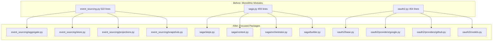
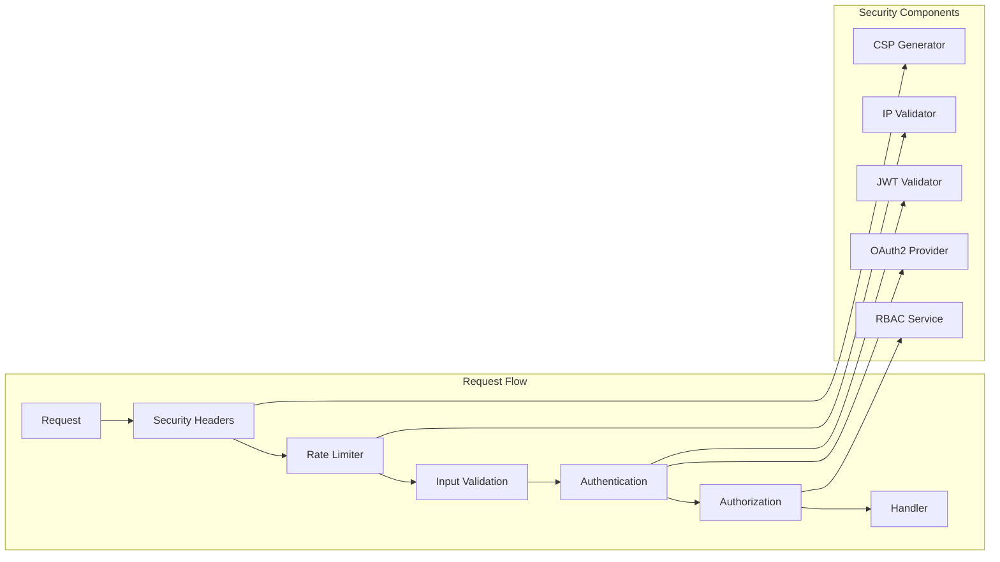

# Design Document: Code Review & Refactoring

## Overview

This design document outlines the systematic approach for refactoring 13 large files (>400 lines), implementing security hardening, and establishing property-based testing for the Python API project.

## Architecture

### Refactoring Strategy



### Security Architecture



## Components and Interfaces

### 1. Event Sourcing Package Structure

```python
# event_sourcing/__init__.py - Backward compatible re-exports
from .aggregate import Aggregate, AggregateId
from .store import EventStore, InMemoryEventStore
from .events import SourcedEvent, EventStream
from .projections import Projection, InMemoryProjection
from .snapshots import Snapshot
from .repository import EventSourcedRepository
from .exceptions import ConcurrencyError

__all__ = [
    "Aggregate", "AggregateId", "EventStore", "InMemoryEventStore",
    "SourcedEvent", "EventStream", "Projection", "InMemoryProjection",
    "Snapshot", "EventSourcedRepository", "ConcurrencyError"
]
```

### 2. Saga Package Structure

```python
# saga/__init__.py - Backward compatible re-exports
from .context import SagaContext
from .steps import SagaStep, StepStatus, StepResult
from .orchestrator import Saga, SagaStatus, SagaResult
from .builder import SagaBuilder
from .manager import SagaOrchestrator

__all__ = [
    "SagaContext", "SagaStep", "StepStatus", "StepResult",
    "Saga", "SagaStatus", "SagaResult", "SagaBuilder", "SagaOrchestrator"
]
```

### 3. OAuth2 Package Structure

```python
# oauth2/__init__.py - Backward compatible re-exports
from .base import BaseOAuthProvider, OAuthConfig
from .models import OAuthUserInfo, OAuthTokenResponse, OAuthState
from .providers.google import GoogleOAuthProvider
from .providers.github import GitHubOAuthProvider
from .state_store import StateStore, InMemoryStateStore
from .exceptions import OAuthError, OAuthConfigError, OAuthTokenError

__all__ = [
    "BaseOAuthProvider", "OAuthConfig", "OAuthUserInfo", "OAuthTokenResponse",
    "OAuthState", "GoogleOAuthProvider", "GitHubOAuthProvider",
    "StateStore", "InMemoryStateStore", "OAuthError", "OAuthConfigError", "OAuthTokenError"
]
```

### 4. Security Components

```python
# IP Validation (already implemented in rate_limiter.py)
def _is_valid_ip(ip: str) -> bool:
    """Validate IP address format to prevent header spoofing."""
    try:
        ipaddress.ip_address(ip)
        return True
    except ValueError:
        return False

# JWT Validation Enhancement
class JWTValidator:
    ALLOWED_ALGORITHMS = ["RS256", "ES256"]
    
    def validate(self, token: str) -> TokenPayload:
        header = jwt.get_unverified_header(token)
        if header.get("alg") not in self.ALLOWED_ALGORITHMS:
            raise InvalidTokenError("Unsupported algorithm")
        # ... validation logic

# Security Headers Middleware
class SecurityHeadersMiddleware:
    def __init__(self, app: ASGIApp):
        self.app = app
        self.headers = {
            "Content-Security-Policy": "default-src 'self'",
            "Strict-Transport-Security": "max-age=31536000; includeSubDomains",
            "X-Frame-Options": "DENY",
            "X-Content-Type-Options": "nosniff",
            "Referrer-Policy": "strict-origin-when-cross-origin",
        }
```

## Data Models

### Refactoring Tracking

```python
@dataclass
class RefactoringTarget:
    original_file: str
    line_count: int
    target_package: str
    extracted_modules: list[str]
    status: Literal["pending", "in_progress", "completed", "verified"]

REFACTORING_TARGETS = [
    RefactoringTarget("event_sourcing.py", 522, "event_sourcing/", 
                      ["aggregate", "store", "projections", "snapshots"]),
    RefactoringTarget("saga.py", 493, "saga/",
                      ["steps", "context", "orchestrator", "builder"]),
    RefactoringTarget("oauth2.py", 454, "oauth2/",
                      ["base", "models", "providers/google", "providers/github"]),
    # ... 10 more targets
]
```

## Correctness Properties

*A property is a characteristic or behavior that should hold true across all valid executions of a system-essentially, a formal statement about what the system should do. Properties serve as the bridge between human-readable specifications and machine-verifiable correctness guarantees.*

### Property 1: Backward Compatibility After Refactoring
*For any* public symbol exported from the original module, importing from the original path after refactoring should succeed and return the same class/function.
**Validates: Requirements 1.2, 1.4**

### Property 2: Event Sourcing Round-Trip
*For any* valid aggregate with applied events, saving to the event store and then loading should produce an aggregate with equivalent state.
**Validates: Requirements 2.5, 12.1**

### Property 3: Saga Compensation Completeness
*For any* saga execution that fails at step N, all steps 1 through N-1 that have compensation functions should have their compensations executed in reverse order.
**Validates: Requirements 3.5, 12.2**

### Property 4: JWT Algorithm Restriction
*For any* JWT token presented for validation, if the algorithm header is not in ["RS256", "ES256"], validation must fail with InvalidTokenError.
**Validates: Requirements 6.1, 6.2**

### Property 5: Token Tampering Detection
*For any* valid JWT token, modifying any byte of the payload and re-encoding should result in validation failure.
**Validates: Requirements 6.1, 12.5**

### Property 6: Refresh Token Rotation
*For any* successful token refresh operation, the returned refresh token must be different from the input refresh token, and the input token must be invalidated.
**Validates: Requirements 6.4**

### Property 7: Input Validation Completeness
*For any* API request with invalid input (according to Pydantic schema), the response status code must be 400 and the response body must not contain the original invalid input.
**Validates: Requirements 7.1, 7.5**

### Property 8: Security Headers Presence
*For any* HTTP response from the API, the headers must include Content-Security-Policy, Strict-Transport-Security, X-Frame-Options, and X-Content-Type-Options.
**Validates: Requirements 8.1, 8.2, 8.3, 8.4**

### Property 9: Cookie Security Attributes
*For any* Set-Cookie header in API responses, the cookie must have Secure, HttpOnly, and SameSite attributes set.
**Validates: Requirements 8.5**

### Property 10: IP Validation Correctness
*For any* string input to IP validation, the function returns True if and only if the string is a valid IPv4 or IPv6 address.
**Validates: Requirements 9.1, 12.4**

### Property 11: Rate Limit Response Format
*For any* request that exceeds rate limits, the response must have status 429 and include a Retry-After header with a positive integer value.
**Validates: Requirements 9.2**

### Property 12: OAuth State Expiration
*For any* OAuth state object, if the current time exceeds creation time plus max_age_seconds, the is_expired() method must return True.
**Validates: Requirements 12.3**

### Property 13: Input Sanitization Effectiveness
*For any* input string containing HTML/JavaScript injection patterns, the sanitized output must not contain executable script content.
**Validates: Requirements 7.2, 12.6**

## Error Handling

```python
# Refactoring-specific errors
class RefactoringError(Exception):
    """Base error for refactoring operations."""
    pass

class BackwardCompatibilityError(RefactoringError):
    """Raised when refactoring breaks existing imports."""
    pass

class FileSizeViolationError(RefactoringError):
    """Raised when extracted file exceeds 400 lines."""
    pass

# Security-specific errors
class SecurityError(Exception):
    """Base error for security violations."""
    pass

class InvalidTokenError(SecurityError):
    """Raised for JWT validation failures."""
    pass

class RateLimitExceededError(SecurityError):
    """Raised when rate limit is exceeded."""
    pass
```

## Testing Strategy

### Dual Testing Approach

This project uses both unit tests and property-based tests:

- **Unit tests**: Verify specific examples, edge cases, and integration points
- **Property-based tests**: Verify universal properties that should hold across all inputs

### Property-Based Testing Framework

**Library**: Hypothesis (Python)
**Minimum iterations**: 100 per property

```python
from hypothesis import given, strategies as st, settings

@settings(max_examples=100)
@given(st.text())
def test_ip_validation_property(ip_string: str):
    """
    **Feature: code-review-refactoring, Property 10: IP Validation Correctness**
    **Validates: Requirements 9.1, 12.4**
    """
    result = _is_valid_ip(ip_string)
    try:
        ipaddress.ip_address(ip_string)
        assert result is True
    except ValueError:
        assert result is False
```

### Test Coverage Targets

| Module Category | Target Coverage |
|-----------------|-----------------|
| Security modules | 90% |
| Core business logic | 85% |
| Refactored modules | 80% |
| Utility modules | 75% |

### Property Test Annotations

All property-based tests must include:
```python
"""
**Feature: {feature_name}, Property {number}: {property_text}**
**Validates: Requirements {requirement_numbers}**
"""
```


## Additional Components

### 5. Advanced Specification Package Structure (471 lines)

```python
# advanced_specification/__init__.py
from .base import Specification, CompositeSpecification
from .combinators import AndSpecification, OrSpecification, NotSpecification
from .validators import ValidationSpecification
from .query import QuerySpecification

__all__ = [
    "Specification", "CompositeSpecification",
    "AndSpecification", "OrSpecification", "NotSpecification",
    "ValidationSpecification", "QuerySpecification"
]
```

### 6. Cloud Provider Filter Package Structure (456 lines)

```python
# cloud_provider_filter/__init__.py
from .base import CloudProviderFilter, FilterResult
from .providers.aws import AWSFilter
from .providers.azure import AzureFilter
from .providers.gcp import GCPFilter
from .registry import FilterRegistry

__all__ = [
    "CloudProviderFilter", "FilterResult",
    "AWSFilter", "AzureFilter", "GCPFilter", "FilterRegistry"
]
```

### 7. Fuzzing Package Structure (453 lines)

```python
# fuzzing/__init__.py
from .core import Fuzzer, FuzzResult
from .strategies.mutation import MutationStrategy
from .strategies.generation import GenerationStrategy
from .generators.string import StringGenerator
from .generators.numeric import NumericGenerator
from .generators.structured import StructuredGenerator

__all__ = [
    "Fuzzer", "FuzzResult",
    "MutationStrategy", "GenerationStrategy",
    "StringGenerator", "NumericGenerator", "StructuredGenerator"
]
```

### 8. Contract Testing Package Structure (440 lines)

```python
# contract_testing/__init__.py
from .contracts import Contract, ConsumerContract, ProviderContract
from .validators import ContractValidator, SchemaValidator
from .matchers import Matcher, ExactMatcher, RegexMatcher, TypeMatcher
from .pact import PactBuilder, PactVerifier

__all__ = [
    "Contract", "ConsumerContract", "ProviderContract",
    "ContractValidator", "SchemaValidator",
    "Matcher", "ExactMatcher", "RegexMatcher", "TypeMatcher",
    "PactBuilder", "PactVerifier"
]
```

### 9. Caching Package Structure (431 lines)

```python
# caching/__init__.py
from .core import Cache, CacheConfig
from .backends.memory import InMemoryCache
from .backends.redis import RedisCache
from .decorators import cached, cache_aside
from .strategies import LRUStrategy, TTLStrategy, LFUStrategy
from .invalidation import CacheInvalidator

__all__ = [
    "Cache", "CacheConfig",
    "InMemoryCache", "RedisCache",
    "cached", "cache_aside",
    "LRUStrategy", "TTLStrategy", "LFUStrategy",
    "CacheInvalidator"
]
```

### 10. Compression Package Structure (428 lines)

```python
# compression/__init__.py
from .core import Compressor, CompressionResult
from .algorithms.gzip import GzipCompressor
from .algorithms.brotli import BrotliCompressor
from .algorithms.zstd import ZstdCompressor
from .middleware import CompressionMiddleware
from .negotiation import ContentNegotiator

__all__ = [
    "Compressor", "CompressionResult",
    "GzipCompressor", "BrotliCompressor", "ZstdCompressor",
    "CompressionMiddleware", "ContentNegotiator"
]
```

### 11. Secrets Manager Package Structure (417 lines)

```python
# secrets_manager/__init__.py
from .core import SecretsManager, Secret
from .providers.aws import AWSSecretsProvider
from .providers.azure import AzureKeyVaultProvider
from .providers.local import LocalSecretsProvider
from .encryption import Encryptor, AESEncryptor
from .rotation import SecretRotator, RotationPolicy

__all__ = [
    "SecretsManager", "Secret",
    "AWSSecretsProvider", "AzureKeyVaultProvider", "LocalSecretsProvider",
    "Encryptor", "AESEncryptor",
    "SecretRotator", "RotationPolicy"
]
```

### 12. Tiered Rate Limiter Package Structure (414 lines)

```python
# tiered_rate_limiter/__init__.py
from .core import TieredRateLimiter, RateLimitConfig
from .strategies.fixed_window import FixedWindowStrategy
from .strategies.sliding_window import SlidingWindowStrategy
from .strategies.token_bucket import TokenBucketStrategy
from .storage.memory import InMemoryStorage
from .storage.redis import RedisStorage
from .tiers import RateLimitTier, TierResolver

__all__ = [
    "TieredRateLimiter", "RateLimitConfig",
    "FixedWindowStrategy", "SlidingWindowStrategy", "TokenBucketStrategy",
    "InMemoryStorage", "RedisStorage",
    "RateLimitTier", "TierResolver"
]
```

### 13. Metrics Dashboard Package Structure (411 lines)

```python
# metrics_dashboard/__init__.py
from .core import MetricsDashboard, DashboardConfig
from .collectors.prometheus import PrometheusCollector
from .collectors.statsd import StatsdCollector
from .exporters.json import JSONExporter
from .exporters.html import HTMLExporter
from .widgets import Widget, CounterWidget, GaugeWidget, HistogramWidget

__all__ = [
    "MetricsDashboard", "DashboardConfig",
    "PrometheusCollector", "StatsdCollector",
    "JSONExporter", "HTMLExporter",
    "Widget", "CounterWidget", "GaugeWidget", "HistogramWidget"
]
```

### 14. AsyncAPI Package Structure (409 lines)

```python
# asyncapi/__init__.py
from .core import AsyncAPISpec, AsyncAPIGenerator
from .schema.message import MessageSchema
from .schema.channel import ChannelSchema
from .schema.server import ServerSchema
from .generators.yaml import YAMLGenerator
from .generators.json import JSONGenerator
from .validators import AsyncAPIValidator

__all__ = [
    "AsyncAPISpec", "AsyncAPIGenerator",
    "MessageSchema", "ChannelSchema", "ServerSchema",
    "YAMLGenerator", "JSONGenerator",
    "AsyncAPIValidator"
]
```

## Security Component Details

### JWT Validator Implementation

```python
class JWTValidator:
    """Enhanced JWT validator with security hardening."""
    
    ALLOWED_ALGORITHMS = frozenset(["RS256", "ES256"])
    MIN_KEY_SIZE = 2048
    
    def __init__(
        self,
        public_key: str,
        issuer: str,
        audience: str,
        clock_skew_seconds: int = 30,
    ):
        self._public_key = public_key
        self._issuer = issuer
        self._audience = audience
        self._clock_skew = clock_skew_seconds
        self._revoked_tokens: set[str] = set()
    
    def validate(self, token: str) -> TokenPayload:
        """Validate JWT token with security checks."""
        # Check algorithm before full decode
        header = self._get_unverified_header(token)
        if header.get("alg") not in self.ALLOWED_ALGORITHMS:
            raise InvalidTokenError(
                f"Algorithm {header.get('alg')} not allowed"
            )
        
        # Check if token is revoked
        if self._is_revoked(token):
            raise InvalidTokenError("Token has been revoked")
        
        # Full validation
        try:
            payload = jwt.decode(
                token,
                self._public_key,
                algorithms=list(self.ALLOWED_ALGORITHMS),
                issuer=self._issuer,
                audience=self._audience,
                leeway=self._clock_skew,
            )
            return TokenPayload(**payload)
        except jwt.ExpiredSignatureError:
            raise InvalidTokenError("Token has expired")
        except jwt.InvalidTokenError as e:
            raise InvalidTokenError(f"Invalid token: {e}")
    
    def revoke(self, token: str) -> None:
        """Add token to revocation list."""
        jti = self._extract_jti(token)
        self._revoked_tokens.add(jti)
    
    def _is_revoked(self, token: str) -> bool:
        """Check if token is in revocation list."""
        jti = self._extract_jti(token)
        return jti in self._revoked_tokens
```

### Input Sanitizer Implementation

```python
class InputSanitizer:
    """Sanitize user inputs to prevent injection attacks."""
    
    # Patterns for common attack vectors
    XSS_PATTERNS = [
        re.compile(r'<script[^>]*>.*?</script>', re.IGNORECASE | re.DOTALL),
        re.compile(r'javascript:', re.IGNORECASE),
        re.compile(r'on\w+\s*=', re.IGNORECASE),
        re.compile(r'<iframe[^>]*>', re.IGNORECASE),
    ]
    
    SQL_PATTERNS = [
        re.compile(r"('\s*OR\s*'1'\s*=\s*'1)", re.IGNORECASE),
        re.compile(r'(;\s*DROP\s+TABLE)', re.IGNORECASE),
        re.compile(r'(UNION\s+SELECT)', re.IGNORECASE),
    ]
    
    def sanitize_html(self, input_str: str) -> str:
        """Remove potentially dangerous HTML content."""
        result = input_str
        for pattern in self.XSS_PATTERNS:
            result = pattern.sub('', result)
        return html.escape(result)
    
    def sanitize_sql(self, input_str: str) -> str:
        """Detect and neutralize SQL injection patterns."""
        for pattern in self.SQL_PATTERNS:
            if pattern.search(input_str):
                raise SecurityError("Potential SQL injection detected")
        return input_str
    
    def sanitize(self, input_str: str) -> str:
        """Apply all sanitization rules."""
        result = self.sanitize_html(input_str)
        result = self.sanitize_sql(result)
        return result
```

### Security Headers Middleware

```python
class SecurityHeadersMiddleware:
    """Add security headers to all responses."""
    
    DEFAULT_HEADERS = {
        "Content-Security-Policy": (
            "default-src 'self'; "
            "script-src 'self' 'nonce-{nonce}'; "
            "style-src 'self' 'unsafe-inline'; "
            "img-src 'self' data: https:; "
            "font-src 'self'; "
            "connect-src 'self'; "
            "frame-ancestors 'none'; "
            "base-uri 'self'; "
            "form-action 'self'"
        ),
        "Strict-Transport-Security": "max-age=31536000; includeSubDomains; preload",
        "X-Frame-Options": "DENY",
        "X-Content-Type-Options": "nosniff",
        "X-XSS-Protection": "1; mode=block",
        "Referrer-Policy": "strict-origin-when-cross-origin",
        "Permissions-Policy": "geolocation=(), microphone=(), camera=()",
    }
    
    def __init__(self, app: ASGIApp, custom_headers: dict[str, str] | None = None):
        self.app = app
        self.headers = {**self.DEFAULT_HEADERS, **(custom_headers or {})}
    
    async def __call__(self, scope: Scope, receive: Receive, send: Send) -> None:
        if scope["type"] != "http":
            await self.app(scope, receive, send)
            return
        
        nonce = secrets.token_urlsafe(16)
        
        async def send_wrapper(message: Message) -> None:
            if message["type"] == "http.response.start":
                headers = MutableHeaders(scope=message)
                for name, value in self.headers.items():
                    headers.append(name, value.format(nonce=nonce))
            await send(message)
        
        await self.app(scope, receive, send_wrapper)
```

## Audit Logging Component

```python
class SecurityAuditLogger:
    """Log security-relevant events for audit trail."""
    
    def __init__(self, logger: logging.Logger):
        self._logger = logger
    
    def log_auth_success(
        self,
        user_id: str,
        client_ip: str,
        method: str,
    ) -> None:
        """Log successful authentication."""
        self._logger.info(
            "Authentication successful",
            extra={
                "event_type": "AUTH_SUCCESS",
                "user_id": user_id,
                "client_ip": client_ip,
                "auth_method": method,
                "timestamp": datetime.now(timezone.utc).isoformat(),
            }
        )
    
    def log_auth_failure(
        self,
        client_ip: str,
        reason: str,
        attempted_user: str | None = None,
    ) -> None:
        """Log failed authentication attempt."""
        self._logger.warning(
            "Authentication failed",
            extra={
                "event_type": "AUTH_FAILURE",
                "client_ip": client_ip,
                "reason": reason,
                "attempted_user": attempted_user,
                "timestamp": datetime.now(timezone.utc).isoformat(),
            }
        )
    
    def log_authorization_denied(
        self,
        user_id: str,
        resource: str,
        action: str,
    ) -> None:
        """Log authorization denial."""
        self._logger.warning(
            "Authorization denied",
            extra={
                "event_type": "AUTHZ_DENIED",
                "user_id": user_id,
                "resource": resource,
                "action": action,
                "timestamp": datetime.now(timezone.utc).isoformat(),
            }
        )
    
    def log_rate_limit_exceeded(
        self,
        client_ip: str,
        endpoint: str,
        limit: str,
    ) -> None:
        """Log rate limit exceeded event."""
        self._logger.warning(
            "Rate limit exceeded",
            extra={
                "event_type": "RATE_LIMIT_EXCEEDED",
                "client_ip": client_ip,
                "endpoint": endpoint,
                "limit": limit,
                "timestamp": datetime.now(timezone.utc).isoformat(),
            }
        )
```

## Additional Correctness Properties

### Property 14: Audit Log Completeness
*For any* authentication failure, the audit log must contain an entry with event_type "AUTH_FAILURE", client_ip, reason, and timestamp.
**Validates: Requirements 10.4**

### Property 15: Secret Access Logging
*For any* secret retrieval operation, the audit log must contain an entry without exposing the secret value.
**Validates: Requirements 10.3**

### Property 16: File Size Compliance Post-Refactoring
*For any* Python file in the refactored packages, the line count must be less than or equal to 400.
**Validates: Requirements 1.1, 1.3**


## Refactoring Patterns & Guidelines

### Extract Package Pattern

When splitting a large file into a package, follow this pattern:

```
# Before: single large file
src/my_api/shared/large_module.py (500+ lines)

# After: focused package
src/my_api/shared/large_module/
├── __init__.py          # Re-exports for backward compatibility
├── core.py              # Core abstractions and base classes
├── models.py            # Data models and DTOs
├── implementations.py   # Concrete implementations
├── utils.py             # Helper functions
└── exceptions.py        # Module-specific exceptions
```

### Backward Compatibility Strategy

```python
# __init__.py pattern for backward compatibility
"""
Large Module - Refactored Package

This module has been refactored from a single file into a package.
All original exports are preserved for backward compatibility.

Original: large_module.py (500 lines)
Refactored: large_module/ package (5 files, ~100 lines each)
"""

# Re-export all public symbols
from .core import BaseClass, AbstractInterface
from .models import DataModel, ConfigModel
from .implementations import ConcreteImpl, AnotherImpl
from .utils import helper_function, another_helper
from .exceptions import ModuleError, ValidationError

# Explicit __all__ for documentation
__all__ = [
    "BaseClass", "AbstractInterface",
    "DataModel", "ConfigModel",
    "ConcreteImpl", "AnotherImpl",
    "helper_function", "another_helper",
    "ModuleError", "ValidationError",
]

# Deprecation warnings for moved items (if needed)
import warnings

def deprecated_function():
    warnings.warn(
        "deprecated_function is deprecated, use new_function instead",
        DeprecationWarning,
        stacklevel=2
    )
    from .utils import new_function
    return new_function()
```

### File Size Validation Script

```python
#!/usr/bin/env python
"""Validate all Python files are under 400 lines."""

import sys
from pathlib import Path

MAX_LINES = 400
SRC_DIR = Path("src")

def check_file_sizes() -> list[tuple[Path, int]]:
    """Find all files exceeding the line limit."""
    violations = []
    for py_file in SRC_DIR.rglob("*.py"):
        line_count = len(py_file.read_text().splitlines())
        if line_count > MAX_LINES:
            violations.append((py_file, line_count))
    return sorted(violations, key=lambda x: x[1], reverse=True)

if __name__ == "__main__":
    violations = check_file_sizes()
    if violations:
        print(f"❌ {len(violations)} files exceed {MAX_LINES} lines:")
        for path, lines in violations:
            print(f"  {path}: {lines} lines")
        sys.exit(1)
    print(f"✅ All files are under {MAX_LINES} lines")
    sys.exit(0)
```

## Detailed Refactoring Plans

### Event Sourcing Refactoring (522 → 4 files)

```
src/my_api/shared/event_sourcing/
├── __init__.py           (~30 lines)  - Re-exports
├── events.py             (~80 lines)  - SourcedEvent, EventStream
├── aggregate.py          (~120 lines) - Aggregate base class
├── store.py              (~150 lines) - EventStore, InMemoryEventStore
├── projections.py        (~80 lines)  - Projection, InMemoryProjection
├── snapshots.py          (~40 lines)  - Snapshot dataclass
├── repository.py         (~60 lines)  - EventSourcedRepository
└── exceptions.py         (~20 lines)  - ConcurrencyError
```

**Extraction Order:**
1. Extract `exceptions.py` (simple, no dependencies)
2. Extract `events.py` (SourcedEvent, EventStream)
3. Extract `snapshots.py` (depends on events)
4. Extract `aggregate.py` (depends on events, snapshots)
5. Extract `projections.py` (depends on events)
6. Extract `store.py` (depends on events, aggregate)
7. Extract `repository.py` (depends on store, aggregate)
8. Create `__init__.py` with re-exports

### Saga Refactoring (493 → 5 files)

```
src/my_api/shared/saga/
├── __init__.py           (~30 lines)  - Re-exports
├── enums.py              (~30 lines)  - SagaStatus, StepStatus
├── context.py            (~50 lines)  - SagaContext
├── steps.py              (~80 lines)  - SagaStep, StepResult
├── orchestrator.py       (~180 lines) - Saga, SagaResult
├── builder.py            (~80 lines)  - SagaBuilder
└── manager.py            (~60 lines)  - SagaOrchestrator
```

### OAuth2 Refactoring (454 → 6 files)

```
src/my_api/shared/oauth2/
├── __init__.py           (~30 lines)  - Re-exports
├── enums.py              (~20 lines)  - OAuthProvider enum
├── models.py             (~100 lines) - OAuthConfig, OAuthUserInfo, etc.
├── exceptions.py         (~40 lines)  - OAuth errors
├── state_store.py        (~60 lines)  - StateStore, InMemoryStateStore
├── base.py               (~120 lines) - BaseOAuthProvider
└── providers/
    ├── __init__.py       (~10 lines)
    ├── google.py         (~80 lines)  - GoogleOAuthProvider
    └── github.py         (~100 lines) - GitHubOAuthProvider
```

## Security Implementation Details

### Rate Limiter with Accurate Retry-After

```python
class EnhancedRateLimiter:
    """Rate limiter with accurate Retry-After calculation."""
    
    def __init__(
        self,
        storage: RateLimitStorage,
        default_limit: str = "100/minute",
    ):
        self._storage = storage
        self._default_limit = self._parse_limit(default_limit)
    
    def _parse_limit(self, limit: str) -> tuple[int, int]:
        """Parse limit string like '100/minute' to (count, seconds)."""
        count, period = limit.split("/")
        periods = {"second": 1, "minute": 60, "hour": 3600, "day": 86400}
        return int(count), periods[period]
    
    async def check_limit(
        self,
        key: str,
        limit: str | None = None,
    ) -> RateLimitResult:
        """Check if request is within rate limit."""
        max_requests, window_seconds = (
            self._parse_limit(limit) if limit else self._default_limit
        )
        
        current_count, window_start = await self._storage.get_window(key)
        now = time.time()
        
        # Calculate accurate retry-after
        window_end = window_start + window_seconds
        retry_after = max(0, int(window_end - now))
        
        if current_count >= max_requests:
            return RateLimitResult(
                allowed=False,
                remaining=0,
                retry_after=retry_after,
                limit=max_requests,
            )
        
        await self._storage.increment(key, window_seconds)
        
        return RateLimitResult(
            allowed=True,
            remaining=max_requests - current_count - 1,
            retry_after=0,
            limit=max_requests,
        )
```

### RBAC with Dependency Injection

```python
# Before: Global mutable state (anti-pattern)
_rbac_service: RBACService | None = None

def get_rbac_service() -> RBACService:
    global _rbac_service
    if _rbac_service is None:
        _rbac_service = RBACService()
    return _rbac_service

# After: Dependency injection pattern
class RBACService:
    """Role-Based Access Control service."""
    
    def __init__(
        self,
        role_repository: RoleRepository,
        permission_repository: PermissionRepository,
        cache: Cache | None = None,
    ):
        self._roles = role_repository
        self._permissions = permission_repository
        self._cache = cache
    
    async def check_permission(
        self,
        user_id: str,
        resource: str,
        action: str,
    ) -> bool:
        """Check if user has permission for action on resource."""
        cache_key = f"rbac:{user_id}:{resource}:{action}"
        
        if self._cache:
            cached = await self._cache.get(cache_key)
            if cached is not None:
                return cached
        
        user_roles = await self._roles.get_user_roles(user_id)
        for role in user_roles:
            if await self._permissions.has_permission(role, resource, action):
                if self._cache:
                    await self._cache.set(cache_key, True, ttl=300)
                return True
        
        if self._cache:
            await self._cache.set(cache_key, False, ttl=60)
        return False

# FastAPI dependency
def get_rbac_service(
    role_repo: RoleRepository = Depends(get_role_repository),
    perm_repo: PermissionRepository = Depends(get_permission_repository),
    cache: Cache = Depends(get_cache),
) -> RBACService:
    return RBACService(role_repo, perm_repo, cache)
```

## Quality Metrics & Monitoring

### Code Quality Dashboard

```python
@dataclass
class CodeQualityMetrics:
    """Metrics for code quality monitoring."""
    
    total_files: int
    files_over_limit: int
    max_file_lines: int
    avg_file_lines: float
    total_functions: int
    functions_over_complexity: int
    max_complexity: int
    avg_complexity: float
    test_coverage: float
    security_issues: int
    
    @property
    def quality_score(self) -> int:
        """Calculate overall quality score (0-100)."""
        score = 100
        
        # File size penalties
        score -= self.files_over_limit * 5
        
        # Complexity penalties
        score -= self.functions_over_complexity * 2
        
        # Coverage penalties
        if self.test_coverage < 80:
            score -= (80 - self.test_coverage)
        
        # Security penalties
        score -= self.security_issues * 10
        
        return max(0, min(100, score))
    
    def to_report(self) -> str:
        """Generate quality report."""
        return f"""
Code Quality Report
==================
Quality Score: {self.quality_score}/100

File Metrics:
  Total files: {self.total_files}
  Files over 400 lines: {self.files_over_limit}
  Max file lines: {self.max_file_lines}
  Avg file lines: {self.avg_file_lines:.1f}

Complexity Metrics:
  Total functions: {self.total_functions}
  Functions over complexity 10: {self.functions_over_complexity}
  Max complexity: {self.max_complexity}
  Avg complexity: {self.avg_complexity:.1f}

Test Coverage: {self.test_coverage:.1f}%
Security Issues: {self.security_issues}
"""
```

### CI/CD Quality Gates

```yaml
# .github/workflows/quality-gates.yml
name: Quality Gates

on: [push, pull_request]

jobs:
  file-size-check:
    runs-on: ubuntu-latest
    steps:
      - uses: actions/checkout@v4
      - name: Check file sizes
        run: |
          python scripts/check_file_sizes.py
  
  complexity-check:
    runs-on: ubuntu-latest
    steps:
      - uses: actions/checkout@v4
      - name: Install radon
        run: pip install radon
      - name: Check complexity
        run: |
          radon cc src/ --min C --show-complexity --total-average
          radon cc src/ --min C --json | python -c "
          import json, sys
          data = json.load(sys.stdin)
          violations = [f for f, funcs in data.items() for func in funcs if func['complexity'] > 10]
          if violations:
              print(f'❌ {len(violations)} functions exceed complexity 10')
              sys.exit(1)
          print('✅ All functions under complexity 10')
          "
  
  security-scan:
    runs-on: ubuntu-latest
    steps:
      - uses: actions/checkout@v4
      - name: Run bandit
        run: |
          pip install bandit
          bandit -r src/ -f json -o bandit-report.json || true
          python -c "
          import json
          with open('bandit-report.json') as f:
              data = json.load(f)
          high_severity = [r for r in data['results'] if r['issue_severity'] == 'HIGH']
          if high_severity:
              print(f'❌ {len(high_severity)} HIGH severity issues')
              exit(1)
          print('✅ No HIGH severity issues')
          "
  
  test-coverage:
    runs-on: ubuntu-latest
    steps:
      - uses: actions/checkout@v4
      - name: Run tests with coverage
        run: |
          pip install pytest pytest-cov
          pytest --cov=src --cov-report=json --cov-fail-under=80
```


## Detailed Security Threat Model

### STRIDE Analysis

| Threat | Category | Mitigation | Implementation |
|--------|----------|------------|----------------|
| Token forgery | Spoofing | RS256/ES256 algorithms | JWTValidator.ALLOWED_ALGORITHMS |
| Session hijacking | Spoofing | Secure cookies, token rotation | Cookie attributes, refresh rotation |
| SQL injection | Tampering | Parameterized queries | SQLAlchemy ORM, InputSanitizer |
| XSS attacks | Tampering | CSP headers, input sanitization | SecurityHeadersMiddleware, InputSanitizer |
| Unauthorized access | Repudiation | Audit logging | SecurityAuditLogger |
| Data exposure | Information Disclosure | PII redaction, secure logging | Log sanitization |
| DDoS attacks | Denial of Service | Rate limiting, IP validation | TieredRateLimiter |
| Privilege escalation | Elevation of Privilege | RBAC, least privilege | RBACService with DI |

### Attack Scenarios & Defenses

```python
class SecurityTestScenarios:
    """Security test scenarios for validation."""
    
    # JWT Attack Scenarios
    JWT_ATTACKS = [
        ("none_algorithm", {"alg": "none"}, "Algorithm not allowed"),
        ("weak_algorithm", {"alg": "HS256"}, "Algorithm not allowed"),
        ("expired_token", {"exp": time.time() - 3600}, "Token has expired"),
        ("invalid_signature", "tampered_payload", "Invalid token"),
        ("missing_claims", {"sub": None}, "Missing required claims"),
    ]
    
    # Input Injection Scenarios
    INJECTION_ATTACKS = [
        ("xss_script", "<script>alert('xss')</script>", "sanitized"),
        ("xss_event", "", "sanitized"),
        ("sql_union", "' UNION SELECT * FROM users--", "blocked"),
        ("sql_drop", "'; DROP TABLE users;--", "blocked"),
        ("path_traversal", "../../../etc/passwd", "blocked"),
        ("command_injection", "; rm -rf /", "blocked"),
    ]
    
    # Rate Limit Scenarios
    RATE_LIMIT_SCENARIOS = [
        ("burst_attack", 1000, 60, "429 with Retry-After"),
        ("distributed_attack", 100, 10, "IP-based limiting"),
        ("slowloris", 1, 3600, "Connection timeout"),
    ]
```

## Database Security Patterns

### Parameterized Query Enforcement

```python
class SecureRepository(Generic[T]):
    """Base repository with enforced parameterized queries."""
    
    def __init__(self, session: AsyncSession):
        self._session = session
    
    async def find_by_id(self, id: UUID) -> T | None:
        """Find entity by ID using parameterized query."""
        # ✅ Safe: parameterized query
        stmt = select(self._model).where(self._model.id == id)
        result = await self._session.execute(stmt)
        return result.scalar_one_or_none()
    
    async def find_by_field(self, field: str, value: Any) -> list[T]:
        """Find entities by field using safe column access."""
        # ✅ Safe: column accessed via getattr, value parameterized
        column = getattr(self._model, field, None)
        if column is None:
            raise ValueError(f"Invalid field: {field}")
        stmt = select(self._model).where(column == value)
        result = await self._session.execute(stmt)
        return list(result.scalars().all())
    
    # ❌ FORBIDDEN: Never do this
    # async def unsafe_query(self, user_input: str):
    #     query = f"SELECT * FROM users WHERE name = '{user_input}'"
    #     await self._session.execute(text(query))
```

### Connection Pool Security

```python
class SecureDatabaseConfig:
    """Secure database configuration."""
    
    def __init__(self):
        self.pool_size = 20
        self.max_overflow = 10
        self.pool_timeout = 30
        self.pool_recycle = 3600  # Recycle connections hourly
        self.pool_pre_ping = True  # Verify connections before use
        self.echo = False  # Never log SQL in production
    
    def create_engine(self, url: str) -> AsyncEngine:
        """Create secure async engine."""
        return create_async_engine(
            url,
            pool_size=self.pool_size,
            max_overflow=self.max_overflow,
            pool_timeout=self.pool_timeout,
            pool_recycle=self.pool_recycle,
            pool_pre_ping=self.pool_pre_ping,
            echo=self.echo,
            # SSL configuration for production
            connect_args={
                "ssl": ssl.create_default_context(
                    cafile="/path/to/ca-certificate.crt"
                )
            } if os.getenv("ENV") == "production" else {},
        )
```

## Error Handling Strategy

### Security-Safe Error Responses

```python
class SecureErrorHandler:
    """Handle errors without exposing sensitive information."""
    
    # Safe error messages for external responses
    SAFE_MESSAGES = {
        "AUTH_FAILED": "Authentication failed",
        "AUTHZ_DENIED": "Access denied",
        "VALIDATION_ERROR": "Invalid request data",
        "NOT_FOUND": "Resource not found",
        "RATE_LIMITED": "Too many requests",
        "SERVER_ERROR": "Internal server error",
    }
    
    def __init__(self, logger: logging.Logger):
        self._logger = logger
    
    def handle_auth_error(
        self,
        error: Exception,
        request_id: str,
    ) -> JSONResponse:
        """Handle authentication errors safely."""
        # Log full details internally
        self._logger.error(
            "Authentication error",
            extra={
                "request_id": request_id,
                "error_type": type(error).__name__,
                "error_detail": str(error),  # Internal only
            }
        )
        
        # Return safe message externally
        return JSONResponse(
            status_code=401,
            content={
                "error": "AUTH_FAILED",
                "message": self.SAFE_MESSAGES["AUTH_FAILED"],
                "request_id": request_id,
            }
        )
    
    def handle_validation_error(
        self,
        error: ValidationError,
        request_id: str,
    ) -> JSONResponse:
        """Handle validation errors with safe field info."""
        # Sanitize field names (remove any injected content)
        safe_errors = []
        for err in error.errors():
            field = ".".join(str(loc) for loc in err["loc"])
            # Only include field name, not the invalid value
            safe_errors.append({
                "field": field[:100],  # Limit length
                "message": err["msg"][:200],  # Limit length
            })
        
        return JSONResponse(
            status_code=400,
            content={
                "error": "VALIDATION_ERROR",
                "message": self.SAFE_MESSAGES["VALIDATION_ERROR"],
                "details": safe_errors,
                "request_id": request_id,
            }
        )
```

## Performance Optimization Patterns

### Async Context Managers for Resources

```python
class ResourceManager:
    """Manage resources with proper cleanup."""
    
    @asynccontextmanager
    async def database_session(self) -> AsyncGenerator[AsyncSession, None]:
        """Provide database session with automatic cleanup."""
        session = self._session_factory()
        try:
            yield session
            await session.commit()
        except Exception:
            await session.rollback()
            raise
        finally:
            await session.close()
    
    @asynccontextmanager
    async def redis_connection(self) -> AsyncGenerator[Redis, None]:
        """Provide Redis connection with automatic cleanup."""
        conn = await self._redis_pool.get_connection()
        try:
            yield conn
        finally:
            await self._redis_pool.release(conn)
```

### Batch Processing for Large Operations

```python
class BatchProcessor(Generic[T]):
    """Process large datasets in batches to prevent memory issues."""
    
    def __init__(
        self,
        batch_size: int = 1000,
        max_concurrent: int = 5,
    ):
        self._batch_size = batch_size
        self._semaphore = asyncio.Semaphore(max_concurrent)
    
    async def process_all(
        self,
        items: Iterable[T],
        processor: Callable[[list[T]], Awaitable[None]],
    ) -> BatchResult:
        """Process all items in batches."""
        batches = list(self._chunk(items, self._batch_size))
        results = []
        
        async def process_batch(batch: list[T], index: int) -> BatchResult:
            async with self._semaphore:
                try:
                    await processor(batch)
                    return BatchResult(index=index, success=True, count=len(batch))
                except Exception as e:
                    return BatchResult(index=index, success=False, error=str(e))
        
        tasks = [process_batch(batch, i) for i, batch in enumerate(batches)]
        results = await asyncio.gather(*tasks)
        
        return AggregatedBatchResult(
            total_batches=len(batches),
            successful=sum(1 for r in results if r.success),
            failed=sum(1 for r in results if not r.success),
            total_items=sum(r.count for r in results if r.success),
        )
    
    @staticmethod
    def _chunk(items: Iterable[T], size: int) -> Iterator[list[T]]:
        """Split items into chunks of specified size."""
        batch = []
        for item in items:
            batch.append(item)
            if len(batch) >= size:
                yield batch
                batch = []
        if batch:
            yield batch
```

## Monitoring & Observability

### Structured Logging Configuration

```python
class StructuredLogger:
    """Structured logging with security considerations."""
    
    # Fields that should never be logged
    REDACTED_FIELDS = frozenset([
        "password", "secret", "token", "api_key", "authorization",
        "credit_card", "ssn", "private_key", "client_secret",
    ])
    
    def __init__(self, name: str):
        self._logger = logging.getLogger(name)
        self._logger.addHandler(self._create_json_handler())
    
    def _create_json_handler(self) -> logging.Handler:
        """Create JSON handler for structured logs."""
        handler = logging.StreamHandler()
        handler.setFormatter(JsonFormatter())
        return handler
    
    def _redact_sensitive(self, data: dict[str, Any]) -> dict[str, Any]:
        """Redact sensitive fields from log data."""
        redacted = {}
        for key, value in data.items():
            if key.lower() in self.REDACTED_FIELDS:
                redacted[key] = "[REDACTED]"
            elif isinstance(value, dict):
                redacted[key] = self._redact_sensitive(value)
            else:
                redacted[key] = value
        return redacted
    
    def info(self, message: str, **kwargs: Any) -> None:
        """Log info with redacted sensitive data."""
        self._logger.info(message, extra=self._redact_sensitive(kwargs))
    
    def error(self, message: str, **kwargs: Any) -> None:
        """Log error with redacted sensitive data."""
        self._logger.error(message, extra=self._redact_sensitive(kwargs))
```

### Health Check Endpoints

```python
class HealthChecker:
    """Comprehensive health checking for all dependencies."""
    
    def __init__(
        self,
        db_session: AsyncSession,
        redis: Redis,
        external_services: list[ExternalService],
    ):
        self._db = db_session
        self._redis = redis
        self._services = external_services
    
    async def check_all(self) -> HealthReport:
        """Check health of all dependencies."""
        checks = await asyncio.gather(
            self._check_database(),
            self._check_redis(),
            *[self._check_service(s) for s in self._services],
            return_exceptions=True,
        )
        
        results = {
            "database": checks[0],
            "redis": checks[1],
            **{s.name: checks[i + 2] for i, s in enumerate(self._services)},
        }
        
        overall_healthy = all(
            isinstance(r, HealthResult) and r.healthy
            for r in results.values()
        )
        
        return HealthReport(
            healthy=overall_healthy,
            checks=results,
            timestamp=datetime.now(timezone.utc),
        )
    
    async def _check_database(self) -> HealthResult:
        """Check database connectivity."""
        try:
            await self._db.execute(text("SELECT 1"))
            return HealthResult(healthy=True, latency_ms=0)
        except Exception as e:
            return HealthResult(healthy=False, error=str(e))
    
    async def _check_redis(self) -> HealthResult:
        """Check Redis connectivity."""
        try:
            start = time.monotonic()
            await self._redis.ping()
            latency = (time.monotonic() - start) * 1000
            return HealthResult(healthy=True, latency_ms=latency)
        except Exception as e:
            return HealthResult(healthy=False, error=str(e))
```

## Migration Strategy

### Zero-Downtime Refactoring

```python
class RefactoringMigration:
    """Strategy for zero-downtime refactoring migration."""
    
    PHASES = [
        "prepare",      # Create new package structure
        "duplicate",    # Copy code to new locations
        "redirect",     # Update imports to use new locations
        "deprecate",    # Add deprecation warnings to old locations
        "cleanup",      # Remove old code after grace period
    ]
    
    def __init__(self, module_name: str):
        self.module_name = module_name
        self.current_phase = "prepare"
    
    def prepare_phase(self) -> None:
        """Create new package structure."""
        # 1. Create package directory
        # 2. Create __init__.py with re-exports
        # 3. Create empty module files
        pass
    
    def duplicate_phase(self) -> None:
        """Copy code to new locations."""
        # 1. Extract classes/functions to new files
        # 2. Update internal imports
        # 3. Run tests to verify functionality
        pass
    
    def redirect_phase(self) -> None:
        """Update imports throughout codebase."""
        # 1. Update all import statements
        # 2. Verify backward compatibility
        # 3. Run full test suite
        pass
    
    def deprecate_phase(self) -> None:
        """Add deprecation warnings."""
        # 1. Add warnings to old import paths
        # 2. Document migration path
        # 3. Set removal timeline
        pass
    
    def cleanup_phase(self) -> None:
        """Remove old code."""
        # 1. Remove deprecated code
        # 2. Update documentation
        # 3. Final verification
        pass
```

