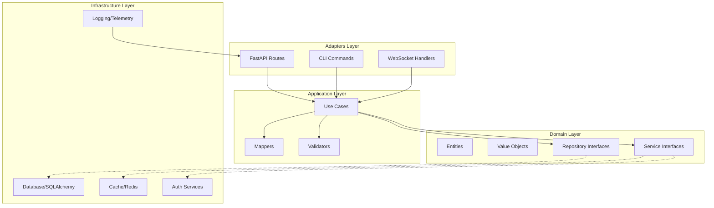
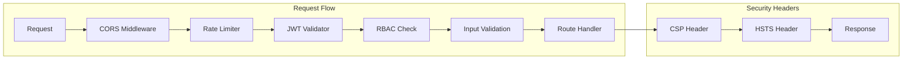

# Design Document: Comprehensive Code Review 2025

## Overview

Este documento descreve o design técnico para implementar melhorias abrangentes no projeto `src/my_api`, focando em segurança, arquitetura limpa, e boas práticas modernas de Python/FastAPI. O objetivo é elevar a qualidade do código seguindo padrões OWASP Top 10, Clean Architecture, e convenções Python 3.12+.

### Scope

- Security hardening (OWASP API Security Top 10 2023)
- Exception handling consistency
- Dependency injection improvements
- Domain layer purity (DDD patterns)
- Application layer patterns (Use Cases)
- Repository pattern compliance
- Configuration management
- Authentication and authorization (JWT, RBAC)
- Observability and logging
- Code quality standards

## Architecture

### High-Level Architecture



### Security Architecture



## Components and Interfaces

### 1. Security Components

#### JWTValidator
```python
from typing import Protocol
from datetime import datetime

class JWTValidatorProtocol(Protocol):
    """Protocol for JWT validation with CVE-2024-33663 mitigation."""
    
    def validate_token(self, token: str) -> TokenPayload:
        """Validate JWT token with algorithm restriction."""
        ...
    
    def reject_none_algorithm(self, token: str) -> bool:
        """Reject tokens with 'none' algorithm."""
        ...
    
    def verify_algorithm_header(self, token: str, expected: str) -> bool:
        """Verify algorithm header matches expected."""
        ...
```

#### RBACService
```python
class RBACServiceProtocol(Protocol):
    """Protocol for Role-Based Access Control."""
    
    def check_permission(self, user_id: str, resource: str, action: str) -> bool:
        """Check if user has permission for action on resource."""
        ...
    
    def aggregate_permissions(self, roles: list[str]) -> set[str]:
        """Aggregate permissions from multiple roles."""
        ...
```

#### PasswordValidator
```python
class PasswordValidatorProtocol(Protocol):
    """Protocol for password validation with OWASP compliance."""
    
    def validate_complexity(self, password: str) -> ValidationResult:
        """Validate password complexity requirements."""
        ...
    
    def check_common_passwords(self, password: str) -> bool:
        """Check against common passwords list."""
        ...
    
    def hash_password(self, password: str) -> str:
        """Hash password using Argon2id."""
        ...
```

### 2. Exception Handling Components

#### BaseException Structure
```python
from dataclasses import dataclass
from datetime import datetime
from typing import Any

@dataclass(frozen=True, slots=True)
class ErrorResponse:
    """Standardized error response structure."""
    message: str
    error_code: str
    status_code: int
    correlation_id: str
    timestamp: datetime
    details: dict[str, Any] | None = None
```

#### Exception Hierarchy
```python
class APIException(Exception):
    """Base exception for all API errors."""
    error_code: str
    status_code: int
    
class ValidationException(APIException):
    """Validation errors with field-level details."""
    field_errors: dict[str, list[str]]
    
class AuthenticationException(APIException):
    """Authentication failures."""
    
class AuthorizationException(APIException):
    """Authorization failures."""
```

### 3. Configuration Components

#### Settings with Validation
```python
from pydantic import SecretStr, field_validator
from pydantic_settings import BaseSettings

class SecuritySettings(BaseSettings):
    """Security configuration with validation."""
    
    jwt_secret_key: SecretStr
    jwt_algorithm: str = "HS256"
    jwt_expiration_minutes: int = 30
    
    @field_validator("jwt_secret_key")
    @classmethod
    def validate_secret_key_length(cls, v: SecretStr) -> SecretStr:
        """Require minimum 32 characters for 256-bit entropy."""
        if len(v.get_secret_value()) < 32:
            raise ValueError("Secret key must be at least 32 characters")
        return v
```

### 4. Domain Layer Components

#### Value Objects
```python
from dataclasses import dataclass
from decimal import Decimal
import re

ULID_PATTERN = re.compile(r"^[0-9A-HJKMNP-TV-Z]{26}$")

@dataclass(frozen=True, slots=True)
class EntityId:
    """Immutable ULID-based entity identifier."""
    value: str
    
    def __post_init__(self) -> None:
        if not ULID_PATTERN.match(self.value):
            raise ValueError(f"Invalid ULID format: {self.value}")
    
    def __eq__(self, other: object) -> bool:
        if not isinstance(other, EntityId):
            return NotImplemented
        return self.value == other.value
    
    def __hash__(self) -> int:
        return hash(self.value)

@dataclass(frozen=True, slots=True)
class Money:
    """Immutable monetary value with Decimal precision."""
    amount: Decimal
    currency: str
    
    def __add__(self, other: "Money") -> "Money":
        if self.currency != other.currency:
            raise ValueError("Cannot add different currencies")
        return Money(self.amount + other.amount, self.currency)
```

### 5. Application Layer Components

#### Use Case Pattern
```python
from typing import Protocol, Generic, TypeVar

InputDTO = TypeVar("InputDTO")
OutputDTO = TypeVar("OutputDTO")

class UseCaseProtocol(Protocol[InputDTO, OutputDTO]):
    """Protocol for use case execution."""
    
    async def execute(self, input_dto: InputDTO) -> OutputDTO:
        """Execute the use case."""
        ...

class BaseUseCase(Generic[InputDTO, OutputDTO]):
    """Base use case with validation and logging."""
    
    async def execute(self, input_dto: InputDTO) -> OutputDTO:
        """Execute with validation and error collection."""
        errors = await self._validate(input_dto)
        if errors:
            raise ValidationException(field_errors=errors)
        return await self._execute(input_dto)
```

#### Mapper Pattern
```python
class MapperProtocol(Protocol[Entity, DTO]):
    """Protocol for entity-DTO mapping."""
    
    def to_dto(self, entity: Entity) -> DTO:
        """Convert entity to DTO."""
        ...
    
    def to_entity(self, dto: DTO) -> Entity:
        """Convert DTO to entity."""
        ...
```

### 6. Repository Components

#### Repository Interface
```python
from typing import Protocol, TypeVar, Generic

T = TypeVar("T")

class RepositoryProtocol(Protocol[T]):
    """Protocol for repository operations."""
    
    async def get_by_id(self, id: str) -> T | None:
        """Get entity by ID."""
        ...
    
    async def list(
        self, 
        skip: int = 0, 
        limit: int = 100,
        filters: dict[str, Any] | None = None
    ) -> list[T]:
        """List entities with pagination and filtering."""
        ...
    
    async def create(self, entity: T) -> T:
        """Create new entity."""
        ...
    
    async def soft_delete(self, id: str) -> bool:
        """Soft delete entity."""
        ...
```

### 7. Observability Components

#### Structured Logger
```python
class StructuredLoggerProtocol(Protocol):
    """Protocol for structured logging."""
    
    def log(
        self,
        level: str,
        message: str,
        correlation_id: str,
        **context: Any
    ) -> None:
        """Log with structured context."""
        ...
    
    def mask_pii(self, data: dict[str, Any]) -> dict[str, Any]:
        """Mask PII fields in log data."""
        ...
```

#### Audit Logger
```python
@dataclass(frozen=True, slots=True)
class AuditEvent:
    """Immutable audit event."""
    timestamp: datetime
    user_id: str
    action: str
    resource: str
    outcome: str
    ip_address: str
    user_agent: str
```

## Data Models

### JWT Token Payload
```python
@dataclass(frozen=True, slots=True)
class TokenPayload:
    """JWT token payload with required claims."""
    sub: str  # Subject (user ID)
    exp: datetime  # Expiration
    iat: datetime  # Issued at
    jti: str  # JWT ID for replay protection
    scopes: list[str]  # Permissions
    token_type: str  # "access" or "refresh"
```

### Error Response Model
```python
@dataclass(frozen=True, slots=True)
class ErrorResponse:
    """Standardized API error response."""
    message: str
    error_code: str
    status_code: int
    correlation_id: str
    timestamp: datetime
    details: dict[str, Any] | None = None
```

### Rate Limit State
```python
@dataclass(slots=True)
class RateLimitState:
    """Rate limit tracking state."""
    client_id: str
    window_start: datetime
    request_count: int
    tier: str
```

## Correctness Properties

*A property is a characteristic or behavior that should hold true across all valid executions of a system-essentially, a formal statement about what the system should do. Properties serve as the bridge between human-readable specifications and machine-verifiable correctness guarantees.*

### Property 1: JWT Algorithm Restriction
*For any* JWT token, if the algorithm header is "none" (case-insensitive), the validator SHALL reject the token.
**Validates: Requirements 13.1**

### Property 2: JWT Algorithm Header Verification
*For any* JWT token, the validator SHALL verify the algorithm header matches the expected algorithm before signature verification.
**Validates: Requirements 13.2**

### Property 3: Secret Key Minimum Length
*For any* secret key configuration, keys shorter than 32 characters SHALL be rejected with a validation error.
**Validates: Requirements 7.4, 13.4**

### Property 4: Exception Response Structure
*For any* exception, the serialized response SHALL contain message, error_code, status_code, correlation_id, and timestamp fields.
**Validates: Requirements 2.1, 2.3**

### Property 5: Exception Chain Preservation
*For any* chained exception, the original cause SHALL be preserved and accessible via __cause__ attribute.
**Validates: Requirements 2.2**

### Property 6: ULID Format Validation
*For any* string, the EntityId validator SHALL accept only strings matching the ULID pattern (26 alphanumeric characters excluding I, L, O, U).
**Validates: Requirements 4.2**

### Property 7: Value Object Equality
*For any* two value objects with identical attribute values, they SHALL be equal and have the same hash.
**Validates: Requirements 4.5**

### Property 8: Monetary Calculation Precision
*For any* monetary calculation, the result SHALL maintain Decimal precision without floating-point errors.
**Validates: Requirements 4.3**

### Property 9: Mapper Round-Trip Consistency
*For any* entity, mapping to DTO and back to entity SHALL produce an equivalent entity.
**Validates: Requirements 11.2**

### Property 10: Validation Error Collection
*For any* input with multiple validation errors, the validator SHALL collect all errors before raising exception.
**Validates: Requirements 5.2**

### Property 11: Pagination Correctness
*For any* list query with skip/limit parameters, the result SHALL contain at most `limit` items starting from position `skip`.
**Validates: Requirements 6.1**

### Property 12: Soft Delete Exclusion
*For any* soft-deleted entity, subsequent queries SHALL exclude the entity from results.
**Validates: Requirements 6.3**

### Property 13: Rate Limit Response Format
*For any* rate-limited request, the response SHALL be 429 status with Retry-After header.
**Validates: Requirements 16.2**

### Property 14: RBAC Permission Aggregation
*For any* user with multiple roles, the effective permissions SHALL be the union of all role permissions.
**Validates: Requirements 8.4**

### Property 15: Password Complexity Validation
*For any* password shorter than 12 characters or lacking complexity requirements, validation SHALL fail.
**Validates: Requirements 18.3**

### Property 16: Common Password Rejection
*For any* password in the common passwords list, validation SHALL fail.
**Validates: Requirements 18.2**

### Property 17: Argon2id Hash Format
*For any* password hash, the hash SHALL use Argon2id algorithm with minimum parameters (memory 64MB, iterations 3, parallelism 4).
**Validates: Requirements 18.1**

### Property 18: Credential Redaction in Logs
*For any* log output containing database URLs or API keys, credentials SHALL be redacted.
**Validates: Requirements 7.2, 17.3**

### Property 19: SecretStr String Representation
*For any* SecretStr value, string representation SHALL not expose the secret value.
**Validates: Requirements 1.4, 17.1**

### Property 20: Audit Log Structure
*For any* audit event, the log SHALL contain timestamp, user_id, action, resource, and outcome fields.
**Validates: Requirements 19.1**

### Property 21: PII Masking
*For any* log data containing PII patterns (email, phone, SSN, credit card), the values SHALL be masked.
**Validates: Requirements 19.2**

### Property 22: HTTP Security Headers Presence
*For any* API response, the headers SHALL include HSTS, X-Content-Type-Options, X-Frame-Options, and Referrer-Policy.
**Validates: Requirements 21.1-21.5**

### Property 23: Error Information Non-Disclosure
*For any* 5xx error response, the response SHALL not contain stack traces or internal implementation details.
**Validates: Requirements 25.1, 25.2**

### Property 24: Request Size Limit Enforcement
*For any* request exceeding the maximum body size, the response SHALL be 413 Payload Too Large.
**Validates: Requirements 26.1**

### Property 25: JSON Nesting Depth Limit
*For any* JSON payload exceeding maximum nesting depth, the request SHALL be rejected.
**Validates: Requirements 14.5, 26.3**

### Property 26: Lifecycle Hook Execution Order
*For any* set of lifecycle hooks, startup hooks SHALL execute in registration order and shutdown hooks in reverse order.
**Validates: Requirements 3.4**

### Property 27: Lifecycle Hook Error Aggregation
*For any* failing lifecycle hook, remaining hooks SHALL still execute and all errors SHALL be aggregated.
**Validates: Requirements 3.5**

### Property 28: Singleton Thread Safety
*For any* concurrent access to singleton, all threads SHALL receive the same instance.
**Validates: Requirements 3.2, 22.4**

### Property 29: Idempotency Key Behavior
*For any* request with duplicate idempotency key, the response SHALL be the cached response without re-execution.
**Validates: Requirements 41.2**

### Property 30: Circuit Breaker State Transitions
*For any* circuit breaker, state transitions SHALL follow: closed -> open (on threshold) -> half-open (after timeout) -> closed/open (on probe result).
**Validates: Requirements 42.1, 42.2**

## Error Handling

### Error Categories

| Category | HTTP Status | Error Code Pattern | Retry |
|----------|-------------|-------------------|-------|
| Validation | 400 | VAL_* | No |
| Authentication | 401 | AUTH_* | No |
| Authorization | 403 | AUTHZ_* | No |
| Not Found | 404 | NOT_FOUND_* | No |
| Conflict | 409 | CONFLICT_* | No |
| Rate Limit | 429 | RATE_LIMIT_* | Yes |
| Server Error | 500 | INTERNAL_* | Yes |
| Service Unavailable | 503 | SERVICE_* | Yes |

### Error Response Format
```json
{
  "message": "Human-readable error message",
  "error_code": "VAL_INVALID_INPUT",
  "status_code": 400,
  "correlation_id": "01HXYZ123456789ABCDEF",
  "timestamp": "2025-11-30T12:00:00Z",
  "details": {
    "field_errors": {
      "email": ["Invalid email format"],
      "password": ["Password too short", "Missing uppercase letter"]
    }
  }
}
```

## Testing Strategy

### Property-Based Testing with Hypothesis

The project SHALL use **Hypothesis** as the property-based testing library for Python.

#### Configuration
```python
from hypothesis import settings, Phase

# Configure minimum 100 iterations per property test
settings.register_profile(
    "ci",
    max_examples=100,
    phases=[Phase.explicit, Phase.reuse, Phase.generate, Phase.shrink]
)
```

#### Test Structure
Each property-based test SHALL:
1. Be annotated with the property number and requirement reference
2. Use smart generators that constrain to valid input space
3. Run minimum 100 iterations
4. Include shrinking for failure case minimization

#### Example Property Test
```python
from hypothesis import given, strategies as st

@given(st.text(min_size=1, max_size=100))
def test_ulid_validation_rejects_invalid_format(value: str):
    """
    **Feature: comprehensive-code-review-2025, Property 6: ULID Format Validation**
    **Validates: Requirements 4.2**
    """
    # Only valid ULIDs should pass
    is_valid_ulid = bool(ULID_PATTERN.match(value))
    if is_valid_ulid:
        entity_id = EntityId(value)
        assert entity_id.value == value
    else:
        with pytest.raises(ValueError):
            EntityId(value)
```

### Unit Testing

Unit tests SHALL cover:
- Specific edge cases not covered by property tests
- Integration points between components
- Error conditions and exception handling
- Configuration validation

### Test Organization

```
tests/
├── properties/
│   ├── test_jwt_properties.py
│   ├── test_exception_properties.py
│   ├── test_value_object_properties.py
│   ├── test_mapper_properties.py
│   ├── test_repository_properties.py
│   ├── test_rate_limit_properties.py
│   ├── test_password_properties.py
│   ├── test_audit_properties.py
│   └── test_security_headers_properties.py
├── unit/
│   ├── test_jwt_validator.py
│   ├── test_rbac_service.py
│   ├── test_password_validator.py
│   └── test_config_validation.py
└── integration/
    ├── test_auth_flow.py
    └── test_rate_limiting.py
```
