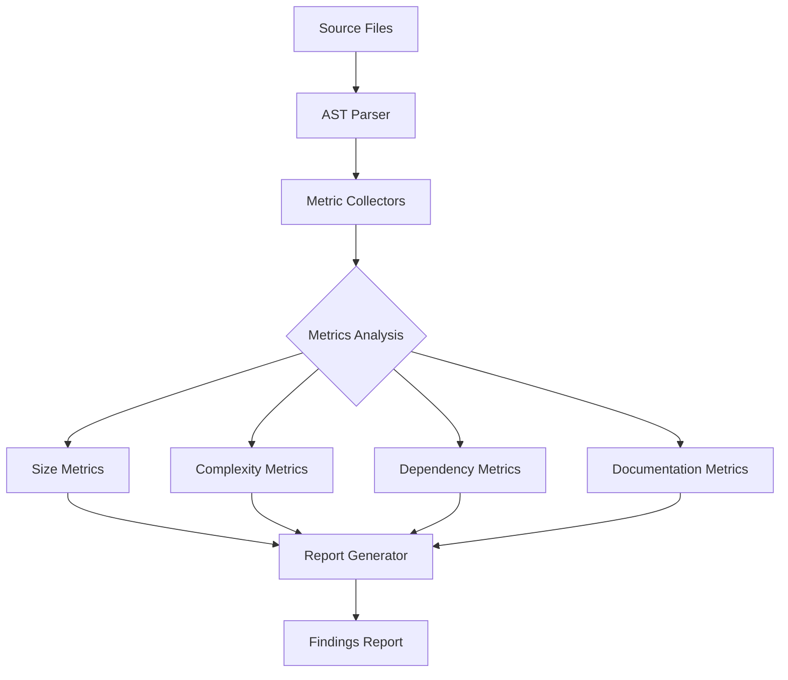

# Design Document

## Overview

This design document outlines the technical approach for a comprehensive code review of the entire codebase. The review focuses on SOLID principles, DRY, Clean Code standards, security, architecture compliance, error handling, documentation, and test coverage.

The review uses automated static analysis tools combined with property-based testing to verify code quality metrics across all modules.

## Architecture

### Review Scope

```
src/my_api/
├── domain/           # Business entities, value objects, repository interfaces
├── application/      # Use cases, DTOs, mappers
├── infrastructure/   # Database, external services, auth
├── adapters/         # API routes, repositories implementation
├── shared/           # Cross-cutting concerns, utilities
└── core/             # Configuration, exceptions, container
```

### Review Pipeline



## Components and Interfaces

### Code Analyzer Components

| Component | Responsibility | Output |
|-----------|---------------|--------|
| `SizeAnalyzer` | Measure function/class/file sizes | Line counts, violations |
| `ComplexityAnalyzer` | Calculate cyclomatic complexity | Complexity scores |
| `DependencyAnalyzer` | Analyze imports and dependencies | Dependency graph, violations |
| `NamingAnalyzer` | Check naming conventions | Convention violations |
| `DocumentationAnalyzer` | Check docstrings and type hints | Missing documentation |
| `SecurityAnalyzer` | Detect security anti-patterns | Security findings |
| `DuplicationDetector` | Find duplicated code blocks | Duplication report |

### Analyzer Interface

```python
from abc import ABC, abstractmethod
from dataclasses import dataclass
from pathlib import Path

@dataclass
class Finding:
    file: Path
    line: int
    rule: str
    severity: str  # "error", "warning", "info"
    message: str

class CodeAnalyzer(ABC):
    @abstractmethod
    def analyze(self, file_path: Path) -> list[Finding]:
        """Analyze a single file and return findings."""
        pass
    
    @abstractmethod
    def analyze_all(self, directory: Path) -> list[Finding]:
        """Analyze all Python files in directory."""
        pass
```

### Metric Thresholds

| Metric | Target | Maximum | Action |
|--------|--------|---------|--------|
| Function lines | 50 | 75 | Refactor |
| Class lines | 300 | 400 | Split |
| File lines | 300 | 400 | Modularize |
| Cyclomatic complexity | 10 | 15 | Simplify |
| Nesting depth | 3 | 4 | Flatten |
| Parameters | 4 | 6 | Use object |
| Interface methods | 5 | 10 | Segregate |

## Data Models

### Finding Categories

```python
from enum import Enum

class FindingCategory(Enum):
    SOLID = "solid"
    DRY = "dry"
    CLEAN_CODE = "clean_code"
    SECURITY = "security"
    ARCHITECTURE = "architecture"
    ERROR_HANDLING = "error_handling"
    DOCUMENTATION = "documentation"
    TEST_COVERAGE = "test_coverage"

class Severity(Enum):
    ERROR = "error"      # Must fix
    WARNING = "warning"  # Should fix
    INFO = "info"        # Consider fixing
```

### Review Report Structure

```python
@dataclass
class ReviewReport:
    total_files: int
    total_findings: int
    findings_by_category: dict[FindingCategory, int]
    findings_by_severity: dict[Severity, int]
    findings: list[Finding]
    metrics: dict[str, Any]
```

## Correctness Properties

*A property is a characteristic or behavior that should hold true across all valid executions of a system-essentially, a formal statement about what the system should do. Properties serve as the bridge between human-readable specifications and machine-verifiable correctness guarantees.*

### Property 1: Function Size Compliance

*For any* Python function in the codebase, the function body should contain 75 lines or fewer.

**Validates: Requirements 3.1**

### Property 2: Class Size Compliance

*For any* Python class in the codebase, the class definition should contain 400 lines or fewer.

**Validates: Requirements 3.2**

### Property 3: Nesting Depth Compliance

*For any* code block in the codebase, the nesting depth should be 4 levels or fewer.

**Validates: Requirements 3.3**

### Property 4: Cyclomatic Complexity Compliance

*For any* Python function in the codebase, the cyclomatic complexity should be 15 or fewer.

**Validates: Requirements 3.4**

### Property 5: Parameter Count Compliance

*For any* Python function in the codebase, the parameter count should be 6 or fewer (excluding self/cls).

**Validates: Requirements 3.6**

### Property 6: Domain Layer Isolation

*For any* module in the domain layer, the module should not import from infrastructure or adapters layers.

**Validates: Requirements 5.1**

### Property 7: No Circular Imports

*For any* module in the codebase, importing that module should not raise an ImportError due to circular dependencies.

**Validates: Requirements 5.5**

### Property 8: Public API Documentation

*For any* public function or class in the codebase, a docstring should exist.

**Validates: Requirements 7.1, 7.3**

### Property 9: Type Annotation Coverage

*For any* public function in the codebase, type annotations should exist for parameters and return type.

**Validates: Requirements 7.4**

### Property 10: No Hardcoded Secrets

*For any* Python file in the codebase, no hardcoded passwords, API keys, or tokens should exist in string literals.

**Validates: Requirements 4.4**

### Property 11: Test File Existence

*For any* module in src/my_api, a corresponding test file should exist in the tests directory.

**Validates: Requirements 8.1**

## Error Handling

### Analysis Errors

| Error Type | Handling Strategy |
|-----------|-------------------|
| Parse errors | Log and skip file, continue analysis |
| Import errors | Record as finding, continue |
| Permission errors | Log warning, skip file |
| Timeout | Set max analysis time per file |

## Testing Strategy

### Dual Testing Approach

- **Property-based tests**: Verify code quality properties across all files
- **Unit tests**: Verify analyzer components work correctly

### Property-Based Testing Framework

- **Library**: Hypothesis (Python)
- **Minimum iterations**: 100 per property
- **Test location**: `tests/properties/test_comprehensive_code_review_properties.py`

### Property Test Specifications

```python
@given(file_path=st.sampled_from(ALL_PYTHON_FILES))
@settings(max_examples=100)
def test_function_size_compliance(file_path: str) -> None:
    """
    **Feature: comprehensive-code-review, Property 1: Function Size Compliance**
    **Validates: Requirements 3.1**
    """
    # Parse file AST
    # For each function, count lines
    # Assert lines <= 75
    pass
```

### Existing Tool Integration

The review leverages existing tools:
- **ruff**: Linting and formatting
- **mypy**: Type checking (if configured)
- **pytest-cov**: Coverage reporting
- **radon**: Complexity metrics

### Verification Commands

```bash
# Run linting
ruff check src/my_api

# Run type checking
mypy src/my_api

# Run tests with coverage
pytest --cov=src/my_api --cov-report=term-missing

# Run property tests
pytest tests/properties/test_comprehensive_code_review_properties.py -v
```

