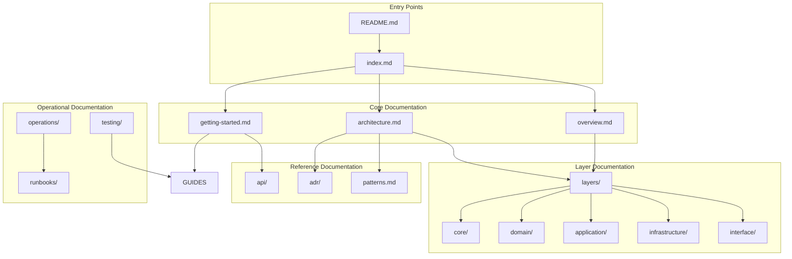

# Design Document: Comprehensive Documentation Improvement

## Overview

Este documento descreve o design para a melhoria abrangente da documentação do Python API Base. O objetivo é criar uma documentação completa, bem estruturada e de alta qualidade que sirva como referência definitiva para todos os stakeholders do projeto.

A documentação seguirá os princípios de Documentation-Driven Development (DDDoc), mantendo consistência com a arquitetura Clean Architecture e servindo como fonte única de verdade para o sistema.

## Architecture

### Documentation Structure

```
docs/
├── index.md                    # Índice principal (melhorado)
├── overview.md                 # Visão geral do sistema (melhorado)
├── architecture.md             # Arquitetura detalhada (melhorado)
├── getting-started.md          # Guia de início rápido (melhorado)
│
├── layers/                     # Documentação por camada
│   ├── index.md               # Índice de camadas
│   ├── core/                  # Core Layer
│   │   ├── index.md
│   │   ├── configuration.md
│   │   ├── protocols.md
│   │   ├── dependency-injection.md
│   │   └── error-handling.md
│   ├── domain/                # Domain Layer
│   │   ├── index.md
│   │   ├── entities.md
│   │   ├── value-objects.md
│   │   ├── specifications.md
│   │   └── domain-events.md
│   ├── application/           # Application Layer
│   │   ├── index.md
│   │   ├── cqrs.md
│   │   ├── use-cases.md
│   │   ├── dtos-mappers.md
│   │   └── services.md
│   ├── infrastructure/        # Infrastructure Layer
│   │   ├── index.md
│   │   ├── database.md
│   │   ├── cache.md
│   │   ├── messaging.md
│   │   ├── storage.md
│   │   └── resilience.md
│   └── interface/             # Interface Layer
│       ├── index.md
│       ├── rest-api.md
│       ├── graphql.md
│       ├── websocket.md
│       └── middleware.md
│
├── api/                        # API Documentation
│   ├── index.md               # Índice de API
│   ├── openapi.yaml           # OpenAPI 3.1 spec (melhorado)
│   ├── security.md            # Segurança de API (melhorado)
│   ├── versioning.md          # Versionamento (melhorado)
│   ├── rest/                  # REST endpoints
│   │   ├── auth.md
│   │   ├── users.md
│   │   ├── items.md
│   │   └── examples.md
│   ├── graphql/               # GraphQL schema
│   │   └── schema.md
│   └── websocket/             # WebSocket handlers
│       └── handlers.md
│
├── adr/                        # Architecture Decision Records
│   ├── README.md              # Índice de ADRs (melhorado)
│   ├── ADR-001-jwt-authentication.md
│   ├── ADR-002-rbac-implementation.md
│   ├── ... (ADRs existentes melhorados)
│   ├── ADR-013-documentation-structure.md (novo)
│   ├── ADR-014-testing-strategy.md (novo)
│   └── ADR-016-observability-strategy.md (novo)
│
├── guides/                     # Guias práticos
│   ├── index.md               # Índice de guias
│   ├── getting-started.md     # Início rápido (melhorado)
│   ├── contributing.md        # Contribuição (melhorado)
│   ├── bounded-context-guide.md
│   ├── integration-guide.md
│   ├── testing-guide.md       # Guia de testes (melhorado)
│   ├── security-guide.md      # Guia de segurança (novo)
│   ├── debugging-guide.md     # Guia de debugging (novo)
│   └── cqrs-middleware-guide.md
│
├── operations/                 # Documentação operacional
│   ├── index.md               # Índice operacional
│   ├── deployment.md          # Deploy (melhorado)
│   ├── monitoring.md          # Monitoramento (melhorado)
│   ├── security.md            # Segurança operacional
│   ├── scaling.md             # Escalabilidade (novo)
│   ├── backup-recovery.md     # Backup e recuperação (novo)
│   └── runbooks/              # Runbooks
│       ├── README.md          # Índice de runbooks
│       ├── database-connection-issues.md
│       ├── cache-failures.md
│       ├── circuit-breaker-open.md
│       ├── high-latency.md    # (novo)
│       ├── memory-issues.md   # (novo)
│       └── kafka-lag.md       # (novo)
│
├── testing/                    # Documentação de testes
│   ├── index.md               # Índice de testes
│   ├── unit-testing.md        # Testes unitários (novo)
│   ├── integration-testing.md # Testes de integração (novo)
│   ├── property-testing.md    # Property-based testing (novo)
│   ├── e2e-testing.md         # Testes e2e (novo)
│   ├── manual-api-testing.md  # Testes manuais
│   └── test-fixtures.md       # Fixtures e factories (novo)
│
├── infrastructure/             # Guias de infraestrutura
│   ├── index.md               # Índice
│   ├── postgresql.md          # PostgreSQL guide (novo)
│   ├── redis.md               # Redis guide (novo)
│   ├── kafka.md               # Kafka guide (novo)
│   ├── minio.md               # MinIO guide (novo)
│   └── elasticsearch.md       # Elasticsearch guide (novo)
│
├── templates/                  # Templates
│   ├── adr-template.md        # Template ADR (melhorado)
│   ├── api-endpoint-template.md
│   ├── module-template.md
│   ├── runbook-template.md    # Template runbook (melhorado)
│   ├── test-template.md       # Template de teste (novo)
│   └── bounded-context-template.md # Template BC (novo)
│
└── diagrams/                   # Diagramas
    ├── architecture-c4.md     # C4 Model (novo)
    ├── data-flow.md           # Fluxo de dados (novo)
    ├── sequence-diagrams.md   # Diagramas de sequência (novo)
    └── deployment.md          # Diagrama de deploy (novo)
```

### Documentation Flow



## Components and Interfaces

### 1. Layer Documentation Component

Cada camada terá documentação estruturada com:

```markdown
# [Layer Name] Layer

## Overview
Descrição da camada e suas responsabilidades.

## Directory Structure
Estrutura de diretórios com explicação.

## Key Components
Lista de componentes principais.

## Dependency Rules
- Allowed imports
- Prohibited imports
- Examples

## Patterns Used
Padrões de design utilizados.

## Code Examples
Exemplos práticos de implementação.

## Testing Guidelines
Como testar componentes desta camada.

## Common Mistakes
Erros comuns e como evitá-los.
```

### 2. API Documentation Component

```yaml
# OpenAPI 3.1 Structure
openapi: "3.1.0"
info:
  title: Python API Base
  version: "1.0.0"
  description: |
    Comprehensive API documentation with examples.
  
paths:
  /api/v1/users:
    get:
      summary: List users
      description: |
        Detailed description with business context.
      parameters:
        - name: skip
          in: query
          schema:
            type: integer
            default: 0
          description: Number of records to skip
      responses:
        "200":
          description: Success
          content:
            application/json:
              schema:
                $ref: "#/components/schemas/UserList"
              examples:
                default:
                  value:
                    items: [...]
                    total: 100
        "401":
          $ref: "#/components/responses/Unauthorized"
```

### 3. ADR Component

```markdown
# ADR-NNN: [Title]

## Status
[Proposed | Accepted | Deprecated | Superseded by ADR-XXX]

## Context
Contexto detalhado do problema.

## Decision
Decisão tomada com justificativa.

## Consequences

### Positive
- Benefício 1
- Benefício 2

### Negative
- Trade-off 1
- Trade-off 2

### Neutral
- Observação 1

## Alternatives Considered

### Alternative 1: [Name]
- Description
- Pros
- Cons
- Reason for rejection

### Alternative 2: [Name]
- Description
- Pros
- Cons
- Reason for rejection

## References
- Link 1
- Link 2
```

### 4. Runbook Component

```markdown
# Runbook: [Incident Name]

## Metadata
- **Severity:** P1/P2/P3/P4
- **SLO Impact:** [Description]
- **Recovery Time Estimate:** [Time]
- **Last Updated:** [Date]
- **Owner:** [Team/Person]

## Symptoms
- Sintoma 1
- Sintoma 2

## Diagnosis

### Step 1: [Check Name]
```bash
# Command to run
kubectl get pods -n production
```
**Expected Output:**
```
NAME                    READY   STATUS    RESTARTS
api-xxx                 1/1     Running   0
```

### Step 2: [Check Name]
...

## Resolution

### Option A: [Resolution Name]
1. Step 1
2. Step 2
3. Verification

### Option B: [Resolution Name]
...

## Escalation
- Level 1: [Contact]
- Level 2: [Contact]
- Level 3: [Contact]

## Post-Incident
- [ ] Update monitoring
- [ ] Document learnings
- [ ] Create follow-up tickets
```

## Data Models

### Documentation Metadata

```python
@dataclass
class DocumentMetadata:
    """Metadata for documentation files."""
    title: str
    description: str
    last_updated: datetime
    author: str
    version: str
    tags: list[str]
    status: DocumentStatus  # draft, review, published, deprecated

class DocumentStatus(Enum):
    DRAFT = "draft"
    REVIEW = "review"
    PUBLISHED = "published"
    DEPRECATED = "deprecated"
```

### ADR Structure

```python
@dataclass
class ADRDocument:
    """Architecture Decision Record structure."""
    number: int
    title: str
    status: ADRStatus
    context: str
    decision: str
    consequences: Consequences
    alternatives: list[Alternative]
    references: list[str]
    created_at: datetime
    updated_at: datetime | None
    superseded_by: int | None

class ADRStatus(Enum):
    PROPOSED = "proposed"
    ACCEPTED = "accepted"
    DEPRECATED = "deprecated"
    SUPERSEDED = "superseded"

@dataclass
class Consequences:
    positive: list[str]
    negative: list[str]
    neutral: list[str]

@dataclass
class Alternative:
    name: str
    description: str
    pros: list[str]
    cons: list[str]
    rejection_reason: str
```

### Runbook Structure

```python
@dataclass
class Runbook:
    """Runbook document structure."""
    title: str
    severity: Severity
    slo_impact: str
    recovery_time_estimate: str
    symptoms: list[str]
    diagnosis_steps: list[DiagnosisStep]
    resolution_options: list[ResolutionOption]
    escalation_contacts: list[EscalationContact]
    post_incident_tasks: list[str]

class Severity(Enum):
    P1 = "P1"  # Critical
    P2 = "P2"  # High
    P3 = "P3"  # Medium
    P4 = "P4"  # Low

@dataclass
class DiagnosisStep:
    name: str
    command: str
    expected_output: str
    interpretation: str

@dataclass
class ResolutionOption:
    name: str
    steps: list[str]
    verification: str
```

## Correctness Properties

*A property is a characteristic or behavior that should hold true across all valid executions of a system-essentially, a formal statement about what the system should do. Properties serve as the bridge between human-readable specifications and machine-verifiable correctness guarantees.*

### Property 1: Layer Documentation Completeness

*For any* architectural layer in the system, the documentation SHALL contain all required sections (overview, directory structure, components, dependency rules, patterns, examples, testing guidelines).

**Validates: Requirements 1.1, 1.2**

### Property 2: ADR Structure Compliance

*For any* ADR document in the repository, the document SHALL follow the standard template with all required sections (status, context, decision, consequences with positive/negative/neutral, alternatives considered).

**Validates: Requirements 3.1, 3.2**

### Property 3: Runbook Completeness

*For any* runbook document, the document SHALL contain all required metadata (severity, SLO impact, recovery time) and sections (symptoms, diagnosis, resolution, escalation).

**Validates: Requirements 4.2, 4.4**

### Property 4: API Documentation Coverage

*For any* API endpoint defined in the codebase, there SHALL exist corresponding documentation in the OpenAPI specification with request/response schemas and examples.

**Validates: Requirements 2.1, 2.2**

## Error Handling

### Documentation Validation Errors

| Error Type | Description | Resolution |
|------------|-------------|------------|
| `MissingSection` | Required section not found | Add missing section to document |
| `InvalidFormat` | Document doesn't follow template | Reformat according to template |
| `BrokenLink` | Internal link points to non-existent file | Fix or remove broken link |
| `OutdatedContent` | Content references deprecated features | Update content to current state |
| `MissingExample` | Code example not provided | Add relevant code example |

### Validation Script

```python
def validate_documentation(docs_path: Path) -> list[ValidationError]:
    """Validate all documentation files."""
    errors = []
    
    # Check layer documentation
    for layer in ["core", "domain", "application", "infrastructure", "interface"]:
        layer_path = docs_path / "layers" / layer
        if not layer_path.exists():
            errors.append(MissingSection(f"Layer documentation missing: {layer}"))
        else:
            errors.extend(validate_layer_doc(layer_path))
    
    # Check ADRs
    adr_path = docs_path / "adr"
    for adr_file in adr_path.glob("ADR-*.md"):
        errors.extend(validate_adr(adr_file))
    
    # Check runbooks
    runbook_path = docs_path / "operations" / "runbooks"
    for runbook_file in runbook_path.glob("*.md"):
        if runbook_file.name != "README.md":
            errors.extend(validate_runbook(runbook_file))
    
    return errors
```

## Testing Strategy

### Dual Testing Approach

A documentação será validada através de:

1. **Unit Tests**: Validação de estrutura e formato de documentos individuais
2. **Property-Based Tests**: Validação de propriedades que devem valer para todos os documentos

### Unit Testing

```python
# tests/unit/docs/test_documentation_structure.py
import pytest
from pathlib import Path

class TestDocumentationStructure:
    def test_index_exists(self, docs_path: Path):
        """Index file must exist."""
        assert (docs_path / "index.md").exists()
    
    def test_all_layers_documented(self, docs_path: Path):
        """All architectural layers must have documentation."""
        layers = ["core", "domain", "application", "infrastructure", "interface"]
        for layer in layers:
            assert (docs_path / "layers" / layer / "index.md").exists()
    
    def test_adr_index_exists(self, docs_path: Path):
        """ADR index must exist."""
        assert (docs_path / "adr" / "README.md").exists()
```

### Property-Based Testing

A biblioteca **Hypothesis** será utilizada para property-based testing.

```python
# tests/properties/test_documentation_properties.py
from hypothesis import given, strategies as st
from pathlib import Path
import re

class TestDocumentationProperties:
    """
    **Feature: comprehensive-documentation-improvement, Property 1: Layer Documentation Completeness**
    """
    @given(layer=st.sampled_from(["core", "domain", "application", "infrastructure", "interface"]))
    def test_layer_has_required_sections(self, layer: str, docs_path: Path):
        """For any layer, documentation must have all required sections."""
        required_sections = [
            "## Overview",
            "## Directory Structure", 
            "## Key Components",
            "## Dependency Rules",
        ]
        
        index_path = docs_path / "layers" / layer / "index.md"
        content = index_path.read_text()
        
        for section in required_sections:
            assert section in content, f"Missing section '{section}' in {layer} layer docs"

    """
    **Feature: comprehensive-documentation-improvement, Property 2: ADR Structure Compliance**
    """
    @given(adr_file=st.sampled_from(list(Path("docs/adr").glob("ADR-*.md"))))
    def test_adr_has_required_sections(self, adr_file: Path):
        """For any ADR, document must have all required sections."""
        required_sections = [
            "## Status",
            "## Context",
            "## Decision",
            "## Consequences",
        ]
        
        content = adr_file.read_text()
        
        for section in required_sections:
            assert section in content, f"Missing section '{section}' in {adr_file.name}"

    """
    **Feature: comprehensive-documentation-improvement, Property 3: Runbook Completeness**
    """
    @given(runbook_file=st.sampled_from(list(Path("docs/operations/runbooks").glob("*.md"))))
    def test_runbook_has_required_metadata(self, runbook_file: Path):
        """For any runbook, document must have severity and SLO impact."""
        if runbook_file.name == "README.md":
            return  # Skip index file
        
        content = runbook_file.read_text()
        
        assert "**Severity:**" in content, f"Missing severity in {runbook_file.name}"
        assert "**SLO Impact:**" in content, f"Missing SLO impact in {runbook_file.name}"
        assert "## Diagnosis" in content, f"Missing diagnosis section in {runbook_file.name}"
        assert "## Resolution" in content, f"Missing resolution section in {runbook_file.name}"
```

### Integration Testing

```python
# tests/integration/docs/test_documentation_links.py
import pytest
from pathlib import Path
import re

class TestDocumentationLinks:
    def test_no_broken_internal_links(self, docs_path: Path):
        """All internal links must point to existing files."""
        broken_links = []
        
        for md_file in docs_path.rglob("*.md"):
            content = md_file.read_text()
            # Find markdown links
            links = re.findall(r'\[.*?\]\(((?!http)[^)]+)\)', content)
            
            for link in links:
                # Remove anchors
                link_path = link.split("#")[0]
                if link_path:
                    target = (md_file.parent / link_path).resolve()
                    if not target.exists():
                        broken_links.append((md_file, link))
        
        assert not broken_links, f"Broken links found: {broken_links}"
```

### Test Configuration

```python
# tests/conftest.py
import pytest
from pathlib import Path

@pytest.fixture
def docs_path() -> Path:
    """Return path to documentation directory."""
    return Path(__file__).parent.parent / "docs"

@pytest.fixture
def adr_files(docs_path: Path) -> list[Path]:
    """Return list of ADR files."""
    return list((docs_path / "adr").glob("ADR-*.md"))

@pytest.fixture
def runbook_files(docs_path: Path) -> list[Path]:
    """Return list of runbook files."""
    runbooks_path = docs_path / "operations" / "runbooks"
    return [f for f in runbooks_path.glob("*.md") if f.name != "README.md"]
```

### Coverage Requirements

- Documentation validation tests: 100% of documents
- Link validation: All internal links
- Structure validation: All required sections

### Test Execution

```bash
# Run documentation tests
pytest tests/unit/docs/ -v

# Run property tests for documentation
pytest tests/properties/test_documentation_properties.py -v --hypothesis-profile=ci

# Run integration tests for links
pytest tests/integration/docs/ -v

# Run all documentation tests
pytest tests/ -k "docs or documentation" -v
```
