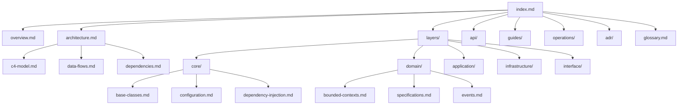
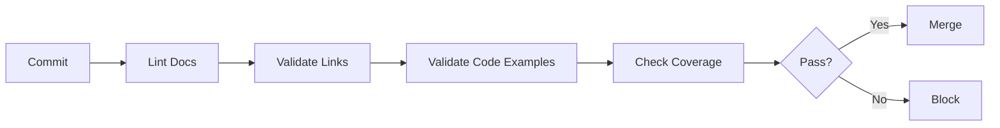

# Design Document: Comprehensive Project Documentation

## Overview

Este documento descreve o design para a documentação abrangente do projeto Python API Base. A documentação será estruturada em múltiplos níveis de detalhe, desde visão geral arquitetural até documentação de código específico, seguindo o princípio de Documentation-Driven Development (DDDoc).

### Objetivos

1. Criar documentação navegável e pesquisável
2. Manter sincronização entre código e documentação
3. Facilitar onboarding de novos desenvolvedores
4. Suportar operações e troubleshooting em produção
5. Documentar decisões arquiteturais e trade-offs

### Princípios de Design

- **Single Source of Truth**: Documentação como fonte autoritativa
- **Living Documentation**: Atualização contínua com o código
- **Layered Detail**: Do alto nível ao detalhe conforme necessidade
- **Searchable**: Estrutura que facilita busca e navegação
- **Executable Examples**: Exemplos que podem ser executados

## Architecture

### Estrutura de Documentação

```
docs/
├── index.md                    # Índice principal
├── overview.md                 # Visão geral do sistema
├── architecture.md             # Arquitetura de alto nível
│
├── architecture/               # Documentação arquitetural detalhada
│   ├── c4-model.md            # Diagramas C4
│   ├── data-flows.md          # Fluxos de dados
│   ├── dependencies.md        # Grafo de dependências
│   └── decisions.md           # Resumo de decisões
│
├── layers/                     # Documentação por camada
│   ├── core/                  # Camada Core
│   │   ├── index.md
│   │   ├── base-classes.md
│   │   ├── configuration.md
│   │   ├── dependency-injection.md
│   │   ├── errors.md
│   │   ├── protocols.md
│   │   └── types.md
│   ├── domain/                # Camada Domain
│   │   ├── index.md
│   │   ├── bounded-contexts.md
│   │   ├── specifications.md
│   │   ├── events.md
│   │   └── repositories.md
│   ├── application/           # Camada Application
│   │   ├── index.md
│   │   ├── cqrs.md
│   │   ├── dtos.md
│   │   ├── mappers.md
│   │   ├── services.md
│   │   └── middleware.md
│   ├── infrastructure/        # Camada Infrastructure
│   │   ├── index.md
│   │   ├── database.md
│   │   ├── cache.md
│   │   ├── messaging.md
│   │   ├── auth.md
│   │   ├── resilience.md
│   │   ├── observability.md
│   │   ├── storage.md
│   │   └── rbac.md
│   └── interface/             # Camada Interface
│       ├── index.md
│       ├── rest-api.md
│       ├── graphql.md
│       ├── websocket.md
│       ├── middleware.md
│       ├── versioning.md
│       └── error-handling.md
│
├── api/                        # Documentação de API
│   ├── README.md
│   ├── rest/
│   ├── graphql/
│   └── internal/
│
├── guides/                     # Guias práticos
│   ├── getting-started.md
│   ├── bounded-context-guide.md
│   ├── integration-guide.md
│   ├── testing-guide.md
│   └── contributing.md
│
├── operations/                 # Documentação operacional
│   ├── deployment.md
│   ├── monitoring.md
│   ├── security.md
│   └── runbooks/
│
├── adr/                        # Architecture Decision Records
│   └── ADR-XXX-*.md
│
└── glossary.md                 # Glossário de termos
```

### Diagrama de Navegação



## Components and Interfaces

### 1. Documentation Generator

Componente responsável por gerar documentação automatizada a partir do código.

```python
class DocumentationGenerator(Protocol):
    """Protocolo para geradores de documentação."""
    
    def generate_module_docs(self, module_path: Path) -> ModuleDocumentation:
        """Gera documentação para um módulo Python."""
        ...
    
    def generate_api_docs(self, router: APIRouter) -> APIDocumentation:
        """Gera documentação para endpoints de API."""
        ...
    
    def validate_coverage(self, source_dir: Path, docs_dir: Path) -> CoverageReport:
        """Valida cobertura de documentação."""
        ...
```

### 2. Documentation Validator

Componente que valida consistência entre código e documentação.

```python
class DocumentationValidator(Protocol):
    """Protocolo para validação de documentação."""
    
    def validate_links(self, docs_dir: Path) -> list[BrokenLink]:
        """Valida links internos e externos."""
        ...
    
    def validate_code_references(self, docs_dir: Path, source_dir: Path) -> list[InvalidReference]:
        """Valida referências a código no docs."""
        ...
    
    def validate_diagrams(self, docs_dir: Path) -> list[DiagramError]:
        """Valida sintaxe de diagramas Mermaid."""
        ...
```

### 3. Template System

Sistema de templates para documentação padronizada.

```python
@dataclass
class DocumentTemplate:
    """Template para documentos."""
    name: str
    sections: list[TemplateSection]
    required_fields: list[str]
    
@dataclass
class TemplateSection:
    """Seção de template."""
    title: str
    description: str
    example: str
    required: bool = True
```

## Data Models

### Documentation Metadata

```python
@dataclass
class DocumentMetadata:
    """Metadados de documento."""
    title: str
    description: str
    author: str
    created_at: datetime
    updated_at: datetime
    version: str
    tags: list[str]
    related_docs: list[str]
    related_code: list[str]

@dataclass
class ModuleDocumentation:
    """Documentação de módulo."""
    module_path: str
    description: str
    classes: list[ClassDocumentation]
    functions: list[FunctionDocumentation]
    examples: list[CodeExample]

@dataclass
class ClassDocumentation:
    """Documentação de classe."""
    name: str
    description: str
    base_classes: list[str]
    methods: list[MethodDocumentation]
    attributes: list[AttributeDocumentation]
    examples: list[CodeExample]

@dataclass
class APIEndpointDocumentation:
    """Documentação de endpoint."""
    path: str
    method: str
    summary: str
    description: str
    request_schema: dict
    response_schema: dict
    examples: list[APIExample]
    error_responses: list[ErrorResponse]
```

### Coverage Report

```python
@dataclass
class CoverageReport:
    """Relatório de cobertura de documentação."""
    total_modules: int
    documented_modules: int
    total_classes: int
    documented_classes: int
    total_functions: int
    documented_functions: int
    coverage_percentage: float
    missing_documentation: list[str]
```

## Correctness Properties

*A property is a characteristic or behavior that should hold true across all valid executions of a system-essentially, a formal statement about what the system should do. Properties serve as the bridge between human-readable specifications and machine-verifiable correctness guarantees.*

Based on the prework analysis, the following correctness properties are identified:

### Property 1: Documentation Coverage for Code Elements

*For any* Python module, class, or public function in the source code, there SHALL exist corresponding documentation that describes its purpose and usage.

**Validates: Requirements 2.1, 2.4, 2.5, 2.6, 3.1, 3.3, 3.4, 4.2, 4.4, 6.1, 11.1**

### Property 2: Dependency Graph Accuracy

*For any* module dependency shown in the dependency graph documentation, the actual code SHALL have a corresponding import statement, and vice versa.

**Validates: Requirements 1.4**

### Property 3: Configuration Documentation Completeness

*For any* configuration setting defined in Pydantic Settings classes, the documentation SHALL include the setting name, type, default value, and description that matches the actual code.

**Validates: Requirements 2.2**

### Property 4: Internal Link Validity

*For any* internal link in the documentation (markdown links to other docs), the target document SHALL exist at the specified path.

**Validates: Requirements 1.2, 1.3**

### Property 5: Code Example Validity

*For any* code example in the documentation that is marked as executable, the code SHALL be syntactically valid Python that can be parsed without errors.

**Validates: Requirements 3.2, 4.1, 4.3, 7.1, 7.2**

## Error Handling

### Documentation Errors

| Error Type | Description | Handling |
|------------|-------------|----------|
| `MissingDocumentationError` | Código sem documentação correspondente | Log warning, adicionar à lista de pendências |
| `BrokenLinkError` | Link interno quebrado | Falha na validação CI |
| `InvalidCodeExampleError` | Exemplo de código inválido | Falha na validação CI |
| `OutdatedDocumentationError` | Documentação desatualizada | Log warning, marcar para revisão |
| `DiagramSyntaxError` | Erro de sintaxe em diagrama Mermaid | Falha na validação CI |

### Validation Pipeline



## Testing Strategy

### Dual Testing Approach

A documentação será validada através de:

1. **Unit Tests**: Validação de componentes individuais
2. **Property-Based Tests**: Validação de propriedades universais

### Unit Testing

```python
# Exemplo de teste unitário para validação de links
def test_all_internal_links_are_valid():
    """Verifica que todos os links internos apontam para arquivos existentes."""
    docs_dir = Path("docs")
    broken_links = validate_internal_links(docs_dir)
    assert len(broken_links) == 0, f"Broken links found: {broken_links}"

def test_all_code_examples_are_valid_python():
    """Verifica que exemplos de código são Python válido."""
    docs_dir = Path("docs")
    invalid_examples = validate_code_examples(docs_dir)
    assert len(invalid_examples) == 0, f"Invalid examples: {invalid_examples}"
```

### Property-Based Testing

O projeto utilizará **Hypothesis** para property-based testing.

```python
from hypothesis import given, strategies as st

# Property 1: Documentation Coverage
@given(st.sampled_from(get_all_public_modules()))
def test_module_has_documentation(module_path: str):
    """
    **Feature: comprehensive-project-documentation, Property 1: Documentation Coverage**
    For any public module, documentation must exist.
    """
    doc_path = get_doc_path_for_module(module_path)
    assert doc_path.exists(), f"Missing docs for {module_path}"

# Property 4: Internal Link Validity
@given(st.sampled_from(get_all_internal_links()))
def test_internal_link_target_exists(link: InternalLink):
    """
    **Feature: comprehensive-project-documentation, Property 4: Internal Link Validity**
    For any internal link, the target must exist.
    """
    target_path = resolve_link(link)
    assert target_path.exists(), f"Broken link: {link}"

# Property 5: Code Example Validity
@given(st.sampled_from(get_all_code_examples()))
def test_code_example_is_valid_python(example: CodeExample):
    """
    **Feature: comprehensive-project-documentation, Property 5: Code Example Validity**
    For any code example, it must be valid Python syntax.
    """
    try:
        ast.parse(example.code)
    except SyntaxError as e:
        pytest.fail(f"Invalid Python in {example.source}: {e}")
```

### Test Configuration

- Minimum 100 iterations per property test
- Tests tagged with feature and property reference
- Coverage threshold: 80% of documented code elements

### Test Organization

```
tests/
├── docs/
│   ├── test_link_validation.py
│   ├── test_code_examples.py
│   ├── test_coverage.py
│   └── test_diagram_syntax.py
└── properties/
    └── test_documentation_properties.py
```
