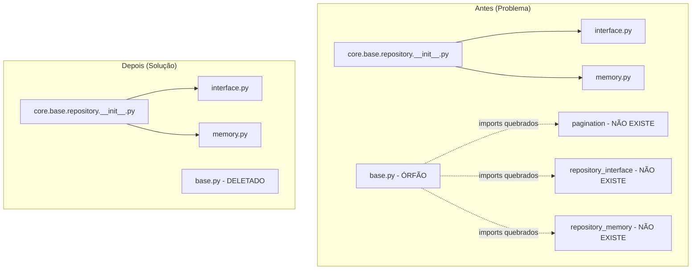

# Design Document: Core Base Repository Fix

## Overview

Este documento descreve a correção do arquivo órfão `src/core/base/repository/base.py` que contém imports quebrados. A solução é deletar o arquivo, pois ele não é utilizado em nenhum lugar do projeto e os imports corretos já estão disponíveis via `__init__.py`.

## Architecture



## Components and Interfaces

### Arquivos Afetados

| Arquivo | Ação | Justificativa |
|---------|------|---------------|
| `src/core/base/repository/base.py` | DELETAR | Código morto com imports quebrados |
| `src/core/base/repository/__init__.py` | MANTER | Já exporta corretamente IRepository e InMemoryRepository |
| `src/core/base/repository/interface.py` | MANTER | Contém IRepository |
| `src/core/base/repository/memory.py` | MANTER | Contém InMemoryRepository |

### Imports Corretos (já funcionando)

```python
# Via __init__.py (CORRETO - já funciona)
from core.base.repository import IRepository, InMemoryRepository

# Via módulos específicos (CORRETO - já funciona)
from core.base.repository.interface import IRepository
from core.base.repository.memory import InMemoryRepository

# Pagination (CORRETO - já funciona)
from core.base.patterns.pagination import CursorPage, CursorPagination
```

## Data Models

Não há alterações em modelos de dados. Esta é uma correção de estrutura de módulos.

## Correctness Properties

*A property is a characteristic or behavior that should hold true across all valid executions of a system-essentially, a formal statement about what the system should do. Properties serve as the bridge between human-readable specifications and machine-verifiable correctness guarantees.*

### Property 1: Repository module exports remain functional after cleanup

*For any* import statement that uses `core.base.repository`, the import should succeed and return the expected classes (`IRepository`, `InMemoryRepository`).

**Validates: Requirements 2.3**

### Property 2: All core.base submodules are importable

*For any* submodule in `core.base` (cqrs, domain, events, patterns, repository), importing the module should not raise `ModuleNotFoundError` or `ImportError`.

**Validates: Requirements 3.1, 3.2**

## Error Handling

| Cenário | Tratamento |
|---------|------------|
| Arquivo `base.py` ainda referenciado | Verificar grep antes de deletar |
| Import falha após deleção | Rollback e investigar dependências |
| Testes falham | Corrigir imports nos testes afetados |

## Testing Strategy

### Abordagem

1. **Verificação pré-deleção**: Confirmar que nenhum arquivo importa de `core.base.repository.base`
2. **Deleção**: Remover o arquivo órfão
3. **Verificação pós-deleção**: Executar testes existentes para garantir que nada quebrou
4. **Teste de propriedade**: Adicionar teste que verifica integridade dos imports do core.base

### Framework

- **Property-Based Testing**: Hypothesis (já configurado no projeto)
- **Unit Testing**: pytest

### Testes a Implementar

1. **Teste de exemplo**: Verificar que imports específicos funcionam
2. **Teste de propriedade**: Verificar que todos os submodulos de core.base são importáveis
