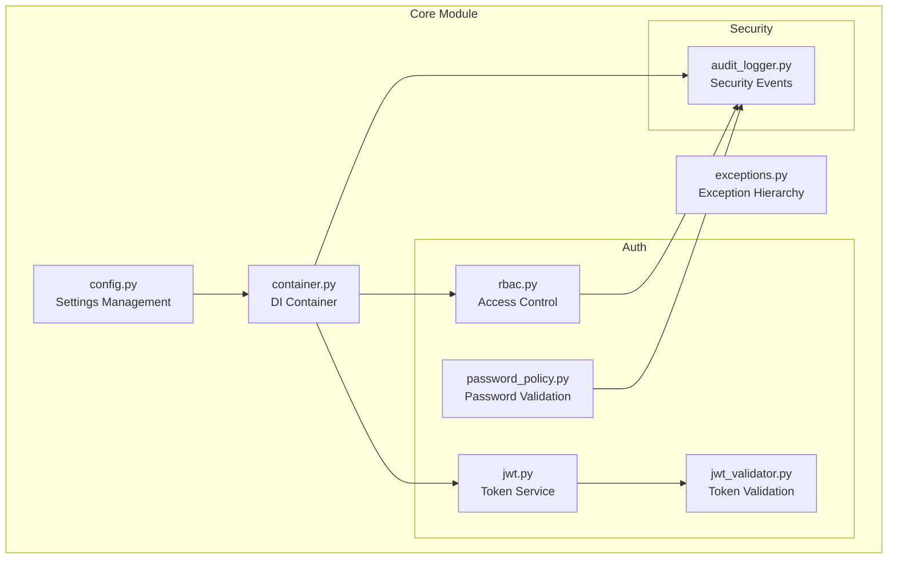

# Design Document: Core Module Code Review Refactoring

## Overview

This design document outlines the architectural improvements and refactoring needed for the `src/my_api/core` module based on a comprehensive code review. The core module is the foundation of the application, providing configuration management, dependency injection, exception handling, authentication (JWT, RBAC), and security audit logging.

The refactoring focuses on:
- Security hardening (JWT algorithm restriction, PII redaction, secret validation)
- Code quality improvements (type hints, consistent patterns, testability)
- Performance optimizations (caching, efficient lookups)
- Maintainability enhancements (better error messages, documentation)

## Architecture



## Components and Interfaces

### 1. Configuration Module (`config.py`)

**Current Issues:**
- No entropy validation for `secret_key`
- No production-mode warnings for insecure CORS
- Database URL credentials may leak in logs

**Proposed Changes:**
```python
class SecuritySettings(BaseSettings):
    secret_key: SecretStr = Field(
        ...,
        min_length=32,
        description="Secret key for signing tokens (min 256-bit entropy)",
    )
    
    @field_validator("secret_key")
    @classmethod
    def validate_secret_entropy(cls, v: SecretStr) -> SecretStr:
        """Validate secret key has sufficient entropy."""
        secret = v.get_secret_value()
        if len(secret) < 32:
            raise ValueError("Secret key must be at least 32 characters (256 bits)")
        return v
    
    @field_validator("cors_origins")
    @classmethod
    def warn_wildcard_cors(cls, v: list[str]) -> list[str]:
        """Warn about wildcard CORS in production."""
        if "*" in v and os.getenv("ENVIRONMENT") == "production":
            logger.warning("SECURITY: Wildcard CORS origin in production")
        return v
```

### 2. Exception Hierarchy (`exceptions.py`)

**Current Issues:**
- No correlation_id for request tracing
- No timestamp in serialized output
- Inconsistent error code namespacing

**Proposed Changes:**
```python
@dataclass(frozen=True)
class ErrorContext:
    """Immutable error context for tracing."""
    correlation_id: str
    timestamp: datetime
    request_path: str | None = None

class AppException(Exception):
    """Base application exception with tracing support."""
    
    def __init__(
        self,
        message: str,
        error_code: str,
        status_code: int = 400,
        details: dict[str, Any] | None = None,
        context: ErrorContext | None = None,
    ) -> None:
        self.message = message
        self.error_code = error_code
        self.status_code = status_code
        self.details = details or {}
        self.context = context or ErrorContext(
            correlation_id=generate_ulid(),
            timestamp=datetime.now(timezone.utc),
        )
        super().__init__(message)
```

### 3. JWT Service (`jwt.py`)

**Current Issues:**
- No injectable time source for testing
- Missing replay protection for refresh tokens
- Clock skew not configurable

**Proposed Changes:**
```python
from typing import Protocol

class TimeSource(Protocol):
    """Protocol for injectable time sources."""
    def now(self) -> datetime: ...

class SystemTimeSource:
    """Default system time source."""
    def now(self) -> datetime:
        return datetime.now(timezone.utc)

class JWTService:
    def __init__(
        self,
        secret_key: str,
        algorithm: str = "HS256",
        access_token_expire_minutes: int = 30,
        refresh_token_expire_days: int = 7,
        clock_skew_seconds: int = 30,
        time_source: TimeSource | None = None,
    ) -> None:
        self._time_source = time_source or SystemTimeSource()
        self._clock_skew = timedelta(seconds=clock_skew_seconds)
```

### 4. JWT Validator (`jwt_validator.py`)

**Current Issues:**
- Algorithm allowlist is good but could be stricter
- Missing fail-closed behavior for revocation store

**Proposed Changes:**
```python
class JWTValidator:
    ALLOWED_ALGORITHMS = frozenset(["RS256", "ES256", "HS256"])
    SECURE_ALGORITHMS = frozenset(["RS256", "ES256"])
    
    async def validate_with_revocation(
        self,
        token: str,
        expected_type: str | None = None,
    ) -> ValidatedToken:
        validated = self.validate(token, expected_type)
        
        if self._revocation_store:
            try:
                if await self._revocation_store.is_revoked(validated.jti):
                    raise InvalidTokenError("Token has been revoked")
            except Exception as e:
                # Fail closed - reject token if revocation check fails
                logger.error(f"Revocation check failed: {e}")
                raise InvalidTokenError("Unable to verify token status") from e
        
        return validated
```

### 5. RBAC Service (`rbac.py`)

**Current Issues:**
- No permission caching
- No audit events on role changes
- Decorator doesn't handle missing user gracefully

**Proposed Changes:**
```python
from functools import lru_cache

class RBACService:
    def __init__(
        self,
        roles: dict[str, Role] | None = None,
        audit_logger: SecurityAuditLogger | None = None,
        cache_ttl: int = 300,
    ) -> None:
        self._roles = roles or self._default_roles()
        self._audit_logger = audit_logger
        self._permission_cache: dict[str, tuple[set[Permission], float]] = {}
        self._cache_ttl = cache_ttl
    
    def add_role(self, role: Role) -> None:
        """Add or update a role with audit logging."""
        old_role = self._roles.get(role.name)
        self._roles[role.name] = role
        self._invalidate_cache()
        
        if self._audit_logger:
            self._audit_logger.log_role_change(
                role_name=role.name,
                action="update" if old_role else "create",
                old_permissions=[p.value for p in old_role.permissions] if old_role else [],
                new_permissions=[p.value for p in role.permissions],
            )
```

### 6. Security Audit Logger (`audit_logger.py`)

**Current Issues:**
- PII patterns could be more comprehensive
- No correlation_id support
- Missing some event types

**Proposed Changes:**
```python
class SecurityAuditLogger:
    PII_PATTERNS = [
        # Email
        (re.compile(r"\b[A-Za-z0-9._%+-]+@[A-Za-z0-9.-]+\.[A-Z|a-z]{2,}\b"), "[EMAIL]"),
        # Phone (various formats)
        (re.compile(r"\b(?:\+?1[-.\s]?)?\(?\d{3}\)?[-.\s]?\d{3}[-.\s]?\d{4}\b"), "[PHONE]"),
        # SSN
        (re.compile(r"\b\d{3}-\d{2}-\d{4}\b"), "[SSN]"),
        # Credit card (16 digits with optional separators)
        (re.compile(r"\b(?:\d{4}[-\s]?){3}\d{4}\b"), "[CARD]"),
        # Secrets in key=value format
        (re.compile(r"(password|secret|token|api[_-]?key|auth)[\"']?\s*[:=]\s*[\"']?[^\s\"']+", re.I), r"\1=[REDACTED]"),
        # Bearer tokens
        (re.compile(r"Bearer\s+[A-Za-z0-9\-_]+\.[A-Za-z0-9\-_]+\.[A-Za-z0-9\-_]+", re.I), "Bearer [REDACTED]"),
        # IP addresses (optional - may want to keep for security analysis)
        # (re.compile(r"\b\d{1,3}\.\d{1,3}\.\d{1,3}\.\d{1,3}\b"), "[IP]"),
    ]
    
    def __init__(
        self,
        logger: logging.Logger | None = None,
        redact_pii: bool = True,
        correlation_id_provider: Callable[[], str] | None = None,
    ) -> None:
        self._logger = logger or logging.getLogger("security.audit")
        self._redact_pii = redact_pii
        self._get_correlation_id = correlation_id_provider or generate_ulid
```

## Data Models

### TokenPayload (Enhanced)
```python
@dataclass(frozen=True)
class TokenPayload:
    sub: str
    exp: datetime
    iat: datetime
    jti: str
    scopes: tuple[str, ...] = field(default_factory=tuple)
    token_type: str = "access"
    
    # New fields
    iss: str | None = None  # Issuer
    aud: str | None = None  # Audience
    nbf: datetime | None = None  # Not before
    
    def is_expired(self, now: datetime | None = None, skew: timedelta = timedelta()) -> bool:
        """Check if token is expired with optional clock skew."""
        check_time = now or datetime.now(timezone.utc)
        return self.exp < (check_time - skew)
```

### SecurityEvent (Enhanced)
```python
@dataclass(frozen=True)
class SecurityEvent:
    event_type: SecurityEventType
    timestamp: datetime
    correlation_id: str
    client_ip: str | None = None
    user_id: str | None = None
    resource: str | None = None
    action: str | None = None
    reason: str | None = None
    metadata: dict[str, Any] = field(default_factory=dict)
    
    def to_dict(self) -> dict[str, Any]:
        """Convert event to dictionary for logging."""
        return {
            "event_type": self.event_type.value,
            "timestamp": self.timestamp.isoformat(),
            "correlation_id": self.correlation_id,
            "client_ip": self.client_ip,
            "user_id": self.user_id,
            "resource": self.resource,
            "action": self.action,
            "reason": self.reason,
            **self.metadata,
        }
```

## Correctness Properties

*A property is a characteristic or behavior that should hold true across all valid executions of a system-essentially, a formal statement about what the system should do. Properties serve as the bridge between human-readable specifications and machine-verifiable correctness guarantees.*

### Property 1: Secret Key Entropy Validation
*For any* secret key string, if its length is less than 32 characters, the Settings validation SHALL reject it with a ValueError.
**Validates: Requirements 1.1**

### Property 2: Database URL Credential Redaction
*For any* database URL containing credentials (username:password), when logged or serialized, the output SHALL NOT contain the original password.
**Validates: Requirements 1.3**

### Property 3: Exception Serialization Consistency
*For any* AppException instance, calling to_dict() SHALL produce a dictionary containing keys: message, error_code, status_code, details, correlation_id, and timestamp.
**Validates: Requirements 2.1, 2.2**

### Property 4: Lifecycle Hook Execution Order
*For any* sequence of registered lifecycle hooks, run_startup() SHALL execute them in registration order, and run_shutdown() SHALL execute them in reverse order.
**Validates: Requirements 3.4**

### Property 5: Lifecycle Hook Error Aggregation
*For any* set of shutdown hooks where some fail, run_shutdown_async() SHALL attempt to execute all hooks and not stop at the first failure.
**Validates: Requirements 3.5**

### Property 6: JWT Required Claims
*For any* user_id, when create_access_token() is called, the resulting token payload SHALL contain sub, exp, iat, and jti claims.
**Validates: Requirements 4.1**

### Property 7: JWT Algorithm Validation
*For any* token with an algorithm not in the allowlist or mismatched with expected algorithm, validate() SHALL raise InvalidTokenError before attempting signature verification.
**Validates: Requirements 4.2, 5.1, 5.4**

### Property 8: JWT None Algorithm Rejection
*For any* token using the "none" algorithm, the JWTValidator SHALL reject it immediately with InvalidTokenError.
**Validates: Requirements 4.3, 5.5**

### Property 9: Token Revocation Round-Trip
*For any* valid token that is revoked, subsequent calls to validate_with_revocation() SHALL raise InvalidTokenError until the token's natural expiry.
**Validates: Requirements 6.1, 6.2**

### Property 10: Revocation Store Fail-Closed
*For any* token validation when the revocation store is unavailable, validate_with_revocation() SHALL reject the token rather than allow it.
**Validates: Requirements 6.5**

### Property 11: Password Complexity Validation
*For any* password and PasswordPolicy, validate() SHALL return valid=False if the password fails any enabled complexity rule (length, uppercase, lowercase, digit, special).
**Validates: Requirements 7.1**

### Property 12: Common Password Rejection
*For any* password in the COMMON_PASSWORDS set, validate() SHALL return valid=False with an appropriate error message.
**Validates: Requirements 7.2**

### Property 13: Password Strength Score Bounds
*For any* password, validate() SHALL return a strength_score in the range [0, 100].
**Validates: Requirements 7.3**

### Property 14: Argon2id Hash Format
*For any* password hashed by hash_password(), the result SHALL be a valid Argon2id hash string starting with "$argon2id$".
**Validates: Requirements 7.5**

### Property 15: RBAC Permission Inheritance
*For any* user with roles, get_user_permissions() SHALL return the union of all permissions from all assigned roles.
**Validates: Requirements 8.1**

### Property 16: RBAC ANY/ALL Semantics
*For any* user and list of required permissions, check_any_permission() SHALL return True if at least one permission is present, and check_all_permissions() SHALL return True only if all permissions are present.
**Validates: Requirements 8.3**

### Property 17: RBAC Decorator Compatibility
*For any* function decorated with @require_permission, the decorator SHALL work correctly for both sync and async functions.
**Validates: Requirements 8.5**

### Property 18: Audit Log Required Fields
*For any* security event logged, the event SHALL contain event_type, timestamp, and correlation_id fields.
**Validates: Requirements 9.1**

### Property 19: PII Redaction Completeness
*For any* string containing email addresses, phone numbers, SSNs, or credit card numbers, _redact() SHALL replace them with appropriate placeholders.
**Validates: Requirements 9.2**

### Property 20: Secret Access Logging Safety
*For any* call to log_secret_access(), the logged event SHALL contain the secret name but SHALL NOT contain the secret value.
**Validates: Requirements 9.5**

### Property 21: Thread-Safe Singleton Access
*For any* concurrent calls to get_settings(), get_rbac_service(), or get_audit_logger(), the same instance SHALL be returned without race conditions.
**Validates: Requirements 10.4**

### Property 22: Environment Variable Override
*For any* Settings field, if a corresponding environment variable is set, the Settings instance SHALL use the environment variable value.
**Validates: Requirements 11.2**

### Property 23: Token Pretty Print Completeness
*For any* TokenPayload, pretty_print() SHALL include all fields (sub, exp, iat, jti, scopes, token_type) in the output string.
**Validates: Requirements 12.1**

### Property 24: Token Serialization Round-Trip
*For any* TokenPair, to_dict() SHALL produce a dictionary that can be serialized to valid JSON.
**Validates: Requirements 12.2**

### Property 25: ISO 8601 Timestamp Format
*For any* TokenPayload, pretty_print() SHALL format exp and iat timestamps in ISO 8601 format.
**Validates: Requirements 12.4**

## Error Handling

### Error Categories

| Error Type | HTTP Status | Error Code Pattern | Recovery |
|------------|-------------|-------------------|----------|
| ValidationError | 422 | VALIDATION_* | Client fixes input |
| AuthenticationError | 401 | AUTH_* | Re-authenticate |
| AuthorizationError | 403 | AUTHZ_* | Request access |
| EntityNotFoundError | 404 | NOT_FOUND_* | Check resource exists |
| ConflictError | 409 | CONFLICT_* | Resolve conflict |
| RateLimitExceededError | 429 | RATE_LIMIT_* | Wait and retry |

### Error Response Format
```json
{
  "message": "Human-readable error message",
  "error_code": "NAMESPACE_ERROR_TYPE",
  "status_code": 400,
  "details": {
    "field": "specific_field",
    "constraint": "violated_constraint"
  },
  "correlation_id": "01HXYZ...",
  "timestamp": "2024-01-15T10:30:00Z"
}
```

## Testing Strategy

### Dual Testing Approach

This module requires both unit tests and property-based tests:

1. **Unit Tests**: Verify specific examples, edge cases, and integration points
2. **Property-Based Tests**: Verify universal properties hold across all valid inputs

### Property-Based Testing Framework

**Library**: Hypothesis (Python)

**Configuration**:
```python
from hypothesis import settings, Phase

# Configure minimum 100 iterations per property
settings.register_profile(
    "ci",
    max_examples=100,
    phases=[Phase.explicit, Phase.reuse, Phase.generate, Phase.shrink],
)
```

### Test Organization

```
tests/
├── unit/
│   └── core/
│       ├── test_config.py
│       ├── test_exceptions.py
│       ├── test_container.py
│       └── auth/
│           ├── test_jwt.py
│           ├── test_jwt_validator.py
│           ├── test_password_policy.py
│           └── test_rbac.py
└── properties/
    └── test_core_properties.py  # All property-based tests
```

### Property Test Annotations

Each property-based test MUST be annotated with:
```python
@given(...)
def test_property_name(self, ...):
    """
    **Feature: core-code-review, Property N: Property Name**
    **Validates: Requirements X.Y**
    """
```
