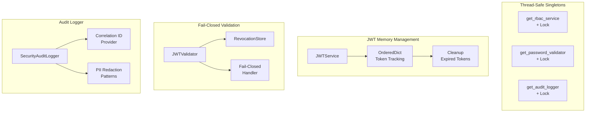

# Design Document: Core Module Improvements V2

## Overview

Este documento de design detalha as melhorias adicionais para o módulo `src/my_api/core`, identificadas através de um code review abrangente. As melhorias focam em:

- Thread-safety para singletons globais
- Gerenciamento de memória para tracking de refresh tokens
- Comportamento fail-closed para revocation store
- Suporte a correlation ID no audit logger
- Padrões de redação PII expandidos
- Exports de API pública explícitos
- Configuração correta de Redis no container
- Constantes nomeadas para qualidade de código

## Architecture



## Components and Interfaces

### 1. Thread-Safe Singletons

**Current Issue**: Race condition em inicialização concorrente.

**Proposed Changes** (`rbac.py`, `password_policy.py`, `audit_logger.py`):

```python
import threading

_rbac_service: RBACService | None = None
_rbac_lock = threading.Lock()

def get_rbac_service() -> RBACService:
    """Get the global RBAC service instance (thread-safe)."""
    global _rbac_service
    if _rbac_service is None:
        with _rbac_lock:
            if _rbac_service is None:  # Double-check locking
                _rbac_service = RBACService()
    return _rbac_service
```

### 2. JWT Refresh Token Memory Management

**Current Issue**: `_used_refresh_tokens` set cresce indefinidamente.

**Proposed Changes** (`jwt.py`):

```python
from collections import OrderedDict
from datetime import datetime

class JWTService:
    DEFAULT_MAX_TRACKED_TOKENS = 10000
    
    def __init__(
        self,
        ...,
        max_tracked_tokens: int = DEFAULT_MAX_TRACKED_TOKENS,
    ) -> None:
        # Use OrderedDict with expiry tracking for bounded memory
        self._used_refresh_tokens: OrderedDict[str, datetime] = OrderedDict()
        self._max_tracked_tokens = max_tracked_tokens
    
    def _cleanup_expired_tokens(self) -> None:
        """Remove expired tokens from tracking."""
        now = self._time_source.now()
        expired_jtis = [
            jti for jti, exp in self._used_refresh_tokens.items()
            if exp < now
        ]
        for jti in expired_jtis:
            del self._used_refresh_tokens[jti]
    
    def verify_refresh_token(self, token: str) -> TokenPayload:
        """Verify refresh token with replay protection and memory management."""
        self._cleanup_expired_tokens()
        payload = self.verify_token(token, expected_type="refresh")
        
        if payload.jti in self._used_refresh_tokens:
            raise TokenRevokedError("Refresh token has already been used")
        
        # Track with expiry for cleanup
        self._used_refresh_tokens[payload.jti] = payload.exp
        
        # Enforce max size (FIFO removal)
        while len(self._used_refresh_tokens) > self._max_tracked_tokens:
            self._used_refresh_tokens.popitem(last=False)
        
        return payload
```

### 3. JWT Validator Fail-Closed Behavior

**Current Issue**: Exceções do revocation store não são tratadas com fail-closed.

**Proposed Changes** (`jwt_validator.py`):

```python
async def validate_with_revocation(
    self,
    token: str,
    expected_type: str | None = None,
) -> ValidatedToken:
    """Validate token with fail-closed revocation check."""
    validated = self.validate(token, expected_type)

    if self._revocation_store:
        try:
            if await self._revocation_store.is_revoked(validated.jti):
                logger.warning("Rejected revoked token", extra={"jti": validated.jti})
                raise InvalidTokenError("Token has been revoked")
        except InvalidTokenError:
            raise  # Re-raise our own errors
        except Exception as e:
            # Fail closed - reject token if revocation check fails
            logger.error(
                "Revocation check failed, rejecting token",
                extra={"jti": validated.jti, "error": str(e)},
            )
            raise InvalidTokenError("Unable to verify token status") from e

    return validated
```

### 4. Audit Logger Correlation ID Support

**Current Issue**: Eventos não incluem correlation_id por padrão.

**Proposed Changes** (`audit_logger.py`):

```python
from typing import Callable
from my_api.shared.utils.ids import generate_ulid

@dataclass(frozen=True)
class SecurityEvent:
    event_type: SecurityEventType
    timestamp: datetime
    correlation_id: str  # Now required field
    client_ip: str | None = None
    # ... rest of fields

class SecurityAuditLogger:
    def __init__(
        self,
        logger: logging.Logger | None = None,
        redact_pii: bool = True,
        correlation_id_provider: Callable[[], str] | None = None,
    ) -> None:
        self._logger = logger or logging.getLogger("security.audit")
        self._redact_pii = redact_pii
        self._get_correlation_id = correlation_id_provider or generate_ulid
    
    def _create_event(self, event_type: SecurityEventType, **kwargs) -> SecurityEvent:
        return SecurityEvent(
            event_type=event_type,
            timestamp=datetime.now(timezone.utc),
            correlation_id=self._get_correlation_id(),
            **kwargs,
        )
```

### 5. Enhanced PII Redaction Patterns

**Current Issue**: Padrões de PII incompletos.

**Proposed Changes** (`audit_logger.py`):

```python
class SecurityAuditLogger:
    # Enhanced PII patterns
    PII_PATTERNS = [
        # Email
        (re.compile(r"\b[A-Za-z0-9._%+-]+@[A-Za-z0-9.-]+\.[A-Z|a-z]{2,}\b"), "[EMAIL]"),
        # Phone (various formats including international)
        (re.compile(r"\b(?:\+?1[-.\s]?)?\(?\d{3}\)?[-.\s]?\d{3}[-.\s]?\d{4}\b"), "[PHONE]"),
        (re.compile(r"\b\+\d{1,3}[-.\s]?\d{1,4}[-.\s]?\d{1,4}[-.\s]?\d{1,9}\b"), "[PHONE]"),
        # SSN
        (re.compile(r"\b\d{3}-\d{2}-\d{4}\b"), "[SSN]"),
        # Credit card (16 digits with optional separators)
        (re.compile(r"\b(?:\d{4}[-\s]?){3}\d{4}\b"), "[CARD]"),
        (re.compile(r"\b\d{16}\b"), "[CARD]"),
        # Secrets in key=value format
        (re.compile(r"(password|secret|token|api[_-]?key|auth)[\"']?\s*[:=]\s*[\"']?[^\s\"']+", re.I), r"\1=[REDACTED]"),
        # Bearer tokens
        (re.compile(r"Bearer\s+[A-Za-z0-9\-_]+\.[A-Za-z0-9\-_]+\.[A-Za-z0-9\-_]+", re.I), "Bearer [REDACTED]"),
    ]
    
    # Optional IP patterns (configurable)
    IP_PATTERNS = [
        (re.compile(r"\b(?:\d{1,3}\.){3}\d{1,3}\b"), "[IP_REDACTED]"),
        (re.compile(r"\b(?:[0-9a-fA-F]{1,4}:){7}[0-9a-fA-F]{1,4}\b"), "[IP_REDACTED]"),
    ]
    
    def __init__(
        self,
        ...,
        redact_ip_addresses: bool = False,
    ) -> None:
        self._redact_ip = redact_ip_addresses
```

### 6. Module Public API Exports

**Proposed Changes** (`exceptions.py`):

```python
__all__ = [
    "ErrorContext",
    "AppException",
    "EntityNotFoundError",
    "ValidationError",
    "BusinessRuleViolationError",
    "AuthenticationError",
    "AuthorizationError",
    "RateLimitExceededError",
    "ConflictError",
]
```

### 7. Container Redis URL Configuration

**Proposed Changes** (`container.py`):

```python
# Redis cache provider - use dedicated Redis settings
redis_cache = providers.Singleton(
    RedisCacheProvider,
    redis_url=providers.Callable(
        lambda cfg: cfg.redis.url if hasattr(cfg, "redis") and cfg.redis.enabled else "redis://localhost:6379",
        config,
    ),
    config=cache_config,
)
```

### 8. Code Quality Constants

**Proposed Changes** (`password_policy.py`):

```python
from typing import Final

# Password strength scoring constants
SCORE_PER_REQUIREMENT: Final[int] = 20
MAX_SCORE: Final[int] = 100
LENGTH_BONUS_MULTIPLIER: Final[int] = 2
MAX_LENGTH_BONUS: Final[int] = 20
COMMON_PASSWORD_PENALTY: Final[int] = 40

# Usage in validate():
score = min(MAX_SCORE, score + min(extra_length * LENGTH_BONUS_MULTIPLIER, MAX_LENGTH_BONUS))
```

## Data Models

### SecurityEvent (Enhanced)

```python
@dataclass(frozen=True)
class SecurityEvent:
    """Immutable security event record with correlation ID."""
    
    event_type: SecurityEventType
    timestamp: datetime
    correlation_id: str  # Required field
    client_ip: str | None = None
    user_id: str | None = None
    resource: str | None = None
    action: str | None = None
    reason: str | None = None
    metadata: dict[str, Any] = field(default_factory=dict)

    def to_dict(self) -> dict[str, Any]:
        """Convert event to dictionary for logging."""
        return {
            "event_type": self.event_type.value,
            "timestamp": self.timestamp.isoformat(),
            "correlation_id": self.correlation_id,
            "client_ip": self.client_ip,
            "user_id": self.user_id,
            "resource": self.resource,
            "action": self.action,
            "reason": self.reason,
            **self.metadata,
        }
```

## Correctness Properties

*A property is a characteristic or behavior that should hold true across all valid executions of a system-essentially, a formal statement about what the system should do. Properties serve as the bridge between human-readable specifications and machine-verifiable correctness guarantees.*

### Property 1: Thread-Safe Singleton Access
*For any* number of concurrent threads calling get_rbac_service(), get_password_validator(), or get_audit_logger(), all threads SHALL receive the same instance without race conditions.
**Validates: Requirements 1.1, 1.2, 1.3**

### Property 2: Bounded Token Tracking Memory
*For any* sequence of refresh token verifications, the number of tracked tokens SHALL never exceed max_tracked_tokens.
**Validates: Requirements 2.1, 2.2**

### Property 3: Token Tracking FIFO Removal
*For any* sequence of token additions when at capacity, the oldest token (by insertion order) SHALL be removed first.
**Validates: Requirements 2.2**

### Property 4: Fail-Closed Revocation Check
*For any* token validation when the revocation store raises an exception (other than InvalidTokenError), validate_with_revocation() SHALL raise InvalidTokenError.
**Validates: Requirements 3.1, 3.3, 3.5**

### Property 5: Correlation ID in All Events
*For any* security event created by SecurityAuditLogger, the event SHALL contain a non-empty correlation_id field.
**Validates: Requirements 4.2, 4.3, 4.5**

### Property 6: Custom Correlation ID Provider
*For any* SecurityAuditLogger configured with a correlation_id_provider, all events SHALL use the provided correlation ID.
**Validates: Requirements 4.4**

### Property 7: Bearer Token Redaction
*For any* string containing a Bearer JWT token, _redact() SHALL replace it with "Bearer [REDACTED]".
**Validates: Requirements 5.2**

### Property 8: Credit Card Redaction with Separators
*For any* string containing a 16-digit credit card number with spaces or dashes, _redact() SHALL replace it with "[CARD]".
**Validates: Requirements 5.3**

### Property 9: IP Address Redaction
*For any* string containing IPv4 or IPv6 addresses when IP redaction is enabled, _redact() SHALL replace them with "[IP_REDACTED]".
**Validates: Requirements 5.1, 5.5**

### Property 10: Module __all__ Completeness
*For any* public class or function in the module, it SHALL be listed in __all__.
**Validates: Requirements 6.1, 6.2, 6.3**

## Error Handling

| Error Type | HTTP Status | Error Code | Recovery |
|------------|-------------|------------|----------|
| InvalidTokenError (fail-closed) | 401 | TOKEN_INVALID | Re-authenticate |
| TokenRevokedError | 401 | TOKEN_REVOKED | Re-authenticate |

## Testing Strategy

### Property-Based Testing Framework

**Library**: Hypothesis (Python)

**Configuration**:
```python
from hypothesis import settings, Phase

settings.register_profile(
    "ci",
    max_examples=100,
    phases=[Phase.explicit, Phase.reuse, Phase.generate, Phase.shrink],
)
```

### Test Organization

```
tests/
└── properties/
    ├── test_core_thread_safety_properties.py
    ├── test_core_jwt_memory_properties.py
    ├── test_core_fail_closed_properties.py
    └── test_core_audit_correlation_properties.py
```

### Property Test Annotations

Each property-based test MUST be annotated with:
```python
@given(...)
def test_property_name(self, ...):
    """
    **Feature: core-improvements-v2, Property N: Property Name**
    **Validates: Requirements X.Y**
    """
```
