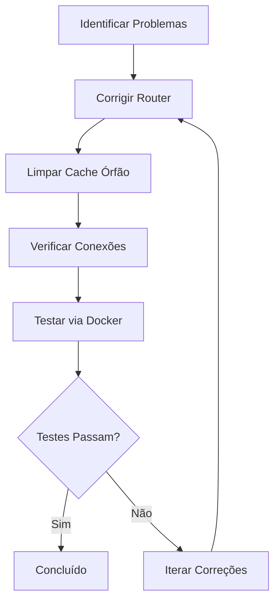

# Design Document: Core Modules Audit

## Overview

Este documento descreve a estratégia para auditar e corrigir os módulos em `src/core/protocols`, `src/core/shared` e `src/core/types`. O problema principal é um bug crítico no router de examples que impede a API de iniciar, além de arquivos cache órfãos e necessidade de verificar conexões entre módulos.

## Architecture



## Components and Interfaces

### Correção do Router de Examples

**Arquivo**: `src/interface/v1/examples/router.py`

**Problema**: Imports de módulos inexistentes

| Import Atual (Quebrado) | Import Correto |
|------------------------|----------------|
| `from application.examples.dtos import (...)` | `from application.examples import (...)` |
| `from application.examples.use_cases import (...)` | `from application.examples import (...)` |

**Solução**: Alterar os imports para usar o módulo `application.examples` que re-exporta todos os componentes via `__init__.py`.

### Limpeza de Cache Órfão

**Diretório**: `src/core/shared/__pycache__/`

**Arquivos a Remover**:
- `code_review.cpython-313.pyc`
- `coverage_enforcement.cpython-313.pyc`
- `data_factory.cpython-313.pyc`
- `mock_server.cpython-313.pyc`
- `perf_baseline.cpython-313.pyc`
- `result.cpython-313.pyc`
- `runbook.cpython-313.pyc`
- `sdk_generator.cpython-313.pyc`
- `snapshot_testing.cpython-313.pyc`

### Mapa de Conexões dos Módulos Core

```mermaid
graph LR
    subgraph "core.protocols"
        P1[AsyncRepository]
        P2[CacheProvider]
        P3[UnitOfWork]
        P4[Mapper]
    end
    
    subgraph "core.types"
        T1[ULID/UUID]
        T2[Email/Password]
        T3[PositiveInt/PageSize]
    end
    
    subgraph "core.shared"
        S1[logging]
        S2[caching]
        S3[utils.ids]
        S4[utils.password]
    end
    
    subgraph "Application Layer"
        A1[ItemExampleUseCase]
        A2[PedidoExampleUseCase]
        A3[DTOs]
    end
    
    subgraph "Infrastructure Layer"
        I1[ItemExampleRepository]
        I2[PedidoExampleRepository]
        I3[InMemoryCacheProvider]
    end
    
    P1 --> I1
    P1 --> I2
    P2 --> I3
    P3 --> A1
    P3 --> A2
    T1 --> A3
    T2 --> A3
    S1 --> A1
    S1 --> A2
    S3 --> I1
    S3 --> I2


## Data Models

Não há alterações em modelos de dados. Este documento trata de correções de imports e limpeza de código.

## Correctness Properties

*A property is a characteristic or behavior that should hold true across all valid executions of a system-essentially, a formal statement about what the system should do. Properties serve as the bridge between human-readable specifications and machine-verifiable correctness guarantees.*

### Property 1: Router imports resolve successfully

*For any* import statement in `interface.v1.examples.router`, the import SHALL resolve without raising ModuleNotFoundError.

**Validates: Requirements 1.1, 1.2, 1.3**

### Property 2: Core protocols are importable

*For any* protocol defined in `core.protocols`, importing the protocol SHALL succeed without errors.

**Validates: Requirements 5.2**

### Property 3: Core types are importable

*For any* type defined in `core.types`, importing the type SHALL succeed without errors.

**Validates: Requirements 5.3**

### Property 4: Core shared utilities are importable

*For any* utility in `core.shared.logging`, `core.shared.caching`, or `core.shared.utils`, importing the utility SHALL succeed without errors.

**Validates: Requirements 5.4**

### Property 5: Integration tests collect without errors

*For any* test file in `tests/integration/examples/`, running `pytest --collect-only` SHALL not produce any collection errors.

**Validates: Requirements 5.1**

## Error Handling

| Cenário | Tratamento |
|---------|------------|
| Import circular após correção | Refatorar para quebrar ciclo |
| Arquivo .pyc não pode ser deletado | Reportar erro e continuar |
| Docker não disponível | Pular testes de Docker, documentar |
| Teste falha após correção | Investigar causa raiz |

## Testing Strategy

### Abordagem

1. **Verificação de imports**: Testar que todos os imports resolvem corretamente
2. **Coleta de testes**: Executar `pytest --collect-only` para verificar que não há erros
3. **Testes de integração**: Executar `pytest tests/integration/examples/`
4. **Teste manual via Docker**: Subir API e testar endpoints

### Framework

- **pytest**: Execução de testes unitários e de integração
- **Hypothesis**: Não aplicável (correções são determinísticas)

### Property-Based Testing

As propriedades identificadas são verificáveis via testes de exemplo, não property-based testing, pois tratam de imports e configuração estática.

```python
# Verificação de imports
def test_router_imports():
    """Property 1: Router imports resolve successfully."""
    from interface.v1.examples.router import router
    assert router is not None

def test_core_protocols_importable():
    """Property 2: Core protocols are importable."""
    from core.protocols import AsyncRepository, CacheProvider, UnitOfWork
    assert AsyncRepository is not None
    assert CacheProvider is not None
    assert UnitOfWork is not None

def test_core_types_importable():
    """Property 3: Core types are importable."""
    from core.types import ULID, UUID, Email, PositiveInt
    assert ULID is not None
    assert UUID is not None

def test_core_shared_importable():
    """Property 4: Core shared utilities are importable."""
    from core.shared.logging import configure_logging, get_logger
    from core.shared.caching import cached, generate_cache_key
    from core.shared.utils.ids import generate_ulid
    assert configure_logging is not None
```

### Dual Testing Approach

- **Unit tests**: Verificar imports individuais
- **Integration tests**: Verificar que ItemExample e PedidoExample funcionam end-to-end
