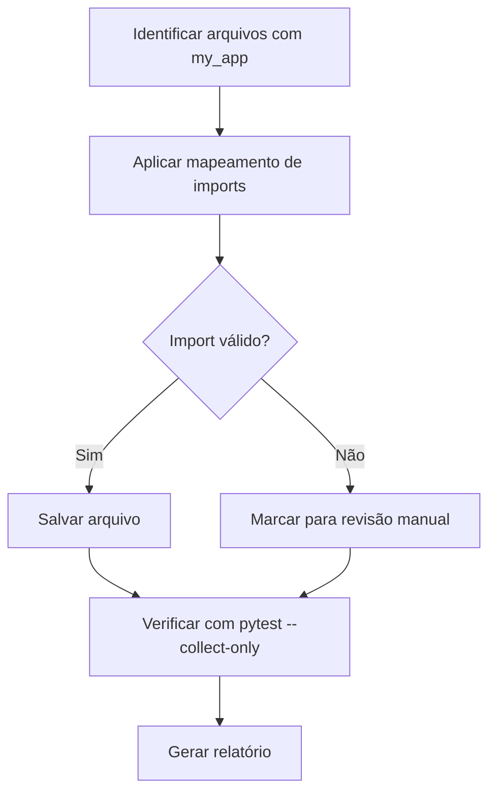

# Design Document: Fix Test Imports (my_app)

## Overview

Este documento descreve a correção em massa dos imports incorretos `my_app.*` em 152 arquivos de teste. A solução usa substituição de texto com mapeamento de prefixos.

## Architecture

## Components and Interfaces

### Mapeamento de Imports

| Padrão Incorreto | Padrão Correto |
|------------------|----------------|
| `from my_app.core.` | `from core.` |
| `from my_app.application.` | `from application.` |
| `from my_app.infrastructure.` | `from infrastructure.` |
| `from my_app.domain.` | `from domain.` |
| `from my_app.interface.` | `from interface.` |
| `from my_app.shared.` | `from core.shared.` |
| `from my_app import` | `from core import` |

### Estratégia de Execução

1. **Batch Processing**: Processar arquivos em lotes para evitar timeout
2. **Verificação Incremental**: Verificar imports após cada lote
3. **Fallback**: Arquivos que não podem ser corrigidos automaticamente são listados

## Data Models

Não há alterações em modelos de dados.

## Correctness Properties

*A property is a characteristic or behavior that should hold true across all valid executions of a system-essentially, a formal statement about what the system should do. Properties serve as the bridge between human-readable specifications and machine-verifiable correctness guarantees.*

### Property 1: No my_app imports remain after correction

*For any* test file in `tests/properties/`, the file should not contain the string `from my_app.` after corrections are applied.

**Validates: Requirements 1.1, 1.2, 1.3, 1.4, 1.5, 1.6**

## Error Handling

| Cenário | Tratamento |
|---------|------------|
| Módulo não existe | Listar arquivo para revisão manual |
| Sintaxe Python inválida | Pular arquivo, reportar erro |
| Arquivo muito grande | Processar normalmente (Python pode lidar) |

## Testing Strategy

### Abordagem

1. **Verificação pré-correção**: Contar arquivos com `my_app`
2. **Correção em lotes**: Aplicar substituições
3. **Verificação pós-correção**: `pytest --collect-only` para verificar imports
4. **Teste de propriedade**: Verificar ausência de `my_app` nos arquivos

### Framework

- **pytest**: Verificação de coleta de testes
- **grep/PowerShell**: Verificação de padrões
