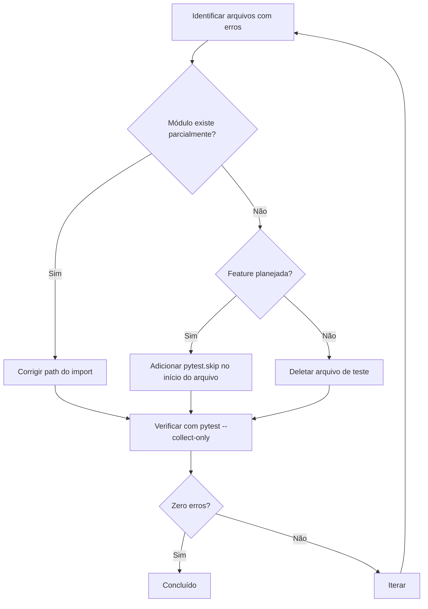

# Design Document: Fix Test Missing Modules

## Overview

Este documento descreve a estratégia para resolver 118 erros de coleta de testes causados por imports de módulos inexistentes. A abordagem principal é marcar os testes com `pytest.skip` quando os módulos não existem, já que a maioria dos módulos referenciados são features planejadas mas não implementadas.

## Architecture



## Components and Interfaces

### Estratégia de Resolução por Categoria

| Categoria | Estratégia | Justificativa |
|-----------|------------|---------------|
| Módulos com path incorreto | Corrigir import | Módulo existe em local diferente |
| Features não implementadas | pytest.skip | Preserva testes para implementação futura |
| Testes obsoletos | Deletar arquivo | Código morto sem valor |

### Mapeamento de Correções

#### Módulos com Path Incorreto (Corrigir Import)

| Import Incorreto | Import Correto |
|------------------|----------------|
| `core.base.entity` | `core.base.domain.entity` |
| `core.base.result` | `core.types.result_types` |
| `core.container` | `core.di.container` |
| `core.errors.exceptions` | `core.errors` |
| `core.exceptions` | `core.errors` |
| `application.mappers` | `application.examples.shared.mappers` |
| `application.common.dto` | `application.common.base.dto` |
| `application.common.mapper` | `application.common.base.mapper` |
| `infrastructure.database` | `infrastructure.db` |
| `infrastructure.audit.logger` | `infrastructure.audit` |

#### Módulos Não Implementados (pytest.skip)

Estes módulos representam features planejadas mas não implementadas. Os testes serão marcados com skip:

- `core.auth`
- `core.security`
- `core.shared.caching.metrics`
- `core.shared.caching.providers`
- `core.shared.contract_testing`
- `core.shared.correlation`
- `core.shared.cqrs`
- `core.shared.date_localization`
- `core.shared.fuzzing`
- `core.shared.grpc_service`
- `core.shared.hot_reload`
- `core.shared.http2_config`
- `core.shared.i18n`
- `core.shared.mutation_testing`
- `core.shared.outbox`
- `core.shared.timezone`
- `core.shared.utils.pagination`
- `core.shared.utils.sanitization`
- `core.shared.value_objects`
- `core.types.types`
- `domain.common.advanced_specification`
- `domain.common.currency`
- `application.common.data_export`
- `application.examples.dtos`
- `infrastructure.compression`
- `infrastructure.connection_pool`
- `infrastructure.distributed`
- `infrastructure.i18n`
- `infrastructure.migration`
- `infrastructure.observability.memory_profiler`
- `infrastructure.observability.metrics_dashboard`
- `infrastructure.observability.query_analyzer`
- `infrastructure.observability.slo`
- `infrastructure.resilience.bulkhead`
- `infrastructure.resilience.circuit_breaker`
- `infrastructure.resilience.request_coalescing`
- `infrastructure.resilience.smart_routing`
- `infrastructure.security.api_key_service`
- `infrastructure.security.audit_trail`
- `infrastructure.security.auto_ban`
- `infrastructure.security.cloud_provider_filter`
- `infrastructure.security.fingerprint`
- `infrastructure.security.geo_blocking`
- `infrastructure.security.oauth2`
- `infrastructure.security.request_signing`
- `infrastructure.security.secrets_manager`
- `infrastructure.security.tiered_rate_limiter`
- `infrastructure.security.waf`
- `infrastructure.storage.archival`
- `infrastructure.streaming`
- `infrastructure.tasks.background_tasks`
- `infrastructure.testing`
- `interface.api`
- `interface.webhooks`
- `cli.commands`
- `cli.constants`
- `shared`

#### Arquivos para Deletar

- Testes que importam `generate_entity` (script de geração, não módulo)
- Testes que importam `scripts.validate_github_config` (script utilitário)

## Data Models

Não há alterações em modelos de dados.

## Correctness Properties

*A property is a characteristic or behavior that should hold true across all valid executions of a system-essentially, a formal statement about what the system should do. Properties serve as the bridge between human-readable specifications and machine-verifiable correctness guarantees.*

### Property 1: Zero collection errors after fix

*For any* test file in `tests/properties/`, running `pytest --collect-only` should not produce any `ModuleNotFoundError` or collection errors.

**Validates: Requirements 1.1**

## Error Handling

| Cenário | Tratamento |
|---------|------------|
| Import circular após correção | Refatorar para quebrar ciclo |
| Múltiplos imports incorretos no mesmo arquivo | Corrigir todos ou aplicar skip |
| Arquivo com sintaxe Python inválida | Reportar para correção manual |

## Testing Strategy

### Abordagem

1. **Verificação pré-correção**: Contar arquivos com erros de coleta
2. **Correção em lotes**: Aplicar correções por categoria
3. **Verificação pós-correção**: `pytest --collect-only` deve retornar zero erros
4. **Teste de propriedade**: Verificar que todos os testes podem ser coletados

### Framework

- **pytest**: Verificação de coleta de testes (`pytest --collect-only`)
- **Hypothesis**: Não aplicável (correção de imports é determinística)

### Property-Based Testing

O único teste de propriedade aplicável é verificar que após as correções, nenhum arquivo de teste produz `ModuleNotFoundError`. Isso será verificado executando `pytest --collect-only` e confirmando exit code 0.

```python
# Verificação manual via comando
# pytest tests/properties --collect-only
# Exit code 0 = sucesso
```
