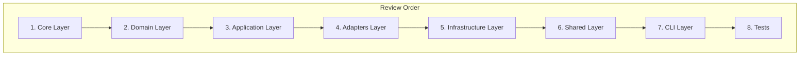

# Design Document: Full Codebase Review 2025

## Overview

Este documento define a estratégia e metodologia para o code review completo do projeto my-api. O review será sistemático, cobrindo todas as camadas da arquitetura.

## Architecture Review Strategy

## Review Checklist per File

### Code Quality Checks
- [ ] File size <= 400 lines
- [ ] Function complexity <= 10
- [ ] Nesting depth <= 4
- [ ] No magic numbers
- [ ] No commented code
- [ ] No TODO without ticket

### Security Checks
- [ ] No hardcoded secrets
- [ ] Input validation present
- [ ] Output encoding correct
- [ ] Error messages safe
- [ ] Logging sanitized

### Architecture Checks
- [ ] Layer boundaries respected
- [ ] Dependencies flow inward
- [ ] Interfaces properly defined
- [ ] No circular imports

### Python 2025 Checks
- [ ] PEP 695 generics used
- [ ] Type hints complete
- [ ] Async patterns correct
- [ ] Modern syntax used

## Correctness Properties

*A property is a characteristic or behavior that should hold true across all valid executions of a system.*

### Property 1: Layer Boundary Integrity
*For any* import statement in a layer, it SHALL NOT import from outer layers (adapters cannot import from infrastructure).
**Validates: Requirements 3.4, 4.4**

### Property 2: File Size Compliance
*For any* Python file in src/my_api, line count SHALL NOT exceed 400 lines.
**Validates: Requirements 9.2**

### Property 3: Function Complexity Compliance
*For any* function in the codebase, cyclomatic complexity SHALL NOT exceed 10.
**Validates: Requirements 9.1**

### Property 4: No Hardcoded Secrets
*For any* Python file, there SHALL be zero hardcoded passwords, API keys, or tokens.
**Validates: Requirements 8.3**

### Property 5: Type Annotation Coverage
*For any* public function, return type annotation SHALL be present.
**Validates: Requirements 6.1**

### Property 6: Exception Handling Consistency
*For any* exception raised, it SHALL inherit from AppException or be a standard library exception.
**Validates: Requirements 1.2**

### Property 7: Async Pattern Correctness
*For any* async function, it SHALL properly await all coroutines.
**Validates: Requirements 5.1**

### Property 8: Import Order Compliance
*For any* Python file, imports SHALL follow: stdlib, third-party, local.
**Validates: Requirements 9.4**

## Testing Strategy

### Property-Based Testing
- Library: Hypothesis
- Minimum iterations: 100
- Focus: Architecture compliance, security patterns

### Static Analysis
- Tool: Ruff
- Rules: All enabled
- Auto-fix: Where safe

## Error Handling

All review findings will be categorized:
- **CRITICAL**: Security vulnerabilities, data loss risks
- **HIGH**: Architecture violations, major bugs
- **MEDIUM**: Code quality issues, performance concerns
- **LOW**: Style issues, minor improvements

