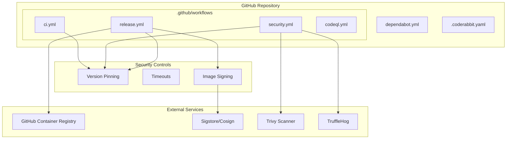

# Design Document: GitHub CI/CD Hardening

## Overview

Este documento descreve o design para hardening das configurações de CI/CD do GitHub Actions, incluindo pinning de versões, configuração de timeouts, assinatura de containers e melhorias nas configurações do Dependabot e CodeRabbit.

## Architecture



## Components and Interfaces

### 1. CI Workflow (ci.yml)

Responsável por lint, testes e build da aplicação.

| Job | Timeout | Dependências |
|-----|---------|--------------|
| lint | 10 min | - |
| test | 20 min | - |
| build | 15 min | lint, test |

### 2. Security Workflow (security.yml)

Responsável por scans de segurança SAST, vulnerabilidades e secrets.

| Job | Timeout | Action Version |
|-----|---------|----------------|
| bandit | 10 min | N/A (uv run) |
| trivy | 10 min | 0.28.0 |
| dependency-review | 5 min | v4 |
| sbom | 10 min | v0.17.8 |
| secrets-scan | 10 min | v3.88.0 |

### 3. Release Workflow (release.yml)

Responsável por build, push e assinatura de imagens de container.

| Step | Descrição |
|------|-----------|
| cosign-installer | Instala cosign para assinatura |
| build-push | Build com provenance e SBOM |
| sign | Assina imagem com keyless signing |
| gh-release | Cria release no GitHub |

### 4. CodeQL Workflow (codeql.yml)

Responsável por análise estática de segurança.

| Job | Timeout |
|-----|---------|
| analyze | 15 min |

### 5. Dependabot Configuration

Grupos de dependências:

| Grupo | Patterns |
|-------|----------|
| dev-dependencies | pytest*, ruff, mypy, hypothesis, coverage |
| security | bandit, safety |
| production | fastapi*, pydantic*, sqlalchemy*, uvicorn*, alembic* |

### 6. CodeRabbit Configuration

Path instructions expandidas:

| Path | Verificações Adicionais |
|------|------------------------|
| src/**/*.py | Secrets hardcoded, SQL injection |
| tests/**/*.py | Dados sensíveis em fixtures |
| terraform/**/*.tf | Secrets, encryption config |

## Data Models

### Workflow Job Schema

```yaml
job:
  name: string
  runs-on: string
  timeout-minutes: integer  # REQUIRED
  permissions:
    contents: read|write
    packages: read|write
    id-token: write  # For cosign
    security-events: write
  steps:
    - uses: action@version  # Pinned version required
```

### Action Reference Pattern

```
# ALLOWED
uses: actions/checkout@v4
uses: aquasecurity/trivy-action@0.28.0
uses: owner/action@sha256:abc123...

# NOT ALLOWED
uses: owner/action@master
uses: owner/action@main
uses: owner/action@HEAD
```

## Correctness Properties

*A property is a characteristic or behavior that should hold true across all valid executions of a system-essentially, a formal statement about what the system should do. Properties serve as the bridge between human-readable specifications and machine-verifiable correctness guarantees.*

### Property 1: No Branch References in Actions

*For any* GitHub Action reference in any workflow file, the version specifier SHALL NOT contain `@master`, `@main`, or `@HEAD` branch references.

**Validates: Requirements 1.1**

### Property 2: All Jobs Have Timeouts

*For any* job defined in any workflow file, the job SHALL have a `timeout-minutes` field with a positive integer value.

**Validates: Requirements 2.1, 2.2, 2.3, 2.4, 2.5, 2.6**

### Property 3: YAML Syntax Validity

*For any* YAML configuration file in `.github/` or `.coderabbit.yaml`, parsing the file SHALL NOT produce syntax errors.

**Validates: Requirements 1.1, 2.1, 3.1, 4.1, 5.1, 6.1**

## Error Handling

| Cenário | Tratamento |
|---------|------------|
| Action version não encontrada | Workflow falha com erro claro |
| Timeout excedido | Job cancelado automaticamente |
| Cosign signing falha | Release workflow falha, imagem não é publicada |
| YAML syntax error | Workflow não executa |

## Testing Strategy

### Property-Based Testing

Utilizaremos **Hypothesis** para testes de propriedade em Python, validando:

1. Parsing de YAML workflow files
2. Validação de action references
3. Verificação de timeout configuration

### Unit Tests

Testes específicos para verificar:

1. Versões específicas de actions críticas
2. Valores de timeout por job
3. Presença de configurações obrigatórias

### Validation Script

Script Python para validar todas as configurações:

```python
# scripts/validate_github_config.py
- Parseia todos os workflow files
- Verifica action pinning
- Verifica timeouts
- Verifica configurações de segurança
```
