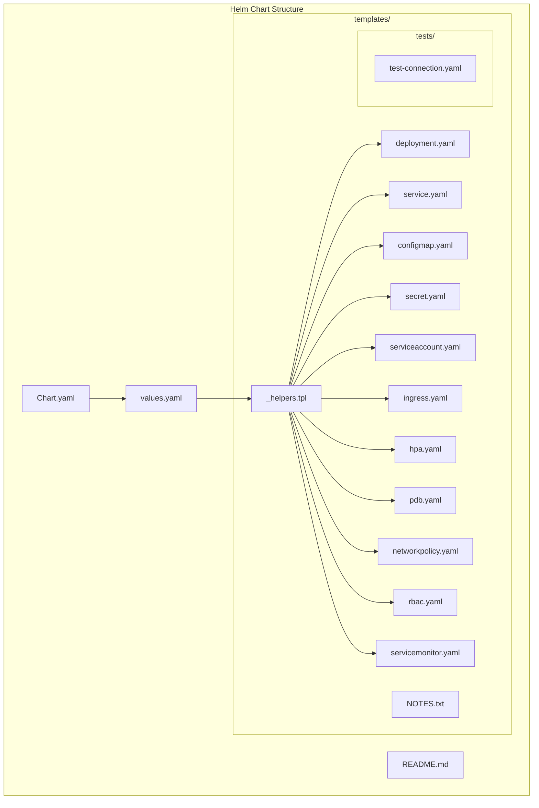

# Design Document: Helm Chart Code Review

## Overview

Este documento descreve o design para melhorias e refatoração do Helm chart `my-api`. O chart atual possui apenas `Chart.yaml`, `values.yaml`, `_helpers.tpl` e `deployment.yaml`. A análise identificou lacunas significativas em recursos essenciais, segurança, alta disponibilidade e conformidade com melhores práticas.

### Current State Analysis

**Arquivos existentes:**
- `Chart.yaml` - Metadados do chart com dependências PostgreSQL e Redis
- `values.yaml` - Valores padrão bem estruturados
- `templates/_helpers.tpl` - Helpers básicos (name, fullname, chart, labels, selectorLabels, serviceAccountName)
- `templates/deployment.yaml` - Template de Deployment funcional

**Problemas identificados:**
1. **Recursos faltantes**: Service, ConfigMap, Secret, Ingress, HPA, ServiceAccount, PDB, NetworkPolicy
2. **Segurança**: Sem NetworkPolicy, sem RBAC, dependências com versões wildcard
3. **Operação**: Sem NOTES.txt, sem testes, sem ServiceMonitor
4. **Documentação**: Sem README.md no chart

## Architecture



## Components and Interfaces

### 1. Core Templates

#### service.yaml
```yaml
apiVersion: v1
kind: Service
metadata:
  name: {{ include "my-api.fullname" . }}
  labels:
    {{- include "my-api.labels" . | nindent 4 }}
spec:
  type: {{ .Values.service.type }}
  ports:
    - port: {{ .Values.service.port }}
      targetPort: http
      protocol: TCP
      name: http
  selector:
    {{- include "my-api.selectorLabels" . | nindent 4 }}
```

#### configmap.yaml
```yaml
{{- if .Values.config }}
apiVersion: v1
kind: ConfigMap
metadata:
  name: {{ include "my-api.fullname" . }}-config
  labels:
    {{- include "my-api.labels" . | nindent 4 }}
data:
  ENVIRONMENT: {{ .Values.config.environment | quote }}
  LOG_LEVEL: {{ .Values.config.logLevel | quote }}
  CORS_ORIGINS: {{ .Values.config.corsOrigins | quote }}
  RATE_LIMIT_REQUESTS: {{ .Values.config.rateLimitRequests | quote }}
  RATE_LIMIT_PERIOD: {{ .Values.config.rateLimitPeriod | quote }}
  CACHE_TTL: {{ .Values.config.cacheTtl | quote }}
{{- end }}
```

#### secret.yaml
```yaml
{{- if not .Values.externalSecrets.enabled }}
apiVersion: v1
kind: Secret
metadata:
  name: {{ include "my-api.fullname" . }}-secrets
  labels:
    {{- include "my-api.labels" . | nindent 4 }}
type: Opaque
data:
  {{- if .Values.secrets.databaseUrl }}
  DATABASE_URL: {{ .Values.secrets.databaseUrl | b64enc | quote }}
  {{- end }}
  {{- if .Values.secrets.jwtSecret }}
  JWT_SECRET: {{ .Values.secrets.jwtSecret | b64enc | quote }}
  {{- end }}
  {{- if .Values.secrets.redisUrl }}
  REDIS_URL: {{ .Values.secrets.redisUrl | b64enc | quote }}
  {{- end }}
{{- end }}
```

### 2. Security Templates

#### networkpolicy.yaml
```yaml
{{- if .Values.networkPolicy.enabled }}
apiVersion: networking.k8s.io/v1
kind: NetworkPolicy
metadata:
  name: {{ include "my-api.fullname" . }}
  labels:
    {{- include "my-api.labels" . | nindent 4 }}
spec:
  podSelector:
    matchLabels:
      {{- include "my-api.selectorLabels" . | nindent 6 }}
  policyTypes:
    - Ingress
    - Egress
  ingress:
    - from:
        - namespaceSelector:
            matchLabels:
              kubernetes.io/metadata.name: {{ .Values.networkPolicy.ingressNamespace | default "ingress-nginx" }}
      ports:
        - protocol: TCP
          port: 8000
  egress:
    - to:
        - namespaceSelector: {}
      ports:
        - protocol: TCP
          port: 5432
        - protocol: TCP
          port: 6379
    - to:
        - namespaceSelector: {}
      ports:
        - protocol: UDP
          port: 53
        - protocol: TCP
          port: 53
{{- end }}
```

#### rbac.yaml
```yaml
{{- if .Values.rbac.create }}
apiVersion: rbac.authorization.k8s.io/v1
kind: Role
metadata:
  name: {{ include "my-api.fullname" . }}
  labels:
    {{- include "my-api.labels" . | nindent 4 }}
rules:
  - apiGroups: [""]
    resources: ["configmaps", "secrets"]
    verbs: ["get", "list", "watch"]
---
apiVersion: rbac.authorization.k8s.io/v1
kind: RoleBinding
metadata:
  name: {{ include "my-api.fullname" . }}
  labels:
    {{- include "my-api.labels" . | nindent 4 }}
roleRef:
  apiGroup: rbac.authorization.k8s.io
  kind: Role
  name: {{ include "my-api.fullname" . }}
subjects:
  - kind: ServiceAccount
    name: {{ include "my-api.serviceAccountName" . }}
    namespace: {{ .Release.Namespace }}
{{- end }}
```

### 3. High Availability Templates

#### pdb.yaml
```yaml
{{- if .Values.podDisruptionBudget.enabled }}
apiVersion: policy/v1
kind: PodDisruptionBudget
metadata:
  name: {{ include "my-api.fullname" . }}
  labels:
    {{- include "my-api.labels" . | nindent 4 }}
spec:
  {{- if .Values.podDisruptionBudget.minAvailable }}
  minAvailable: {{ .Values.podDisruptionBudget.minAvailable }}
  {{- else if .Values.podDisruptionBudget.maxUnavailable }}
  maxUnavailable: {{ .Values.podDisruptionBudget.maxUnavailable }}
  {{- else }}
  minAvailable: 1
  {{- end }}
  selector:
    matchLabels:
      {{- include "my-api.selectorLabels" . | nindent 6 }}
{{- end }}
```

### 4. Observability Templates

#### servicemonitor.yaml
```yaml
{{- if and .Values.metrics.enabled .Values.metrics.serviceMonitor.enabled }}
apiVersion: monitoring.coreos.com/v1
kind: ServiceMonitor
metadata:
  name: {{ include "my-api.fullname" . }}
  labels:
    {{- include "my-api.labels" . | nindent 4 }}
    {{- with .Values.metrics.serviceMonitor.labels }}
    {{- toYaml . | nindent 4 }}
    {{- end }}
spec:
  selector:
    matchLabels:
      {{- include "my-api.selectorLabels" . | nindent 6 }}
  endpoints:
    - port: http
      path: {{ .Values.metrics.path | default "/metrics" }}
      interval: {{ .Values.metrics.serviceMonitor.interval | default "30s" }}
{{- end }}
```

## Data Models

### Values Schema

```yaml
# values.yaml additions
externalSecrets:
  enabled: false
  secretStoreRef:
    name: ""
    kind: ClusterSecretStore
  refreshInterval: "1h"
  data: []

networkPolicy:
  enabled: true
  ingressNamespace: ingress-nginx

rbac:
  create: true

podDisruptionBudget:
  enabled: true
  minAvailable: 1
  # maxUnavailable: 1

metrics:
  enabled: true
  path: /metrics
  serviceMonitor:
    enabled: false
    interval: 30s
    labels: {}

topologySpreadConstraints: []
```

## Correctness Properties

*A property is a characteristic or behavior that should hold true across all valid executions of a system-essentially, a formal statement about what the system should do. Properties serve as the bridge between human-readable specifications and machine-verifiable correctness guarantees.*

Based on the prework analysis, the following correctness properties have been identified:

### Property 1: Resource Generation Consistency
*For any* valid values configuration, when the chart is rendered, all enabled resources SHALL produce valid Kubernetes manifests with consistent naming using the fullname helper.
**Validates: Requirements 1.1, 1.2, 1.3, 1.4, 1.5, 1.6**

### Property 2: Security Configuration Completeness
*For any* rendered Deployment, the container securityContext SHALL contain runAsNonRoot=true, readOnlyRootFilesystem=true, allowPrivilegeEscalation=false, AND resources.limits and resources.requests SHALL be defined.
**Validates: Requirements 2.2, 2.3**

### Property 3: Label Consistency
*For any* rendered Kubernetes resource, the metadata.labels SHALL contain all standard Kubernetes labels (app.kubernetes.io/name, app.kubernetes.io/instance, app.kubernetes.io/version, app.kubernetes.io/managed-by, helm.sh/chart).
**Validates: Requirements 4.1, 4.2**

### Property 4: Conditional Resource Creation
*For any* conditional resource (Ingress, HPA, NetworkPolicy, ServiceMonitor, RBAC), the resource SHALL be created if and only if its corresponding enabled flag is true.
**Validates: Requirements 1.4, 1.5, 2.1, 2.4, 2.5, 5.1**

### Property 5: PDB Configuration Validity
*For any* PodDisruptionBudget configuration, exactly one of minAvailable or maxUnavailable SHALL be set, never both.
**Validates: Requirements 3.1**

### Property 6: Probe Configuration Propagation
*For any* liveness or readiness probe values, the rendered Deployment SHALL contain probes with the exact configured parameters.
**Validates: Requirements 3.3**

### Property 7: Dependency Version Constraint
*For any* dependency declared in Chart.yaml, the version field SHALL NOT contain wildcard patterns (x.x.x).
**Validates: Requirements 6.3**

### Property 8: YAML Round-Trip Consistency
*For any* rendered template output, parsing the YAML and re-serializing SHALL produce semantically equivalent output.
**Validates: Requirements 6.5**

### Property 9: Values JSON Round-Trip
*For any* values.yaml configuration, serializing to JSON and deserializing back SHALL produce an equivalent configuration object.
**Validates: Requirements 6.4**

## Error Handling

### Template Rendering Errors
- Use `required` function for mandatory values
- Use `default` function for optional values with sensible defaults
- Use `fail` function for invalid configuration combinations

### Validation Patterns
```yaml
{{- if and .Values.podDisruptionBudget.minAvailable .Values.podDisruptionBudget.maxUnavailable }}
{{- fail "Cannot set both minAvailable and maxUnavailable in podDisruptionBudget" }}
{{- end }}
```

## Testing Strategy

### Dual Testing Approach

#### Unit Tests (helm unittest)
- Test individual template rendering
- Verify conditional resource creation
- Validate label propagation

#### Property-Based Tests (Hypothesis + PyYAML)
- Use Python Hypothesis library for property-based testing
- Generate random valid configurations
- Verify properties hold across all inputs
- Minimum 100 iterations per property test

### Test Framework
- **Property-Based Testing**: Python Hypothesis library
- **Unit Testing**: helm-unittest plugin
- **Linting**: helm lint, kubeval, kubeconform

### Test File Structure
```
tests/
├── properties/
│   └── test_helm_chart_properties.py
└── unit/
    └── helm/
        └── my-api/
            └── tests/
                └── deployment_test.yaml
```

### Property Test Annotation Format
Each property-based test MUST be tagged with:
```python
# **Feature: helm-chart-code-review, Property {number}: {property_text}**
```
