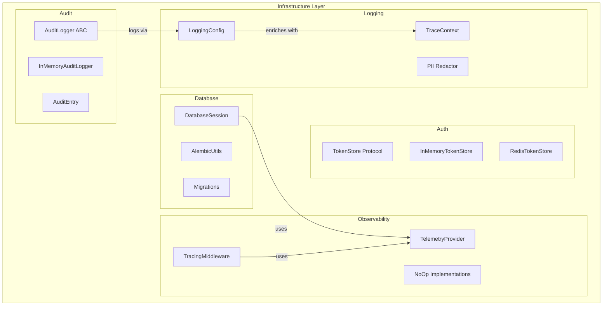

# Design Document: Infrastructure Layer Code Review

## Overview

This design document outlines the improvements and refactoring needed for the `src/my_api/infrastructure` layer based on a comprehensive code review. The infrastructure layer is responsible for external concerns including database management, authentication token storage, audit logging, observability (telemetry/tracing), and structured logging.

The review identified several areas for improvement:
- Input validation gaps in database and token store components
- Serialization round-trip consistency issues
- PII redaction coverage gaps
- Error handling inconsistencies
- Missing edge case handling

## Architecture

The infrastructure layer follows Clean Architecture principles with clear separation of concerns:



## Components and Interfaces

### 1. Database Session Management

**Current Issues:**
- No validation of `database_url` parameter
- No bounds checking for `pool_size` and `max_overflow`
- Generic exception handling in session context manager

**Proposed Changes:**
```python
def __init__(
    self,
    database_url: str,
    pool_size: int = 5,
    max_overflow: int = 10,
    echo: bool = False,
) -> None:
    # Add validation
    if not database_url or not database_url.strip():
        raise ValueError("database_url cannot be empty")
    if pool_size < 1:
        raise ValueError(f"pool_size must be >= 1, got {pool_size}")
    if max_overflow < 0:
        raise ValueError(f"max_overflow must be >= 0, got {max_overflow}")
```

### 2. Token Store Implementations

**Current Issues:**
- No input validation in `store()` method
- RedisTokenStore uses inline `import json` (should be at module level)
- TTL calculation can result in negative values
- No atomic operations for `revoke_all_for_user`

**Proposed Changes:**
```python
async def store(self, jti: str, user_id: str, expires_at: datetime) -> None:
    # Add validation
    if not jti or not jti.strip():
        raise ValueError("jti cannot be empty")
    if not user_id or not user_id.strip():
        raise ValueError("user_id cannot be empty")
    if expires_at <= datetime.now(timezone.utc):
        raise ValueError("expires_at must be in the future")
```

### 3. Audit Logger

**Current Issues:**
- `from_dict` doesn't validate required fields
- No explicit UTC enforcement in `log_action`
- Trimming logic could lose recent entries under race conditions

**Proposed Changes:**
- Add field validation in `from_dict`
- Use `datetime.now(timezone.utc)` consistently
- Use thread-safe trimming with proper locking

### 4. Telemetry Provider

**Current Issues:**
- Global `_telemetry` variable without thread safety
- `initialize()` not truly idempotent (can partially initialize)
- `traced` decorator duplicates code between sync/async wrappers

**Proposed Changes:**
- Add threading lock for global state
- Make initialization atomic
- Extract common tracing logic to reduce duplication

### 5. Logging Configuration

**Current Issues:**
- PII patterns are hardcoded (should be configurable)
- `_redact_value` doesn't handle all edge cases (e.g., bytes, custom objects)
- No validation of log_level parameter

**Proposed Changes:**
```python
def configure_logging(
    log_level: str = "INFO",
    log_format: str = "json",
    development: bool = False,
    additional_pii_patterns: set[str] | None = None,
) -> None:
    # Validate log_level
    valid_levels = {"DEBUG", "INFO", "WARNING", "ERROR", "CRITICAL"}
    if log_level.upper() not in valid_levels:
        raise ValueError(f"Invalid log_level: {log_level}")
```

### 6. Tracing Middleware

**Current Issues:**
- `_should_trace` uses exact match (should support patterns)
- Response headers injection doesn't actually add headers to response
- Metrics labels use string status_code (should be consistent)

**Proposed Changes:**
- Support glob patterns for excluded paths
- Fix response header injection
- Ensure consistent label types

## Data Models

### StoredToken
```python
@dataclass(frozen=True)
class StoredToken:
    jti: str
    user_id: str
    created_at: datetime
    expires_at: datetime
    revoked: bool = False
    
    def __post_init__(self) -> None:
        # Validate on creation
        if not self.jti:
            raise ValueError("jti is required")
        if not self.user_id:
            raise ValueError("user_id is required")
```

### AuditEntry
```python
@dataclass(frozen=True)
class AuditEntry:
    id: str
    timestamp: datetime
    action: str
    resource_type: str
    result: str
    # ... other fields
    
    def __post_init__(self) -> None:
        # Ensure UTC timezone
        if self.timestamp.tzinfo is None:
            raise ValueError("timestamp must be timezone-aware")
```

## Correctness Properties

*A property is a characteristic or behavior that should hold true across all valid executions of a system-essentially, a formal statement about what the system should do. Properties serve as the bridge between human-readable specifications and machine-verifiable correctness guarantees.*

### Property 1: Database URL Validation
*For any* string input to DatabaseSession initialization, if the string is empty or contains only whitespace, the system should raise a ValueError with a descriptive message.
**Validates: Requirements 1.1**

### Property 2: Connection Pool Bounds Validation
*For any* integer values for pool_size and max_overflow, if pool_size < 1 or max_overflow < 0, the system should raise a ValueError.
**Validates: Requirements 1.4**

### Property 3: Session Exception Propagation
*For any* exception raised within a database session context, the exception should be propagated after rollback is called, preserving the original exception chain.
**Validates: Requirements 1.2**

### Property 4: Token Store Input Validation
*For any* token storage operation with empty jti, empty user_id, or past expires_at, the system should raise a ValueError.
**Validates: Requirements 2.1**

### Property 5: Token Serialization Round-Trip
*For any* valid StoredToken, serializing to dict/JSON and deserializing back should produce an equivalent StoredToken.
**Validates: Requirements 2.2**

### Property 6: Token Store Eviction Order
*For any* InMemoryTokenStore with max_entries=N, after storing N+M tokens, the store should contain exactly N tokens, and the M oldest tokens should be removed.
**Validates: Requirements 2.3**

### Property 7: User Token Revocation Completeness
*For any* user with K tokens in the store, calling revoke_all_for_user should revoke exactly K tokens and return K.
**Validates: Requirements 2.4**

### Property 8: AuditEntry Serialization Round-Trip
*For any* valid AuditEntry (including nested details), serializing to JSON and deserializing back should produce an equivalent AuditEntry.
**Validates: Requirements 3.1**

### Property 9: AuditEntry UTC Timestamp Invariant
*For any* AuditEntry created via log_action, the timestamp should always have UTC timezone info.
**Validates: Requirements 3.2**

### Property 10: Audit Log Filter Correctness
*For any* set of AuditEntries and AuditFilters, the query result should contain only entries matching all specified filter criteria, sorted by timestamp descending.
**Validates: Requirements 3.4**

### Property 11: Telemetry Initialization Idempotence
*For any* TelemetryProvider, calling initialize() multiple times should have the same effect as calling it once (no duplicate providers, no errors).
**Validates: Requirements 4.2**

### Property 12: Traced Decorator Function Type Detection
*For any* function (sync or async), the @traced decorator should correctly detect the function type and return a wrapper of the same type.
**Validates: Requirements 4.3**

### Property 13: PII Redaction Completeness
*For any* log event dict containing keys matching PII patterns (at any nesting level), all matching values should be replaced with "[REDACTED]".
**Validates: Requirements 5.1, 5.2**

### Property 14: Request ID Context Propagation
*For any* request where set_request_id is called, all subsequent log events within that context should include the request_id field.
**Validates: Requirements 5.5**

### Property 15: Tracing Path Exclusion
*For any* request path in the excluded_paths list, the middleware should skip tracing and return the response directly.
**Validates: Requirements 6.1**

### Property 16: HTTP Status to Span Status Mapping
*For any* HTTP response with status code >= 500, the span status should be ERROR; for 4xx, the span status should be OK.
**Validates: Requirements 6.4**

### Property 17: Metrics Labels Completeness
*For any* recorded HTTP request metric, the labels should include method, path, and status_code.
**Validates: Requirements 6.5**

### Property 18: Validation Error Type Consistency
*For any* validation failure in infrastructure components, the raised exception should be a ValueError with a non-empty message.
**Validates: Requirements 8.1**

### Property 19: Exception Chain Preservation
*For any* async operation that catches and re-raises an exception, the original exception should be preserved in the exception chain.
**Validates: Requirements 8.4**

## Error Handling

### Exception Hierarchy
```python
class InfrastructureError(Exception):
    """Base exception for infrastructure layer."""
    pass

class DatabaseError(InfrastructureError):
    """Database-related errors."""
    pass

class TokenStoreError(InfrastructureError):
    """Token storage errors."""
    pass

class TelemetryError(InfrastructureError):
    """Telemetry/tracing errors."""
    pass
```

### Error Handling Patterns
1. **Validation Errors**: Raise `ValueError` with descriptive message
2. **External Service Errors**: Wrap in domain-specific exception, preserve chain
3. **Configuration Errors**: Fail fast with clear guidance
4. **Transient Errors**: Log warning, use fallback (e.g., NoOp implementations)

## Testing Strategy

### Dual Testing Approach

The testing strategy combines unit tests for specific scenarios with property-based tests for universal correctness guarantees.

### Unit Tests
- Test specific edge cases (empty inputs, boundary values)
- Test error conditions and exception messages
- Test integration points between components
- Test configuration variations

### Property-Based Tests

Property-based tests will use **Hypothesis** library for Python.

Each property test should:
1. Run a minimum of 100 iterations
2. Use smart generators that constrain to valid input spaces
3. Be tagged with the property number and requirements reference

Example test structure:
```python
from hypothesis import given, strategies as st, settings

@settings(max_examples=100)
@given(st.text(min_size=0, max_size=100))
def test_database_url_validation(url: str):
    """
    **Feature: infrastructure-code-review, Property 1: Database URL Validation**
    **Validates: Requirements 1.1**
    """
    if not url or not url.strip():
        with pytest.raises(ValueError):
            DatabaseSession(database_url=url)
    else:
        # Valid URL should not raise ValueError for empty check
        # (may raise other errors for malformed URLs)
        pass
```

### Test Organization
```
tests/
├── properties/
│   └── test_infrastructure_properties.py  # Property-based tests
├── unit/
│   └── infrastructure/
│       ├── test_database_session.py
│       ├── test_token_store.py
│       ├── test_audit_logger.py
│       ├── test_telemetry.py
│       └── test_logging_config.py
```

### Coverage Goals
- All correctness properties implemented as property-based tests
- Edge cases covered by unit tests
- Error paths tested with specific assertions
