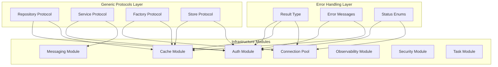

# Design Document: Infrastructure Generics Review 2025

## Overview

This design document outlines the comprehensive refactoring of the infrastructure layer to achieve state-of-the-art code quality using PEP 695 generics, standardized error handling, and maximum code reusability.

The refactoring focuses on:
1. Unified generic protocols for all infrastructure services
2. Standardized Result pattern for error handling
3. Centralized error messages and status enums
4. Type-safe implementations across all modules
5. Code deduplication and composition patterns

## Architecture



## Components and Interfaces

### 1. Generic Base Protocols

```python
# src/infrastructure/generics/protocols.py

@runtime_checkable
class Repository[TEntity, TId](Protocol):
    """Generic repository protocol for CRUD operations."""
    
    async def get(self, id: TId) -> TEntity | None: ...
    async def get_all(self) -> list[TEntity]: ...
    async def create(self, entity: TEntity) -> TEntity: ...
    async def update(self, entity: TEntity) -> TEntity: ...
    async def delete(self, id: TId) -> bool: ...
    async def exists(self, id: TId) -> bool: ...


@runtime_checkable
class Service[TInput, TOutput](Protocol):
    """Generic service protocol for business operations."""
    
    async def execute(self, input: TInput) -> Result[TOutput, ServiceError]: ...


@runtime_checkable
class Factory[TConfig, TInstance](Protocol):
    """Generic factory protocol for instance creation."""
    
    def create(self, config: TConfig) -> TInstance: ...
    def create_default(self) -> TInstance: ...


@runtime_checkable
class Store[TKey, TValue](Protocol):
    """Generic key-value store protocol."""
    
    async def get(self, key: TKey) -> TValue | None: ...
    async def set(self, key: TKey, value: TValue, ttl: int | None = None) -> None: ...
    async def delete(self, key: TKey) -> bool: ...
    async def exists(self, key: TKey) -> bool: ...
```

### 2. Centralized Error Messages

```python
# src/infrastructure/generics/errors.py

from typing import Final

class ErrorMessages:
    """Centralized error message constants."""
    
    # Authentication errors
    AUTH_TOKEN_EXPIRED: Final[str] = "Token has expired"
    AUTH_TOKEN_INVALID: Final[str] = "Invalid token"
    AUTH_TOKEN_REVOKED: Final[str] = "Token has been revoked"
    AUTH_ALGORITHM_MISMATCH: Final[str] = "Algorithm mismatch: expected {expected}, got {received}"
    AUTH_KEY_INVALID: Final[str] = "Invalid key format"
    
    # Cache errors
    CACHE_KEY_NOT_FOUND: Final[str] = "Cache key not found: {key}"
    CACHE_SERIALIZATION_FAILED: Final[str] = "Failed to serialize cache value"
    CACHE_DESERIALIZATION_FAILED: Final[str] = "Failed to deserialize cache value"
    
    # Connection pool errors
    POOL_EXHAUSTED: Final[str] = "Connection pool exhausted"
    POOL_ACQUIRE_TIMEOUT: Final[str] = "Acquire timeout after {timeout}s"
    POOL_CONNECTION_ERROR: Final[str] = "Connection error: {message}"
    POOL_CLOSED: Final[str] = "Pool is closed"
    
    # Validation errors
    VALIDATION_EMPTY_VALUE: Final[str] = "{field} cannot be empty or whitespace"
    VALIDATION_INVALID_FORMAT: Final[str] = "Invalid format for {field}"
    VALIDATION_OUT_OF_RANGE: Final[str] = "{field} must be between {min} and {max}"
    
    # Security errors
    SECURITY_UNAUTHORIZED: Final[str] = "Unauthorized access"
    SECURITY_FORBIDDEN: Final[str] = "Access forbidden"
    SECURITY_RATE_LIMITED: Final[str] = "Rate limit exceeded, retry after {retry_after}s"
```

### 3. Standardized Status Enums

```python
# src/infrastructure/generics/status.py

from enum import Enum

class BaseStatus(str, Enum):
    """Base status enum for common states."""
    PENDING = "pending"
    ACTIVE = "active"
    COMPLETED = "completed"
    FAILED = "failed"
    CANCELLED = "cancelled"


class ConnectionStatus(str, Enum):
    """Connection-specific status."""
    IDLE = "idle"
    IN_USE = "in_use"
    UNHEALTHY = "unhealthy"
    CLOSED = "closed"


class TaskStatus(str, Enum):
    """Task execution status."""
    PENDING = "pending"
    RUNNING = "running"
    COMPLETED = "completed"
    FAILED = "failed"
    CANCELLED = "cancelled"
    RETRYING = "retrying"


class HealthStatus(str, Enum):
    """Health check status."""
    HEALTHY = "healthy"
    DEGRADED = "degraded"
    UNHEALTHY = "unhealthy"
```

### 4. Enhanced Result Pattern

```python
# src/shared/result.py (enhanced)

@dataclass(frozen=True, slots=True)
class Ok[T]:
    """Success result containing a value."""
    value: T
    
    def is_ok(self) -> bool: return True
    def is_err(self) -> bool: return False
    def unwrap(self) -> T: return self.value
    def unwrap_or(self, default: Any) -> T: return self.value
    def map[U](self, fn: Callable[[T], U]) -> "Ok[U]": return Ok(fn(self.value))
    def flat_map[U, E](self, fn: Callable[[T], "Result[U, E]"]) -> "Result[U, E]": return fn(self.value)
    def map_err[E, F](self, fn: Callable[[E], F]) -> "Ok[T]": return self


@dataclass(frozen=True, slots=True)
class Err[E]:
    """Error result containing an error value."""
    error: E
    
    def is_ok(self) -> bool: return False
    def is_err(self) -> bool: return True
    def unwrap(self) -> NoReturn: raise UnwrapError(f"Called unwrap on Err: {self.error}")
    def unwrap_or[T](self, default: T) -> T: return default
    def map[T, U](self, fn: Callable[[T], U]) -> "Err[E]": return self
    def flat_map[T, U](self, fn: Callable[[T], "Result[U, E]"]) -> "Err[E]": return self
    def map_err[F](self, fn: Callable[[E], F]) -> "Err[F]": return Err(fn(self.error))


type Result[T, E] = Ok[T] | Err[E]
```

## Data Models

### Generic Cache Entry

```python
@dataclass(frozen=True, slots=True)
class CacheEntry[T]:
    """Type-safe cache entry."""
    key: str
    value: T
    created_at: datetime
    ttl: int | None = None
    expires_at: datetime | None = None
    tags: tuple[str, ...] = ()
    
    @property
    def is_expired(self) -> bool:
        if self.expires_at is None:
            return False
        return datetime.now(UTC) > self.expires_at
```

### Generic Connection Info

```python
@dataclass
class ConnectionInfo[T]:
    """Information about a pooled connection."""
    id: str
    connection: T
    state: ConnectionStatus = ConnectionStatus.IDLE
    created_at: datetime = field(default_factory=lambda: datetime.now(UTC))
    last_used_at: datetime = field(default_factory=lambda: datetime.now(UTC))
    use_count: int = 0
    health_check_failures: int = 0
```

### Generic Task Result

```python
@dataclass
class TaskResult[TOutput]:
    """Result of task execution."""
    status: TaskStatus
    output: TOutput | None = None
    error: Exception | None = None
    started_at: datetime | None = None
    completed_at: datetime | None = None
    retry_count: int = 0
    
    @property
    def duration_ms(self) -> float:
        if self.started_at and self.completed_at:
            return (self.completed_at - self.started_at).total_seconds() * 1000
        return 0.0
```

## Correctness Properties

*A property is a characteristic or behavior that should hold true across all valid executions of a system-essentially, a formal statement about what the system should do. Properties serve as the bridge between human-readable specifications and machine-verifiable correctness guarantees.*

### Property 1: Result Type Round-Trip

*For any* value of type T, wrapping it in Ok and then unwrapping should return the original value unchanged.

**Validates: Requirements 2.1, 2.3, 2.4**

### Property 2: Result Map Composition

*For any* Ok result and two functions f and g, `result.map(f).map(g)` should equal `result.map(lambda x: g(f(x)))`.

**Validates: Requirements 2.4**

### Property 3: Result Error Propagation

*For any* Err result, calling `map` should return the same Err unchanged, preserving the error value.

**Validates: Requirements 2.2, 2.4**

### Property 4: Cache Type Preservation

*For any* cache provider and value of type T, storing and retrieving the value should return an equivalent value of the same type.

**Validates: Requirements 6.2, 6.3, 6.4**

### Property 5: Cache Tag Invalidation

*For any* cache with tagged entries, invalidating a tag should remove all entries with that tag and only those entries.

**Validates: Requirements 6.5**

### Property 6: Pool Counter Invariant

*For any* connection pool state, the sum of idle, in_use, and unhealthy connections should equal the total connections.

**Validates: Requirements 5.5**

### Property 7: Pool Acquire-Release Round-Trip

*For any* connection pool, acquiring and then releasing a connection should return the pool to a valid state with the same total connections.

**Validates: Requirements 5.3, 5.4**

### Property 8: Token Store Immutability

*For any* StoredToken instance, attempting to modify any field should raise an error (frozen dataclass).

**Validates: Requirements 8.2**

### Property 9: Token Store Input Validation

*For any* string composed entirely of whitespace, storing it as a token identifier should be rejected with a validation error.

**Validates: Requirements 8.3**

### Property 10: Token Revocation Atomicity

*For any* token store and token, after revocation the token should be marked as revoked in all subsequent queries.

**Validates: Requirements 8.5**

### Property 11: Compression Round-Trip

*For any* compressor and byte sequence, compressing and then decompressing should return the original bytes.

**Validates: Requirements 9.1, 9.4**

### Property 12: Compression Algorithm Selection

*For any* Accept-Encoding header and supported algorithms, the selected algorithm should be the highest-priority supported algorithm from the header.

**Validates: Requirements 9.3**

### Property 13: Event Bus Type Safety

*For any* event bus subscription, handlers should only receive events of the subscribed type.

**Validates: Requirements 10.3**

### Property 14: Message Broker Topic Routing

*For any* message published to a topic, all subscribers to that topic should receive the message.

**Validates: Requirements 10.5**

### Property 15: Health Check Status Propagation

*For any* composite health check, if any component is UNHEALTHY the composite should be UNHEALTHY; if any is DEGRADED and none UNHEALTHY, composite should be DEGRADED.

**Validates: Requirements 11.5**

### Property 16: Rate Limiter Consistency

*For any* rate limiter and key, the remaining count should decrease by 1 after each allowed request until reaching 0.

**Validates: Requirements 12.2**

### Property 17: Priority Queue Ordering

*For any* priority job queue, dequeuing should always return the job with the highest priority (lowest priority value).

**Validates: Requirements 13.5**

### Property 18: Status Enum JSON Serialization

*For any* status enum value, JSON serialization should produce the string value of the enum.

**Validates: Requirements 4.4**

## Error Handling

### Error Hierarchy

```python
class InfrastructureError(Exception):
    """Base class for infrastructure errors."""
    error_code: str
    message: str

class AuthenticationError(InfrastructureError):
    """Authentication-related errors."""
    pass

class CacheError(InfrastructureError):
    """Cache-related errors."""
    pass

class PoolError(InfrastructureError):
    """Connection pool errors."""
    pass

class ValidationError(InfrastructureError):
    """Input validation errors."""
    pass
```

### Error Handling Strategy

1. Use Result pattern for expected failures (validation, not found, etc.)
2. Use exceptions for unexpected failures (infrastructure, programming errors)
3. All error messages reference centralized constants
4. Errors include context (correlation_id, operation, parameters)

## Testing Strategy

### Unit Testing

- Test each generic protocol implementation independently
- Test error message formatting with various parameters
- Test status enum serialization/deserialization
- Test Result pattern operations (map, flat_map, unwrap_or)

### Property-Based Testing

The following property-based tests will be implemented using **Hypothesis** library:

1. **Result Round-Trip**: Generate random values, wrap in Ok, verify unwrap returns original
2. **Cache Type Preservation**: Generate random typed values, store/retrieve, verify equality
3. **Pool Counter Invariant**: Generate random pool operations, verify invariant holds
4. **Compression Round-Trip**: Generate random bytes, compress/decompress, verify equality
5. **Priority Queue Ordering**: Generate random jobs with priorities, verify dequeue order

### Test Configuration

```python
from hypothesis import settings, given, strategies as st

# Configure minimum 100 iterations per property test
settings.register_profile("ci", max_examples=100)
settings.load_profile("ci")
```

### Test Annotations

Each property-based test must include:
```python
# **Feature: infrastructure-generics-review-2025, Property N: Property Name**
# **Validates: Requirements X.Y**
```
