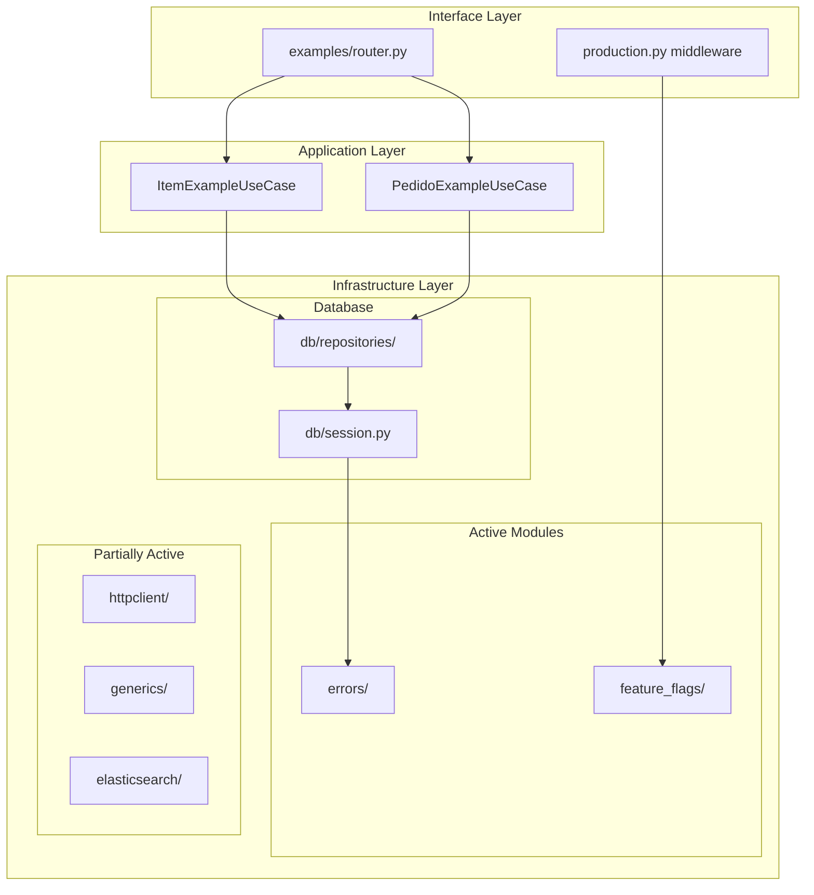

# Design Document

## Overview

Este documento descreve as correções e melhorias necessárias para os módulos de infraestrutura analisados: `elasticsearch`, `errors`, `feature_flags`, `generics` e `httpclient`. O objetivo é garantir que todos os módulos estejam corretamente integrados ao workflow do projeto e possam ser testados.

## Architecture



## Components and Interfaces

### 1. Fix httpclient Test Import Bug

**File**: `tests/unit/infrastructure/httpclient/test_client.py`

**Problem**: O teste importa `RetryPolicy` de `infrastructure.httpclient.client`, mas está definido em `infrastructure.httpclient.resilience`.

**Solution**:
```python
# Before (broken):
from infrastructure.httpclient.client import (
    HttpClient,
    HttpClientConfig,
    HttpError,
    TimeoutError,
    ValidationError,
    RetryPolicy,  # NOT EXPORTED FROM client.py
    CircuitBreaker,
    CircuitBreakerConfig,
    CircuitState,
)

# After (fixed):
from infrastructure.httpclient import (
    HttpClient,
    HttpClientConfig,
    HttpError,
    TimeoutError,
    ValidationError,
    RetryPolicy,
    CircuitBreaker,
    CircuitBreakerConfig,
    CircuitState,
)
```

### 2. Document Module Integration Status

Criar documentação clara sobre quais módulos estão ativos e como testá-los.

### 3. Add Elasticsearch to Docker (Optional)

Se o módulo elasticsearch for necessário, adicionar ao docker-compose:

```yaml
# docker-compose.infra.yml
elasticsearch:
  image: elasticsearch:8.11.0
  environment:
    - discovery.type=single-node
    - xpack.security.enabled=false
  ports:
    - "9200:9200"
```

## Data Models

Não há novos modelos de dados. Os módulos existentes já definem seus próprios modelos.

## Correctness Properties

*A property is a characteristic or behavior that should hold true across all valid executions of a system-essentially, a formal statement about what the system should do. Properties serve as the bridge between human-readable specifications and machine-verifiable correctness guarantees.*

### Property 1: All Infrastructure Modules Import Successfully

*For any* infrastructure module in the analyzed set (errors, httpclient, feature_flags, generics, elasticsearch), importing the module SHALL NOT raise ImportError or ModuleNotFoundError.

**Validates: Requirements 5.1, 5.3**

### Property 2: Active Modules Are Reachable from Main

*For any* module marked as "active" (errors, feature_flags), there SHALL exist an import path from `main.py` to that module.

**Validates: Requirements 2.3**

### Property 3: Test Files Import Correctly After Fix

*For any* test file in `tests/unit/infrastructure/httpclient/`, importing the test module SHALL NOT raise ImportError after the fix is applied.

**Validates: Requirements 5.1, 5.2**

### Property 4: Feature Flags Middleware Integration

*For any* request to the API, the feature flags middleware SHALL be invoked and the `FeatureFlagEvaluator` SHALL be accessible.

**Validates: Requirements 1.3, 3.1**

### Property 5: Error Hierarchy Consistency

*For any* error class in `infrastructure.errors`, it SHALL inherit from `InfrastructureError` and be catchable by catching `InfrastructureError`.

**Validates: Requirements 1.1**

## Error Handling

Os módulos de infraestrutura já possuem hierarquia de erros bem definida em `infrastructure.errors`. Não são necessárias alterações.

## Testing Strategy

### Unit Tests

1. **httpclient**: Corrigir imports e remover `pytest.skip`
2. **errors**: Testes existentes em `test_exceptions.py` - OK
3. **elasticsearch**: Testes existentes - OK
4. **feature_flags**: Testes de propriedade existentes - OK
5. **generics**: Testes de propriedade existentes - OK

### Property-Based Tests

Usar Hypothesis para testes de propriedade. Configuração mínima de 100 iterações.

```python
# tests/properties/test_infrastructure_modules_audit_properties.py
from hypothesis import given, settings, strategies as st

@settings(max_examples=100)
class TestInfrastructureModulesAudit:
    """Property tests for infrastructure modules audit."""
    
    def test_all_modules_import_successfully(self) -> None:
        """Property 1: All modules import without error."""
        # Implementation
        
    def test_active_modules_reachable_from_main(self) -> None:
        """Property 2: Active modules are reachable."""
        # Implementation
```

### Integration Tests

1. Subir API via Docker
2. Fazer requisições aos endpoints de examples
3. Verificar que erros são tratados corretamente
4. Verificar que feature flags funcionam

### Manual Testing via Docker

```bash
# Start services
docker compose -f deployments/docker/docker-compose.base.yml -f deployments/docker/docker-compose.dev.yml up

# Test endpoints
curl http://localhost:8000/api/v1/examples/items
curl http://localhost:8000/api/v1/examples/pedidos
curl http://localhost:8000/health/live
```
