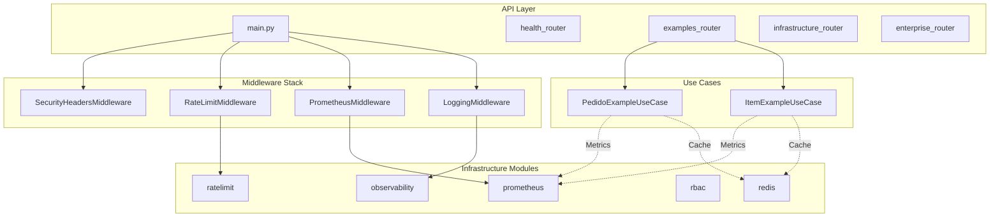

# Design Document: Infrastructure Modules Integration Fix

## Overview

Este documento descreve as correções necessárias para integrar completamente os módulos de infraestrutura (observability, prometheus, ratelimit, rbac, redis) no workflow do projeto, incluindo conexão com ItemExample e PedidoExample.

## Architecture



## Components and Interfaces

### 1. Prometheus Integration (Bug Fix)

**Problema**: `setup_prometheus()` não é chamado no main.py

**Solução**: Adicionar integração condicional baseada em `prometheus_enabled`

```python
# Em main.py, após _configure_middleware()
def _configure_prometheus(app: FastAPI) -> None:
    """Configure Prometheus metrics if enabled."""
    settings = get_settings()
    obs = settings.observability
    
    if obs.prometheus_enabled:
        from infrastructure.prometheus import setup_prometheus
        setup_prometheus(
            app,
            endpoint=obs.prometheus_endpoint,
            include_in_schema=obs.prometheus_include_in_schema,
            skip_paths=["/health/live", "/health/ready", "/docs", "/redoc"],
        )
        logger.info("prometheus_configured", endpoint=obs.prometheus_endpoint)
```

### 2. Redis Cache Integration with Examples

**Problema**: ItemExample/PedidoExample não usam cache

**Solução**: Adicionar cache decorator ou cache service

```python
# infrastructure/cache/decorators.py
from functools import wraps
from typing import Callable, TypeVar

T = TypeVar("T")

def cached(
    key_prefix: str,
    ttl: int = 3600,
) -> Callable[[Callable[..., T]], Callable[..., T]]:
    """Cache decorator for use case methods."""
    def decorator(func: Callable[..., T]) -> Callable[..., T]:
        @wraps(func)
        async def wrapper(self, *args, **kwargs) -> T:
            redis = getattr(self, "_redis", None)
            if redis is None:
                return await func(self, *args, **kwargs)
            
            cache_key = f"{key_prefix}:{args[0] if args else 'all'}"
            cached_value = await redis.get(cache_key)
            if cached_value:
                return cached_value
            
            result = await func(self, *args, **kwargs)
            await redis.set(cache_key, result, ttl)
            return result
        return wrapper
    return decorator
```

### 3. Rate Limiting for Examples

**Problema**: Endpoints de examples não têm rate limiting

**Solução**: Adicionar rate limit decorator ou middleware seletivo

```python
# Em interface/v1/examples/router.py
from infrastructure.ratelimit import rate_limit, RateLimit
from datetime import timedelta

@router.get("/items")
@rate_limit(RateLimit(requests=100, window=timedelta(minutes=1)))
async def list_items(...):
    ...
```

### 4. RBAC for Examples (Opcional)

**Problema**: Endpoints de examples não têm controle de acesso

**Solução**: Adicionar RBAC decorator para endpoints sensíveis

```python
# Em interface/v1/examples/router.py
from infrastructure.rbac import requires, Permission

@router.delete("/items/{item_id}")
@requires(Permission(Resource.ITEM, Action.DELETE))
async def delete_item(...):
    ...
```

## Data Models

Não há alterações em data models necessárias.

## Correctness Properties

*A property is a characteristic or behavior that should hold true across all valid executions of a system-essentially, a formal statement about what the system should do. Properties serve as the bridge between human-readable specifications and machine-verifiable correctness guarantees.*

### Acceptance Criteria Testing Prework

1.1 WHEN o módulo prometheus é analisado THEN o sistema SHALL identificar que o PrometheusMiddleware não está registrado no main.py
  Thoughts: Podemos verificar se após a correção, o endpoint /metrics retorna métricas válidas
  Testable: yes - property

1.2 WHEN o módulo prometheus é analisado THEN o sistema SHALL identificar que o endpoint /metrics não está exposto
  Thoughts: Podemos testar que GET /metrics retorna status 200 e content-type correto
  Testable: yes - example

1.3 WHEN os módulos ratelimit e rbac são analisados THEN o sistema SHALL identificar que não protegem os endpoints de ItemExample e PedidoExample
  Thoughts: Podemos verificar que após N requests, o rate limiter bloqueia
  Testable: yes - property

1.4 WHEN o módulo redis é analisado THEN o sistema SHALL identificar que o cache não é utilizado pelos use cases de examples
  Thoughts: Podemos verificar que após cache hit, não há query ao banco
  Testable: yes - property

2.1 WHEN os testes unitários são verificados THEN o sistema SHALL confirmar existência de testes para redis/circuit_breaker
  Thoughts: Verificação de existência de arquivo
  Testable: yes - example

3.1 WHEN o docker-compose.infra.yml é analisado THEN o sistema SHALL confirmar disponibilidade de Redis (porta 6379)
  Thoughts: Verificação de configuração
  Testable: yes - example

### Property Reflection

Após análise, as propriedades podem ser consolidadas:

- Properties 1.1 e 1.2 podem ser combinadas em "Prometheus endpoint funcional"
- Property 1.3 é independente (rate limiting)
- Property 1.4 é independente (cache)

### Correctness Properties

Property 1: Prometheus metrics endpoint funcional
*For any* request GET /metrics, quando prometheus_enabled=true, o sistema deve retornar status 200 com content-type text/plain e conteúdo contendo métricas Prometheus válidas
**Validates: Requirements 1.1, 1.2**

Property 2: Rate limiting protege endpoints
*For any* cliente fazendo mais de N requests em uma janela de tempo, o sistema deve retornar status 429 após exceder o limite
**Validates: Requirements 1.3**

Property 3: Cache hit evita query ao banco
*For any* item já cacheado, uma segunda requisição GET deve retornar o valor do cache sem executar query SQL
**Validates: Requirements 1.4**

Property 4: Circuit breaker protege contra falhas Redis
*For any* sequência de N falhas consecutivas no Redis, o circuit breaker deve abrir e usar fallback local
**Validates: Requirements 2.1**

## Error Handling

### Prometheus

- Se prometheus_enabled=false, não registrar middleware nem endpoint
- Se falha ao coletar métricas, retornar 500 com mensagem de erro

### Redis Cache

- Se Redis indisponível, usar fallback local (já implementado via circuit breaker)
- Se cache miss, executar query normalmente

### Rate Limiting

- Se rate limit excedido, retornar 429 com headers X-RateLimit-*
- Se Redis indisponível para rate limit, usar InMemoryRateLimiter

## Testing Strategy

### Unit Tests

Já existentes:
- `tests/unit/infrastructure/redis/test_circuit_breaker.py`
- `tests/unit/infrastructure/prometheus/test_metrics.py`
- `tests/unit/infrastructure/ratelimit/test_limiter.py`
- `tests/unit/infrastructure/rbac/test_rbac.py`

### Property-Based Tests

Usar Hypothesis (já configurado no projeto) para:

1. **Property 1**: Testar que /metrics sempre retorna formato válido
2. **Property 2**: Testar que rate limiting funciona para qualquer sequência de requests
3. **Property 3**: Testar que cache funciona para qualquer item válido
4. **Property 4**: Testar que circuit breaker abre após threshold de falhas

### Integration Tests (Novos)

Criar em `tests/integration/infrastructure/`:

1. `test_prometheus_integration.py` - Testar endpoint /metrics com API real
2. `test_redis_cache_integration.py` - Testar cache com Redis real
3. `test_ratelimit_integration.py` - Testar rate limiting com API real

### E2E Tests

Criar em `tests/e2e/`:

1. `test_infrastructure_e2e.py` - Testar fluxo completo com Docker

## Implementation Priority

1. **P0 - Bug Fix**: Integrar Prometheus no main.py (crítico - métricas não funcionam)
2. **P1 - Enhancement**: Adicionar testes de integração
3. **P2 - Enhancement**: Integrar cache nos use cases de examples
4. **P3 - Enhancement**: Adicionar rate limiting nos endpoints de examples
5. **P4 - Optional**: Adicionar RBAC nos endpoints de examples
