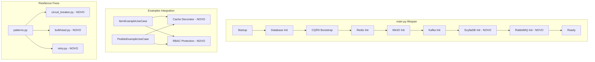

# Design Document

## Overview

Este documento descreve as correções necessárias para integrar os módulos órfãos de infraestrutura ao workflow do projeto, corrigir bugs identificados e melhorar a testabilidade via ItemExample/PedidoExample.

## Architecture



## Components and Interfaces

### 1. ScyllaDB Integration

**Problema**: Configuração existe mas não há inicialização no main.py

**Solução**: Adicionar inicialização condicional no lifespan similar a Redis/MinIO/Kafka

```python
# main.py lifespan
if obs.scylladb_enabled:
    scylladb_config = ScyllaDBConfig(
        hosts=obs.scylladb_hosts,
        port=obs.scylladb_port,
        keyspace=obs.scylladb_keyspace,
        username=obs.scylladb_username,
        password=obs.scylladb_password.get_secret_value() if obs.scylladb_password else None,
    )
    app.state.scylladb = ScyllaDBClient(scylladb_config)
    await app.state.scylladb.connect()
```

### 2. Storage Implementation

**Problema**: FileStorage é apenas Protocol sem implementação concreta

**Solução**: Criar MinIOStorageProvider que implementa FileStorage

```python
class MinIOStorageProvider[TProvider](FileStorage[TProvider]):
    """MinIO implementation of FileStorage protocol."""
    
    def __init__(self, client: MinIOClient) -> None:
        self._client = client
    
    async def upload(self, key: str, data: bytes, content_type: str) -> Result[str, Exception]:
        ...
```

### 3. Resilience Module Refactoring

**Problema**: Testes esperam arquivos separados mas tudo está em patterns.py

**Solução**: Criar arquivos separados que re-exportam de patterns.py

```python
# infrastructure/resilience/circuit_breaker.py
from infrastructure.resilience.patterns import (
    CircuitBreaker,
    CircuitBreakerConfig,
    CircuitState,
)
__all__ = ["CircuitBreaker", "CircuitBreakerConfig", "CircuitState"]
```

### 4. RabbitMQ Initialization

**Problema**: RabbitMQ usa lazy initialization, diferente de Kafka

**Solução**: Adicionar inicialização opcional no lifespan

```python
# main.py lifespan
if obs.rabbitmq_enabled:
    rabbitmq_config = RabbitMQConfig(
        host=obs.rabbitmq_host,
        port=obs.rabbitmq_port,
        username=obs.rabbitmq_username,
        password=obs.rabbitmq_password,
    )
    app.state.rabbitmq = RabbitMQTaskQueue(config=rabbitmq_config)
    await app.state.rabbitmq.connect()
```

### 5. RBAC Integration with Examples

**Problema**: Endpoints de examples não usam RBAC

**Solução**: Adicionar decorators de permissão aos endpoints

```python
@router.post("/items")
@require_permission(Permission.WRITE)
async def create_item(
    data: ItemExampleCreate,
    current_user: User = Depends(get_current_user),
    use_case: ItemExampleUseCase = Depends(get_item_use_case),
) -> ApiResponse[ItemExampleResponse]:
    ...
```

## Data Models

### Configuração de Observability (Extensão)

```python
# core/config/observability.py - Adicionar
rabbitmq_enabled: bool = Field(default=False)
rabbitmq_host: str = Field(default="localhost")
rabbitmq_port: int = Field(default=5672)
rabbitmq_username: str = Field(default="guest")
rabbitmq_password: SecretStr = Field(default=SecretStr("guest"))
```

## Correctness Properties

*A property is a characteristic or behavior that should hold true across all valid executions of a system-essentially, a formal statement about what the system should do. Properties serve as the bridge between human-readable specifications and machine-verifiable correctness guarantees.*

### Property 1: ScyllaDB Initialization Consistency
*For any* application startup with `scylladb_enabled=True`, the `app.state.scylladb` SHALL be a connected ScyllaDBClient instance.
**Validates: Requirements 1.1**

### Property 2: Storage Provider Implementation
*For any* FileStorage operation (upload, download, delete), the MinIOStorageProvider SHALL return a Result type with success or error.
**Validates: Requirements 1.2**

### Property 3: Resilience Module Exports
*For any* import from `infrastructure.resilience.circuit_breaker`, the module SHALL export CircuitBreaker, CircuitBreakerConfig, and CircuitState.
**Validates: Requirements 1.3**

### Property 4: RabbitMQ Initialization Consistency
*For any* application startup with `rabbitmq_enabled=True`, the `app.state.rabbitmq` SHALL be a connected RabbitMQTaskQueue instance.
**Validates: Requirements 3.4**

### Property 5: RBAC Protection on Examples
*For any* POST, PUT, DELETE request to `/api/v1/examples/*` without valid authentication, the system SHALL return 401 Unauthorized.
**Validates: Requirements 2.1**

## Error Handling

| Cenário | Erro | Ação |
|---------|------|------|
| ScyllaDB connection failure | ConnectionError | Log warning, continue without ScyllaDB |
| RabbitMQ connection failure | ConnectionError | Log warning, use InMemoryTaskQueue fallback |
| MinIO upload failure | StorageError | Return Err result, log error |
| RBAC permission denied | AuthorizationError | Return 403 Forbidden |

## Testing Strategy

### Unit Tests
- Testar inicialização de ScyllaDB com mock
- Testar MinIOStorageProvider com mock client
- Testar re-exports do módulo resilience
- Testar RBAC decorators com mock user

### Property-Based Tests
- **Hypothesis** será usado para testes de propriedade
- Mínimo de 100 iterações por teste
- Cada teste deve referenciar a propriedade do design

### Integration Tests
- Testar conexão real com ScyllaDB (requer Docker)
- Testar conexão real com RabbitMQ (requer Docker)
- Testar upload/download com MinIO (requer Docker)
