# Design Document: Interface Layer Generics Review

## Overview

Este documento descreve o design para refatoração da camada `src/interface` visando:

1. **Padronização de Generics PEP 695**: Uso consistente de type parameters
2. **Unificação de Patterns**: Result, Status, Builder, Factory
3. **Clean Code**: DRY, SOLID, KISS aplicados sistematicamente
4. **Type Safety**: Garantias de tipo em tempo de compilação e runtime

## Architecture

```mermaid
graph TB
    subgraph "Shared Types"
        Result[Result T E]
        Status[OperationStatus]
        Builder[Builder T Protocol]
        ErrorMsg[ErrorMessages]
    end
    
    subgraph "Generic Patterns"
        Transformer[Transformer InputT OutputT]
        Repository[GenericRepository T]
        Service[GenericService T]
        Middleware[Middleware ContextT]
    end
    
    subgraph "API Layer"
        BFF[BFFRouter RequestT ResponseT]
        Composition[APIComposer T]
        WebSocket[ConnectionManager MessageT]
        GraphQL[Connection T / Edge T]
    end
    
    subgraph "Integration Layer"
        Webhook[WebhookService TEvent]
        JSONRPC[JSONRPCServer]
        LongPoll[LongPollEndpoint T]
        GRPC[GRPCService T]
    end
    
    Result --> Service
    Result --> Repository
    Result --> Webhook
    Status --> Service
    Status --> Webhook
    Builder --> BFF
    Builder --> Composition
    ErrorMsg --> Service
    ErrorMsg --> Middleware
```



## Components and Interfaces

### 1. Unified Result Type

```python
# src/shared/result.py
from dataclasses import dataclass
from typing import Callable, NoReturn

@dataclass(frozen=True, slots=True)
class Ok[T]:
    """Success result containing a value."""
    value: T
    
    def is_ok(self) -> bool:
        return True
    
    def is_err(self) -> bool:
        return False
    
    def unwrap(self) -> T:
        return self.value
    
    def unwrap_or(self, default: T) -> T:
        return self.value
    
    def map[U](self, fn: Callable[[T], U]) -> "Result[U, NoReturn]":
        return Ok(fn(self.value))

@dataclass(frozen=True, slots=True)
class Err[E]:
    """Error result containing an error."""
    error: E
    
    def is_ok(self) -> bool:
        return False
    
    def is_err(self) -> bool:
        return True
    
    def unwrap(self) -> NoReturn:
        raise UnwrapError(f"Called unwrap on Err: {self.error}")
    
    def unwrap_or[T](self, default: T) -> T:
        return default
    
    def map[T, U](self, fn: Callable[[T], U]) -> "Result[U, E]":
        return self

type Result[T, E] = Ok[T] | Err[E]
```

### 2. Unified Status Enum

```python
# src/interface/api/status.py
from enum import Enum

class OperationStatus(str, Enum):
    """Base status for all operations."""
    PENDING = "pending"
    IN_PROGRESS = "in_progress"
    SUCCESS = "success"
    PARTIAL = "partial"
    FAILED = "failed"
    CANCELLED = "cancelled"

class HealthStatus(str, Enum):
    """Health check specific status."""
    HEALTHY = "healthy"
    DEGRADED = "degraded"
    UNHEALTHY = "unhealthy"

class DeliveryStatus(str, Enum):
    """Webhook/message delivery status."""
    PENDING = "pending"
    DELIVERED = "delivered"
    FAILED = "failed"
    RETRYING = "retrying"
```

### 3. Builder Protocol

```python
# src/interface/api/patterns/builder.py
from typing import Protocol, Self

class Builder[T](Protocol):
    """Protocol for fluent builders."""
    
    def build(self) -> T:
        """Build the final object."""
        ...

class ValidatingBuilder[T](Protocol):
    """Builder with validation."""
    
    def validate(self) -> list[str]:
        """Return list of validation errors."""
        ...
    
    def build(self) -> T:
        """Build after validation."""
        ...
```

### 4. Generic Transformer

```python
# src/interface/api/transformers/base.py
from abc import ABC, abstractmethod
from typing import Protocol

class Transformer[InputT, OutputT](Protocol):
    """Protocol for data transformers."""
    
    def transform(self, data: InputT, context: TransformationContext) -> OutputT:
        ...
    
    def can_transform(self, context: TransformationContext) -> bool:
        ...

class BaseTransformer[InputT, OutputT](ABC):
    """Abstract base for transformers."""
    
    @abstractmethod
    def transform(self, data: InputT, context: TransformationContext) -> OutputT:
        ...
    
    def can_transform(self, context: TransformationContext) -> bool:
        return True

class CompositeTransformer[T](BaseTransformer[T, T]):
    """Chain multiple transformers."""
    
    def __init__(self, transformers: list[Transformer[T, T]]) -> None:
        self._transformers = transformers
    
    def transform(self, data: T, context: TransformationContext) -> T:
        result = data
        for t in self._transformers:
            if t.can_transform(context):
                result = t.transform(result, context)
        return result
```

### 5. Centralized Error Messages

```python
# src/interface/api/errors/messages.py
from dataclasses import dataclass
from enum import Enum

class ErrorCode(str, Enum):
    """Centralized error codes."""
    NOT_FOUND = "NOT_FOUND"
    VALIDATION_ERROR = "VALIDATION_ERROR"
    UNAUTHORIZED = "UNAUTHORIZED"
    FORBIDDEN = "FORBIDDEN"
    CONFLICT = "CONFLICT"
    INTERNAL_ERROR = "INTERNAL_ERROR"
    TIMEOUT = "TIMEOUT"
    RATE_LIMITED = "RATE_LIMITED"

@dataclass(frozen=True, slots=True)
class ErrorMessage:
    """Structured error message."""
    code: ErrorCode
    message: str
    details: dict[str, Any] | None = None
    
    @classmethod
    def not_found(cls, resource: str, id: str) -> "ErrorMessage":
        return cls(
            code=ErrorCode.NOT_FOUND,
            message=f"{resource} with id '{id}' not found",
            details={"resource": resource, "id": id}
        )
    
    @classmethod
    def validation_error(cls, field: str, reason: str) -> "ErrorMessage":
        return cls(
            code=ErrorCode.VALIDATION_ERROR,
            message=f"Validation failed for field '{field}': {reason}",
            details={"field": field, "reason": reason}
        )
```

## Data Models

### Generic Service Result

```python
@dataclass(frozen=True, slots=True)
class ServiceError:
    """Service layer error."""
    code: ErrorCode
    message: str
    field_errors: list[FieldError] = field(default_factory=list)

@dataclass(frozen=True, slots=True)
class FieldError:
    """Field-level validation error."""
    field: str
    message: str
    code: str

# Service methods return:
type ServiceResult[T] = Result[T, ServiceError]
```

### Generic Repository Result

```python
@dataclass(frozen=True, slots=True)
class RepositoryError:
    """Repository layer error."""
    code: str
    message: str
    cause: Exception | None = None

# Repository methods return:
type RepositoryResult[T] = Result[T, RepositoryError]
```

## Correctness Properties

*A property is a characteristic or behavior that should hold true across all valid executions of a system-essentially, a formal statement about what the system should do. Properties serve as the bridge between human-readable specifications and machine-verifiable correctness guarantees.*

### Property 1: Result Ok/Err Duality
*For any* Result value, it is either Ok or Err, never both, and `is_ok()` returns the opposite of `is_err()`
**Validates: Requirements 2.1, 2.3**

### Property 2: Result Unwrap Safety
*For any* Ok result, `unwrap()` returns the contained value; *for any* Err result, `unwrap()` raises `UnwrapError`
**Validates: Requirements 2.5**

### Property 3: Result Map Preservation
*For any* Ok result and function f, `result.map(f)` produces `Ok(f(value))`; *for any* Err result, `map` returns the same Err unchanged
**Validates: Requirements 2.4**

### Property 4: Result Unwrap_or Default
*For any* Ok result, `unwrap_or(default)` returns the value; *for any* Err result, `unwrap_or(default)` returns the default
**Validates: Requirements 2.4**

### Property 5: Status Enum Snake Case
*For any* status enum value, the string representation follows snake_case convention (lowercase with underscores)
**Validates: Requirements 3.3**

### Property 6: Transformer Chain Composition
*For any* list of transformers and input data, applying `CompositeTransformer` produces the same result as applying each transformer sequentially
**Validates: Requirements 1.3**

### Property 7: Identity Transformer Preservation
*For any* input data and context, `IdentityTransformer.transform(data, context)` returns data unchanged
**Validates: Requirements 1.4**

### Property 8: Builder Fluent Return
*For any* builder method call (except `build()`), the return value is the same builder instance (Self)
**Validates: Requirements 16.3**

### Property 9: Error Message Factory Consistency
*For any* error factory method call with the same parameters, the resulting ErrorMessage has consistent structure with code, message, and details
**Validates: Requirements 4.4**

### Property 10: Pagination Result Consistency
*For any* paginated query with page P and per_page N, `has_next` is true iff `page * per_page < total`, and `has_prev` is true iff `page > 1`
**Validates: Requirements 5.3**

### Property 11: Cursor Round Trip
*For any* valid cursor value, `decode_cursor(encode_cursor(value))` returns the original value
**Validates: Requirements 11.4**

### Property 12: HMAC Signature Verification
*For any* payload and secret, `verify_signature(payload, sign_payload(payload, secret), secret, timestamp)` returns True within tolerance window
**Validates: Requirements 12.4**

### Property 13: JSON-RPC Error Codes
*For any* JSON-RPC error, the error code is within the valid range (-32768 to -32000 for server errors, or application-defined)
**Validates: Requirements 13.5**

### Property 14: Poll Timeout Result
*For any* poll operation that times out, the result status is `TIMEOUT` and data is None
**Validates: Requirements 14.5**

### Property 15: Dataclass Slots Efficiency
*For any* dataclass with `slots=True`, instances do not have `__dict__` attribute (memory efficient)
**Validates: Requirements 18.1, 18.2**

### Property 16: Protocol Runtime Checkable
*For any* class decorated with `@runtime_checkable`, `isinstance()` checks work correctly at runtime
**Validates: Requirements 19.3**

### Property 17: Structured Logging Extra Dict
*For any* log call with structured data, the extra dict contains all required context fields
**Validates: Requirements 22.1**

### Property 18: Problem Details Structure
*For any* error response, the body contains RFC 7807 required fields: type, title, status
**Validates: Requirements 23.2**

### Property 19: CSP Builder Strict Defaults
*For any* CSP policy built with `create_strict_policy()`, default-src is 'none' and script-src includes 'strict-dynamic'
**Validates: Requirements 24.2**

### Property 20: WebSocket Message Type Safety
*For any* WebSocket message sent through `ConnectionManager[MessageT]`, the message is an instance of MessageT
**Validates: Requirements 7.1, 7.4**

## Error Handling

### Error Hierarchy

```python
# src/interface/api/errors/exceptions.py
class InterfaceError(Exception):
    """Base exception for interface layer."""
    pass

class ValidationError(InterfaceError):
    """Validation failed."""
    def __init__(self, errors: list[FieldError]) -> None:
        self.errors = errors
        super().__init__(f"Validation failed: {len(errors)} errors")

class NotFoundError(InterfaceError):
    """Resource not found."""
    def __init__(self, resource: str, id: str) -> None:
        self.resource = resource
        self.id = id
        super().__init__(f"{resource} '{id}' not found")

class UnwrapError(InterfaceError):
    """Attempted to unwrap an Err result."""
    pass

class BuilderValidationError(InterfaceError):
    """Builder validation failed."""
    def __init__(self, missing_fields: list[str]) -> None:
        self.missing_fields = missing_fields
        super().__init__(f"Missing required fields: {missing_fields}")

class InvalidStatusTransitionError(InterfaceError):
    """Invalid status transition attempted."""
    def __init__(self, from_status: str, to_status: str) -> None:
        self.from_status = from_status
        self.to_status = to_status
        super().__init__(f"Cannot transition from {from_status} to {to_status}")
```

### Error to Result Conversion

```python
def catch_to_result[T, E: Exception](
    fn: Callable[[], T],
    error_type: type[E],
    error_mapper: Callable[[E], Any]
) -> Result[T, Any]:
    """Convert exception-throwing function to Result."""
    try:
        return Ok(fn())
    except error_type as e:
        return Err(error_mapper(e))
```

## Testing Strategy

### Dual Testing Approach

This design requires both unit tests and property-based tests:

1. **Unit Tests**: Verify specific examples and edge cases
2. **Property-Based Tests**: Verify universal properties across all inputs

### Property-Based Testing Framework

- **Library**: Hypothesis (Python)
- **Minimum iterations**: 100 per property
- **Annotation format**: `**Feature: interface-layer-generics-review, Property N: property_name**`

### Test Organization

```
tests/
├── unit/
│   └── interface/
│       ├── test_result.py
│       ├── test_status.py
│       ├── test_transformers.py
│       └── test_builders.py
└── properties/
    └── interface/
        ├── test_result_properties.py
        ├── test_transformer_properties.py
        ├── test_pagination_properties.py
        └── test_signature_properties.py
```

### Property Test Example

```python
from hypothesis import given, strategies as st

class TestResultProperties:
    """Property-based tests for Result type.
    
    **Feature: interface-layer-generics-review, Property 1: Result Ok/Err Duality**
    **Validates: Requirements 2.1, 2.3**
    """
    
    @given(st.integers())
    def test_ok_is_ok_not_err(self, value: int) -> None:
        """Ok result is_ok() returns True, is_err() returns False."""
        result = Ok(value)
        assert result.is_ok() is True
        assert result.is_err() is False
    
    @given(st.text())
    def test_err_is_err_not_ok(self, error: str) -> None:
        """Err result is_err() returns True, is_ok() returns False."""
        result = Err(error)
        assert result.is_err() is True
        assert result.is_ok() is False
```

### Unit Test Example

```python
class TestResultUnwrap:
    """Unit tests for Result unwrap behavior."""
    
    def test_ok_unwrap_returns_value(self) -> None:
        """Ok.unwrap() returns the contained value."""
        result = Ok(42)
        assert result.unwrap() == 42
    
    def test_err_unwrap_raises(self) -> None:
        """Err.unwrap() raises UnwrapError."""
        result = Err("error")
        with pytest.raises(UnwrapError):
            result.unwrap()
```

## Migration Strategy

### Phase 1: Shared Types (Week 1)
1. Create `src/shared/result.py` with unified Result type
2. Create `src/interface/api/status.py` with unified status enums
3. Create `src/interface/api/errors/messages.py` with centralized messages

### Phase 2: Pattern Consolidation (Week 2)
1. Create `src/interface/api/patterns/builder.py` with Builder protocol
2. Create `src/interface/api/transformers/base.py` with generic transformers
3. Update existing builders to implement Builder protocol

### Phase 3: Service Layer (Week 3)
1. Update GenericService to use Result type
2. Update GenericRepository to use Result type
3. Add property-based tests for service operations

### Phase 4: API Layer (Week 4)
1. Update BFF, Composition, WebSocket to use unified types
2. Update GraphQL types to use generic patterns
3. Add property-based tests for API operations

### Phase 5: Integration Layer (Week 5)
1. Update Webhook, JSON-RPC, Long Polling, gRPC
2. Consolidate error handling
3. Add property-based tests for integrations

## File Structure

```
src/interface/
├── api/
│   ├── errors/
│   │   ├── __init__.py
│   │   ├── exceptions.py      # Exception classes
│   │   └── messages.py        # Centralized error messages
│   ├── patterns/
│   │   ├── __init__.py
│   │   ├── builder.py         # Builder protocol
│   │   └── factory.py         # Factory utilities
│   ├── transformers/
│   │   ├── __init__.py
│   │   ├── base.py            # Generic transformer base
│   │   └── common.py          # Common transformers
│   ├── status.py              # Unified status enums
│   └── types.py               # Centralized type aliases
└── ...
```
