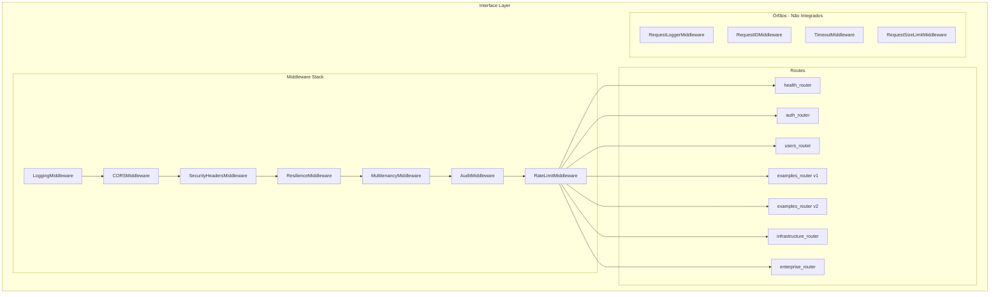
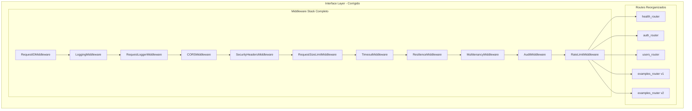

# Design Document: Interface Middleware and Routes Analysis

## Overview

Este documento detalha o design para correção e melhoria dos módulos `src/interface/middleware` e `src/interface/routes`, incluindo integração de middlewares órfãos, reorganização da estrutura de pastas, e criação de testes de integração HTTP reais.

## Architecture

### Arquitetura Atual



### Arquitetura Proposta



## Components and Interfaces

### 1. Middleware Integration

#### 1.1 RequestIDMiddleware
- **Propósito**: Gerar/propagar X-Request-ID para correlação
- **Localização**: `src/interface/middleware/request/request_id.py`
- **Integração**: Primeiro middleware na stack

#### 1.2 RequestLoggerMiddleware
- **Propósito**: Log estruturado de requests/responses
- **Localização**: `src/interface/middleware/logging/request_logger.py`
- **Integração**: Após RequestIDMiddleware

#### 1.3 TimeoutMiddleware
- **Propósito**: Timeout configurável por request
- **Localização**: `src/interface/middleware/request/timeout.py`
- **Integração**: Antes de ResilienceMiddleware

#### 1.4 RequestSizeLimitMiddleware
- **Propósito**: Limitar tamanho de request body
- **Localização**: `src/interface/middleware/request/request_size_limit.py`
- **Integração**: Após SecurityHeadersMiddleware

### 2. Routes Reorganization

#### 2.1 Estrutura Atual
```
src/interface/routes/
├── __init__.py (vazio)
└── auth/
    ├── __init__.py
    ├── constants.py
    └── service.py
```

#### 2.2 Estrutura Proposta
```
src/interface/routes/
├── __init__.py (exporta routers)
├── auth/
│   ├── __init__.py
│   ├── constants.py
│   ├── service.py
│   └── router.py (mover de v1/auth/router.py)
└── README.md (documentação)
```

### 3. Test Infrastructure

#### 3.1 Fixtures para Testes HTTP
```python
@pytest.fixture
async def async_client() -> AsyncGenerator[AsyncClient, None]:
    """Create async test client with real database."""
    async with AsyncClient(app=app, base_url="http://test") as client:
        yield client

@pytest.fixture
def test_headers() -> dict[str, str]:
    """Headers for authenticated requests."""
    return {
        "X-User-Id": "test-user",
        "X-User-Roles": "admin",
        "X-Tenant-Id": "test-tenant",
    }
```

## Data Models

### Request/Response Models

Os modelos já existem em `application/examples/`:
- `ItemExampleCreate`, `ItemExampleUpdate`, `ItemExampleResponse`
- `PedidoExampleCreate`, `PedidoExampleResponse`

### Test Data Generators

```python
from hypothesis import strategies as st

item_create_strategy = st.builds(
    ItemExampleCreate,
    name=st.text(min_size=1, max_size=100),
    sku=st.text(min_size=3, max_size=20).map(lambda s: f"SKU-{s}"),
    price_amount=st.decimals(min_value=0.01, max_value=99999.99),
    price_currency=st.sampled_from(["BRL", "USD", "EUR"]),
    quantity=st.integers(min_value=0, max_value=10000),
)
```

## Correctness Properties

*A property is a characteristic or behavior that should hold true across all valid executions of a system-essentially, a formal statement about what the system should do. Properties serve as the bridge between human-readable specifications and machine-verifiable correctness guarantees.*

### Property 1: Security Headers Present
*For any* HTTP response from the API, the response SHALL contain all required security headers (X-Frame-Options, X-Content-Type-Options, Strict-Transport-Security, Referrer-Policy).
**Validates: Requirements 1.1**

### Property 2: Pagination Response Structure
*For any* GET request to a list endpoint with valid page/size parameters, the response SHALL contain items array, total count, page number, and size fields.
**Validates: Requirements 2.1, 2.3**

### Property 3: Create-Read Round Trip
*For any* valid entity creation request (ItemExample or PedidoExample), creating the entity and then reading it by ID SHALL return equivalent data.
**Validates: Requirements 2.2, 2.4**

### Property 4: RBAC Enforcement
*For any* write operation (POST, PUT, DELETE) without proper role headers, the API SHALL return 403 Forbidden status.
**Validates: Requirements 3.4**

### Property 5: Health Endpoint Consistency
*For any* call to /health/live, the response SHALL contain status field with value "ok" and return 200 status code.
**Validates: Requirements 4.4**

### Property 6: Tenant Context Propagation
*For any* request with X-Tenant-ID header, the tenant context SHALL be available in the request processing chain.
**Validates: Requirements 1.3**

## Error Handling

### HTTP Error Responses (RFC 7807)

```python
class ProblemDetail(BaseModel):
    type: str
    title: str
    status: int
    detail: str | None
    instance: str
    errors: list[dict] | None
```

### Error Codes

| Status | Error Code | Description |
|--------|------------|-------------|
| 400 | VALIDATION_ERROR | Request validation failed |
| 401 | AUTHENTICATION_ERROR | Missing or invalid credentials |
| 403 | FORBIDDEN | Insufficient permissions |
| 404 | NOT_FOUND | Resource not found |
| 422 | UNPROCESSABLE_ENTITY | Business rule violation |
| 429 | RATE_LIMIT_EXCEEDED | Too many requests |
| 500 | INTERNAL_ERROR | Unexpected server error |
| 503 | SERVICE_UNAVAILABLE | Circuit breaker open |

## Testing Strategy

### Dual Testing Approach

#### Unit Tests
- Testar middlewares isoladamente
- Testar handlers de erro
- Testar validações de DTOs

#### Property-Based Tests
- Usar Hypothesis para gerar inputs
- Mínimo 100 iterações por propriedade
- Testar invariantes de API

### Test Framework

- **Framework**: pytest + pytest-asyncio
- **Property Testing**: Hypothesis
- **HTTP Client**: httpx.AsyncClient
- **Mocking**: unittest.mock (apenas para dependências externas)

### Test Organization

```
tests/
├── integration/
│   └── interface/
│       ├── test_middleware_integration.py
│       ├── test_items_api_http.py
│       └── test_pedidos_api_http.py
└── properties/
    └── test_interface_api_properties.py
```

### Property Test Annotations

Cada teste de propriedade DEVE incluir:
```python
# **Feature: interface-middleware-routes-analysis, Property 1: Security Headers Present**
# **Validates: Requirements 1.1**
@given(...)
@settings(max_examples=100)
def test_security_headers_present(self, ...):
    ...
```
