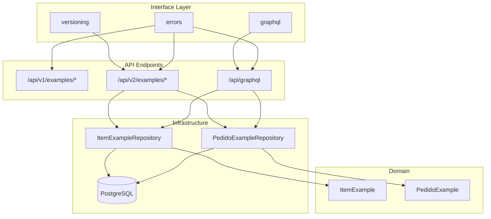

# Design Document: Interface Modules Integration

## Overview

Este documento descreve o design para completar a integração dos módulos `interface/versioning`, `interface/errors` e `interface/graphql` ao workflow do projeto. O objetivo é garantir que todos os módulos estejam funcionais, testados e documentados para uso com `ItemExample` e `PedidoExample`.

## Architecture



## Components and Interfaces

### 1. GraphQL Integration

O módulo GraphQL já possui implementação completa em `src/interface/graphql/`:

- **schema.py**: Define tipos Strawberry para ItemExample e PedidoExample
- **router.py**: Integra GraphQL com FastAPI via `GraphQLRouter`
- **dataloader.py**: Implementa DataLoader genérico para N+1 prevention
- **relay.py**: Tipos Connection, Edge, PageInfo para paginação

**Dependência necessária:** `strawberry-graphql[fastapi]>=0.252.0`

### 2. Versioning Integration

O módulo versioning está funcional em `src/interface/versioning/`:

- **VersionedRouter**: Cria rotas com prefixo `/v{version}`
- **ApiVersion**: Dataclass imutável para versão da API
- **BaseResponseTransformer**: Transforma responses entre versões

**Uso atual:** `src/interface/v2/examples_router.py` usa `VersionedRouter[int](version=2)`

### 3. Error Handling Integration

O módulo errors está funcional em `src/interface/errors/`:

- **InterfaceError**: Base exception para interface layer
- **ErrorMessage**: Mensagens estruturadas com RFC 7807 support
- **ErrorCode**: Enum com códigos de erro padronizados

## Data Models

### GraphQL Types (já implementados)

```python
@strawberry.type
class ItemExampleType:
    id: str
    name: str
    description: str | None
    category: str
    price: float
    quantity: int
    status: str
    created_at: datetime
    updated_at: datetime | None

@strawberry.type
class PedidoExampleType:
    id: str
    customer_id: str
    status: str
    items: list[PedidoItemType]
    total: float
    created_at: datetime
    confirmed_at: datetime | None
    cancelled_at: datetime | None
```

### API v2 Response Models

```python
class ApiResponse[T](BaseModel):
    data: T
    status_code: int = 200

class PaginatedResponse[T](BaseModel):
    items: list[T]
    total: int
    page: int
    page_size: int
```


## Correctness Properties

*A property is a characteristic or behavior that should hold true across all valid executions of a system-essentially, a formal statement about what the system should do. Properties serve as the bridge between human-readable specifications and machine-verifiable correctness guarantees.*

### Property 1: GraphQL Single Entity Query Returns Complete Data

*For any* valid entity ID (ItemExample or PedidoExample), when queried via GraphQL, the response SHALL contain all required fields defined in the type schema.

**Validates: Requirements 2.1, 2.3**

### Property 2: GraphQL Pagination Returns Relay Connection

*For any* pagination parameters (first, after), when querying items or pedidos via GraphQL, the response SHALL contain edges array, pageInfo object with has_next_page/has_previous_page/start_cursor/end_cursor, and total_count.

**Validates: Requirements 2.2, 2.4**

### Property 3: GraphQL Create Mutation Persists Entity

*For any* valid entity creation input, when submitted via GraphQL mutation, the system SHALL persist the entity and return success=true with the created entity data.

**Validates: Requirements 3.1, 3.4**

### Property 4: GraphQL Update Mutation Modifies Entity

*For any* existing entity and valid update input, when submitted via GraphQL mutation, the system SHALL update the entity and return the modified data.

**Validates: Requirements 3.2**

### Property 5: GraphQL Delete Mutation Removes Entity

*For any* existing entity ID, when delete mutation is called, the system SHALL remove the entity and return success=true.

**Validates: Requirements 3.3**

### Property 6: GraphQL Confirm Pedido Updates Status

*For any* pending pedido, when confirm mutation is called, the system SHALL update status to "confirmed".

**Validates: Requirements 3.5**

### Property 7: V2 List Endpoint Returns Paginated Response

*For any* page and page_size parameters, when requesting /api/v2/examples/items or /api/v2/examples/pedidos, the response SHALL contain items array, total count, page number, and page_size.

**Validates: Requirements 4.1, 4.4**

### Property 8: V2 Get Endpoint Returns ApiResponse Wrapper

*For any* valid entity ID, when requesting /api/v2/examples/items/{id} or /api/v2/examples/pedidos/{id}, the response SHALL be wrapped in ApiResponse with data field containing the entity.

**Validates: Requirements 4.2, 4.5**

### Property 9: V2 Create Returns 201 Status

*For any* valid entity creation data, when POSTing to /api/v2/examples/items, the response SHALL have status code 201 and contain the created entity.

**Validates: Requirements 4.3**

### Property 10: NotFoundError Contains Resource Info

*For any* resource type and ID, when NotFoundError is raised, it SHALL contain the resource type and ID in its attributes.

**Validates: Requirements 5.1**

### Property 11: ValidationError Contains Field Errors

*For any* validation failure, when ValidationError is raised, it SHALL contain a list of FieldError objects with field name, message, and code.

**Validates: Requirements 5.2**

## Error Handling

### GraphQL Errors

- **Repository not available**: Returns `{success: false, error: "Repository not available"}`
- **Entity not found**: Returns `null` for queries, `{success: false, error: "Item not found"}` for mutations
- **Validation errors**: Handled by Strawberry's built-in validation

### REST v2 Errors

- **404 Not Found**: `HTTPException(status_code=404, detail="Item {id} not found")`
- **422 Validation Error**: Pydantic validation errors
- **500 Internal Error**: Unhandled exceptions

### Error Response Format (RFC 7807)

```json
{
  "type": "about:blank",
  "title": "Not Found",
  "status": 404,
  "detail": "ItemExample with id 'xyz' not found",
  "extensions": {
    "resource": "ItemExample",
    "id": "xyz"
  }
}
```

## Testing Strategy

### Dual Testing Approach

1. **Unit Tests**: Verificam comportamento específico de componentes isolados
2. **Property-Based Tests**: Verificam propriedades universais que devem valer para todas as entradas

### Property-Based Testing Library

- **Library**: `hypothesis` (já instalado no projeto)
- **Configuration**: Mínimo de 100 iterações por propriedade
- **Annotation Format**: `**Feature: interface-modules-integration, Property {N}: {description}**`

### Test Files Structure

```
tests/
├── integration/
│   └── interface/
│       ├── test_graphql_integration.py      # GraphQL queries/mutations
│       ├── test_versioning_integration.py   # V2 endpoints
│       └── test_errors_integration.py       # Error handling
└── properties/
    ├── test_interface_errors_properties.py      # Existing
    ├── test_interface_versioning_properties.py  # Existing
    └── test_interface_graphql_properties.py     # Existing
```

### Test Dependencies

- `pytest-asyncio`: Para testes assíncronos
- `httpx`: Para cliente HTTP em testes
- `hypothesis`: Para property-based testing
- `strawberry-graphql[fastapi]`: Para GraphQL (deve ser instalado)
