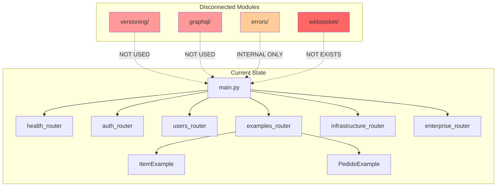

# Design Document

## Overview

Este documento apresenta a análise técnica detalhada dos módulos `versioning`, `errors`, `graphql` e `websocket` da camada interface do projeto Python API Base. O objetivo é identificar problemas de integração, bugs potenciais e propor soluções para conectar estes módulos ao workflow principal.

## Architecture



## Components and Interfaces

### 1. Versioning Module (`src/interface/versioning/`)

**Status**: Implementado mas NÃO conectado

**Componentes**:
- `ApiVersion[TVersion]`: Dataclass genérica para versão de API
- `VersionConfig[TVersion]`: Configuração de versionamento
- `VersionedRouter[TVersion]`: Router com suporte a versão via URL prefix
- `VersionRouter`: Router com seleção de versão via header
- `deprecated`: Decorator para marcar endpoints como deprecated
- `BaseResponseTransformer[TFrom, TTo]`: Transformador de respostas entre versões

**Problema Identificado**:
- O módulo existe em `src/interface/versioning/` mas não é importado em `main.py`
- Os testes em `test_versioning_properties.py` estão SKIPPED porque tentam importar de `interface.api.versioning` (caminho incorreto)

### 2. Errors Module (`src/interface/errors/`)

**Status**: Implementado, parcialmente conectado

**Componentes**:
- `InterfaceError`: Exceção base para camada interface
- `ValidationError`: Erro de validação com field errors
- `NotFoundError`: Recurso não encontrado
- `ErrorCode`: Enum com códigos de erro padronizados
- `ErrorMessage`: Dataclass com factory methods e suporte RFC 7807

**Problema Identificado**:
- O módulo é importado internamente mas o workflow principal usa erros de `application.examples`
- Não há integração com exception handlers em `main.py`

### 3. GraphQL Module (`src/interface/graphql/`)

**Status**: Implementado mas NÃO conectado

**Componentes**:
- `DataLoader[TKey, TValue]`: Loader genérico para prevenção de N+1
- `PydanticGraphQLMapper[T]`: Mapeador de Pydantic para GraphQL
- `Connection[T]`, `Edge[T]`, `PageInfo`: Tipos Relay
- `QueryResolver[T, TArgs]`, `MutationResolver[TInput, TOutput]`: Protocolos de resolvers
- `BaseSubscription[T]`: Base para subscriptions

**Problema Identificado**:
- Nenhum endpoint GraphQL está registrado em `main.py`
- Os testes em `test_graphql_properties.py` estão SKIPPED porque tentam importar de `interface.api.graphql` (caminho incorreto)
- Não há integração com Strawberry ou outro framework GraphQL

### 4. WebSocket Module

**Status**: NÃO EXISTE

**Problema Identificado**:
- A pasta `src/interface/websocket/` não existe
- Documentação em `docs/architecture.md` e `docs/api/README.md` menciona WebSocket
- Dependência `websockets` está no `uv.lock` mas não há implementação

## Data Models

### ErrorMessage (RFC 7807)

```python
@dataclass(frozen=True, slots=True)
class ErrorMessage:
    code: ErrorCode
    message: str
    details: dict[str, Any] | None = None
    
    def to_problem_details(self, type_uri: str, instance: str | None) -> dict[str, Any]:
        # Retorna formato RFC 7807
```

### ApiVersion

```python
@dataclass(frozen=True, slots=True)
class ApiVersion[TVersion]:
    version: TVersion
    deprecated: bool = False
    sunset_date: datetime | None = None
    successor: TVersion | None = None
```

### DataLoader

```python
class DataLoader[TKey, TValue]:
    async def load(self, key: TKey) -> TValue | None
    async def load_many(self, keys: list[TKey]) -> list[TValue | None]
    def clear(self, key: TKey | None = None) -> None
    def prime(self, key: TKey, value: TValue) -> None
```

## Correctness Properties

*A property is a characteristic or behavior that should hold true across all valid executions of a system-essentially, a formal statement about what the system should do. Properties serve as the bridge between human-readable specifications and machine-verifiable correctness guarantees.*

### Error Module Properties

### Property 1: Error Hierarchy Inheritance
*For any* error class in the errors module, it SHALL inherit from InterfaceError
**Validates: Requirements 2.1**

### Property 2: ErrorMessage Factory Methods Produce Valid Codes
*For any* factory method call on ErrorMessage (not_found, validation_error, etc.), the resulting ErrorMessage SHALL have the correct ErrorCode
**Validates: Requirements 2.3**

### Property 3: RFC 7807 Problem Details Format
*For any* ErrorMessage instance, calling to_problem_details SHALL produce a dictionary with required fields: type, title, status, detail
**Validates: Requirements 2.5**

### Property 4: ErrorMessage to_dict Round Trip
*For any* ErrorMessage instance, calling to_dict SHALL produce a dictionary that contains code, message, and optionally details
**Validates: Requirements 2.3**

### Property 5: HTTP Status Code Mapping
*For any* ErrorCode, the to_problem_details method SHALL map to the correct HTTP status code (404 for NOT_FOUND, 400 for VALIDATION_ERROR, etc.)
**Validates: Requirements 2.5**

### Versioning Module Properties

### Property 6: Deprecated Decorator Adds Headers
*For any* endpoint decorated with @deprecated, the response SHALL include Deprecation header set to "true"
**Validates: Requirements 1.3**

### Property 7: ApiVersion Immutability
*For any* ApiVersion instance, the version, deprecated, sunset_date and successor fields SHALL be immutable (frozen dataclass)
**Validates: Requirements 1.1**

### Property 8: VersionedRouter Prefix Format
*For any* VersionedRouter with version V, the router prefix SHALL be "/vV{original_prefix}"
**Validates: Requirements 1.2**

### Property 9: ResponseTransformer Field Mapping
*For any* BaseResponseTransformer with field mapping, transforming a source model SHALL produce a target model with mapped fields
**Validates: Requirements 1.1**

### Property 10: VersionRouter Version Extraction
*For any* request with X-API-Version header, the VersionRouter SHALL extract the correct version string
**Validates: Requirements 1.2**

### GraphQL Module Properties

### Property 11: DataLoader Batching Behavior
*For any* sequence of load calls within batch window, the batch function SHALL be called once with all keys
**Validates: Requirements 3.1**

### Property 12: DataLoader Cache Consistency
*For any* key loaded via DataLoader with caching enabled, subsequent loads of the same key SHALL return cached value without calling batch function
**Validates: Requirements 3.1**

### Property 13: DataLoader Clear Removes Cache Entry
*For any* key in DataLoader cache, calling clear(key) SHALL remove that key from cache
**Validates: Requirements 3.1**

### Property 14: DataLoader Prime Adds to Cache
*For any* key-value pair, calling prime(key, value) SHALL add the value to cache for that key
**Validates: Requirements 3.1**

### Property 15: Relay Connection Edge Count
*For any* Connection with edges, the number of edges SHALL equal the number of items in the connection
**Validates: Requirements 3.2**

### Property 16: Relay PageInfo Consistency
*For any* Connection, if edges is empty then start_cursor and end_cursor SHALL be None
**Validates: Requirements 3.2**

### Property 17: PydanticGraphQLMapper Type Mapping
*For any* Pydantic model field, the mapper SHALL produce the correct GraphQL type (str->String, int->Int, etc.)
**Validates: Requirements 3.1**

### Property 18: GraphQL Schema Generation
*For any* Pydantic model, to_graphql_schema SHALL produce valid GraphQL type definition with all fields
**Validates: Requirements 3.1**

### Integration Properties

### Property 19: FieldError to_dict Completeness
*For any* FieldError instance, to_dict SHALL return a dictionary with field, message, and code keys
**Validates: Requirements 2.1**

### Property 20: ValidationError Error Count
*For any* ValidationError with N field errors, the errors list SHALL have exactly N elements
**Validates: Requirements 2.1**

## Error Handling

### Problemas Identificados

1. **Duplicação de Erros**: O módulo `interface.errors` define `ValidationError` e `NotFoundError`, mas o workflow usa erros de `application.examples`

2. **Falta de Integração**: Os exception handlers em `main.py` usam `core.errors.setup_exception_handlers` mas não integram com `interface.errors`

3. **Inconsistência de Imports**: Testes tentam importar de caminhos que não existem (`interface.api.versioning`, `interface.api.graphql`)

### Recomendações

1. Unificar hierarquia de erros ou criar mapeamento entre camadas
2. Registrar handlers para `InterfaceError` em `main.py`
3. Corrigir caminhos de import nos testes

## Testing Strategy

### Dual Testing Approach

**Unit Tests**:
- Verificar estrutura de classes e enums
- Testar factory methods de ErrorMessage
- Validar formato RFC 7807

**Property-Based Tests** (usando Hypothesis):
- Testar que todos os erros herdam de InterfaceError
- Testar que factory methods produzem códigos corretos
- Testar comportamento de batching do DataLoader
- Testar consistência de cache do DataLoader

### Testes Existentes com Problemas

| Arquivo | Status | Problema |
|---------|--------|----------|
| `test_versioning_properties.py` | SKIPPED | Import de `interface.api.versioning` não existe |
| `test_graphql_properties.py` | SKIPPED | Import de `interface.api` não existe |

### Como Testar Manualmente

```bash
# Subir ambiente de desenvolvimento
cd deployments/docker
docker compose -f docker-compose.base.yml -f docker-compose.dev.yml up

# Testar ItemExample
curl http://localhost:8000/api/v1/examples/items

# Testar PedidoExample
curl http://localhost:8000/api/v1/examples/pedidos

# Acessar Swagger UI
# http://localhost:8000/docs
```

### Conexão com ItemExample/PedidoExample

Os módulos `versioning`, `graphql` e `errors` da interface **NÃO estão conectados** aos endpoints de ItemExample e PedidoExample. Para testar estes módulos através dos examples, seria necessário:

1. **Versioning**: Criar routers versionados para os examples (v1, v2)
2. **GraphQL**: Criar schema GraphQL com queries para Item e Pedido
3. **Errors**: Integrar InterfaceError nos handlers dos examples
