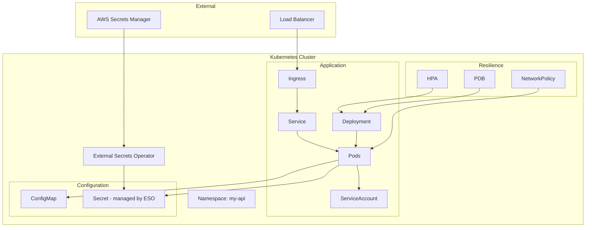

# Design Document: Kubernetes Manifests Refactoring

## Overview

Este documento descreve o design para refatoração dos manifests Kubernetes do projeto my-api. A refatoração visa corrigir vulnerabilidades de segurança críticas, implementar melhores práticas de observabilidade, resiliência e manutenibilidade.

## Architecture

### Estrutura de Arquivos Proposta

```
k8s/
├── namespace.yaml          # Namespace com Pod Security Standards
├── serviceaccount.yaml     # ServiceAccount dedicado
├── configmap.yaml          # ConfigMap (sem secrets)
├── external-secret.yaml    # ExternalSecret para secrets
├── deployment.yaml         # Deployment hardened
├── service.yaml            # Service com monitoring
├── ingress.yaml            # Ingress com security headers
├── hpa.yaml                # HPA existente
├── pdb.yaml                # PodDisruptionBudget (NOVO)
└── networkpolicy.yaml      # NetworkPolicy (NOVO)
```

### Diagrama de Componentes



## Components and Interfaces

### 1. Namespace com Pod Security Standards

```yaml
apiVersion: v1
kind: Namespace
metadata:
  name: my-api
  labels:
    pod-security.kubernetes.io/enforce: restricted
    pod-security.kubernetes.io/audit: restricted
    pod-security.kubernetes.io/warn: restricted
```

### 2. External Secret

```yaml
apiVersion: external-secrets.io/v1beta1
kind: ExternalSecret
metadata:
  name: my-api-secrets
spec:
  refreshInterval: 1h
  secretStoreRef:
    name: aws-secrets-manager
    kind: ClusterSecretStore
  target:
    name: my-api-secrets
  data:
    - secretKey: database-url
      remoteRef:
        key: my-api/database-url
```

### 3. Security Context Hardened

```yaml
securityContext:
  runAsNonRoot: true
  runAsUser: 1000
  runAsGroup: 1000
  fsGroup: 1000
  readOnlyRootFilesystem: true
  allowPrivilegeEscalation: false
  capabilities:
    drop:
      - ALL
  seccompProfile:
    type: RuntimeDefault
```

## Data Models

### Labels Padrão (Kubernetes Recommended)

| Label | Valor |
|-------|-------|
| app.kubernetes.io/name | my-api |
| app.kubernetes.io/instance | my-api-prod |
| app.kubernetes.io/version | 1.0.0 |
| app.kubernetes.io/component | api |
| app.kubernetes.io/part-of | my-api |
| app.kubernetes.io/managed-by | kubectl |

## Correctness Properties

*A property is a characteristic or behavior that should hold true across all valid executions of a system-essentially, a formal statement about what the system should do. Properties serve as the bridge between human-readable specifications and machine-verifiable correctness guarantees.*

### Property 1: No Plaintext Secrets
*For any* Secret resource in the k8s directory, the resource SHALL NOT contain plaintext credentials in stringData or data fields with actual values.
**Validates: Requirements 1.2**

### Property 2: No Latest Image Tags
*For any* container image specification in Deployment resources, the image tag SHALL NOT be "latest".
**Validates: Requirements 2.1**

### Property 3: Pod Security Context Hardening
*For any* Pod specification, the securityContext SHALL include runAsNonRoot: true, readOnlyRootFilesystem: true, and allowPrivilegeEscalation: false.
**Validates: Requirements 3.1, 3.2, 3.4**

### Property 4: Capabilities Dropped
*For any* container securityContext, capabilities SHALL drop ALL.
**Validates: Requirements 3.3**

### Property 5: PodDisruptionBudget Exists
*For any* Deployment, there SHALL exist a corresponding PodDisruptionBudget resource.
**Validates: Requirements 4.1**

### Property 6: NetworkPolicy Exists
*For any* application namespace, there SHALL exist NetworkPolicy resources restricting ingress and egress.
**Validates: Requirements 5.1, 5.2**

### Property 7: Ingress Security Headers
*For any* Ingress resource, annotations SHALL include security headers (X-Frame-Options, X-Content-Type-Options, CSP).
**Validates: Requirements 6.2**

### Property 8: Ingress Class Specification
*For any* Ingress resource, ingressClassName SHALL be specified instead of deprecated kubernetes.io/ingress.class annotation.
**Validates: Requirements 6.1**

### Property 9: Prometheus Annotations
*For any* Deployment, pod template annotations SHALL include prometheus.io/scrape.
**Validates: Requirements 7.1**

### Property 10: Kubernetes Recommended Labels
*For any* resource in k8s directory, metadata.labels SHALL include app.kubernetes.io/name.
**Validates: Requirements 8.2**

### Property 11: Deployment Strategy Configuration
*For any* Deployment, strategy SHALL be RollingUpdate with maxSurge and maxUnavailable configured.
**Validates: Requirements 9.1**

### Property 12: Startup Probe Configuration
*For any* container in Deployment, startupProbe SHALL be configured.
**Validates: Requirements 4.4**

## Error Handling

| Scenario | Resolution |
|----------|------------|
| ExternalSecret sync failure | ESO retries with exponential backoff |
| Pod fails security policy | Admission controller rejects pod |
| NetworkPolicy blocks traffic | Review egress rules for required destinations |

## Testing Strategy

### Property-Based Testing Framework

**Framework**: pytest com hypothesis para Python
**Rationale**: Consistência com outros testes do projeto.

### Test Structure

```
tests/
└── properties/
    └── test_k8s_properties.py  # Property-based tests for k8s manifests
```

### Test Categories

| Categoria | Tipo | Descrição |
|-----------|------|-----------|
| Security Scanning | Property | Verifica ausência de secrets plaintext |
| Image Tags | Property | Verifica tags específicas |
| Security Context | Property | Verifica hardening |
| Resource Existence | Property | Verifica PDB, NetworkPolicy |
| Labels | Property | Verifica labels padrão |
