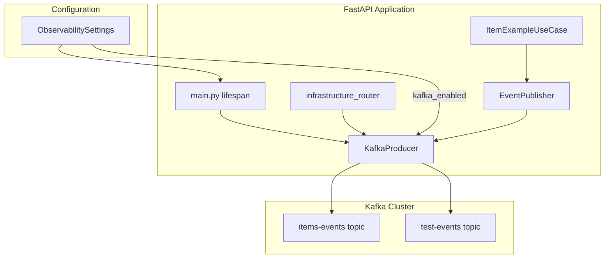

# Design Document: Kafka Workflow Integration

## Overview

Este documento descreve o design para integrar o módulo Kafka existente ao workflow principal da aplicação. A integração inclui:

1. Inicialização do KafkaProducer no lifespan da aplicação
2. Endpoints de teste para verificar funcionalidade Kafka
3. Publicação automática de eventos de domínio
4. Graceful shutdown do producer

## Architecture



## Components and Interfaces

### 1. KafkaProducer Initialization (main.py)

O producer será inicializado no lifespan da aplicação, similar ao MinIO:

```python
# src/main.py - additions to lifespan
from infrastructure.kafka import KafkaProducer, KafkaConfig

async def lifespan(app: FastAPI):
    # ... existing code ...
    
    # Initialize Kafka if enabled
    if obs.kafka_enabled:
        kafka_config = KafkaConfig(
            bootstrap_servers=obs.kafka_bootstrap_servers,
            client_id=obs.kafka_client_id,
            security_protocol=obs.kafka_security_protocol,
            sasl_mechanism=obs.kafka_sasl_mechanism,
            sasl_username=obs.kafka_sasl_username,
            sasl_password=obs.kafka_sasl_password.get_secret_value() if obs.kafka_sasl_password else None,
        )
        app.state.kafka_producer = KafkaProducer(kafka_config, topic="default")
        try:
            await app.state.kafka_producer.start()
            logger.info("Kafka producer started")
        except Exception as e:
            logger.error(f"Kafka connection failed: {e}")
            app.state.kafka_producer = None
    else:
        app.state.kafka_producer = None
    
    yield
    
    # Cleanup Kafka
    if app.state.kafka_producer:
        await app.state.kafka_producer.stop()
```

### 2. Kafka Router (infrastructure_router.py)

Novos endpoints para teste de Kafka:

```python
# Additions to src/interface/v1/infrastructure_router.py

class KafkaPublishRequest(BaseModel):
    """Request to publish Kafka message."""
    topic: str = Field(default="test-events", min_length=1)
    key: str | None = Field(default=None)
    payload: dict[str, Any] = Field(...)
    headers: dict[str, str] | None = Field(default=None)

class KafkaPublishResponse(BaseModel):
    """Kafka publish response."""
    topic: str
    partition: int
    offset: int
    timestamp: str

class KafkaStatusResponse(BaseModel):
    """Kafka status response."""
    enabled: bool
    connected: bool
    client_id: str | None
    bootstrap_servers: list[str] | None

def get_kafka(request: Request):
    """Get Kafka producer from app state."""
    producer = getattr(request.app.state, "kafka_producer", None)
    if producer is None:
        raise HTTPException(
            status_code=503,
            detail="Kafka not configured. Set OBSERVABILITY__KAFKA_ENABLED=true",
        )
    return producer

@router.post("/kafka/publish", response_model=KafkaPublishResponse)
async def kafka_publish(
    request: KafkaPublishRequest,
    producer=Depends(get_kafka),
) -> KafkaPublishResponse:
    """Publish test message to Kafka."""
    metadata = await producer.send(
        payload=request.payload,
        key=request.key,
        headers=request.headers,
        topic=request.topic,
    )
    return KafkaPublishResponse(
        topic=metadata.topic,
        partition=metadata.partition,
        offset=metadata.offset,
        timestamp=metadata.timestamp.isoformat() if metadata.timestamp else "",
    )

@router.get("/kafka/status", response_model=KafkaStatusResponse)
async def kafka_status(request: Request) -> KafkaStatusResponse:
    """Get Kafka producer status."""
    producer = getattr(request.app.state, "kafka_producer", None)
    settings = request.app.state.settings.observability
    
    return KafkaStatusResponse(
        enabled=settings.kafka_enabled,
        connected=producer is not None and producer._started,
        client_id=settings.kafka_client_id if settings.kafka_enabled else None,
        bootstrap_servers=settings.kafka_bootstrap_servers if settings.kafka_enabled else None,
    )
```

### 3. Domain Event Publisher

Interface para publicação de eventos de domínio:

```python
# src/infrastructure/kafka/event_publisher.py

from abc import ABC, abstractmethod
from dataclasses import dataclass
from datetime import datetime, UTC
from typing import Any, Generic, TypeVar
from pydantic import BaseModel

T = TypeVar("T", bound=BaseModel)

@dataclass
class DomainEvent(Generic[T]):
    """Base domain event."""
    event_type: str
    entity_type: str
    entity_id: str
    payload: T
    timestamp: datetime
    correlation_id: str | None = None
    
class ItemCreatedEvent(BaseModel):
    """Event published when item is created."""
    id: str
    name: str
    sku: str
    created_by: str

class ItemUpdatedEvent(BaseModel):
    """Event published when item is updated."""
    id: str
    changes: dict[str, Any]
    updated_by: str

class ItemDeletedEvent(BaseModel):
    """Event published when item is deleted."""
    id: str
    deleted_by: str

class EventPublisher(ABC):
    """Abstract event publisher."""
    
    @abstractmethod
    async def publish(self, event: DomainEvent[Any], topic: str) -> None:
        """Publish domain event."""
        ...

class KafkaEventPublisher(EventPublisher):
    """Kafka implementation of event publisher."""
    
    def __init__(self, producer: KafkaProducer | None):
        self._producer = producer
    
    async def publish(self, event: DomainEvent[Any], topic: str) -> None:
        if self._producer is None:
            return  # Kafka disabled, skip silently
        
        try:
            await self._producer.send(
                payload=event.payload,
                key=event.entity_id,
                headers={
                    "event_type": event.event_type,
                    "entity_type": event.entity_type,
                    "timestamp": event.timestamp.isoformat(),
                },
                topic=topic,
            )
        except Exception as e:
            logger.error(f"Failed to publish event: {e}")
            # Don't raise - event publishing should not fail main operation

class NoOpEventPublisher(EventPublisher):
    """No-op publisher for when Kafka is disabled."""
    
    async def publish(self, event: DomainEvent[Any], topic: str) -> None:
        pass  # Do nothing
```

## Data Models

### KafkaMessage (existing)

```python
class KafkaMessage(BaseModel, Generic[T]):
    payload: T
    key: str | None = None
    headers: dict[str, str] = {}
    timestamp: datetime
```

### MessageMetadata (existing)

```python
@dataclass
class MessageMetadata:
    topic: str
    partition: int
    offset: int
    timestamp: datetime | None = None
    key: str | None = None
    headers: dict[str, str] = field(default_factory=dict)
```

## Correctness Properties

*A property is a characteristic or behavior that should hold true across all valid executions of a system-essentially, a formal statement about what the system should do. Properties serve as the bridge between human-readable specifications and machine-verifiable correctness guarantees.*

### Property 1: Kafka Initialization Respects Configuration

*For any* application startup with `kafka_enabled=true` and valid configuration, the KafkaProducer SHALL be initialized and stored in `app.state.kafka_producer`.

**Validates: Requirements 1.1, 1.2, 1.5**

### Property 2: Graceful Degradation on Connection Failure

*For any* application startup where Kafka connection fails, the system SHALL log the error and continue startup with `app.state.kafka_producer = None`.

**Validates: Requirements 1.3**

### Property 3: Graceful Shutdown Closes Connections

*For any* application shutdown with an active KafkaProducer, the system SHALL call `producer.stop()` before completing shutdown.

**Validates: Requirements 1.4**

### Property 4: Message Serialization Round-Trip

*For any* valid KafkaMessage with payload and headers, serializing then deserializing SHALL produce an equivalent message with identical payload and headers.

**Validates: Requirements 4.1, 4.2**

### Property 5: Domain Event Publishing for CRUD Operations

*For any* CRUD operation (create, update, delete) on ItemExample, when Kafka is enabled, the corresponding domain event SHALL be published to the items-events topic.

**Validates: Requirements 3.1, 3.2, 3.3**

### Property 6: Silent Skip When Kafka Disabled

*For any* domain event publish attempt when Kafka is disabled, the EventPublisher SHALL complete without error and without side effects.

**Validates: Requirements 3.4**

### Property 7: Non-Blocking Event Publishing Failures

*For any* event publishing failure, the main operation (create/update/delete) SHALL complete successfully and the error SHALL be logged.

**Validates: Requirements 3.5**

## Error Handling

| Error Scenario | Handling Strategy | User Impact |
|----------------|-------------------|-------------|
| Kafka connection timeout on startup | Log error, set producer=None, continue | None - graceful degradation |
| Kafka unavailable on publish | Return 503 with descriptive message | Clear error message |
| Serialization error | Log error, raise HTTPException 500 | Error response |
| Event publish failure | Log error, continue main operation | None - fire-and-forget |

## Testing Strategy

### Unit Tests

- Test KafkaConfig.to_producer_config() generates correct configuration
- Test KafkaMessage serialization/deserialization
- Test EventPublisher with mock producer

### Property-Based Tests (using Hypothesis)

Property tests will use the Hypothesis library with minimum 100 iterations per test.

```python
from hypothesis import given, settings, strategies as st

@given(
    payload=st.dictionaries(st.text(min_size=1), st.text()),
    key=st.text() | st.none(),
    headers=st.dictionaries(st.text(min_size=1), st.text()),
)
@settings(max_examples=100)
def test_message_round_trip(payload, key, headers):
    """
    **Feature: kafka-workflow-integration, Property 4: Message Serialization Round-Trip**
    """
    # ... test implementation
```

### Integration Tests

- Test Kafka endpoints with TestClient
- Test event publishing with InMemoryBroker mock
- Test graceful shutdown hooks

### E2E Tests (with Docker)

- Start docker-compose.infra.yml
- Verify Kafka connectivity
- Publish and consume test messages
