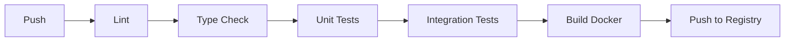
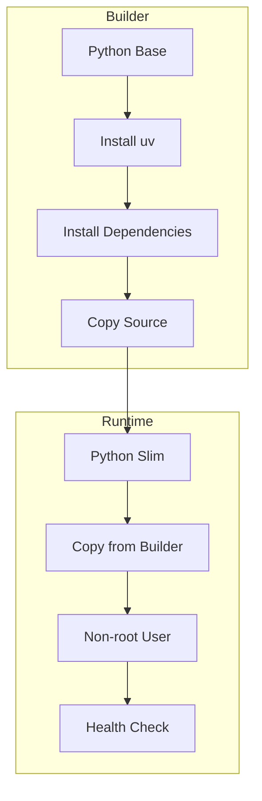

# Design Document - Project Improvements

## Overview

Este documento descreve o design das melhorias de infraestrutura e arquitetura implementadas no projeto my-api para transformá-lo em uma base enterprise-ready.

## Architecture

### CI/CD Pipeline



### Docker Multi-Stage Build



## Components and Interfaces

### Unit of Work Pattern

```python
class IUnitOfWork(Protocol):
    async def __aenter__(self) -> Self: ...
    async def __aexit__(self, *args) -> None: ...
    async def commit(self) -> None: ...
    async def rollback(self) -> None: ...
```

### Request ID Middleware

```python
class RequestIDMiddleware:
    async def __call__(self, request: Request, call_next):
        request_id = request.headers.get("X-Request-ID") or str(uuid4())
        # Propagate to context and logs
        response = await call_next(request)
        response.headers["X-Request-ID"] = request_id
        return response
```

### Structured Logging

```python
structlog.configure(
    processors=[
        structlog.processors.TimeStamper(fmt="iso"),
        structlog.processors.add_log_level,
        add_request_context,
        redact_pii,
        structlog.processors.JSONRenderer(),
    ]
)
```

## Data Models

### Health Check Response

```python
class HealthStatus(BaseModel):
    status: Literal["healthy", "degraded", "unhealthy"]
    checks: dict[str, CheckResult]
    timestamp: datetime

class CheckResult(BaseModel):
    status: Literal["pass", "fail"]
    duration_ms: float
    message: str | None = None
```

## Correctness Properties

*A property is a characteristic or behavior that should hold true across all valid executions of a system.*

### Property 1: Request ID Propagation
*For any* HTTP request, the response SHALL include the same X-Request-ID header value as the request, or a newly generated UUID if not provided.
**Validates: Requirements 4.1, 4.3**

### Property 2: Transaction Atomicity
*For any* Unit of Work scope, either all operations commit successfully or all are rolled back.
**Validates: Requirements 6.2, 6.3**

### Property 3: Health Check Accuracy
*For any* health check request, the overall status SHALL be "unhealthy" if any critical dependency fails.
**Validates: Requirements 7.3**

### Property 4: Log JSON Validity
*For any* log entry, the output SHALL be valid JSON with timestamp, level, and message fields.
**Validates: Requirements 8.1, 8.2**

### Property 5: PII Redaction
*For any* log entry containing sensitive fields (password, token, secret), the values SHALL be redacted.
**Validates: Requirements 8.3**

## Error Handling

- Database connection failures return 503 Service Unavailable
- Migration failures prevent application startup
- Health check timeouts return degraded status

## Testing Strategy

### Unit Tests
- Unit of Work commit/rollback behavior
- Request ID generation and propagation
- Log processor transformations

### Property-Based Tests
- Request ID format validation (UUID)
- Health check status determination
- Log JSON structure validation

### Integration Tests
- Full CI pipeline execution
- Docker build and health check
- Database migration execution
