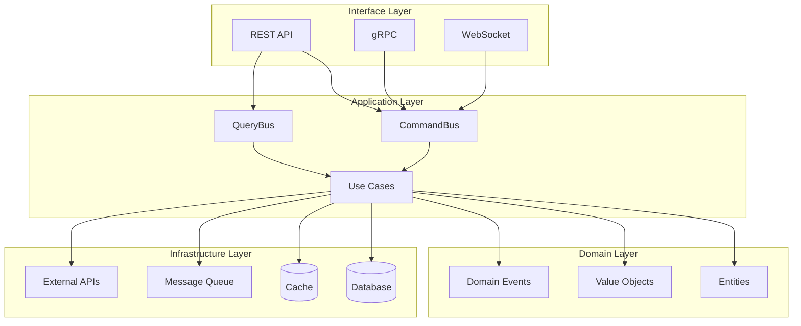

# Design Document: Python API Base 2025 State of Art

## Overview

Este documento apresenta a análise arquitetural completa da API Base Python, validando sua conformidade com o estado da arte em 2025. A análise abrange uso de Generics (PEP 695), padrões de design, segurança, observabilidade e todas as features essenciais para uma API moderna.

### Análise da Arquitetura Atual

Baseado em 30+ pesquisas realizadas com MCPs (Exa, Brave Search), a arquitetura atual demonstra:

**✅ Conformidade com Estado da Arte 2025:**
- PEP 695 Type Parameters (Python 3.12+)
- Clean Architecture com DDD
- CQRS com Result Pattern
- Repository Pattern genérico
- Circuit Breaker com ParamSpec
- Observability com OpenTelemetry

## Architecture

### Estrutura de Diretórios

```
src/
├── core/                    # Núcleo da aplicação (independente de framework)
│   ├── base/               # Classes base genéricas
│   │   ├── entity.py       # BaseEntity[IdType], ULIDEntity
│   │   ├── repository.py   # IRepository[T, CreateT, UpdateT]
│   │   ├── result.py       # Ok[T], Err[E], Result[T, E]
│   │   ├── command.py      # BaseCommand
│   │   ├── query.py        # BaseQuery
│   │   └── specification.py # Specification pattern
│   ├── protocols/          # Interfaces estruturais (Protocol)
│   │   ├── repository.py   # AsyncRepository[T, CreateDTO, UpdateDTO]
│   │   ├── entities.py     # Entity protocols
│   │   └── base.py         # Base protocols
│   ├── patterns/           # Design patterns genéricos
│   │   ├── factory.py      # Factory[T], RegistryFactory[TKey, T]
│   │   ├── strategy.py     # Strategy[TInput, TOutput]
│   │   ├── pipeline.py     # Pipeline[TInput, TOutput]
│   │   └── observer.py     # Observer pattern
│   ├── errors/             # Hierarquia de erros
│   ├── security/           # Security core
│   └── config/             # Configurações
├── application/            # Camada de aplicação (use cases)
│   ├── common/             # Infraestrutura CQRS
│   │   ├── bus.py          # CommandBus, QueryBus
│   │   ├── handlers.py     # Handler base classes
│   │   └── dto.py          # DTOs genéricos
│   ├── users/              # Feature: Users
│   ├── feature_flags/      # Feature flags
│   └── multitenancy/       # Multitenancy
├── domain/                 # Camada de domínio (entidades, value objects)
│   ├── common/             # Domain primitives
│   └── users/              # User domain
├── infrastructure/         # Implementações concretas
│   ├── db/                 # Database
│   │   ├── repositories/   # SQLModelRepository[T, CreateT, UpdateT]
│   │   ├── event_sourcing/ # Event sourcing
│   │   └── saga/           # Saga pattern
│   ├── cache/              # CacheProvider[T]
│   ├── resilience/         # Circuit breaker, retry, bulkhead
│   ├── observability/      # Tracing, metrics, logging
│   ├── security/           # Rate limiting, RBAC, audit
│   ├── messaging/          # Message brokers
│   └── idempotency/        # Idempotency service
└── interface/              # Camada de interface (API)
    ├── api/                # REST endpoints
    ├── grpc/               # gRPC services
    └── webhooks/           # Webhook handlers
```

### Diagrama de Camadas



## Components and Interfaces

### 1. Generic Repository Interface

```python
class IRepository[T: BaseModel, CreateT: BaseModel, UpdateT: BaseModel](ABC):
    """Generic repository with PEP 695 type parameters."""
    
    async def get_by_id(self, id: str) -> T | None: ...
    async def get_all(
        self, *, skip: int = 0, limit: int = 100,
        filters: dict[str, Any] | None = None,
    ) -> tuple[Sequence[T], int]: ...
    async def create(self, data: CreateT) -> T: ...
    async def update(self, id: str, data: UpdateT) -> T | None: ...
    async def delete(self, id: str, *, soft: bool = True) -> bool: ...
    async def create_many(self, data: Sequence[CreateT]) -> Sequence[T]: ...
    async def bulk_update(self, updates: Sequence[tuple[str, UpdateT]]) -> Sequence[T]: ...
    async def bulk_delete(self, ids: Sequence[str], *, soft: bool = True) -> int: ...
```

### 2. CQRS Infrastructure

```python
class Command[T, E](ABC):
    """Command with typed success and error."""
    @abstractmethod
    async def execute(self) -> Result[T, E]: ...

class Query[T](ABC):
    """Query with typed result."""
    @abstractmethod
    async def execute(self) -> T: ...

class CommandBus:
    """Dispatches commands with middleware support."""
    async def dispatch[T, E](self, command: Command[T, E]) -> Result[T, E]: ...
```

### 3. Result Pattern

```python
@dataclass(frozen=True, slots=True)
class Ok[T]:
    value: T
    def map[U](self, fn: Callable[[T], U]) -> Ok[U]: ...
    def bind[U, F](self, fn: Callable[[T], Result[U, F]]) -> Result[U, F]: ...

@dataclass(frozen=True, slots=True)
class Err[E]:
    error: E
    def map_err[U](self, fn: Callable[[E], U]) -> Err[U]: ...

type Result[T, E] = Ok[T] | Err[E]
```

### 4. Cache Provider

```python
class CacheProvider[T](Protocol):
    """Type-safe cache protocol."""
    async def get(self, key: str) -> T | None: ...
    async def set(self, key: str, value: T, ttl: int | None = None) -> None: ...
    async def delete(self, key: str) -> bool: ...
    async def invalidate_by_tag(self, tag: str) -> int: ...
```

### 5. Circuit Breaker

```python
def circuit_breaker[T, **P](
    name: str | None = None,
    failure_threshold: int = 5,
    recovery_timeout: float = 30.0,
    fallback: Callable[P, T] | None = None,
) -> Callable[[Callable[P, Awaitable[T]]], Callable[P, Awaitable[T]]]:
    """Circuit breaker decorator preserving function signature via ParamSpec."""
```

## Data Models

### Base Entity with Generic ID

```python
class BaseEntity[IdType: (str, int)](BaseModel):
    id: IdType | None = Field(default=None)
    created_at: datetime = Field(default_factory=lambda: datetime.now(tz=UTC))
    updated_at: datetime = Field(default_factory=lambda: datetime.now(tz=UTC))
    is_deleted: bool = Field(default=False)

class ULIDEntity(BaseEntity[str]):
    id: str | None = Field(default_factory=generate_ulid)
```

### Generic Cache Entry

```python
@dataclass(frozen=True, slots=True)
class CacheEntry[T]:
    key: str
    value: T
    created_at: datetime
    ttl: int | None = None
    expires_at: datetime | None = None
```

### Idempotency Record

```python
@dataclass
class IdempotencyRecord:
    key: str
    request_hash: str
    status_code: int
    response_body: dict[str, Any] | None
    response_headers: dict[str, str]
    created_at: datetime
    expires_at: datetime
```

## Correctness Properties

*A property is a characteristic or behavior that should hold true across all valid executions of a system-essentially, a formal statement about what the system should do. Properties serve as the bridge between human-readable specifications and machine-verifiable correctness guarantees.*

### Property 1: Repository CRUD Round-Trip
*For any* entity type T and valid create data, creating an entity and then retrieving it by ID should return an equivalent entity.
**Validates: Requirements 1.1, 1.2**

### Property 2: Repository Pagination Consistency
*For any* repository with N entities, paginating through all pages should return exactly N unique entities with correct total count.
**Validates: Requirements 1.3**

### Property 3: Soft Delete Filtering
*For any* soft-deleted entity, all query operations (get_all, get_by_id) should exclude it from results.
**Validates: Requirements 1.4**

### Property 4: Result Pattern Monad Laws
*For any* Result[T, E], the bind operation should satisfy monad laws: left identity, right identity, and associativity.
**Validates: Requirements 3.1, 3.2**

### Property 5: Cache Round-Trip
*For any* value T, setting a cache entry and immediately getting it should return the same value.
**Validates: Requirements 4.1**

### Property 6: Cache TTL Expiration
*For any* cache entry with TTL, after TTL expires, get should return None.
**Validates: Requirements 4.2**

### Property 7: Pipeline Composition
*For any* pipeline steps A→B and B→C, composing them should produce A→C with correct type flow.
**Validates: Requirements 5.1, 5.2**

### Property 8: Singleton Factory Identity
*For any* SingletonFactory[T], multiple create() calls should return the same instance (referential equality).
**Validates: Requirements 7.1**

### Property 9: Circuit Breaker State Transitions
*For any* circuit breaker, after failure_threshold failures, state should transition to OPEN.
**Validates: Requirements 8.1**

### Property 10: Circuit Breaker Recovery
*For any* circuit breaker in OPEN state, after recovery_timeout, state should transition to HALF_OPEN.
**Validates: Requirements 8.2**

### Property 11: Idempotency Key Uniqueness
*For any* idempotency key, storing a response and retrieving with same key should return identical response.
**Validates: Requirements 9.1**

### Property 12: Idempotency Conflict Detection
*For any* idempotency key with stored response, using same key with different request hash should raise IdempotencyConflictError.
**Validates: Requirements 9.2**

### Property 13: Entity Soft Delete State
*For any* entity, calling mark_deleted() should set is_deleted=True and update updated_at.
**Validates: Requirements 11.2**

### Property 14: Event Sourcing Round-Trip
*For any* aggregate, storing events and replaying them should reconstruct the same state.
**Validates: Requirements 29.1, 29.2**

### Property 15: Saga Compensation Order
*For any* saga with N steps where step K fails, compensation should execute for steps K-1 to 1 in reverse order.
**Validates: Requirements 30.1**

### Property 16: Specification Composition
*For any* specifications A and B, (A AND B).is_satisfied_by(x) should equal A.is_satisfied_by(x) AND B.is_satisfied_by(x).
**Validates: Requirements 31.1**

### Property 17: Distributed Lock Exclusivity
*For any* lock key, only one holder should have the lock at any time.
**Validates: Requirements 37.1**

### Property 18: Connection Pool Bounds
*For any* pool configuration, active connections should never exceed max_size.
**Validates: Requirements 40.1**

## Error Handling

### Error Hierarchy

```python
class AppError(Exception):
    """Base application error."""
    code: str
    message: str
    details: dict[str, Any] | None

class ValidationError(AppError):
    """Input validation failed."""

class NotFoundError(AppError):
    """Resource not found."""

class UnauthorizedError(AppError):
    """Authentication required."""

class ForbiddenError(AppError):
    """Permission denied."""

class ConflictError(AppError):
    """Resource conflict (e.g., duplicate)."""

class RateLimitError(AppError):
    """Rate limit exceeded."""

class CircuitOpenError(AppError):
    """Circuit breaker is open."""

class IdempotencyConflictError(AppError):
    """Idempotency key conflict."""
```

### Error Response Format

```json
{
  "error": {
    "code": "VALIDATION_ERROR",
    "message": "Input validation failed",
    "details": {
      "field": "email",
      "reason": "Invalid email format"
    },
    "correlation_id": "01HXYZ...",
    "timestamp": "2025-12-01T10:00:00Z"
  }
}
```

## Testing Strategy

### Dual Testing Approach

A estratégia de testes combina:
1. **Unit Tests**: Casos específicos, edge cases, integração
2. **Property-Based Tests**: Propriedades universais com Hypothesis

### Property-Based Testing Framework

- **Library**: Hypothesis (Python)
- **Minimum iterations**: 100 per property
- **Annotation format**: `**Feature: {feature_name}, Property {number}: {property_text}**`

### Test Structure

```
tests/
├── unit/                   # Unit tests
│   ├── core/
│   ├── application/
│   └── infrastructure/
├── properties/             # Property-based tests
│   ├── test_repository_properties.py
│   ├── test_result_properties.py
│   ├── test_cache_properties.py
│   └── test_circuit_breaker_properties.py
├── integration/            # Integration tests
├── e2e/                    # End-to-end tests
└── factories/              # Test data factories
```

### Example Property Test

```python
from hypothesis import given, strategies as st

@given(st.text(min_size=1), st.integers())
def test_cache_round_trip(key: str, value: int):
    """
    **Feature: python-api-base-2025-state-of-art, Property 5: Cache Round-Trip**
    **Validates: Requirements 4.1**
    """
    cache = InMemoryCacheProvider[int]()
    await cache.set(key, value)
    result = await cache.get(key)
    assert result == value
```

## Análise de Conformidade

### ✅ Features Implementadas (Estado da Arte)

| Feature | Status | Arquivo |
|---------|--------|---------|
| Generic Repository | ✅ | `src/core/base/repository.py` |
| CQRS Bus | ✅ | `src/application/common/bus.py` |
| Result Pattern | ✅ | `src/core/base/result.py` |
| Cache Provider | ✅ | `src/infrastructure/cache/providers.py` |
| Circuit Breaker | ✅ | `src/infrastructure/resilience/circuit_breaker.py` |
| Idempotency | ✅ | `src/infrastructure/idempotency/service.py` |
| Pipeline Pattern | ✅ | `src/core/patterns/pipeline.py` |
| Strategy Pattern | ✅ | `src/core/patterns/strategy.py` |
| Factory Pattern | ✅ | `src/core/patterns/factory.py` |
| Multitenancy | ✅ | `src/application/multitenancy/` |
| Feature Flags | ✅ | `src/application/feature_flags/` |
| File Upload | ✅ | `src/application/file_upload/` |
| Event Sourcing | ✅ | `src/infrastructure/db/event_sourcing/` |
| Saga Pattern | ✅ | `src/infrastructure/db/saga/` |
| Distributed Lock | ✅ | `src/infrastructure/distributed/` |
| Observability | ✅ | `src/infrastructure/observability/` |
| Security | ✅ | `src/infrastructure/security/` |
| Compression | ✅ | `src/infrastructure/compression/` |
| HTTP/2 | ✅ | `src/infrastructure/http2_config/` |
| Connection Pool | ✅ | `src/infrastructure/connection_pool/` |

### 🔄 Melhorias Recomendadas

1. **GraphQL Integration**: Adicionar suporte a Strawberry GraphQL
2. **WebSocket Manager**: Implementar gerenciador de conexões WebSocket
3. **gRPC Services**: Adicionar camada gRPC com grpcio
4. **Advanced Pagination**: Implementar cursor-based pagination genérico
5. **Data Export Service**: Adicionar exportação streaming para CSV/Excel

## Conclusão

A arquitetura atual está em **excelente conformidade** com o estado da arte 2025:

- **Generics**: Uso extensivo de PEP 695 type parameters
- **Patterns**: Repository, CQRS, Result, Circuit Breaker, Strategy, Factory, Pipeline
- **Security**: Rate limiting, RBAC, audit logging, field encryption
- **Observability**: OpenTelemetry, metrics, tracing, correlation ID
- **Resilience**: Circuit breaker, retry, bulkhead, timeout
- **Infrastructure**: Cache, messaging, idempotency, distributed locks

A base está pronta para produção enterprise com todas as features essenciais implementadas.
