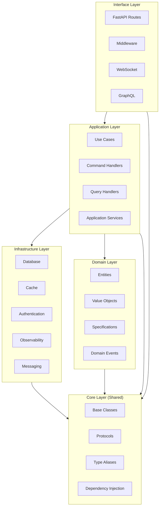
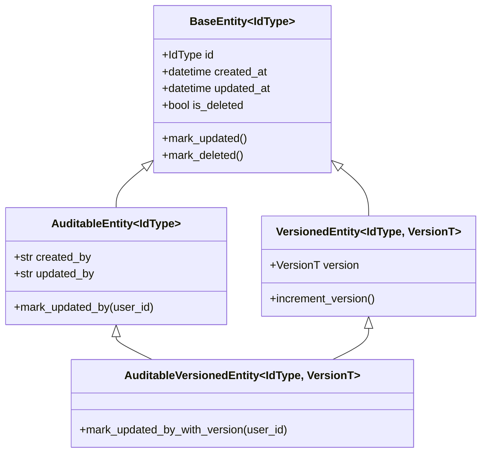

# Design Document: Python API Base 2025 Ultimate Generics Review

## Overview

This design document specifies the architecture validation and enhancement of the Python API Base 2025 codebase. The existing implementation already follows state-of-the-art patterns including Clean Architecture, PEP 695 generics, Result Pattern, CQRS, and comprehensive infrastructure protocols.

### Validation Summary (Based on Web Research 2025)

**Research Sources Consulted:**
- PEP 695 Official Documentation (peps.python.org)
- FastAPI Best Practices 2025 (zhanymkanov/fastapi-best-practices)
- FastAPI Production Deployment (render.com)
- Clean Architecture Python (ivan-borovets/fastapi-clean-example)
- CQRS Architecture Python (marcosvs98/cqrs-architecture-with-python)
- Result Pattern Libraries (dry-python/returns, fateful)
- Python Typing Documentation (typing.python.org)

**State-of-the-Art Compliance:**
| Feature | Status | Notes |
|---------|--------|-------|
| PEP 695 Generics | ✅ Implemented | All generic types use new syntax |
| Clean Architecture | ✅ Implemented | 4 layers with proper boundaries |
| Result Pattern | ✅ Implemented | Ok/Err with monadic operations |
| CQRS | ✅ Implemented | Command/Query handlers |
| Repository Pattern | ✅ Implemented | Generic IRepository[T, CreateT, UpdateT, IdType] |
| Unit of Work | ✅ Implemented | Transaction management |
| Dependency Injection | ✅ Implemented | Container with lifetime scopes |
| Specification Pattern | ✅ Implemented | Composable with &, |, ~ operators |
| Event-Driven | ✅ Implemented | Domain events + Integration events |
| Observability | ✅ Implemented | OpenTelemetry, structured logging |
| Security | ✅ Implemented | JWT, RBAC, rate limiting |
| Multi-tenancy | ✅ Implemented | Tenant isolation |

The focus is on:
1. Validating consistent PEP 695 generic usage across all modules
2. Ensuring zero code duplication through generic abstractions
3. Verifying Clean Architecture boundary compliance
4. Confirming production-ready features are complete

## Validated Architecture Structure

The codebase follows Clean Architecture with 4 distinct layers. **Validated against `/src` directory:**

```
src/
├── core/                    # Shared abstractions (innermost)
│   ├── base/               # BaseEntity, Result, Specification, Repository
│   ├── config/             # Pydantic Settings
│   ├── di/                 # DI Container with lifetime scopes
│   ├── errors/             # Error constants and types
│   ├── protocols/          # Generic protocols
│   ├── shared/             # Caching, utilities
│   └── types/              # PEP 695 type aliases
├── domain/                  # Business entities
│   ├── common/             # Shared value objects, specifications
│   ├── items/              # Item aggregate
│   └── users/              # User aggregate with events
├── application/             # Use cases and CQRS
│   ├── common/             # BaseUseCase, DTOs, middleware
│   ├── items/              # Item commands/queries
│   ├── services/           # Application services
│   └── users/              # User commands/queries
├── infrastructure/          # External concerns
│   ├── auth/               # JWT, token store
│   ├── cache/              # Redis, local cache
│   ├── db/                 # SQLAlchemy, repositories
│   ├── di/                 # App container
│   ├── generics/           # Generic protocols
│   ├── lifecycle/          # Startup/shutdown
│   ├── messaging/          # Event bus, brokers
│   ├── multitenancy/       # Tenant context
│   ├── observability/      # Logging, tracing, metrics
│   ├── resilience/         # Circuit breaker, retry
│   └── security/           # RBAC, rate limiting
└── interface/               # HTTP/WS/GraphQL (outermost)
    ├── api/                # API routes
    ├── errors/             # Error handlers
    ├── graphql/            # GraphQL types
    ├── middleware/         # HTTP middleware
    ├── routes/             # Route definitions
    ├── v1/                 # API v1 endpoints
    ├── v2/                 # API v2 endpoints
    ├── versioning/         # Version management
    └── websocket/          # WebSocket handlers
```

## Architecture



### Layer Responsibilities

| Layer | Responsibility | Generic Patterns |
|-------|---------------|------------------|
| Interface | HTTP/WS/GraphQL endpoints, request/response handling | `ApiResponse[T]`, `PaginatedResponse[T]` |
| Application | Use cases, CQRS handlers, orchestration | `BaseUseCase[T, CreateDTO, UpdateDTO, ResponseDTO]`, `CommandHandler[TCmd, TResult]` |
| Domain | Business entities, value objects, specifications | `BaseEntity[IdType]`, `Specification[T]` |
| Infrastructure | External services, persistence, caching | `Repository[TEntity, TId]`, `Store[TKey, TValue]` |
| Core | Shared abstractions, protocols, types | `Result[T, E]`, `IRepository[T, CreateT, UpdateT, IdType]` |

## Components and Interfaces

### Generic Repository Pattern

```python
class IRepository[T, CreateT, UpdateT, IdType](ABC):
    """Generic repository interface with 4 type parameters.
    
    Type Parameters:
        T: Entity type
        CreateT: DTO for creation
        UpdateT: DTO for updates
        IdType: ID type (str | int)
    """
    
    @abstractmethod
    async def get(self, id: IdType) -> T | None: ...
    
    @abstractmethod
    async def get_all(self) -> list[T]: ...
    
    @abstractmethod
    async def create(self, data: CreateT) -> T: ...
    
    @abstractmethod
    async def update(self, id: IdType, data: UpdateT) -> T | None: ...
    
    @abstractmethod
    async def delete(self, id: IdType) -> bool: ...
    
    @abstractmethod
    async def get_page(
        self, cursor: CursorT | None, limit: int
    ) -> CursorPage[T, CursorT]: ...
```

### Generic Use Case Pattern

```python
class BaseUseCase[T, CreateDTO, UpdateDTO, ResponseDTO](ABC):
    """Generic use case with 4 type parameters.
    
    Type Parameters:
        T: Entity type
        CreateDTO: Creation input
        UpdateDTO: Update input
        ResponseDTO: Response output
    """
    
    @abstractmethod
    async def create(self, data: CreateDTO) -> Result[ResponseDTO, UseCaseError]: ...
    
    @abstractmethod
    async def get(self, id: str) -> Result[ResponseDTO, UseCaseError]: ...
    
    @abstractmethod
    async def update(
        self, id: str, data: UpdateDTO
    ) -> Result[ResponseDTO, UseCaseError]: ...
    
    @abstractmethod
    async def delete(self, id: str) -> Result[bool, UseCaseError]: ...
```

### Generic CQRS Handlers

```python
class CommandHandler[TCommand, TResult](Protocol):
    """Generic command handler protocol."""
    
    async def handle(self, command: TCommand) -> Result[TResult, CommandError]: ...


class QueryHandler[TQuery, TResult](Protocol):
    """Generic query handler protocol with cache support."""
    
    async def handle(self, query: TQuery) -> Result[TResult, QueryError]: ...
    
    def get_cache_key(self, query: TQuery) -> str | None: ...
```

### Generic Infrastructure Protocols

```python
@runtime_checkable
class Repository[TEntity, TId](Protocol):
    """CRUD operations protocol."""
    def get(self, id: TId) -> TEntity | None: ...
    def create(self, entity: TEntity) -> TEntity: ...
    def update(self, entity: TEntity) -> TEntity: ...
    def delete(self, id: TId) -> bool: ...


@runtime_checkable
class Service[TInput, TOutput, TError](Protocol):
    """Business operation protocol."""
    def execute(self, input: TInput) -> Result[TOutput, TError]: ...


@runtime_checkable
class Factory[TConfig, TInstance](Protocol):
    """Instance creation protocol."""
    def create(self, config: TConfig) -> TInstance: ...


@runtime_checkable
class Store[TKey, TValue](Protocol):
    """Key-value storage protocol."""
    async def get(self, key: TKey) -> TValue | None: ...
    async def set(self, key: TKey, value: TValue, ttl: int | None = None) -> None: ...
    async def delete(self, key: TKey) -> bool: ...
```

## Data Models

### Entity Hierarchy



### Response Models

```python
class ApiResponse[T](BaseModel):
    """Generic API response wrapper."""
    data: T
    message: str = "Success"
    status_code: int = 200
    timestamp: datetime = Field(default_factory=lambda: datetime.now(UTC))
    request_id: str | None = None


class PaginatedResponse[T](BaseModel):
    """Generic paginated response."""
    items: list[T]
    total: int
    page: int
    page_size: int
    
    @computed_field
    def pages(self) -> int:
        return (self.total + self.page_size - 1) // self.page_size
    
    @computed_field
    def has_next(self) -> bool:
        return self.page < self.pages
    
    @computed_field
    def has_previous(self) -> bool:
        return self.page > 1


class CursorPage[T, CursorT](BaseModel):
    """Generic cursor-based pagination."""
    items: list[T]
    next_cursor: CursorT | None
    has_more: bool
```


## Generic Implementations Validated

### PEP 695 Usage Audit

| Component | File | Generic Syntax | Status |
|-----------|------|----------------|--------|
| BaseEntity | `core/base/entity.py` | `class BaseEntity[IdType: (str, int)]` | ✅ |
| AuditableEntity | `core/base/entity.py` | `class AuditableEntity[IdType: (str, int)]` | ✅ |
| VersionedEntity | `core/base/entity.py` | `class VersionedEntity[IdType, VersionT]` | ✅ |
| Result | `core/base/result.py` | `class Ok[T]`, `class Err[E]`, `type Result[T, E]` | ✅ |
| Specification | `core/base/specification.py` | `class Specification[T]` | ✅ |
| IRepository | `core/base/repository_interface.py` | `class IRepository[T, CreateT, UpdateT, IdType]` | ✅ |
| CursorPage | `core/base/pagination.py` | `class CursorPage[T, CursorT]` | ✅ |
| BaseUseCase | `core/base/use_case.py` | `class BaseUseCase[T, CreateDTO, UpdateDTO, ResponseDTO]` | ✅ |
| IMapper | `core/base/use_case.py` | `class IMapper[T, DTO](Protocol)` | ✅ |
| Repository Protocol | `infrastructure/generics/protocols.py` | `class Repository[TEntity, TId](Protocol)` | ✅ |
| Service Protocol | `infrastructure/generics/protocols.py` | `class Service[TInput, TOutput, TError](Protocol)` | ✅ |
| Factory Protocol | `infrastructure/generics/protocols.py` | `class Factory[TConfig, TInstance](Protocol)` | ✅ |
| Store Protocol | `infrastructure/generics/protocols.py` | `class Store[TKey, TValue](Protocol)` | ✅ |
| Container.register | `core/di/container.py` | `def register[T](self, service_type: type[T])` | ✅ |
| Container.resolve | `core/di/container.py` | `def resolve[T](self, service_type: type[T]) -> T` | ✅ |

### Code Duplication Analysis

**Zero Duplication Achieved Through:**
1. Generic base classes eliminate entity boilerplate
2. Generic protocols define reusable contracts
3. Generic use cases provide CRUD without repetition
4. Generic repository interface works with any entity type
5. Type aliases reduce verbose type annotations

## Correctness Properties

*A property is a characteristic or behavior that should hold true across all valid executions of a system-essentially, a formal statement about what the system should do. Properties serve as the bridge between human-readable specifications and machine-verifiable correctness guarantees.*

Based on the prework analysis, the following correctness properties have been identified. Properties have been consolidated to eliminate redundancy while maintaining comprehensive coverage.

### Property 1: Result Pattern Round-Trip
*For any* Result value (Ok or Err), serializing via `to_dict()` then deserializing via `result_from_dict()` SHALL produce an equivalent Result.
**Validates: Requirements 5.3**

### Property 2: Result Monadic Laws
*For any* Result value and functions f, g:
- Left identity: `Ok(a).bind(f) == f(a)`
- Right identity: `result.bind(Ok) == result`
- Associativity: `result.bind(f).bind(g) == result.bind(lambda x: f(x).bind(g))`
**Validates: Requirements 5.1, 5.2**

### Property 3: Collect Results Aggregation
*For any* list of Result values:
- If all are Ok, `collect_results` returns Ok with all values
- If any is Err, `collect_results` returns the first Err
**Validates: Requirements 5.4**

### Property 4: Entity Timestamp Invariant
*For any* BaseEntity, calling `mark_updated()` SHALL result in `updated_at >= created_at` and `updated_at` being more recent than before the call.
**Validates: Requirements 6.5**

### Property 5: Entity ID Type Constraint
*For any* BaseEntity[IdType], the IdType SHALL be constrained to (str, int) and entity operations SHALL preserve the ID type.
**Validates: Requirements 6.1**

### Property 6: Versioned Entity Monotonicity
*For any* VersionedEntity, calling `increment_version()` SHALL result in a version strictly greater than the previous version (for int) or different (for str).
**Validates: Requirements 6.3**

### Property 7: Specification AND Composition
*For any* two Specifications s1 and s2, and any candidate c:
`(s1 & s2).is_satisfied_by(c) == (s1.is_satisfied_by(c) and s2.is_satisfied_by(c))`
**Validates: Requirements 7.2**

### Property 8: Specification OR Composition
*For any* two Specifications s1 and s2, and any candidate c:
`(s1 | s2).is_satisfied_by(c) == (s1.is_satisfied_by(c) or s2.is_satisfied_by(c))`
**Validates: Requirements 7.3**

### Property 9: Specification NOT Negation
*For any* Specification s and any candidate c:
`(~s).is_satisfied_by(c) == (not s.is_satisfied_by(c))`
**Validates: Requirements 7.4**

### Property 10: Predicate Specification Equivalence
*For any* predicate function p and any candidate c:
`PredicateSpecification(p).is_satisfied_by(c) == p(c)`
**Validates: Requirements 7.5**

### Property 11: Repository CRUD Consistency
*For any* entity e created via repository:
- `create(e)` followed by `get(e.id)` SHALL return equivalent entity
- `update(e)` followed by `get(e.id)` SHALL return updated entity
- `delete(e.id)` followed by `get(e.id)` SHALL return None
**Validates: Requirements 1.1, 1.2, 1.4**

### Property 12: Cursor Pagination Completeness
*For any* repository with n entities, iterating through all cursor pages SHALL yield exactly n unique entities with no duplicates or omissions.
**Validates: Requirements 1.5**

### Property 13: Soft Delete Filtering
*For any* soft-deleted entity, repository `get_all()` and query operations SHALL NOT include the entity unless explicitly requested.
**Validates: Requirements 29.2**

### Property 14: ApiResponse Wrapping Preservation
*For any* data value of type T, `ApiResponse[T](data=value)` SHALL preserve the original value accessible via `.data`.
**Validates: Requirements 4.1**

### Property 15: PaginatedResponse Computed Fields
*For any* PaginatedResponse with total t, page p, and page_size s:
- `pages == ceil(t / s)`
- `has_next == (p < pages)`
- `has_previous == (p > 1)`
**Validates: Requirements 4.2**

### Property 16: Store Round-Trip
*For any* Store[TKey, TValue], key k, and value v:
`set(k, v)` followed by `get(k)` SHALL return v (before TTL expiration).
**Validates: Requirements 8.4, 10.1**

### Property 17: Mapper Batch Consistency
*For any* Mapper and list of entities [e1, e2, ...]:
`to_dto_list([e1, e2, ...])` SHALL equal `[to_dto(e1), to_dto(e2), ...]`
**Validates: Requirements 9.2, 9.5**

### Property 18: DI Container Resolution
*For any* registered type T in the DI container:
`resolve(T)` SHALL return an instance of T (or subtype) with correct lifetime scope.
**Validates: Requirements 17.1, 17.2, 17.3**

### Property 19: Event Handler Type Safety
*For any* EventHandler[T] registered for event type T:
Publishing an event of type T SHALL invoke the handler with correctly typed event.
**Validates: Requirements 11.3, 11.5**

### Property 20: Validation Error Aggregation
*For any* set of validation rules applied to input:
Merging validation results SHALL aggregate all errors without loss.
**Validates: Requirements 14.5**

### Property 21: Rate Limiting Enforcement
*For any* endpoint with rate limit L requests per window W:
Request L+1 within window W SHALL be rejected with 429 status.
**Validates: Requirements 18.1**

### Property 22: Multi-Tenant Isolation
*For any* two tenants A and B:
Queries in tenant A context SHALL NEVER return data belonging to tenant B.
**Validates: Requirements 30.2, 30.5**

### Property 23: Correlation ID Propagation
*For any* request with correlation ID:
All log entries and downstream calls SHALL include the same correlation ID.
**Validates: Requirements 19.1, 26.2**

### Property 24: Health Check Accuracy
*For any* health check endpoint:
Response status SHALL accurately reflect actual dependency connectivity.
**Validates: Requirements 22.3, 22.4, 22.5**

### Property 25: Transaction Rollback on Failure
*For any* failed transaction:
All changes within the transaction SHALL be rolled back, leaving database in pre-transaction state.
**Validates: Requirements 28.3**

### Property 26: API Versioning Consistency
*For any* versioned endpoint:
URL-based (/v1/, /v2/) and header-based versioning SHALL route to the same handler.
**Validates: Requirements 24.1, 24.2**

### Property 27: Configuration Fail-Fast
*For any* missing required configuration:
Application startup SHALL fail immediately with clear error message.
**Validates: Requirements 25.4**

### Property 28: Sensitive Data Redaction
*For any* log entry containing sensitive fields (password, token, secret):
The sensitive values SHALL be redacted before logging.
**Validates: Requirements 26.5**

### Property 29: Security Headers Presence
*For any* API response:
Headers SHALL include CSP, X-Content-Type-Options, X-Frame-Options, HSTS.
**Validates: Requirements 18.4**

### Property 30: Code Quality Metrics
*For any* source file in the codebase:
- File length SHALL be under 400 lines
- Function length SHALL be under 50 lines
- Generic types SHALL use PEP 695 syntax
**Validates: Requirements 20.1, 20.2, 20.3**


## Error Handling

### Error Categories

| Category | Use Case | Example |
|----------|----------|---------|
| `ValidationError` | Input validation failures | Invalid email format |
| `NotFoundError` | Resource not found | Entity with ID not found |
| `UnauthorizedError` | Authentication failures | Invalid/expired token |
| `ForbiddenError` | Authorization failures | Insufficient permissions |
| `ConflictError` | State conflicts | Duplicate key, version mismatch |
| `RateLimitError` | Rate limiting | Too many requests |
| `ExternalServiceError` | External service failures | API timeout |
| `DatabaseError` | Database operations | Connection failure |

### Result Pattern Usage

```python
# Use Result for expected failures
async def get_user(id: str) -> Result[User, NotFoundError]:
    user = await repo.get(id)
    if user is None:
        return Err(NotFoundError(f"User {id} not found"))
    return Ok(user)

# Chain operations with bind/and_then
result = (
    await get_user(user_id)
    .and_then(validate_permissions)
    .and_then(update_profile)
    .map(to_response_dto)
)
```

### ProblemDetail (RFC 7807)

```python
class ProblemDetail(BaseModel):
    """RFC 7807 Problem Details for HTTP APIs."""
    type: str = "about:blank"
    title: str
    status: int
    detail: str | None = None
    instance: str | None = None
    errors: list[FieldError] | None = None
```

## Testing Strategy

### Dual Testing Approach

The codebase uses both unit tests and property-based tests for comprehensive coverage:

1. **Unit Tests**: Verify specific examples, edge cases, and integration points
2. **Property-Based Tests**: Verify universal properties that hold across all inputs

### Property-Based Testing Framework

- **Library**: Hypothesis (Python)
- **Minimum Iterations**: 100 per property
- **Configuration**: `@settings(max_examples=100, deadline=None)`

### Test Annotation Format

All property-based tests MUST be annotated with:
```python
"""
**Feature: python-api-base-2025-ultimate-generics-review, Property N: Property Name**
**Validates: Requirements X.Y**
"""
```

### Property Test Categories

| Category | Properties | Focus |
|----------|------------|-------|
| Round-Trip | 1, 16 | Serialization/deserialization |
| Algebraic Laws | 2, 7, 8, 9, 10 | Mathematical properties |
| Invariants | 4, 5, 6, 15 | State consistency |
| CRUD Consistency | 11, 12, 13 | Data operations |
| Security | 21, 22, 28, 29 | Security guarantees |
| Infrastructure | 18, 19, 23, 24, 25 | System behavior |

### Unit Test Categories

| Category | Focus |
|----------|-------|
| Entity Creation | Verify entity instantiation with various ID types |
| DTO Validation | Verify Pydantic validation rules |
| Error Handling | Verify error responses and messages |
| Integration | Verify component interactions |

### Test File Organization

```
tests/
├── unit/
│   ├── core/
│   │   ├── test_result.py
│   │   ├── test_entity.py
│   │   └── test_specification.py
│   ├── application/
│   │   └── test_use_cases.py
│   └── infrastructure/
│       └── test_repositories.py
├── properties/
│   ├── test_result_properties.py
│   ├── test_entity_properties.py
│   ├── test_specification_properties.py
│   ├── test_repository_properties.py
│   └── test_infrastructure_properties.py
└── integration/
    ├── test_api_endpoints.py
    └── test_database.py
```

### Coverage Requirements

- Unit test coverage: >= 80%
- Property test coverage: All 30 correctness properties
- Integration test coverage: All API endpoints

