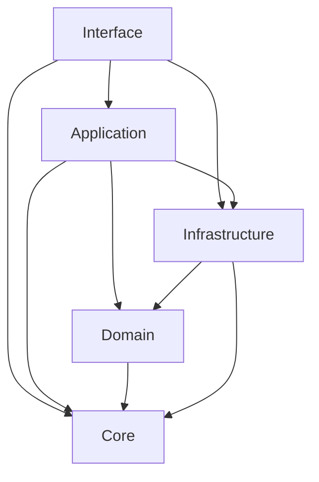
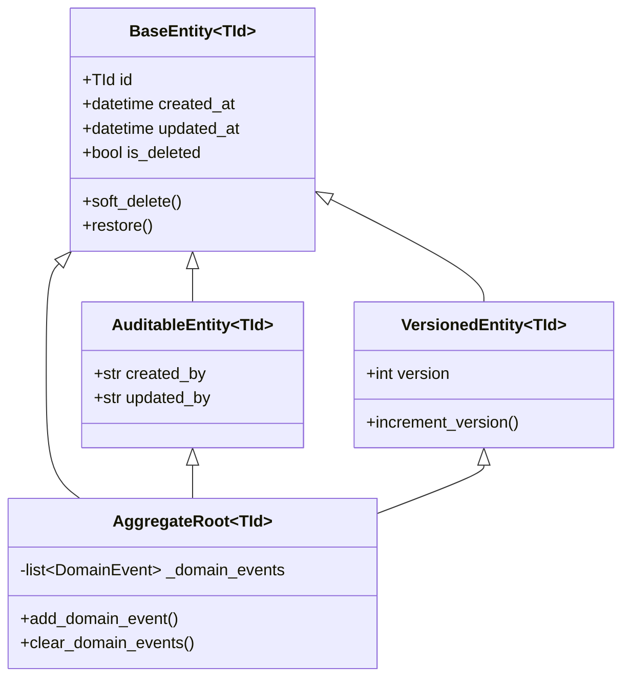
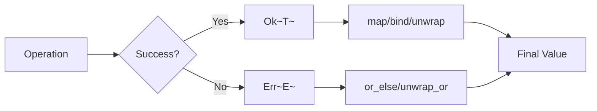

# Design Document: Python API Base 2025 Validation

## Overview

This design document outlines the architecture, components, and implementation approach for validating and improving the Python API Base against 2025 state-of-the-art standards. The system follows Clean Architecture principles with Domain-Driven Design (DDD) tactical patterns, leveraging Python 3.12+ features including PEP 695 generics.

### Goals

1. Validate existing implementation against 2025 best practices
2. Identify and implement missing patterns (Outbox, Zero-Trust, AI/ML)
3. Reduce boilerplate through generic base classes
4. Ensure 100% type coverage with PEP 695 syntax
5. Achieve comprehensive test coverage with property-based testing

### Non-Goals

1. Complete rewrite of existing functionality
2. Breaking changes to public APIs
3. Removal of existing features

## Architecture

### Layer Structure

```
┌─────────────────────────────────────────────────────────────┐
│                    Interface Layer                          │
│  (FastAPI Routes, Middleware, GraphQL, gRPC)               │
├─────────────────────────────────────────────────────────────┤
│                   Application Layer                         │
│  (Use Cases, Commands, Queries, DTOs, Mappers)             │
├─────────────────────────────────────────────────────────────┤
│                     Domain Layer                            │
│  (Entities, Value Objects, Aggregates, Domain Events)      │
├─────────────────────────────────────────────────────────────┤
│                  Infrastructure Layer                       │
│  (Repositories, External Services, Messaging, Caching)     │
├─────────────────────────────────────────────────────────────┤
│                      Core Layer                             │
│  (Result Pattern, Base Classes, Protocols, Utilities)      │
└─────────────────────────────────────────────────────────────┘
```

### Dependency Flow



## Components and Interfaces

### 1. Core Layer Components

#### 1.1 Result Pattern (PEP 695)

```python
type Result[T, E] = Ok[T] | Err[E]

class Ok[T]:
    """Success result containing a value."""
    value: T
    
    def map[U](self, f: Callable[[T], U]) -> Ok[U]: ...
    def bind[U, E2](self, f: Callable[[T], Result[U, E2]]) -> Result[U, E2]: ...
    def unwrap(self) -> T: ...
    def unwrap_or(self, default: T) -> T: ...
    def to_dict(self) -> dict[str, Any]: ...

class Err[E]:
    """Error result containing an error."""
    error: E
    
    def map[U](self, f: Callable[[Any], U]) -> Err[E]: ...
    def bind[U, E2](self, f: Callable[[Any], Result[U, E2]]) -> Err[E]: ...
    def unwrap(self) -> NoReturn: ...
    def unwrap_or[T](self, default: T) -> T: ...
    def to_dict(self) -> dict[str, Any]: ...
```

#### 1.2 Generic Repository Protocol

```python
class IRepository[TEntity, TCreate, TUpdate, TId](Protocol):
    """Generic repository interface with full CRUD support."""
    
    async def get_by_id(self, id: TId) -> Result[TEntity | None, RepositoryError]: ...
    async def get_all(self) -> Result[list[TEntity], RepositoryError]: ...
    async def create(self, data: TCreate) -> Result[TEntity, RepositoryError]: ...
    async def update(self, id: TId, data: TUpdate) -> Result[TEntity, RepositoryError]: ...
    async def delete(self, id: TId) -> Result[bool, RepositoryError]: ...
    async def create_many(self, items: list[TCreate]) -> Result[list[TEntity], RepositoryError]: ...
    async def get_page(
        self, 
        cursor: TId | None, 
        limit: int,
        filters: Specification[TEntity] | None = None
    ) -> Result[CursorPage[TEntity, TId], RepositoryError]: ...
```

#### 1.3 Generic Use Case Base

```python
class UseCase[TInput, TOutput, TError](ABC):
    """Base class for application use cases."""
    
    @abstractmethod
    async def execute(self, input: TInput) -> Result[TOutput, TError]: ...
    
    async def __call__(self, input: TInput) -> Result[TOutput, TError]:
        return await self.execute(input)
```

#### 1.4 Specification Pattern

```python
class Specification[T](ABC):
    """Base specification for business rules."""
    
    @abstractmethod
    def is_satisfied_by(self, entity: T) -> bool: ...
    
    def __and__(self, other: Specification[T]) -> AndSpecification[T]: ...
    def __or__(self, other: Specification[T]) -> OrSpecification[T]: ...
    def __invert__(self) -> NotSpecification[T]: ...
```

### 2. Domain Layer Components

#### 2.1 Base Entity

```python
class BaseEntity[TId](ABC):
    """Base entity with identity and timestamps."""
    
    id: TId
    created_at: datetime
    updated_at: datetime | None
    is_deleted: bool = False
    deleted_at: datetime | None = None
    
    def soft_delete(self) -> None: ...
    def restore(self) -> None: ...
```

#### 2.2 Aggregate Root

```python
class AggregateRoot[TId](BaseEntity[TId]):
    """Aggregate root with domain event support."""
    
    _domain_events: list[DomainEvent]
    
    def add_domain_event(self, event: DomainEvent) -> None: ...
    def clear_domain_events(self) -> list[DomainEvent]: ...
    def get_uncommitted_events(self) -> list[DomainEvent]: ...
```

#### 2.3 Value Object

```python
@dataclass(frozen=True)
class ValueObject(ABC):
    """Immutable value object base class."""
    
    def __eq__(self, other: object) -> bool: ...
    def __hash__(self) -> int: ...
```

### 3. Application Layer Components

#### 3.1 CQRS Commands and Queries

```python
@dataclass
class BaseCommand:
    """Base command with metadata."""
    command_id: UUID = field(default_factory=uuid4)
    timestamp: datetime = field(default_factory=datetime.utcnow)
    correlation_id: UUID | None = None
    user_id: str | None = None

@dataclass
class BaseQuery[TResult]:
    """Base query with result type and caching."""
    cache_key: str | None = None
    cache_ttl: int = 300  # seconds
```

#### 3.2 Generic Service

```python
class GenericService[TEntity, TCreate, TUpdate, TResponse]:
    """Generic service with CRUD operations and Result pattern."""
    
    def __init__(
        self,
        repository: IRepository[TEntity, TCreate, TUpdate, Any],
        mapper: GenericMapper[TEntity, Any, TResponse],
        event_bus: EventBus[DomainEvent] | None = None
    ): ...
    
    async def create(self, data: TCreate) -> Result[TResponse, ServiceError]: ...
    async def update(self, id: Any, data: TUpdate) -> Result[TResponse, ServiceError]: ...
    async def delete(self, id: Any) -> Result[bool, ServiceError]: ...
    async def get_by_id(self, id: Any) -> Result[TResponse | None, ServiceError]: ...
```

### 4. Infrastructure Layer Components

#### 4.1 SQLAlchemy Generic Repository

```python
class SQLAlchemyRepository[TEntity, TModel, TId](IRepository[TEntity, Any, Any, TId]):
    """Generic SQLAlchemy repository implementation."""
    
    def __init__(
        self,
        session: AsyncSession,
        model_class: type[TModel],
        entity_class: type[TEntity]
    ): ...
    
    async def get_by_id(self, id: TId) -> Result[TEntity | None, RepositoryError]: ...
    # ... all CRUD operations
```

#### 4.2 Outbox Pattern

```python
@dataclass
class OutboxMessage:
    """Transactional outbox message."""
    id: UUID
    aggregate_type: str
    aggregate_id: str
    event_type: str
    payload: dict[str, Any]
    created_at: datetime
    processed_at: datetime | None = None
    retry_count: int = 0

class OutboxPublisher:
    """Background publisher for outbox messages."""
    
    async def publish_pending(self, batch_size: int = 100) -> int: ...
    async def mark_processed(self, message_id: UUID) -> None: ...
    async def mark_failed(self, message_id: UUID, error: str) -> None: ...
```

#### 4.3 Circuit Breaker

```python
class CircuitBreaker[T]:
    """Circuit breaker with Result pattern integration."""
    
    def __init__(
        self,
        failure_threshold: int = 5,
        recovery_timeout: float = 30.0,
        half_open_max_calls: int = 3
    ): ...
    
    async def call(
        self, 
        func: Callable[[], Awaitable[T]],
        fallback: Callable[[], T] | None = None
    ) -> Result[T, CircuitBreakerError]: ...
    
    @property
    def state(self) -> CircuitState: ...
```

### 5. Interface Layer Components

#### 5.1 Generic Router Factory

```python
def create_crud_router[TEntity, TCreate, TUpdate, TResponse](
    prefix: str,
    service: GenericService[TEntity, TCreate, TUpdate, TResponse],
    create_schema: type[TCreate],
    update_schema: type[TUpdate],
    response_schema: type[TResponse],
    tags: list[str] | None = None,
    dependencies: list[Depends] | None = None
) -> APIRouter:
    """Factory function to generate CRUD router."""
    ...
```

#### 5.2 API Response Wrapper

```python
@dataclass
class ApiResponse[T]:
    """Standard API response wrapper."""
    data: T
    success: bool = True
    message: str | None = None
    request_id: str = field(default_factory=lambda: str(uuid4()))
    timestamp: datetime = field(default_factory=datetime.utcnow)
    
    def to_dict(self) -> dict[str, Any]: ...

@dataclass
class PaginatedResponse[T]:
    """Paginated response with navigation."""
    items: list[T]
    total: int
    page: int
    page_size: int
    has_next: bool = field(init=False)
    has_previous: bool = field(init=False)
    total_pages: int = field(init=False)
    
    def __post_init__(self) -> None:
        self.total_pages = (self.total + self.page_size - 1) // self.page_size
        self.has_next = self.page < self.total_pages
        self.has_previous = self.page > 1
```

## Data Models

### Entity Hierarchy



### Result Pattern Flow



</text>
</invoke>


## Correctness Properties

*A property is a characteristic or behavior that should hold true across all valid executions of a system-essentially, a formal statement about what the system should do. Properties serve as the bridge between human-readable specifications and machine-verifiable correctness guarantees.*

Based on the prework analysis, the following correctness properties have been identified for property-based testing:

### Property 1: Domain Layer Independence

*For any* module in the domain layer, analyzing its imports SHALL reveal no dependencies on the infrastructure layer.

**Validates: Requirements 1.2**

### Property 2: Module Exports Completeness

*For any* public module in the API Base, the module SHALL define an `__all__` list that exports all public symbols.

**Validates: Requirements 1.4**

### Property 3: Result Pattern Monadic Laws - Left Identity

*For any* value `a` and function `f: T -> Result[U, E]`, `Ok(a).bind(f)` SHALL equal `f(a)`.

**Validates: Requirements 5.1, 5.2**

### Property 4: Result Pattern Monadic Laws - Right Identity

*For any* Result `m`, `m.bind(Ok)` SHALL equal `m`.

**Validates: Requirements 5.1, 5.2**

### Property 5: Result Pattern Round-Trip Serialization

*For any* valid Result (Ok or Err), serializing with `to_dict()` then deserializing with `result_from_dict()` SHALL produce an equivalent Result.

**Validates: Requirements 5.7**

### Property 6: Result Map Preserves Structure

*For any* Ok value and pure function `f`, `Ok(x).map(f)` SHALL equal `Ok(f(x))`, and for any Err, `Err(e).map(f)` SHALL equal `Err(e)`.

**Validates: Requirements 5.2**

### Property 7: Result Unwrap Consistency

*For any* Ok value `x`, `Ok(x).unwrap()` SHALL return `x`, and `Ok(x).unwrap_or(default)` SHALL return `x`.

**Validates: Requirements 5.3**

### Property 8: Result Collect All-Or-Nothing

*For any* list of Results, `collect_results` SHALL return `Ok(list)` if and only if all Results are Ok, otherwise Err.

**Validates: Requirements 5.6**

### Property 9: Repository CRUD Consistency

*For any* entity created via repository, `get_by_id` with the created entity's ID SHALL return that entity.

**Validates: Requirements 6.2**

### Property 10: Repository Bulk Create Count

*For any* list of N valid create DTOs, `create_many` SHALL create exactly N entities.

**Validates: Requirements 6.3**

### Property 11: Repository Pagination Completeness

*For any* repository with N entities, iterating through all pages SHALL yield exactly N unique entities.

**Validates: Requirements 6.4, 6.5**

### Property 12: Unit of Work Commit Persistence

*For any* changes made within a Unit of Work, after `commit()`, the changes SHALL be persisted and visible in subsequent queries.

**Validates: Requirements 7.1**

### Property 13: Unit of Work Rollback Reversion

*For any* changes made within a Unit of Work, after `rollback()`, the changes SHALL NOT be persisted.

**Validates: Requirements 7.1**

### Property 14: Entity Soft Delete Behavior

*For any* entity, after `soft_delete()`, `is_deleted` SHALL be True and `deleted_at` SHALL be set.

**Validates: Requirements 4.1**

### Property 15: Entity Version Increment

*For any* VersionedEntity, each update SHALL increment the version by exactly 1.

**Validates: Requirements 4.3**

### Property 16: Aggregate Root Event Collection

*For any* AggregateRoot, events added via `add_domain_event` SHALL be retrievable via `get_uncommitted_events` until cleared.

**Validates: Requirements 4.4**

### Property 17: Value Object Immutability

*For any* ValueObject, attempting to modify its attributes SHALL raise an error (frozen dataclass).

**Validates: Requirements 4.5**

### Property 18: Value Object Equality

*For any* two ValueObjects with identical attribute values, they SHALL be equal and have the same hash.

**Validates: Requirements 4.5**

### Property 19: Specification Composition - AND

*For any* two Specifications A and B, `(A & B).is_satisfied_by(x)` SHALL equal `A.is_satisfied_by(x) and B.is_satisfied_by(x)`.

**Validates: Requirements 4.6**

### Property 20: Specification Composition - OR

*For any* two Specifications A and B, `(A | B).is_satisfied_by(x)` SHALL equal `A.is_satisfied_by(x) or B.is_satisfied_by(x)`.

**Validates: Requirements 4.6**

### Property 21: Specification Composition - NOT

*For any* Specification A, `(~A).is_satisfied_by(x)` SHALL equal `not A.is_satisfied_by(x)`.

**Validates: Requirements 4.6**

### Property 22: Command Metadata Presence

*For any* BaseCommand instance, `command_id`, `timestamp` SHALL be automatically populated with valid values.

**Validates: Requirements 3.1**

### Property 23: API Response Request ID Uniqueness

*For any* two ApiResponse instances created independently, their `request_id` values SHALL be different.

**Validates: Requirements 8.4**

### Property 24: Paginated Response Navigation Correctness

*For any* PaginatedResponse with total items T and page_size S, `total_pages` SHALL equal `ceil(T/S)`, `has_next` SHALL be True iff `page < total_pages`, `has_previous` SHALL be True iff `page > 1`.

**Validates: Requirements 8.2**

### Property 25: Circuit Breaker State Transitions

*For any* CircuitBreaker, after `failure_threshold` consecutive failures, state SHALL transition to OPEN.

**Validates: Requirements 13.1**

### Property 26: Circuit Breaker Recovery

*For any* CircuitBreaker in OPEN state, after `recovery_timeout` seconds, state SHALL transition to HALF_OPEN.

**Validates: Requirements 13.1**

### Property 27: Retry Exponential Backoff

*For any* retry sequence, delay between attempt N and N+1 SHALL be greater than or equal to delay between N-1 and N (exponential growth).

**Validates: Requirements 13.2**

### Property 28: Outbox Transactional Atomicity

*For any* domain operation with event publishing, if the domain change is committed, the outbox message SHALL also be committed in the same transaction.

**Validates: Requirements 33.1, 33.2**

### Property 29: Generic Mapper Bidirectional Consistency

*For any* entity, mapping to DTO and relevant fields back SHALL preserve the original values.

**Validates: Requirements 25.1**

### Property 30: Validator Allowlist Enforcement

*For any* input value, if the value is not in the allowlist, validation SHALL reject it.

**Validates: Requirements 36.2**

## Error Handling

### Error Hierarchy

```python
class AppError[TCode](Exception):
    """Base application error with generic error code."""
    code: TCode
    message: str
    details: dict[str, Any] | None = None
    
    def to_problem_detail(self) -> ProblemDetail: ...

class DomainError(AppError[DomainErrorCode]):
    """Domain layer errors."""
    pass

class ApplicationError(AppError[ApplicationErrorCode]):
    """Application layer errors."""
    pass

class InfrastructureError(AppError[InfrastructureErrorCode]):
    """Infrastructure layer errors."""
    pass

class ValidationError(AppError[ValidationErrorCode]):
    """Input validation errors."""
    field: str
    constraint: str
```

### Error Code Enums

```python
class DomainErrorCode(StrEnum):
    ENTITY_NOT_FOUND = "DOMAIN_001"
    INVALID_STATE = "DOMAIN_002"
    BUSINESS_RULE_VIOLATION = "DOMAIN_003"
    AGGREGATE_VERSION_CONFLICT = "DOMAIN_004"

class ApplicationErrorCode(StrEnum):
    USE_CASE_FAILED = "APP_001"
    AUTHORIZATION_FAILED = "APP_002"
    VALIDATION_FAILED = "APP_003"

class InfrastructureErrorCode(StrEnum):
    DATABASE_ERROR = "INFRA_001"
    EXTERNAL_SERVICE_ERROR = "INFRA_002"
    MESSAGING_ERROR = "INFRA_003"
    CACHE_ERROR = "INFRA_004"
```

### RFC 7807 Problem Detail

```python
@dataclass
class ProblemDetail:
    """RFC 7807 Problem Details for HTTP APIs."""
    type: str
    title: str
    status: int
    detail: str | None = None
    instance: str | None = None
    extensions: dict[str, Any] = field(default_factory=dict)
```

## Testing Strategy

### Dual Testing Approach

The testing strategy combines unit tests for specific examples and property-based tests for universal properties:

#### Unit Tests
- Verify specific examples and edge cases
- Test integration points between components
- Cover error conditions and boundary values
- Use pytest with async support

#### Property-Based Tests
- Use **Hypothesis** library for Python
- Minimum **100 iterations** per property test
- Test universal properties that should hold across all inputs
- Tag each test with the property it validates

### Test Organization

```
tests/
├── unit/
│   ├── core/
│   │   ├── test_result.py
│   │   └── test_specification.py
│   ├── domain/
│   │   ├── test_entities.py
│   │   └── test_value_objects.py
│   └── application/
│       └── test_use_cases.py
├── properties/
│   ├── test_result_properties.py
│   ├── test_repository_properties.py
│   ├── test_entity_properties.py
│   └── test_specification_properties.py
├── integration/
│   ├── test_repository_integration.py
│   └── test_middleware_integration.py
└── conftest.py
```

### Property Test Example

```python
from hypothesis import given, strategies as st, settings

@settings(max_examples=100)
@given(st.integers())
def test_result_map_preserves_ok_structure(value: int):
    """
    **Feature: python-api-base-2025-validation, Property 6: Result Map Preserves Structure**
    **Validates: Requirements 5.2**
    """
    result = Ok(value)
    mapped = result.map(lambda x: x * 2)
    
    assert isinstance(mapped, Ok)
    assert mapped.value == value * 2
```

### Coverage Requirements

- Minimum **80%** overall test coverage
- **100%** coverage for core Result pattern
- **100%** coverage for generic base classes
- Property tests for all 30 identified properties

</text>
</invoke>