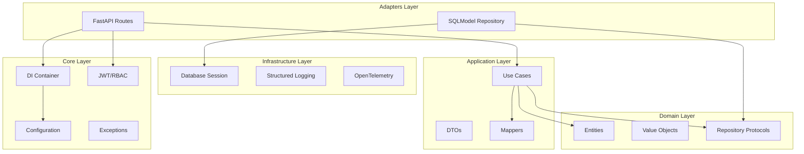

# Design Document: Python API Code Review 2025

## Overview

Este documento descreve o design para implementação das melhorias identificadas no code review da API Base Python. O objetivo é garantir conformidade com as melhores práticas de 2025, incluindo Clean Architecture, segurança OWASP, type safety, e padrões modernos de Python.

A API já possui uma estrutura sólida baseada em Clean Architecture com as seguintes camadas:
- **Domain**: Entidades, value objects, e interfaces de repositório
- **Application**: Use cases, DTOs, e mappers
- **Adapters**: API routes, repositórios concretos
- **Infrastructure**: Database, logging, observability
- **Shared**: Utilitários, patterns reutilizáveis

## Architecture



## Components and Interfaces

### Core Components

#### Configuration (core/config.py)
- `Settings`: Pydantic BaseSettings com nested configuration
- `DatabaseSettings`, `SecuritySettings`, `RedisSettings`, `ObservabilitySettings`
- Validadores para secret_key entropy, rate_limit format, CORS warnings

#### Exception Hierarchy (core/exceptions.py)
- `ErrorContext`: Dataclass imutável com correlation_id e timestamp
- `AppException`: Base exception com to_dict() para serialização
- Subclasses: `EntityNotFoundError`, `ValidationError`, `AuthenticationError`, etc.

#### DI Container (core/container.py)
- `Container`: DeclarativeContainer com providers para config, cache, CQRS
- `LifecycleManager`: Gerencia hooks de startup/shutdown

#### JWT Service (core/auth/jwt.py)
- `JWTService`: Criação e verificação de tokens
- `TokenPayload`: Dataclass com claims (sub, exp, iat, jti, scopes)
- Replay protection para refresh tokens

#### RBAC Service (core/auth/rbac.py)
- `Permission`: Enum com permissões padrão
- `Role`: Dataclass com permissions frozenset
- `RBACService`: Verificação de permissões

### Domain Components

#### Repository Protocol (domain/repositories/base.py)
- `RepositoryProtocol[T, ID]`: Interface async para CRUD
- `ReadOnlyRepositoryProtocol[T, ID]`: Interface somente leitura

### Shared Components

#### Result Pattern (shared/result.py)
- `Ok[T]`: Resultado de sucesso
- `Err[E]`: Resultado de erro
- Usa PEP 695 type parameter syntax

## Data Models

### Token Models
```python
@dataclass(frozen=True)
class TokenPayload:
    sub: str           # User ID
    exp: datetime      # Expiration
    iat: datetime      # Issued at
    jti: str           # JWT ID (ULID)
    scopes: tuple[str, ...]
    token_type: str    # "access" | "refresh"
```

### Error Models
```python
@dataclass(frozen=True)
class ErrorContext:
    correlation_id: str
    timestamp: datetime
    request_path: str | None
```

### Configuration Models
```python
class Settings(BaseSettings):
    app_name: str
    debug: bool
    version: str
    database: DatabaseSettings
    security: SecuritySettings
    redis: RedisSettings
    observability: ObservabilitySettings
```

## Correctness Properties

*A property is a characteristic or behavior that should hold true across all valid executions of a system-essentially, a formal statement about what the system should do. Properties serve as the bridge between human-readable specifications and machine-verifiable correctness guarantees.*

### Property 1: Domain Layer Independence
*For any* file in the domain layer, the file SHALL NOT import from adapters or infrastructure layers
**Validates: Requirements 1.2**

### Property 2: File Size Compliance
*For any* Python file in src/my_api, the file SHALL NOT exceed 400 lines of code
**Validates: Requirements 1.5**

### Property 3: Exception Serialization Consistency
*For any* AppException instance, calling to_dict() SHALL produce a dictionary containing keys: message, error_code, status_code, details, correlation_id, timestamp
**Validates: Requirements 3.1, 3.2**

### Property 4: JWT Required Claims
*For any* JWT token created by JWTService, the token SHALL contain claims: sub, exp, iat, jti
**Validates: Requirements 4.1**

### Property 5: Secret Key Entropy
*For any* secret_key provided to SecuritySettings, if length is less than 32 characters THEN validation SHALL fail
**Validates: Requirements 4.1**

### Property 6: Password Hash Format
*For any* password hashed by PasswordValidator, the hash SHALL start with "$argon2id$"
**Validates: Requirements 4.4**

### Property 7: CORS Wildcard Warning
*For any* SecuritySettings with "*" in cors_origins AND ENVIRONMENT="production", the System SHALL log a warning
**Validates: Requirements 4.5**

### Property 8: Security Headers Presence
*For any* HTTP response processed by SecurityHeadersMiddleware, the response SHALL contain headers: Content-Security-Policy, X-Content-Type-Options, X-Frame-Options
**Validates: Requirements 4.6**

### Property 9: Repository Pagination
*For any* call to repository.get_all() with skip and limit parameters, the returned sequence length SHALL NOT exceed limit
**Validates: Requirements 6.2**

### Property 10: Soft Delete Behavior
*For any* entity with is_deleted=True, calling repository.get_by_id() SHALL return None
**Validates: Requirements 6.3**

### Property 11: Lifecycle Hook Order
*For any* set of registered startup hooks [h1, h2, h3], run_startup() SHALL execute them in order h1, h2, h3
**Validates: Requirements 11.4**

### Property 12: Lifecycle Shutdown Reverse Order
*For any* set of registered shutdown hooks [h1, h2, h3], run_shutdown() SHALL execute them in order h3, h2, h1
**Validates: Requirements 11.4**

### Property 13: Configuration Caching
*For any* two calls to get_settings(), the returned objects SHALL be identical (same instance)
**Validates: Requirements 10.5**

### Property 14: SecretStr Redaction
*For any* SecretStr field, str() or repr() SHALL NOT reveal the secret value
**Validates: Requirements 10.2**

### Property 15: URL Credential Redaction
*For any* URL with credentials passed to redact_url_credentials(), the returned string SHALL NOT contain the original password
**Validates: Requirements 8.5**

### Property 16: Rate Limit Format Validation
*For any* rate_limit string not matching pattern "number/unit", SecuritySettings validation SHALL fail
**Validates: Requirements 4.3**

### Property 17: Validation Error Normalization
*For any* ValidationError created with dict errors, the errors SHALL be normalized to list format
**Validates: Requirements 3.1**

### Property 18: Result Pattern Unwrap Safety
*For any* Err result, calling unwrap() SHALL raise ValueError
**Validates: Requirements 3.3**

### Property 19: Token Expiration Check
*For any* expired JWT token, verify_token() SHALL raise TokenExpiredError
**Validates: Requirements 4.1**

### Property 20: Refresh Token Replay Protection
*For any* refresh token used twice, the second verify_refresh_token() call SHALL raise TokenRevokedError
**Validates: Requirements 4.1**

## Error Handling

### Exception Hierarchy
```
AppException (base)
├── EntityNotFoundError (404)
├── ValidationError (422)
├── BusinessRuleViolationError (400)
├── AuthenticationError (401)
│   ├── TokenExpiredError
│   ├── TokenInvalidError
│   └── TokenRevokedError
├── AuthorizationError (403)
├── RateLimitExceededError (429)
└── ConflictError (409)
```

### Error Response Format
```json
{
  "message": "Human-readable error message",
  "error_code": "MACHINE_READABLE_CODE",
  "status_code": 400,
  "details": {},
  "correlation_id": "01HXYZ...",
  "timestamp": "2025-11-30T12:00:00Z"
}
```

## Testing Strategy

### Dual Testing Approach

O projeto utiliza uma abordagem dual de testes:

1. **Unit Tests (pytest)**: Verificam exemplos específicos e edge cases
2. **Property-Based Tests (Hypothesis)**: Verificam propriedades universais

### Property-Based Testing Framework

- **Library**: Hypothesis (Python)
- **Minimum iterations**: 100 por propriedade
- **Configuration**: `@settings(max_examples=100)`

### Test Organization

```
tests/
├── unit/           # Unit tests por módulo
├── integration/    # Testes de integração
├── properties/     # Property-based tests
└── conftest.py     # Fixtures compartilhadas
```

### Property Test Annotation Format

Cada property test DEVE incluir comentário referenciando a propriedade:
```python
# **Feature: python-api-code-review-2025, Property 3: Exception Serialization Consistency**
# **Validates: Requirements 3.1, 3.2**
@given(st.text(), st.text(), st.integers(400, 599))
def test_exception_serialization_consistency(message, error_code, status_code):
    ...
```

### Key Test Scenarios

1. **Configuration Tests**
   - Secret key entropy validation
   - Rate limit format validation
   - CORS wildcard warning in production

2. **JWT Tests**
   - Token creation with required claims
   - Token expiration handling
   - Refresh token replay protection

3. **Exception Tests**
   - Serialization consistency
   - Error context preservation
   - Validation error normalization

4. **Repository Tests**
   - Pagination limits
   - Soft delete behavior
   - Bulk operations

5. **Lifecycle Tests**
   - Hook execution order
   - Error aggregation on shutdown

