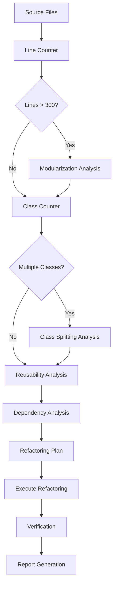

# Design Document

## Overview

This design document outlines the technical approach for a full RITE Framework (Role-Instruction-Task-Expectation) code review and refactoring of the entire codebase. The review focuses on:

1. File size modularization (300-line threshold)
2. One-class-per-file enforcement
3. Reusable logic extraction
4. Module cohesion and dependency management

The review uses AST-based static analysis combined with property-based testing to verify compliance across all modules.

## Architecture

### Review Scope

```
src/my_api/
├── domain/           # Business entities, value objects, repository interfaces
├── application/      # Use cases, DTOs, mappers
├── infrastructure/   # Database, external services, auth
├── adapters/         # API routes, repositories implementation
├── shared/           # Cross-cutting concerns, utilities (target for reusable logic)
├── core/             # Configuration, exceptions, container
└── cli/              # Command-line interface
```

### RITE Framework Pipeline



## Components and Interfaces

### Analyzer Components

| Component | Responsibility | Output |
|-----------|---------------|--------|
| `LineCounter` | Count total lines per file | Line counts, threshold violations |
| `ClassAnalyzer` | Detect class definitions per file | Class counts, multi-class files |
| `ImportAnalyzer` | Analyze import structure | Import graph, circular detection |
| `ReusabilityDetector` | Find duplicated patterns | Reusability candidates |
| `ModuleDocAnalyzer` | Check module documentation | Missing docstrings |

### Metric Thresholds

| Metric | Target | Maximum | Action |
|--------|--------|---------|--------|
| File lines | 300 | 400 | Modularize |
| Classes per file | 1 | 1 (exceptions documented) | Split |
| Module size after split | 150 | 200 | Target range |
| Shared utility coverage | - | - | Extract when 2+ usages |

### File Naming Conventions

| Type | Convention | Example |
|------|------------|---------|
| Class file | snake_case of class name | `user_service.py` for `UserService` |
| Utility module | descriptive_name | `string_helpers.py` |
| Package __init__ | exports public API | `from .user_service import UserService` |

## Data Models

### Analysis Result Structure

```python
from dataclasses import dataclass
from pathlib import Path
from enum import Enum

class ViolationType(Enum):
    FILE_TOO_LARGE = "file_too_large"
    MULTIPLE_CLASSES = "multiple_classes"
    MISSING_DOCSTRING = "missing_docstring"
    CIRCULAR_IMPORT = "circular_import"
    IMPORT_ORDER = "import_order"

@dataclass
class FileAnalysis:
    path: Path
    total_lines: int
    class_count: int
    class_names: list[str]
    has_module_docstring: bool
    violations: list[ViolationType]

@dataclass
class RefactoringReport:
    files_analyzed: int
    files_over_300: list[Path]
    files_over_400: list[Path]
    multi_class_files: list[Path]
    files_refactored: list[Path]
    new_modules_created: list[Path]
    reusable_logic_extracted: list[str]
```

## Correctness Properties

*A property is a characteristic or behavior that should hold true across all valid executions of a system-essentially, a formal statement about what the system should do. Properties serve as the bridge between human-readable specifications and machine-verifiable correctness guarantees.*

### Property 1: File Size Hard Limit Compliance

*For any* Python file in the codebase, the file should contain 400 lines or fewer.

**Validates: Requirements 1.3**

### Property 2: File Size Soft Limit Tracking

*For any* Python file in the codebase exceeding 300 lines, the file should be documented in the refactoring report or have a documented exception.

**Validates: Requirements 1.2**

### Property 3: One-Class-Per-File Compliance

*For any* Python file in the codebase containing multiple class definitions, the total lines of all classes should be under 50 (exception rule) or the file should be flagged for splitting.

**Validates: Requirements 2.1, 2.5**

### Property 4: Class File Naming Convention

*For any* Python file containing a single class, the file name should match the snake_case version of the class name.

**Validates: Requirements 2.3**

### Property 5: Import Functionality

*For any* module in the codebase, importing that module should not raise an ImportError.

**Validates: Requirements 1.5, 2.4, 5.1**

### Property 6: No Circular Imports

*For any* module in the codebase, importing that module should not raise an ImportError due to circular dependencies.

**Validates: Requirements 5.3**

### Property 7: Import Ordering Compliance

*For any* Python file in the codebase, imports should follow stdlib, third-party, local ordering.

**Validates: Requirements 5.4**

### Property 8: Module Documentation

*For any* Python module in the codebase (non-__init__ files), a module-level docstring should exist.

**Validates: Requirements 4.5, 3.5**

### Property 9: Shared Utility Documentation

*For any* module in the shared/ directory, all public functions should have docstrings with usage examples.

**Validates: Requirements 3.5**

### Property 10: Linting Compliance

*For any* Python file in the codebase, running ruff check should produce no errors.

**Validates: Requirements 1.6, 6.1**

## Error Handling

### Analysis Errors

| Error Type | Handling Strategy |
|-----------|-------------------|
| Parse errors | Log and skip file, continue analysis |
| Permission errors | Log warning, skip file |
| Encoding errors | Try UTF-8, fallback to latin-1 |

### Refactoring Errors

| Error Type | Handling Strategy |
|-----------|-------------------|
| Import resolution failure | Rollback changes, document issue |
| Test failure after refactor | Rollback changes, investigate |
| Circular dependency introduced | Rollback, redesign module boundaries |

## Testing Strategy

### Dual Testing Approach

- **Property-based tests**: Verify code structure properties across all files
- **Unit tests**: Verify analyzer components work correctly

### Property-Based Testing Framework

- **Library**: Hypothesis (Python)
- **Minimum iterations**: 100 per property
- **Test location**: `tests/properties/test_rite_framework_properties.py`

### Property Test Specifications

```python
@pytest.mark.parametrize("file_path", ALL_PYTHON_FILES)
def test_file_size_hard_limit(file_path: Path) -> None:
    """
    **Feature: rite-framework-refactoring, Property 1: File Size Hard Limit Compliance**
    **Validates: Requirements 1.3**
    """
    content = file_path.read_text(encoding="utf-8")
    line_count = len(content.splitlines())
    assert line_count <= 400, f"{file_path.name} has {line_count} lines (max 400)"
```

### Verification Commands

```bash
# Run RITE framework property tests
pytest tests/properties/test_rite_framework_properties.py -v

# Run linting
ruff check src/my_api

# Run all tests
pytest tests/ -v

# Check for circular imports
python -c "import my_api"
```

### Existing Tool Integration

The review leverages existing tools:
- **ruff**: Linting, formatting, and import sorting
- **pytest**: Test execution
- **ast**: Python AST parsing for analysis

