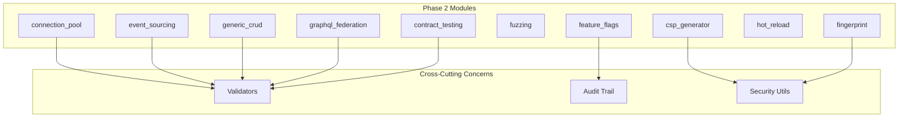

# Design Document

## Overview

Este documento descreve o design para refatoração dos módulos compartilhados da fase 2 em `src/my_api/shared/`. O objetivo é corrigir problemas críticos de segurança, melhorar a confiabilidade, e garantir conformidade com boas práticas Python modernas.

## Architecture



## Components and Interfaces

### 1. Enhanced Connection Pool

```python
from typing import Protocol, TypeVar
from dataclasses import dataclass
import asyncio

T = TypeVar("T")

@dataclass(frozen=True)
class PoolInvariant:
    """Invariant: idle + in_use + unhealthy == total"""
    idle: int
    in_use: int
    unhealthy: int
    total: int
    
    def is_valid(self) -> bool:
        return self.idle + self.in_use + self.unhealthy == self.total

class EnhancedConnectionPool(Generic[T]):
    """Connection pool with guaranteed counter consistency."""
    
    async def _transition_state(
        self,
        conn_id: str,
        from_state: ConnectionState,
        to_state: ConnectionState,
    ) -> None:
        """Atomically transition connection state and update counters."""
        async with self._lock:
            # Decrement source counter
            # Increment destination counter
            # Update connection state
            pass
```

### 2. CSP Generator with Validation

```python
from typing import Protocol
import secrets

class NonceGenerator(Protocol):
    """Protocol for nonce generation."""
    
    def generate(self) -> str: ...
    def validate(self, nonce: str) -> bool: ...

class SecureNonceGenerator:
    """Cryptographically secure nonce generator."""
    
    def __init__(self, min_bytes: int = 16) -> None:
        self._min_bytes = min_bytes
    
    def generate(self) -> str:
        return secrets.token_urlsafe(self._min_bytes)
```

### 3. Event Store with Snapshot Validation

```python
from typing import Protocol
import hashlib

class SnapshotValidator(Protocol):
    """Protocol for snapshot validation."""
    
    def compute_hash(self, state: dict) -> str: ...
    def validate(self, snapshot: Snapshot, expected_hash: str) -> bool: ...

@dataclass
class ValidatedSnapshot(Generic[AggregateT]):
    """Snapshot with integrity hash."""
    
    aggregate_id: str
    aggregate_type: str
    version: int
    state: dict[str, Any]
    state_hash: str  # NEW: SHA-256 of serialized state
    created_at: datetime
    
    @classmethod
    def from_aggregate(cls, aggregate: Aggregate) -> "ValidatedSnapshot":
        state = aggregate.to_snapshot_state()
        state_hash = hashlib.sha256(
            json.dumps(state, sort_keys=True).encode()
        ).hexdigest()
        return cls(
            aggregate_id=str(aggregate.id),
            aggregate_type=aggregate.__class__.__name__,
            version=aggregate.version,
            state=state,
            state_hash=state_hash,
        )
```

### 4. Feature Flag with Audit Trail

```python
from typing import Protocol
from dataclasses import dataclass
from datetime import datetime

@dataclass(frozen=True)
class FlagAuditEvent:
    """Audit event for flag changes."""
    
    flag_key: str
    action: str  # "enabled", "disabled", "modified", "evaluated"
    actor: str | None
    timestamp: datetime
    old_value: Any
    new_value: Any
    context: dict[str, Any]

class AuditableFeatureFlagService(FeatureFlagService):
    """Feature flag service with audit trail."""
    
    def __init__(self, audit_logger: AuditLogger | None = None) -> None:
        super().__init__()
        self._audit_logger = audit_logger
        self._audit_events: list[FlagAuditEvent] = []
```

### 5. Fingerprint with Privacy Controls

```python
@dataclass
class PrivacyConfig:
    """Privacy configuration for fingerprinting."""
    
    excluded_components: set[FingerprintComponent] = field(default_factory=set)
    hash_ip_address: bool = True  # Hash instead of store raw
    ttl_seconds: int = 86400  # 24 hours default
    anonymize_after: int = 3600  # Anonymize after 1 hour
```

### 6. Fuzzing with Crash Deduplication

```python
@dataclass
class CrashSignature:
    """Unique signature for crash deduplication."""
    
    error_type: str
    stack_hash: str  # Hash of normalized stack trace
    input_hash: str
    
    @classmethod
    def from_crash(cls, crash: CrashInfo) -> "CrashSignature":
        # Normalize stack trace (remove line numbers, memory addresses)
        normalized_stack = cls._normalize_stack(crash.stack_trace)
        stack_hash = hashlib.sha256(normalized_stack.encode()).hexdigest()[:16]
        return cls(
            error_type=crash.crash_type.value,
            stack_hash=stack_hash,
            input_hash=crash.input_data.hash[:16],
        )
```

### 7. Generic CRUD with Input Validation

```python
class ValidatedGenericEndpoints(GenericEndpoints):
    """Generic endpoints with input validation."""
    
    def __init__(self, *args, allowed_filter_fields: set[str] | None = None, **kwargs):
        super().__init__(*args, **kwargs)
        self._allowed_filter_fields = allowed_filter_fields or self._get_model_fields()
    
    def _validate_filter_field(self, field: str) -> bool:
        """Validate filter field against allowed fields."""
        return field in self._allowed_filter_fields
```

### 8. GraphQL Federation with Validation

```python
class ValidatedFederatedSchema(FederatedSchema):
    """Federated schema with comprehensive validation."""
    
    def validate(self) -> list[str]:
        """Validate schema and return ALL errors."""
        errors: list[str] = []
        errors.extend(self._validate_key_fields())
        errors.extend(self._validate_requires_external())
        errors.extend(self._validate_provides_fields())
        return errors
```

## Data Models

### Enhanced PoolStats

```python
@dataclass
class EnhancedPoolStats(PoolStats):
    """Pool statistics with invariant validation."""
    
    def validate_invariant(self) -> bool:
        """Validate that counters are consistent."""
        return (
            self.idle_connections + 
            self.in_use_connections + 
            self.unhealthy_connections
        ) == self.total_connections
```

### Enhanced CrashInfo

```python
@dataclass
class EnhancedCrashInfo(CrashInfo):
    """Crash info with deduplication support."""
    
    signature: CrashSignature | None = None
    occurrence_count: int = 1
    first_seen: datetime = field(default_factory=datetime.now)
    last_seen: datetime = field(default_factory=datetime.now)
```

### Enhanced FlagEvaluation

```python
@dataclass
class EnhancedFlagEvaluation(FlagEvaluation):
    """Flag evaluation with audit support."""
    
    evaluation_id: str = field(default_factory=lambda: str(uuid4()))
    evaluated_at: datetime = field(default_factory=lambda: datetime.now(timezone.utc))
    context_hash: str | None = None  # Hash of evaluation context
```

## Correctness Properties

*A property is a characteristic or behavior that should hold true across all valid executions of a system-essentially, a formal statement about what the system should do. Properties serve as the bridge between human-readable specifications and machine-verifiable correctness guarantees.*

### Property 1: Pool Counter Invariant
*For any* connection pool state, the sum of idle_connections, in_use_connections, and unhealthy_connections SHALL equal total_connections.
**Validates: Requirements 2.3**

### Property 2: Connection Lifetime Enforcement
*For any* connection that exceeds max_lifetime, the pool SHALL remove and destroy it within one health check interval.
**Validates: Requirements 1.1**

### Property 3: Pool Closure Completeness
*For any* pool closure operation, all connection destructions SHALL complete before the close() method returns.
**Validates: Requirements 1.2**

### Property 4: State Transition Counter Consistency
*For any* connection state transition, exactly one source counter SHALL be decremented and exactly one destination counter SHALL be incremented.
**Validates: Requirements 2.2**

### Property 5: Nonce Uniqueness
*For any* sequence of nonce generations for the same route, all generated nonces SHALL be unique.
**Validates: Requirements 3.2**

### Property 6: Nonce Entropy
*For any* generated nonce, the decoded value SHALL have at least 16 bytes of entropy.
**Validates: Requirements 3.1**

### Property 7: CSP Header Determinism
*For any* CSP policy, converting to header value multiple times SHALL produce identical strings.
**Validates: Requirements 4.3**

### Property 8: Event Store Optimistic Locking
*For any* concurrent save operations on the same aggregate, at most one SHALL succeed and others SHALL raise ConcurrencyError.
**Validates: Requirements 5.1**

### Property 9: ConcurrencyError Message Content
*For any* ConcurrencyError raised, the error message SHALL contain both expected and actual version numbers.
**Validates: Requirements 5.2**

### Property 10: Snapshot Hash Integrity
*For any* snapshot created from an aggregate, the state_hash SHALL match the SHA-256 of the serialized state.
**Validates: Requirements 6.1**

### Property 11: Snapshot Validation Detection
*For any* snapshot with corrupted state_hash, loading SHALL detect the corruption and fall back to event replay.
**Validates: Requirements 6.2, 6.3**

### Property 12: Percentage Rollout Consistency
*For any* user_id and flag_key combination, evaluating the same percentage rollout multiple times SHALL return the same result.
**Validates: Requirements 7.1**

### Property 13: Rollout Monotonicity
*For any* user in a percentage rollout, increasing the percentage SHALL NOT remove them from the rollout.
**Validates: Requirements 7.2**

### Property 14: Audit Event Emission
*For any* flag modification (enable, disable, update), an audit event SHALL be emitted with correct action type.
**Validates: Requirements 8.1**

### Property 15: Fingerprint Component Exclusion
*For any* fingerprint generated with excluded components, the resulting fingerprint SHALL NOT contain those components.
**Validates: Requirements 9.1**

### Property 16: Fingerprint Validity Without IP
*For any* fingerprint generated with IP excluded, the fingerprint SHALL still be valid and have non-empty hash.
**Validates: Requirements 9.2**

### Property 17: Fingerprint Hash Algorithm
*For any* fingerprint, the hash_value SHALL be computed using SHA-256 algorithm.
**Validates: Requirements 10.1**

### Property 18: Low Confidence Indication
*For any* fingerprint with confidence below 0.5, the result SHALL indicate reduced reliability.
**Validates: Requirements 10.3**

### Property 19: Fuzzing Config Validation
*For any* FuzzingConfig with max_input_size < min_input_size, validation SHALL fail with descriptive error.
**Validates: Requirements 11.1, 11.3**

### Property 20: Fuzzing Directory Creation
*For any* Fuzzer initialized with non-existent corpus_dir or crashes_dir, the directories SHALL be created.
**Validates: Requirements 11.2**

### Property 21: Crash Signature Uniqueness
*For any* two crashes with different error types or stack traces, their signatures SHALL be different.
**Validates: Requirements 12.1**

### Property 22: Duplicate Crash Counting
*For any* duplicate crash added to CrashManager, the occurrence_count SHALL increment instead of creating new entry.
**Validates: Requirements 12.2**

### Property 23: Filter Field Validation
*For any* filter parameter with field not in model, the GenericEndpoints SHALL reject it with 400 status.
**Validates: Requirements 13.1, 13.2**

### Property 24: Malformed JSON Handling
*For any* malformed JSON in filter parameter, the GenericEndpoints SHALL return 400 Bad Request.
**Validates: Requirements 13.3**

### Property 25: Pagination Cap Enforcement
*For any* per_page value exceeding 100, the GenericEndpoints SHALL cap it at 100.
**Validates: Requirements 14.1**

### Property 26: Federation Key Field Validation
*For any* entity with @key directive, the FederatedSchema SHALL verify all key fields exist in the entity.
**Validates: Requirements 15.1**

### Property 27: Federation Requires External Validation
*For any* field with @requires directive, the FederatedSchema SHALL verify referenced fields are @external.
**Validates: Requirements 15.2**

### Property 28: Federation All Errors Returned
*For any* schema with multiple validation errors, validate() SHALL return all errors, not just the first.
**Validates: Requirements 15.3**

### Property 29: Entity Resolution Validation
*For any* entity resolution request with invalid representation format, the FederatedSchema SHALL return validation error.
**Validates: Requirements 16.1**

### Property 30: Missing Resolver Error
*For any* entity resolution request without registered resolver, the FederatedSchema SHALL return clear error message.
**Validates: Requirements 16.2**

### Property 31: Hot Reload State Preservation
*For any* failed reload operation, the previous working module state SHALL be preserved.
**Validates: Requirements 17.2**

### Property 32: Syntax Error Handling
*For any* module with syntax errors, the ModuleReloader SHALL skip it and log the error.
**Validates: Requirements 17.3**

### Property 33: Dependency Cascade Reload
*For any* reloaded module with dependents, all dependent modules SHALL also be reloaded.
**Validates: Requirements 18.1**

### Property 34: Circular Dependency Termination
*For any* module graph with circular dependencies, the ModuleReloader SHALL terminate without infinite loop.
**Validates: Requirements 18.2**

### Property 35: Nested Field Path Validation
*For any* contract with nested field matchers (e.g., "data.user.name"), the ContractTester SHALL correctly validate nested values.
**Validates: Requirements 19.1**

### Property 36: Array Index Access
*For any* contract with array index matchers (e.g., "items.0.id"), the ContractTester SHALL correctly access array elements.
**Validates: Requirements 19.2**

### Property 37: OpenAPI Path Parameter Matching
*For any* OpenAPI spec with path parameters, the OpenAPIContractValidator SHALL correctly match actual paths.
**Validates: Requirements 20.2**

## Error Handling

### Exception Hierarchy

```python
class Phase2ModuleError(Exception):
    """Base exception for phase 2 modules."""
    pass

class PoolInvariantViolation(Phase2ModuleError):
    """Pool counter invariant violated."""
    def __init__(self, stats: PoolStats):
        self.stats = stats
        super().__init__(f"Invariant violated: {stats}")

class SnapshotIntegrityError(Phase2ModuleError):
    """Snapshot integrity check failed."""
    def __init__(self, expected_hash: str, actual_hash: str):
        self.expected_hash = expected_hash
        self.actual_hash = actual_hash
        super().__init__(f"Hash mismatch: expected {expected_hash}, got {actual_hash}")

class FilterValidationError(Phase2ModuleError):
    """Filter field validation failed."""
    def __init__(self, field: str, allowed: set[str]):
        self.field = field
        self.allowed = allowed
        super().__init__(f"Invalid filter field '{field}'. Allowed: {allowed}")

class FederationValidationError(Phase2ModuleError):
    """Federation schema validation failed."""
    def __init__(self, errors: list[str]):
        self.errors = errors
        super().__init__(f"Validation failed with {len(errors)} errors")
```

### Error Handling Strategy

| Error Type | Strategy | Action |
|------------|----------|--------|
| `PoolInvariantViolation` | Log and recover | Reset counters from actual state |
| `SnapshotIntegrityError` | Fallback | Replay all events |
| `FilterValidationError` | Fail fast | Return 400 Bad Request |
| `FederationValidationError` | Fail fast | Return all errors |
| `ConcurrencyError` | Retry | Reload and retry operation |

## Testing Strategy

### Dual Testing Approach

#### Unit Tests
- Test individual components in isolation
- Mock external dependencies
- Cover edge cases and error conditions
- Use pytest fixtures for common setup

#### Property-Based Tests
- Use `hypothesis` library for property-based testing
- Configure minimum 100 iterations per property
- Test invariants across random inputs
- Focus on concurrent behavior verification

### Property-Based Testing Framework

```python
from hypothesis import given, strategies as st, settings
import asyncio

@settings(max_examples=100)
@given(
    idle=st.integers(min_value=0, max_value=100),
    in_use=st.integers(min_value=0, max_value=100),
    unhealthy=st.integers(min_value=0, max_value=100),
)
def test_pool_counter_invariant(idle: int, in_use: int, unhealthy: int):
    """
    **Feature: shared-modules-phase2, Property 1: Pool Counter Invariant**
    **Validates: Requirements 2.3**
    """
    total = idle + in_use + unhealthy
    stats = PoolStats(
        total_connections=total,
        idle_connections=idle,
        in_use_connections=in_use,
        unhealthy_connections=unhealthy,
    )
    assert stats.idle_connections + stats.in_use_connections + stats.unhealthy_connections == stats.total_connections
```

### Test Categories

1. **Invariant Tests**: Verify counter consistency, hash integrity
2. **Concurrency Tests**: Verify race condition prevention
3. **Validation Tests**: Verify input validation
4. **Security Tests**: Verify nonce uniqueness, hash algorithms
5. **Integration Tests**: Verify component interaction

