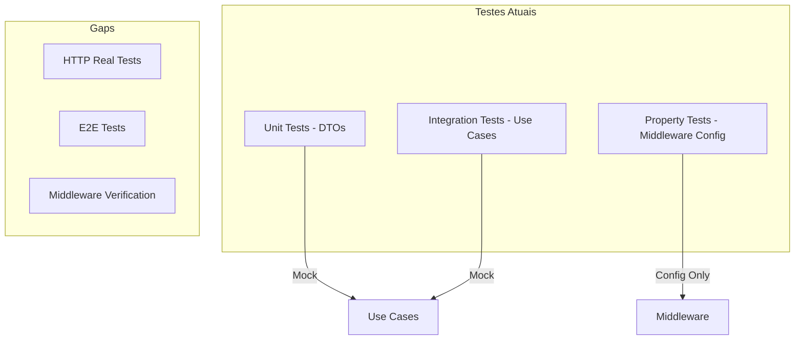
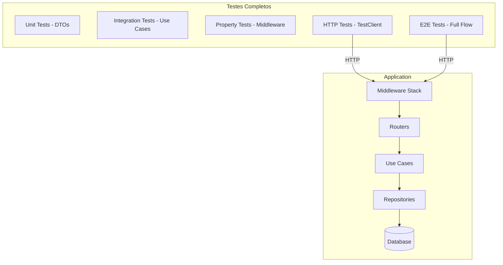

# Design Document: Interface Improvements

## Overview

Este documento detalha o design para implementação de testes HTTP reais, verificação de middlewares, e testes E2E para ItemExample e PedidoExample. O objetivo é aumentar a confiança no código através de testes que exercitam o fluxo completo da aplicação.

## Architecture

### Arquitetura de Testes Atual



### Arquitetura de Testes Proposta



## Components and Interfaces

### 1. HTTP Test Infrastructure

#### 1.1 Test Client Factory

```python
@pytest.fixture
def client() -> Generator[TestClient, None, None]:
    """Create test client with lifespan management."""
    with TestClient(app, raise_server_exceptions=False) as client:
        yield client
```

#### 1.2 Async Test Client Factory

```python
@pytest.fixture
async def async_client() -> AsyncGenerator[AsyncClient, None]:
    """Create async test client for concurrent tests."""
    async with AsyncClient(
        transport=ASGITransport(app=app),
        base_url="http://test"
    ) as client:
        yield client
```

### 2. Test Fixtures

#### 2.1 Authentication Headers

```python
@pytest.fixture
def admin_headers() -> dict[str, str]:
    return {
        "X-User-Id": "test-admin",
        "X-User-Roles": "admin",
        "X-Tenant-Id": "test-tenant",
    }

@pytest.fixture
def viewer_headers() -> dict[str, str]:
    return {
        "X-User-Id": "test-viewer",
        "X-User-Roles": "viewer",
    }
```

#### 2.2 Test Data Factories

```python
@pytest.fixture
def item_data() -> dict[str, Any]:
    return {
        "name": "Test Item",
        "sku": f"SKU-{uuid4().hex[:8]}",
        "price": {"amount": "99.99", "currency": "BRL"},
        "quantity": 10,
        "category": "electronics",
    }

@pytest.fixture
def pedido_data() -> dict[str, Any]:
    return {
        "customer_id": f"cust-{uuid4().hex[:8]}",
        "customer_name": "Test Customer",
        "customer_email": "test@example.com",
        "shipping_address": "123 Test St",
    }
```

## Data Models

### Test Response Models

```python
class ItemListResponse(BaseModel):
    items: list[ItemExampleResponse]
    total: int
    page: int
    size: int

class ErrorResponse(BaseModel):
    detail: str
    status_code: int
```

## Correctness Properties

*A property is a characteristic or behavior that should hold true across all valid executions of a system-essentially, a formal statement about what the system should do. Properties serve as the bridge between human-readable specifications and machine-verifiable correctness guarantees.*

### Property 1: Response Headers Present
*For any* HTTP request to the API, the response SHALL contain X-Request-ID header with a valid UUID AND security headers (X-Frame-Options, X-Content-Type-Options).
**Validates: Requirements 3.1, 3.2**

### Property 2: Pagination Structure Consistency
*For any* GET request to /api/v1/examples/items or /api/v1/examples/pedidos, the response SHALL contain items array, total count, page number, and size fields with status 200.
**Validates: Requirements 1.1, 2.1**

### Property 3: RBAC Enforcement on Write Operations
*For any* POST, PUT, or DELETE request to /api/v1/examples/* without admin/editor/user role, the API SHALL return 403 Forbidden status.
**Validates: Requirements 1.3, 1.5**

### Property 4: Create-Read Round Trip
*For any* valid ItemExample or PedidoExample creation with proper authorization, creating the entity and reading it by ID SHALL return equivalent data.
**Validates: Requirements 1.2, 2.2**

### Property 5: Tenant Isolation
*For any* request with X-Tenant-Id header to /api/v1/examples/pedidos, the response SHALL only contain pedidos belonging to that tenant.
**Validates: Requirements 2.5**

### Property 6: Concurrent Request Handling
*For any* set of concurrent requests to the API, the System SHALL handle them without data corruption or race conditions.
**Validates: Requirements 4.4**

## Error Handling

### HTTP Error Responses

| Status | Scenario | Response |
|--------|----------|----------|
| 400 | Invalid request body | `{"detail": "Validation error", "errors": [...]}` |
| 403 | Missing permission | `{"detail": "Permission 'write' required"}` |
| 404 | Entity not found | `{"detail": "ItemExample item-123 not found"}` |
| 413 | Request too large | `{"detail": "Request body too large"}` |
| 429 | Rate limit exceeded | `{"detail": "Rate limit exceeded", "retry_after": 60}` |

## Testing Strategy

### Dual Testing Approach

#### Unit Tests
- Testar DTOs e validações isoladamente
- Testar mappers e conversões
- Testar error handling

#### Property-Based Tests
- Usar Hypothesis para gerar inputs
- Mínimo 100 iterações por propriedade
- Testar invariantes de API

### Test Framework

- **Framework**: pytest + pytest-asyncio
- **Property Testing**: Hypothesis
- **HTTP Client**: TestClient (sync) + AsyncClient (async)
- **Database**: SQLite in-memory para testes rápidos

### Test Organization

```
tests/
├── e2e/
│   └── examples/
│       ├── test_item_lifecycle.py
│       └── test_pedido_lifecycle.py
├── integration/
│   └── interface/
│       ├── test_items_http_real.py
│       ├── test_pedidos_http_real.py
│       └── test_middleware_http.py
└── properties/
    └── test_http_properties.py
```

### Property Test Annotations

```python
# **Feature: src-interface-improvements, Property 1: HTTP Response Contains Request ID**
# **Validates: Requirements 3.1**
@given(...)
@settings(max_examples=100)
def test_response_contains_request_id(self, ...):
    ...
```

