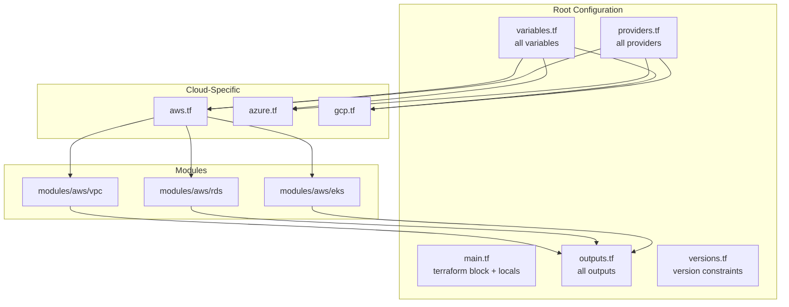

# Design Document: Terraform Infrastructure Refactoring

## Overview

Este documento descreve o design para refatoração da infraestrutura Terraform do projeto my-api. A refatoração visa eliminar problemas de segurança, duplicações de código e melhorar a manutenibilidade seguindo as melhores práticas de Infrastructure as Code.

A abordagem é incremental, priorizando correções de segurança, seguidas de consolidação estrutural e otimizações.

## Architecture

### Estrutura de Arquivos Atual vs Proposta

```
terraform/                          terraform/
├── main.tf (vars+outputs+config)   ├── main.tf (terraform block + locals)
├── variables.tf (duplicadas)       ├── variables.tf (ÚNICA fonte)
├── outputs.tf (duplicados)         ├── outputs.tf (ÚNICA fonte)
├── aws.tf (vars duplicadas)        ├── providers.tf (NOVO - todos providers)
├── azure.tf (vars duplicadas)      ├── versions.tf (NOVO - constraints)
├── gcp.tf (vars duplicadas)        ├── aws.tf (apenas recursos AWS)
├── environments/                   ├── azure.tf (apenas recursos Azure)
│   ├── dev.tfvars                  ├── gcp.tf (apenas recursos GCP)
│   └── prod.tfvars                 ├── backend.hcl.example (NOVO)
└── modules/                        ├── environments/
    └── aws/vpc/main.tf             │   ├── dev.tfvars
                                    │   ├── staging.tfvars (NOVO)
                                    │   └── prod.tfvars
                                    └── modules/
                                        └── aws/vpc/
                                            ├── main.tf
                                            ├── variables.tf (NOVO)
                                            ├── outputs.tf (NOVO)
                                            ├── versions.tf (NOVO)
                                            └── README.md (NOVO)
```

### Diagrama de Dependências



## Components and Interfaces

### 1. Variables Consolidation (variables.tf)

Todas as variáveis serão centralizadas em `variables.tf` com validações apropriadas:

```hcl
# Estrutura de variável com validação
variable "db_username" {
  description = "Database admin username"
  type        = string
  sensitive   = true

  validation {
    condition     = can(regex("^[a-zA-Z][a-zA-Z0-9_]{2,15}$", var.db_username))
    error_message = "Username must start with letter, 3-16 chars, alphanumeric and underscore only."
  }
}
```

### 2. Providers Configuration (providers.tf)

Providers isolados com configuração segura para multi-cloud:

```hcl
# Provider com tratamento de erro para outputs condicionais
provider "kubernetes" {
  host                   = try(module.aws_eks[0].endpoint, "")
  cluster_ca_certificate = try(base64decode(module.aws_eks[0].cluster_ca_certificate), "")
  # ...
}
```

### 3. Backend Configuration (backend.hcl.example)

Template para configuração de backend por ambiente:

```hcl
# backend.hcl.example
bucket         = "BUCKET_NAME"
key            = "ENV/terraform.tfstate"
region         = "REGION"
dynamodb_table = "LOCK_TABLE"
```

### 4. Module Interface Pattern

Cada módulo seguirá a estrutura:

| Arquivo | Conteúdo |
|---------|----------|
| main.tf | Resources e data sources |
| variables.tf | Input variables com validações |
| outputs.tf | Output values |
| versions.tf | Required providers e versions |
| README.md | Documentação e exemplos |

## Data Models

### Variable Categories

| Categoria | Variáveis | Sensitive |
|-----------|-----------|-----------|
| Environment | environment, app_name | No |
| Cloud Selection | cloud_provider, region | No |
| Compute | k8s_node_count, k8s_node_size | No |
| Database | db_instance_class, db_username, db_password | Yes (credentials) |
| Cache | redis_node_type | No |
| Provider-Specific | gcp_project_id, azure_subscription_id, azure_tenant_id | No |
| Deployment | image_tag, image_repository | No |
| Cost Optimization | single_nat_gateway | No |

### Output Categories

| Categoria | Outputs | Sensitive |
|-----------|---------|-----------|
| Endpoints | database_endpoint, redis_endpoint | Yes |
| Kubernetes | kubernetes_endpoint, kubernetes_cluster_name | No |
| Metadata | environment, cloud_provider, region | No |

## Correctness Properties

*A property is a characteristic or behavior that should hold true across all valid executions of a system-essentially, a formal statement about what the system should do. Properties serve as the bridge between human-readable specifications and machine-verifiable correctness guarantees.*

### Property 1: Variable Declaration Uniqueness
*For any* variable name in the Terraform configuration, parsing all .tf files SHALL yield exactly one declaration of that variable.
**Validates: Requirements 1.1**

### Property 2: Output Declaration Uniqueness
*For any* output name in the Terraform configuration, parsing all .tf files SHALL yield exactly one declaration of that output.
**Validates: Requirements 1.2**

### Property 3: No Hardcoded Credentials
*For any* .tf file in the configuration, scanning for patterns matching `username = "`, `password = "`, `api_key = "`, `secret = "` with literal string values SHALL return zero matches.
**Validates: Requirements 2.1**

### Property 4: Database Credential Variables Are Sensitive
*For any* variable with name containing "password", "secret", or "credential" in database-related modules, the variable definition SHALL include `sensitive = true`.
**Validates: Requirements 2.2**

### Property 5: Sensitive Outputs Marked Correctly
*For any* output with name containing "endpoint", "password", "secret", or "key" that exposes infrastructure connection details, the output definition SHALL include `sensitive = true`.
**Validates: Requirements 2.3**

### Property 6: Backend Contains No Hardcoded Environment Values
*For any* backend block in the Terraform configuration, the block SHALL NOT contain literal values for bucket, key, region, or dynamodb_table attributes.
**Validates: Requirements 3.2**

### Property 7: Cloud-Specific Variable Validation
*For any* cloud-provider-specific variable (gcp_project_id when cloud_provider="gcp", azure_subscription_id when cloud_provider="azure"), the configuration SHALL include validation ensuring non-empty values when that provider is selected.
**Validates: Requirements 4.3**

### Property 8: NAT Gateway Count Correctness
*For any* VPC module configuration, when single_nat_gateway is true the NAT Gateway count SHALL equal 1, and when single_nat_gateway is false the count SHALL equal the number of availability zones.
**Validates: Requirements 5.3, 5.4**

### Property 9: Module Structure Completeness
*For any* module directory under terraform/modules/, the directory SHALL contain at minimum: main.tf, variables.tf, outputs.tf, versions.tf, and README.md files.
**Validates: Requirements 6.1, 6.2, 6.3**

### Property 10: Safe Conditional Module Access
*For any* output or provider configuration that accesses module outputs conditionally, the access SHALL use try() or coalesce() functions to handle cases where the module is not instantiated.
**Validates: Requirements 7.2**

### Property 11: No Latest Image Tags
*For any* helm_release resource or container image configuration, the image tag SHALL reference a variable or specific version, never the literal string "latest".
**Validates: Requirements 8.1**

## Error Handling

### Validation Errors

| Scenario | Error Message | Resolution |
|----------|---------------|------------|
| Invalid region | "Region must be a valid AWS, GCP, or Azure region" | Provide valid region code |
| Invalid db_username | "Username must start with letter, 3-16 chars" | Fix username format |
| Missing GCP project | "gcp_project_id is required when cloud_provider is gcp" | Set gcp_project_id |
| Missing Azure subscription | "azure_subscription_id is required when cloud_provider is azure" | Set azure_subscription_id |
| Missing image_tag | "image_tag is required for deployment" | Provide specific image tag |

### Runtime Errors

| Scenario | Handling |
|----------|----------|
| Module not instantiated | try() returns default value |
| Backend not configured | terraform init fails with clear message |
| Provider auth missing | Provider-specific error with documentation link |

## Testing Strategy

### Dual Testing Approach

A estratégia de testes combina:
1. **Property-Based Tests**: Verificam propriedades universais que devem valer para toda a configuração
2. **Unit Tests**: Verificam exemplos específicos e edge cases

### Property-Based Testing Framework

**Framework**: [Hypothesis](https://hypothesis.readthedocs.io/) com pytest para Python
**Rationale**: Hypothesis é o padrão de facto para PBT em Python, com excelente suporte para geração de dados e shrinking.

### Test Structure

```
tests/
└── properties/
    └── test_terraform_properties.py  # Property-based tests
```

### Property Test Implementation Pattern

Cada property-based test DEVE:
1. Ser anotado com o número da propriedade do design document
2. Usar o formato: `**Feature: terraform-infrastructure-refactoring, Property {N}: {description}**`
3. Executar no mínimo 100 iterações
4. Usar generators que produzem inputs válidos para o domínio

### Test Categories

| Categoria | Tipo | Descrição |
|-----------|------|-----------|
| Structure Validation | Property | Verifica estrutura de arquivos e declarações |
| Security Scanning | Property | Detecta credenciais hardcoded |
| Configuration Validation | Example | Verifica terraform validate passa |
| Module Completeness | Property | Verifica estrutura de módulos |

### Example Test Annotations

```python
def test_variable_uniqueness():
    """
    **Feature: terraform-infrastructure-refactoring, Property 1: Variable Declaration Uniqueness**
    **Validates: Requirements 1.1**
    
    For any variable name, there should be exactly one declaration across all .tf files.
    """
    # Implementation
```

