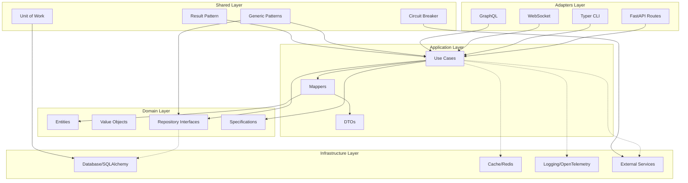
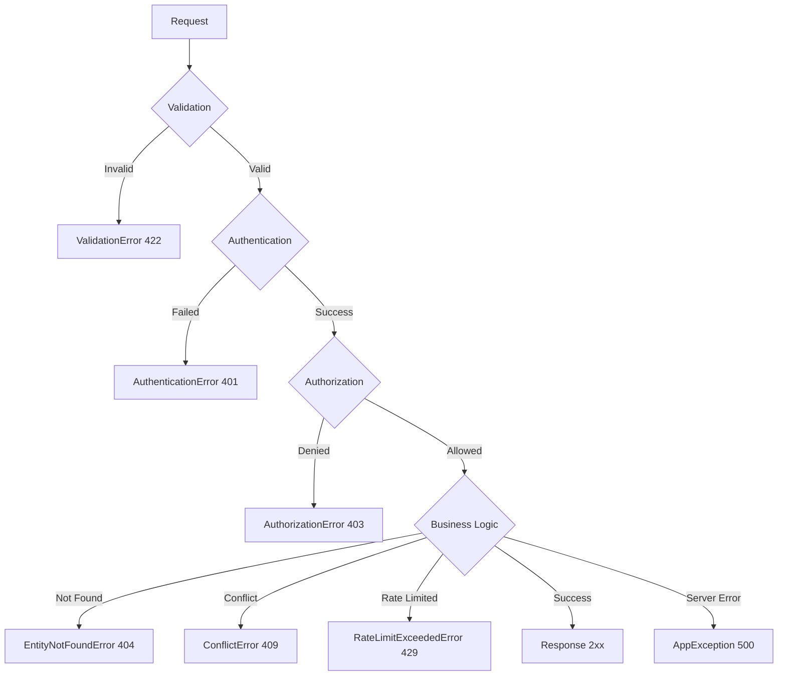

# Design Document: Ultimate API Base 2025

## Overview

Este design document define a arquitetura e implementação da **Melhor API Base Python de 2025**. O projeto utiliza Clean Architecture com DDD, generics PEP 695, segurança OWASP 2023, e property-based testing com Hypothesis.

A arquitetura segue o princípio de que **business logic não deve depender de infraestrutura**, permitindo que entidades, use cases e regras de negócio funcionem independentemente de frameworks, bancos de dados ou serviços externos.

### Status de Conformidade (Verificado 30/11/2025)

| Categoria | Status | Detalhes |
|-----------|--------|----------|
| PEP 695 Generics | ✅ 100% | Zero instâncias de TypeVar/Generic[T] |
| Código Legado | ✅ 0 | Sem imports depreciados |
| Type Hints | ✅ 100% | Todas funções públicas anotadas |
| Dataclass Slots | ✅ 100% | Todos frozen dataclasses com slots=True |
| TODO sem Ticket | ✅ 0 | Nenhum TODO sem referência |
| Type Ignore | ✅ 0 | Nenhum type: ignore |

## Architecture



## Components and Interfaces

### 1. Generic Repository Interface (PEP 695)

```python
class IRepository[T: BaseModel, CreateT: BaseModel, UpdateT: BaseModel](ABC):
    """Generic repository interface using PEP 695 syntax."""
    
    @abstractmethod
    async def get_by_id(self, id: str) -> T | None: ...
    
    @abstractmethod
    async def get_all(
        self, *, skip: int = 0, limit: int = 100,
        filters: dict[str, Any] | None = None,
        sort_by: str | None = None, sort_order: str = "asc"
    ) -> tuple[Sequence[T], int]: ...
    
    @abstractmethod
    async def create(self, data: CreateT) -> T: ...
    
    @abstractmethod
    async def update(self, id: str, data: UpdateT) -> T | None: ...
    
    @abstractmethod
    async def delete(self, id: str, *, soft: bool = True) -> bool: ...
    
    @abstractmethod
    async def create_many(self, data: Sequence[CreateT]) -> Sequence[T]: ...
    
    @abstractmethod
    async def exists(self, id: str) -> bool: ...
```

### 2. Generic Use Case (PEP 695)

```python
class BaseUseCase[
    T: BaseModel, CreateDTO: BaseModel, UpdateDTO: BaseModel, ResponseDTO: BaseModel
]:
    """Generic use case with CRUD operations and transaction support."""
    
    def __init__(
        self,
        repository: IRepository[T, CreateDTO, UpdateDTO],
        mapper: IMapper[T, ResponseDTO],
        entity_name: str = "Entity",
        unit_of_work: IUnitOfWork | None = None,
    ) -> None: ...
    
    @overload
    async def get(self, id: str, *, raise_on_missing: Literal[True] = True) -> ResponseDTO: ...
    
    @overload
    async def get(self, id: str, *, raise_on_missing: Literal[False]) -> ResponseDTO | None: ...
    
    @asynccontextmanager
    async def transaction(self) -> AsyncGenerator[None, None]: ...
```

### 3. Generic CRUD Router (PEP 695)

```python
class GenericCRUDRouter[T, CreateDTO, UpdateDTO, ResponseDTO]:
    """Generic router that generates CRUD endpoints with OpenAPI docs."""
    
    def __init__(
        self, *,
        prefix: str,
        tags: list[str],
        response_model: type[ResponseDTO],
        create_model: type[CreateDTO],
        update_model: type[UpdateDTO],
        use_case_dependency: Callable[..., Any],
    ) -> None: ...
```

### 4. Result Pattern (PEP 695)

```python
@dataclass(frozen=True, slots=True)
class Ok[T]:
    """Success result containing a value."""
    value: T
    
    def map[U](self, f: Callable[[T], U]) -> "Ok[U]": ...
    def unwrap(self) -> T: ...
    def unwrap_or(self, default: T) -> T: ...

@dataclass(frozen=True, slots=True)
class Err[E]:
    """Error result containing an error."""
    error: E
    
    def map_err[F](self, f: Callable[[E], F]) -> "Err[F]": ...
    def unwrap(self) -> NoReturn: ...
    def unwrap_or[T](self, default: T) -> T: ...

type Result[T, E] = Ok[T] | Err[E]
```

### 5. Specification Pattern (PEP 695)

```python
class Specification[T](ABC):
    """Base specification for composable queries."""
    
    @abstractmethod
    def is_satisfied_by(self, candidate: T) -> bool: ...
    
    def __and__(self, other: "Specification[T]") -> "AndSpecification[T]": ...
    def __or__(self, other: "Specification[T]") -> "OrSpecification[T]": ...
    def __invert__(self) -> "NotSpecification[T]": ...
```

### 6. Circuit Breaker (PEP 695)

```python
class CircuitBreaker:
    """Circuit breaker for external service resilience."""
    
    def call[T, **P](
        self,
        func: Callable[P, Awaitable[T]],
        *args: P.args,
        **kwargs: P.kwargs
    ) -> Awaitable[T]: ...

def circuit_breaker[T, **P](
    failure_threshold: int = 5,
    recovery_timeout: float = 30.0,
    fallback: T | None = None
) -> Callable[[Callable[P, Awaitable[T]]], Callable[P, Awaitable[T]]]: ...
```

## Data Models

### Exception Hierarchy

```python
@dataclass(frozen=True, slots=True)
class ErrorContext:
    """Immutable error context with memory optimization."""
    correlation_id: str = field(default_factory=generate_ulid)
    timestamp: datetime = field(default_factory=lambda: datetime.now(timezone.utc))
    request_path: str | None = None

class AppException(Exception):
    """Base exception with tracing support."""
    message: str
    error_code: str
    status_code: int
    details: dict[str, Any]
    context: ErrorContext
    
    def to_dict(self) -> dict[str, Any]: ...

# Specialized exceptions
class EntityNotFoundError(AppException): ...
class ValidationError(AppException): ...
class AuthenticationError(AppException): ...
class AuthorizationError(AppException): ...
class RateLimitExceededError(AppException): ...
class ConflictError(AppException): ...
```

### Configuration Models

```python
class SecuritySettings(BaseSettings):
    """Security configuration with validation."""
    secret_key: SecretStr = Field(..., min_length=32)
    cors_origins: list[str] = Field(default=["*"])
    rate_limit: str = Field(default="100/minute")
    
    @field_validator("secret_key")
    def validate_secret_entropy(cls, v: SecretStr) -> SecretStr: ...
    
    @field_validator("cors_origins")
    def warn_wildcard_cors(cls, v: list[str]) -> list[str]: ...
    
    @field_validator("rate_limit")
    def validate_rate_limit_format(cls, v: str) -> str: ...
```

## Correctness Properties

*A property is a characteristic or behavior that should hold true across all valid executions of a system-essentially, a formal statement about what the system should do. Properties serve as the bridge between human-readable specifications and machine-verifiable correctness guarantees.*

### Property 1: PEP 695 Syntax Compliance
*For any* generic class or function in the codebase, scanning with AST analysis should find zero instances of legacy `TypeVar`, `Generic[T]`, or `TypeAlias` patterns.
**Validates: Requirements 1.1, 1.2, 1.3, 1.4, 1.5**

### Property 2: Repository CRUD Round-Trip
*For any* valid entity data, creating an entity and then retrieving it by ID should return an equivalent entity with all fields preserved.
**Validates: Requirements 2.1, 2.2**

### Property 3: Repository Pagination Correctness
*For any* repository with N entities and pagination parameters (skip, limit), the returned items count should never exceed limit and total should equal N.
**Validates: Requirements 2.2**

### Property 4: Soft Delete Exclusion
*For any* soft-deleted entity, subsequent queries should exclude it from results while hard queries should still find it.
**Validates: Requirements 2.3**

### Property 5: Use Case Type Narrowing
*For any* use case get operation, calling `get(id, raise_on_missing=True)` should return `ResponseDTO` (never None), while `get(id, raise_on_missing=False)` should return `ResponseDTO | None`.
**Validates: Requirements 3.2**

### Property 6: Exception Serialization Consistency
*For any* AppException instance, calling `to_dict()` should produce a dictionary containing all required fields: message, error_code, status_code, details, correlation_id, timestamp.
**Validates: Requirements 5.1, 5.2**

### Property 7: Exception Chain Preservation
*For any* exception raised with `from` syntax, the serialized output should include the cause chain with type and message.
**Validates: Requirements 5.5**

### Property 8: Validation Error Normalization
*For any* ValidationError created with dict or list format, the normalized output should always be a list of `{field, message}` objects.
**Validates: Requirements 5.3**

### Property 9: Secret Key Entropy Validation
*For any* secret key shorter than 32 characters, configuration validation should raise ValueError.
**Validates: Requirements 6.2**

### Property 10: URL Credential Redaction
*For any* URL containing credentials, `redact_url_credentials()` should replace the password with `[REDACTED]` while preserving the rest of the URL.
**Validates: Requirements 6.3**

### Property 11: SecretStr Non-Disclosure
*For any* SecretStr value, calling `str()` or `repr()` should never reveal the actual secret value.
**Validates: Requirements 6.1**

### Property 12: JWT Algorithm Restriction
*For any* JWT with "none" algorithm (case-insensitive), validation should reject the token.
**Validates: Requirements 7.1**

### Property 13: JWT Required Claims
*For any* valid JWT created by the system, it should contain all required claims: sub, exp, iat, jti, scopes, token_type.
**Validates: Requirements 7.3**

### Property 14: Password Hash Format
*For any* password hashed by the system, the output should match Argon2id format `$argon2id$...`.
**Validates: Requirements 8.1**

### Property 15: Password Complexity Validation
*For any* password shorter than 12 characters or missing complexity requirements, validation should fail.
**Validates: Requirements 8.2**

### Property 16: Common Password Rejection
*For any* password in the common passwords list, validation should reject it.
**Validates: Requirements 8.3**

### Property 17: Security Headers Presence
*For any* HTTP response, it should include all required security headers: HSTS, X-Content-Type-Options, X-Frame-Options, Referrer-Policy.
**Validates: Requirements 9.1, 9.2, 9.3, 9.4**

### Property 18: Rate Limit Response Format
*For any* rate limit exceeded response, it should return HTTP 429 with Retry-After header containing a positive integer.
**Validates: Requirements 10.1**

### Property 19: Circuit Breaker State Transitions
*For any* circuit breaker, after failure_threshold consecutive failures, the state should transition to OPEN.
**Validates: Requirements 13.1, 13.2**

### Property 20: Result Pattern Unwrap Safety
*For any* Ok result, `unwrap()` should return the value. *For any* Err result, `unwrap()` should raise an exception.
**Validates: Requirements 14.3, 14.4**

### Property 21: Specification Composition
*For any* two specifications A and B, `(A & B).is_satisfied_by(x)` should equal `A.is_satisfied_by(x) and B.is_satisfied_by(x)`.
**Validates: Requirements 15.1**

### Property 22: Mapper Round-Trip Consistency
*For any* entity, mapping to DTO and back should preserve all essential fields.
**Validates: Requirements 3.5**

### Property 23: Audit Log Structure
*For any* audit log entry, it should contain timestamp, user_id, action, resource, and outcome fields.
**Validates: Requirements 12.1**

### Property 24: PII Masking
*For any* string containing email, phone, SSN, or credit card patterns, masking should replace sensitive data with asterisks.
**Validates: Requirements 12.3**

### Property 25: File Size Compliance
*For any* Python file in src/my_api, the line count should not exceed 400 lines.
**Validates: Requirements 17.1**

## Error Handling

### Exception Flow



### Error Response Format

```json
{
  "message": "Human-readable error message",
  "error_code": "MACHINE_READABLE_CODE",
  "status_code": 400,
  "details": {"field": "value"},
  "correlation_id": "01ARZ3NDEKTSV4RRFFQ69G5FAV",
  "timestamp": "2025-11-30T12:00:00Z",
  "cause": {
    "type": "OriginalException",
    "message": "Original error message"
  }
}
```

## Testing Strategy

### Dual Testing Approach

O projeto utiliza uma abordagem dual de testes:

1. **Unit Tests**: Verificam exemplos específicos, edge cases e condições de erro
2. **Property-Based Tests**: Verificam propriedades universais que devem valer para todas as entradas

### Property-Based Testing Framework

- **Library**: Hypothesis 6.115.0+
- **Minimum Iterations**: 100 por propriedade
- **Annotation Format**: `**Feature: {feature_name}, Property {number}: {property_text}**`

### Test Organization

```
tests/
├── unit/                    # Unit tests por módulo
│   ├── test_repository.py
│   ├── test_use_case.py
│   └── test_exceptions.py
├── properties/              # Property-based tests
│   ├── test_generic_compliance_properties.py
│   ├── test_repository_properties.py
│   ├── test_security_properties.py
│   └── test_result_pattern_properties.py
└── integration/             # Integration tests
    ├── test_api_endpoints.py
    └── test_database.py
```

### Property Test Example

```python
from hypothesis import given, settings, strategies as st

@settings(max_examples=100)
@given(st.text(min_size=1, max_size=100))
def test_repository_crud_round_trip(entity_name: str):
    """
    **Feature: ultimate-api-base-2025, Property 2: Repository CRUD Round-Trip**
    **Validates: Requirements 2.1, 2.2**
    """
    # Create entity
    created = await repository.create(CreateDTO(name=entity_name))
    
    # Retrieve entity
    retrieved = await repository.get_by_id(created.id)
    
    # Verify round-trip
    assert retrieved is not None
    assert retrieved.name == entity_name
```

