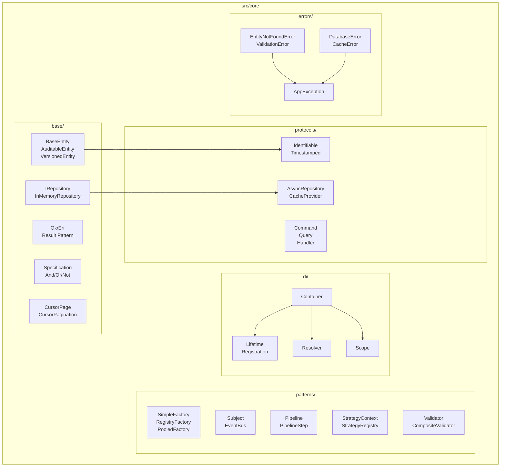

# Design Document: Ultimate Generics Code Review 2025

## Overview

Este documento descreve o design para uma revisão abrangente de código focada em Generics, boas práticas e clean code para uma API Python 2025 estado-da-arte. O objetivo é garantir código conciso, reutilizável, type-safe e seguindo padrões modernos Python 3.12+ (PEP 695).

### Escopo da Revisão

**Módulos Analisados:**
- `src/core/auth/` - JWT providers, validators, password policy
- `src/core/base/` - Entity, Repository, Result, Specification, etc.
- `src/core/config/` - Settings, logging
- `src/core/di/` - Container, lifecycle, resolver, scopes
- `src/core/errors/` - Exception hierarchy
- `src/core/patterns/` - Factory, Observer, Pipeline, Strategy, Validation
- `src/core/protocols/` - Application, data access, entities
- `src/core/security/` - Audit logger
- `src/core/types/` - Annotated types

### Análise do Estado Atual

**Pontos Fortes Identificados:**
1. ✅ Uso extensivo de PEP 695 syntax (`class Name[T]:`)
2. ✅ Result pattern bem implementado com Ok/Err
3. ✅ Specification pattern com operadores &, |, ~
4. ✅ DI Container com detecção de dependência circular
5. ✅ Protocols com @runtime_checkable
6. ✅ Entity hierarchy com BaseEntity, Auditable, Versioned
7. ✅ Dataclasses com frozen=True e slots=True
8. ✅ Documentação com Feature/Validates tags

**Oportunidades de Melhoria:**
1. ⚠️ Algumas mensagens de erro ainda usam strings literais
2. ⚠️ Falta constantes centralizadas para error codes
3. ⚠️ Alguns módulos duplicam lógica de validação
4. ⚠️ Thread safety inconsistente em singletons
5. ⚠️ Falta pretty printer para round-trip testing de Result

## Architecture



## Components and Interfaces

### 1. Generic Entity Hierarchy

```python
# Hierarquia de entidades com PEP 695
class BaseEntity[IdType: (str, int)](BaseModel):
    id: IdType | None
    created_at: datetime
    updated_at: datetime
    is_deleted: bool

class AuditableEntity[IdType: (str, int)](BaseEntity[IdType]):
    created_by: str | None
    updated_by: str | None

class VersionedEntity[IdType: (str, int), VersionT: (int, str) = int](BaseEntity[IdType]):
    version: VersionT

class AggregateRoot[IdType: (str, int)](BaseEntity[IdType]):
    _pending_events: list[DomainEvent]
```

### 2. Generic Repository Interface

```python
class IRepository[T: BaseModel, CreateT: BaseModel, UpdateT: BaseModel, IdType: (str, int) = str](ABC):
    async def get_by_id(self, id: IdType) -> T | None: ...
    async def get_all(self, *, skip: int, limit: int, filters: dict | None) -> tuple[Sequence[T], int]: ...
    async def create(self, data: CreateT) -> T: ...
    async def update(self, id: IdType, data: UpdateT) -> T | None: ...
    async def delete(self, id: IdType, *, soft: bool = True) -> bool: ...
```

### 3. Result Pattern

```python
@dataclass(frozen=True, slots=True)
class Ok[T]:
    value: T
    def map[U](self, fn: Callable[[T], U]) -> Ok[U]: ...
    def bind[U, F](self, fn: Callable[[T], Result[U, F]]) -> Result[U, F]: ...

@dataclass(frozen=True, slots=True)
class Err[E]:
    error: E
    def map_err[U](self, fn: Callable[[E], U]) -> Err[U]: ...

type Result[T, E] = Ok[T] | Err[E]
```

### 4. DI Container

```python
class Container:
    def register[T](self, service_type: type[T], factory: Callable[..., T] | None, lifetime: Lifetime) -> None: ...
    def resolve[T](self, service_type: type[T]) -> T: ...
    def create_scope(self) -> Scope: ...

class Scope:
    def resolve[T](self, service_type: type[T]) -> T: ...
    def dispose(self) -> None: ...
```

### 5. Specification Pattern

```python
class Specification[T](ABC):
    @abstractmethod
    def is_satisfied_by(self, candidate: T) -> bool: ...
    def __and__(self, other: Specification[T]) -> AndSpecification[T]: ...
    def __or__(self, other: Specification[T]) -> OrSpecification[T]: ...
    def __invert__(self) -> NotSpecification[T]: ...
```

### 6. Pipeline Pattern

```python
class PipelineStep[TInput, TOutput](ABC):
    @abstractmethod
    async def execute(self, input_data: TInput) -> TOutput: ...
    def __rshift__[TNext](self, next_step: PipelineStep[TOutput, TNext]) -> ChainedStep[TInput, TOutput, TNext]: ...

class Pipeline[TInput, TOutput]:
    def add_step[TStepOutput](self, step: PipelineStep[Any, TStepOutput]) -> Pipeline[TInput, TStepOutput]: ...
    async def execute(self, input_data: TInput) -> TOutput: ...
```

## Data Models

### Error Constants (Proposta de Melhoria)

```python
# src/core/errors/constants.py
from typing import Final

class ErrorCodes:
    """Centralized error codes."""
    ENTITY_NOT_FOUND: Final[str] = "ENTITY_NOT_FOUND"
    VALIDATION_ERROR: Final[str] = "VALIDATION_ERROR"
    AUTHENTICATION_ERROR: Final[str] = "AUTHENTICATION_ERROR"
    AUTHORIZATION_ERROR: Final[str] = "AUTHORIZATION_ERROR"
    RATE_LIMIT_EXCEEDED: Final[str] = "RATE_LIMIT_EXCEEDED"
    CONFLICT: Final[str] = "CONFLICT"
    CIRCULAR_DEPENDENCY: Final[str] = "CIRCULAR_DEPENDENCY"
    SERVICE_NOT_REGISTERED: Final[str] = "SERVICE_NOT_REGISTERED"
    INVALID_FACTORY: Final[str] = "INVALID_FACTORY"

class ErrorMessages:
    """Centralized error message templates."""
    ENTITY_NOT_FOUND: Final[str] = "{entity_type} with id '{entity_id}' not found"
    VALIDATION_FAILED: Final[str] = "Validation failed for field '{field}': {reason}"
    CIRCULAR_DEPENDENCY: Final[str] = "Circular dependency detected: {chain}"
```

### Validation Result

```python
@dataclass(frozen=True, slots=True)
class ValidationError:
    field: str
    message: str
    code: str = "validation_error"

@dataclass(frozen=True, slots=True)
class ValidationResult[T]:
    value: T | None = None
    errors: list[ValidationError] = field(default_factory=list)
    
    @property
    def is_valid(self) -> bool: ...
    def to_result(self) -> Result[T, list[ValidationError]]: ...
```

## Correctness Properties

*A property is a characteristic or behavior that should hold true across all valid executions of a system-essentially, a formal statement about what the system should do. Properties serve as the bridge between human-readable specifications and machine-verifiable correctness guarantees.*

### Property 1: PEP 695 Syntax Consistency
*For any* generic class, type alias, or function in the codebase, the definition SHALL use PEP 695 syntax (`class Name[T]:`, `type Alias[T] = ...`, `def func[T]():`) instead of legacy `Generic[T]` or `TypeVar` patterns.
**Validates: Requirements 1.1, 1.2, 1.3, 1.4, 1.5**

### Property 2: Result Pattern Round-Trip
*For any* Result value (Ok or Err), serializing to dict and deserializing back SHALL produce an equivalent Result with the same type (Ok/Err) and value.
**Validates: Requirements 5.1, 15.1**

### Property 3: DI Container Type Preservation
*For any* service type T registered in the Container, resolving that service SHALL return an instance of type T without requiring explicit type casting.
**Validates: Requirements 4.1, 4.2**

### Property 4: Circular Dependency Detection
*For any* set of services with circular dependencies, attempting to resolve any service in the cycle SHALL raise CircularDependencyError with the complete dependency chain.
**Validates: Requirements 4.3**

### Property 5: Specification Composition Laws
*For any* Specification S1 and S2, and any candidate C:
- `(S1 & S2).is_satisfied_by(C)` equals `S1.is_satisfied_by(C) and S2.is_satisfied_by(C)`
- `(S1 | S2).is_satisfied_by(C)` equals `S1.is_satisfied_by(C) or S2.is_satisfied_by(C)`
- `(~S1).is_satisfied_by(C)` equals `not S1.is_satisfied_by(C)`
**Validates: Requirements 8.2, 8.3, 8.4**

### Property 6: Pipeline Short-Circuit on Error
*For any* ResultPipeline with steps that may return Err, execution SHALL stop at the first Err and return that error without executing subsequent steps.
**Validates: Requirements 9.3**

### Property 7: Entity Timestamp Invariants
*For any* BaseEntity, after calling `mark_updated()`, the `updated_at` timestamp SHALL be greater than or equal to the previous value and greater than or equal to `created_at`.
**Validates: Requirements 7.1**

### Property 8: Version Increment Monotonicity
*For any* VersionedEntity, calling `increment_version()` SHALL increase the version number by exactly 1 (for int versions).
**Validates: Requirements 7.3**

### Property 9: Cursor Pagination Round-Trip
*For any* entity with cursor fields, encoding a cursor and decoding it back SHALL return the original field values.
**Validates: Requirements 14.2, 14.3, 15.5**

### Property 10: ValidationResult to Result Conversion
*For any* ValidationResult, calling `to_result()` SHALL return `Ok(value)` if `is_valid` is True, or `Err(errors)` if `is_valid` is False.
**Validates: Requirements 13.5**

### Property 11: Factory Singleton Identity
*For any* SingletonFactory, multiple calls to `create()` SHALL return the same instance (identity equality).
**Validates: Requirements 10.3**

### Property 12: Observer Unsubscribe Effectiveness
*For any* observer subscribed to a Subject, after calling the returned unsubscribe function, publishing events SHALL NOT notify that observer.
**Validates: Requirements 11.1**

### Property 13: Exception Serialization Completeness
*For any* AppException with a cause chain, calling `to_dict()` SHALL include all causes in the serialized output.
**Validates: Requirements 2.3, 15.3**

### Property 14: Immutable Dataclass Integrity
*For any* dataclass with `frozen=True`, attempting to modify attributes after creation SHALL raise FrozenInstanceError.
**Validates: Requirements 18.1**

### Property 15: Collect Results Aggregation
*For any* list of Results, `collect_results()` SHALL return `Ok(list of values)` if all are Ok, or the first `Err` encountered.
**Validates: Requirements 5.4**

## Error Handling

### Exception Hierarchy

```
Exception
└── AppException (base with correlation_id, timestamp, error_code)
    ├── EntityNotFoundError (404)
    ├── ValidationError (422)
    ├── AuthenticationError (401)
    ├── AuthorizationError (403)
    ├── RateLimitExceededError (429)
    ├── ConflictError (409)
    └── BusinessRuleViolationError (400)

└── InfrastructureError
    ├── DatabaseError
    ├── CacheError
    ├── TokenStoreError
    └── ExternalServiceError

└── DependencyResolutionError
    ├── CircularDependencyError
    ├── InvalidFactoryError
    └── ServiceNotRegisteredError
```

### Error Handling Strategy

1. **Domain Errors**: Use Result pattern para erros esperados
2. **Infrastructure Errors**: Raise exceptions, log e propagar
3. **Validation Errors**: Use ValidationResult com lista de erros
4. **DI Errors**: Raise exceptions específicas com contexto

## Testing Strategy

### Dual Testing Approach

Este projeto usa tanto **unit tests** quanto **property-based tests** para cobertura completa:

- **Unit Tests**: Verificam exemplos específicos, edge cases e integração
- **Property Tests**: Verificam propriedades universais que devem valer para todas as entradas

### Property-Based Testing Framework

**Framework**: `hypothesis` (Python)

**Configuração**: Mínimo de 100 iterações por property test

### Test Organization

```
tests/
├── unit/
│   └── core/
│       ├── test_entity.py
│       ├── test_result.py
│       ├── test_container.py
│       └── test_specification.py
└── properties/
    └── test_ultimate_generics_properties.py
```

### Property Test Annotations

Cada property test DEVE incluir comentário referenciando a property do design:

```python
@given(st.text(), st.integers())
@settings(max_examples=100)
def test_result_round_trip(value, error):
    """
    **Feature: ultimate-generics-code-review-2025, Property 2: Result Pattern Round-Trip**
    **Validates: Requirements 5.1, 15.1**
    """
    # Test implementation
```

### Key Test Strategies

1. **Generators Inteligentes**: Criar generators que produzem dados válidos dentro do espaço de entrada
2. **Round-Trip Testing**: Para serialização/deserialização
3. **Invariant Testing**: Para operações que devem preservar propriedades
4. **Composition Testing**: Para operadores como &, |, ~

