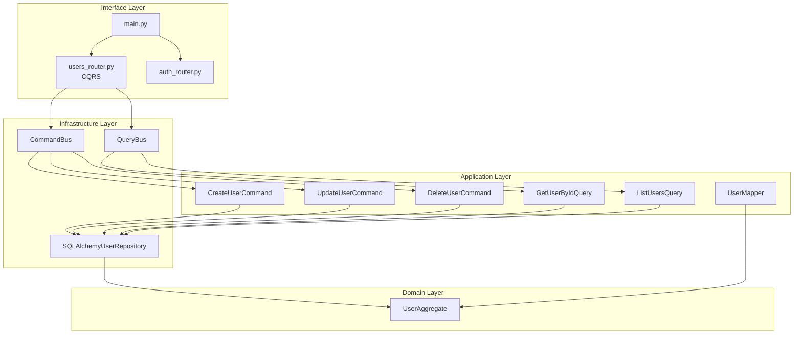

# Design Document

## Overview

Este design resolve os problemas de integração do módulo `src/application/users` com o workflow principal da aplicação. A solução envolve:

1. Remover o router mock (`interface/v1/auth/users_router.py`) e usar o router CQRS real
2. Atualizar imports no `main.py` para usar o router correto
3. Corrigir imports nos testes de propriedades
4. Garantir que os testes de round-trip do mapper funcionem corretamente

## Architecture



## Components and Interfaces

### 1. Router Consolidation

**Arquivo a remover:** `src/interface/v1/auth/users_router.py`

**Arquivo a manter:** `src/interface/v1/users_router.py`

**Mudança em `src/interface/v1/auth/__init__.py`:**
```python
# Antes
from interface.v1.auth.router import router as auth_router
from interface.v1.auth.users_router import router as users_router

# Depois
from interface.v1.auth.router import router as auth_router
# users_router removido daqui
```

**Mudança em `src/main.py`:**
```python
# Antes
from interface.v1.auth import auth_router, users_router

# Depois
from interface.v1.auth import auth_router
from interface.v1.users_router import router as users_router
```

### 2. Test Import Corrections

**Arquivo:** `tests/properties/test_mapper_roundtrip_properties.py`

```python
# Antes (incorreto)
from my_app.application.users.mappers import UserMapper
from my_app.application.users.dto import UserDTO
from my_app.domain.users.aggregates import UserAggregate

# Depois (correto)
from application.users.commands.mapper import UserMapper
from application.users.commands.dtos import UserDTO
from domain.users.aggregates import UserAggregate
```

### 3. UserMapper Interface

```python
class UserMapper(IMapper[UserAggregate, UserDTO]):
    def to_dto(self, aggregate: UserAggregate) -> UserDTO
    def to_entity(self, dto: UserDTO) -> UserAggregate
    def to_list_dto(self, aggregate: UserAggregate) -> UserListDTO
```

## Data Models

### UserDTO (Write Model)
```python
class UserDTO(BaseModel):
    id: str
    email: str
    username: str | None
    display_name: str | None
    is_active: bool
    is_verified: bool
    created_at: datetime
    updated_at: datetime
    last_login_at: datetime | None
```

### UserAggregate (Domain)
```python
class UserAggregate(AggregateRoot[str]):
    email: str
    password_hash: str
    username: str | None
    display_name: str | None
    is_active: bool
    is_verified: bool
    last_login_at: datetime | None
```

## Correctness Properties

*A property is a characteristic or behavior that should hold true across all valid executions of a system-essentially, a formal statement about what the system should do. Properties serve as the bridge between human-readable specifications and machine-verifiable correctness guarantees.*

### Property Reflection

Analisando as propriedades identificadas no prework:
- 4.1, 4.2 e 4.3 são todas sobre round-trip do mapper
- 4.1 (Aggregate → DTO) e 4.2 (DTO → Aggregate) são subconjuntos de 4.3 (round-trip completo)
- Podemos consolidar em uma única propriedade de round-trip que cobre todos os casos

### Property 1: Mapper Round-Trip Preserves Data

*For any* valid UserAggregate with arbitrary field values, converting to UserDTO and back to UserAggregate SHALL produce an object where all DTO-visible fields (id, email, username, display_name, is_active, is_verified, created_at, updated_at) are equivalent to the original.

**Validates: Requirements 4.1, 4.2, 4.3**

### Property 2: Command Dispatch Preserves User Data

*For any* valid CreateUserDTO with arbitrary email, password, username, and display_name, dispatching CreateUserCommand through the CommandBus SHALL result in a UserAggregate with matching email, username, and display_name fields.

**Validates: Requirements 1.2**

## Error Handling

| Error Condition | Response |
|----------------|----------|
| Import não encontrado | ImportError com mensagem clara do módulo faltante |
| UserAggregate None no mapper | ValueError("aggregate parameter cannot be None") |
| UserDTO None no mapper | ValueError("dto parameter cannot be None") |
| Tipo incorreto no mapper | TypeError com mensagem indicando tipo esperado |

## Testing Strategy

### Property-Based Testing

**Framework:** Hypothesis (já configurado no projeto)

**Configuração:**
- Mínimo de 100 iterações por propriedade
- Estratégias para geração de dados:
  - `email_strategy`: `st.emails()`
  - `username_strategy`: `st.text(min_size=3, max_size=50)`
  - `user_id_strategy`: `st.text(min_size=10, max_size=26, alphabet=ULID_CHARS)`
  - `datetime_strategy`: `st.datetimes(min_value=datetime(2020,1,1), max_value=datetime(2030,12,31))`

**Anotação obrigatória:**
```python
# **Feature: users-module-integration-fix, Property 1: Mapper Round-Trip Preserves Data**
# **Validates: Requirements 4.1, 4.2, 4.3**
```

### Unit Tests

1. Verificar que imports funcionam sem erro
2. Verificar que router CQRS está registrado no app
3. Verificar que endpoints mantêm assinaturas esperadas

### Integration Tests

1. Testar POST `/api/v1/users` cria usuário via CQRS
2. Testar GET `/api/v1/users` lista usuários via CQRS
3. Testar GET `/api/v1/users/{id}` retorna usuário específico
