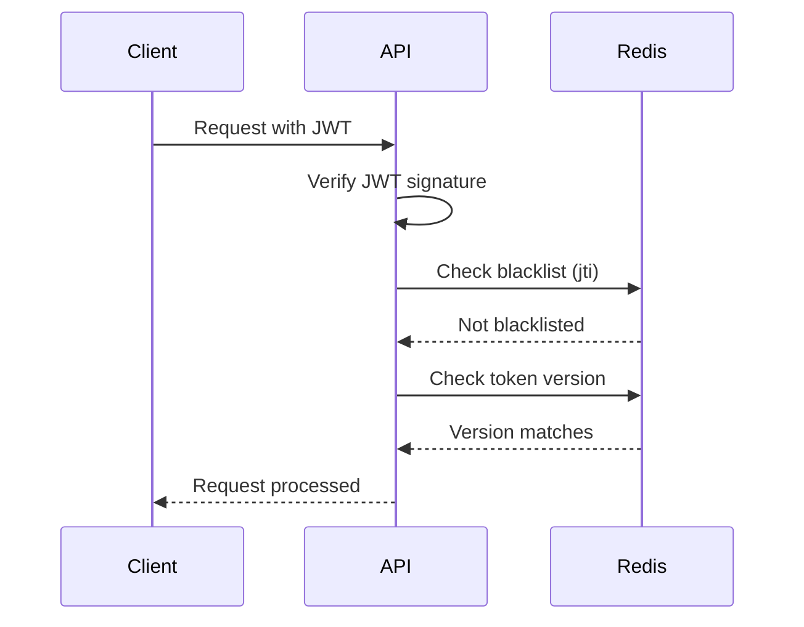

# ADR-004: Token Revocation via Redis

## Status
Accepted

## Context

JWT tokens are stateless and cannot be invalidated once issued. The system needs:
- Ability to revoke tokens on logout
- Ability to invalidate all tokens for a user (password change, security breach)
- Minimal performance impact on token validation
- Automatic cleanup of expired entries

## Decision

We implement token revocation using a Redis-based blacklist:

### Blacklist Strategy

```python
# src/infrastructure/auth/token_store/
class TokenBlacklist:
    async def revoke_token(self, jti: str, exp: datetime) -> None:
        """Add token to blacklist with TTL matching token expiration."""
        ttl = (exp - datetime.utcnow()).total_seconds()
        await self.redis.setex(f"blacklist:{jti}", int(ttl), "1")

    async def is_revoked(self, jti: str) -> bool:
        """Check if token is in blacklist."""
        return await self.redis.exists(f"blacklist:{jti}") > 0

    async def revoke_all_user_tokens(self, user_id: str) -> None:
        """Revoke all tokens for a user by incrementing version."""
        await self.redis.incr(f"token_version:{user_id}")
```

### Token Validation Flow



### TTL Management

- Blacklist entries expire when the original token would expire
- No manual cleanup required
- Memory usage bounded by token lifetime

### Performance Considerations

- Single Redis lookup per request
- Pipeline multiple checks when possible
- Use Redis cluster for high availability

## Consequences

### Positive
- Immediate token revocation capability
- Automatic cleanup via TTL
- Minimal storage (only revoked tokens)
- User-level revocation for security incidents

### Negative
- Adds Redis dependency for authentication
- Additional latency per request (~1ms)
- Redis must be highly available

### Neutral
- Requires Redis infrastructure
- Token version adds complexity but enables bulk revocation

## Alternatives Considered

1. **Database blacklist** - Rejected due to higher latency and no automatic cleanup
2. **Short-lived tokens only** - Rejected as poor UX requiring frequent re-authentication
3. **Token introspection endpoint** - Rejected as adds complexity and latency

## References

- [src/infrastructure/auth/token_store/](../../src/infrastructure/auth/token_store/)
- [src/infrastructure/redis/client.py](../../src/infrastructure/redis/client.py)
- [ADR-001: JWT Authentication](ADR-001-jwt-authentication.md)

## History

| Date | Status | Notes |
|------|--------|-------|
| 2024-12-02 | Proposed | Initial proposal |
| 2024-12-02 | Accepted | Approved for implementation |
