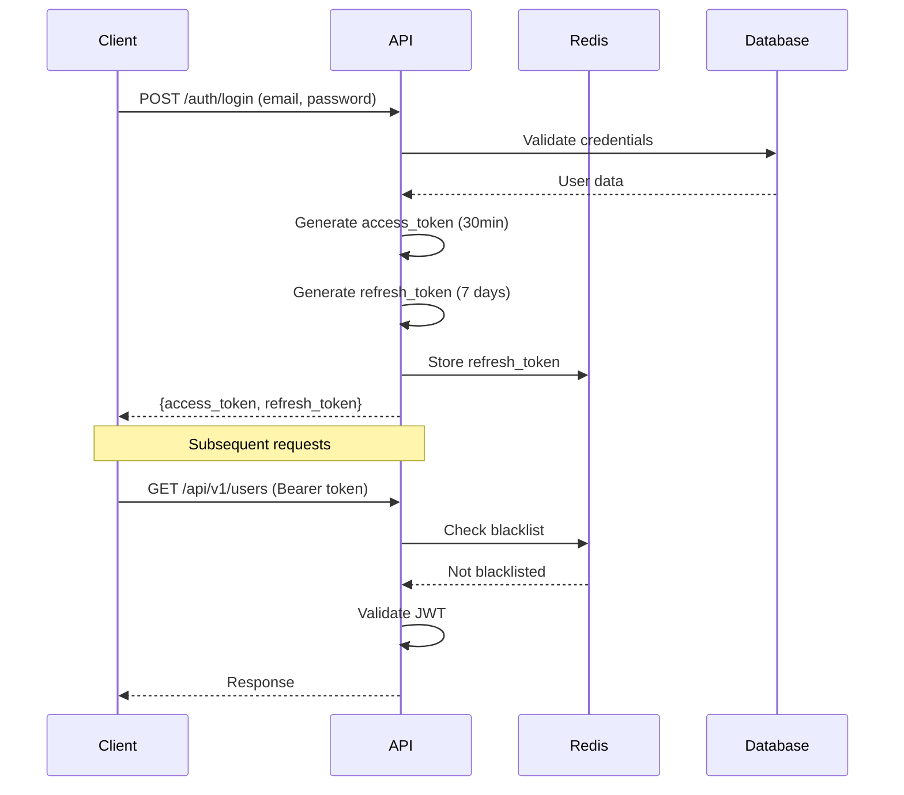
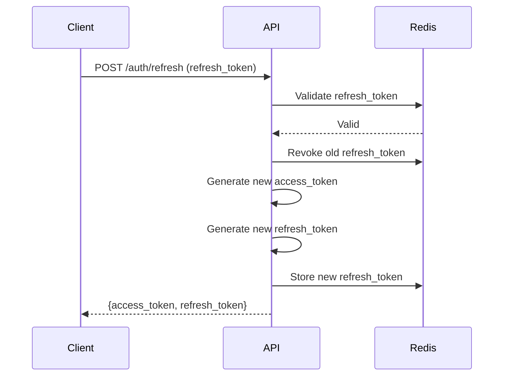

# API Security

Este documento descreve as práticas de segurança implementadas no Python API Base.

## 1. Authentication

### JWT Token Flow



### Token Structure

**Access Token Claims:**
```json
{
    "sub": "user-id",
    "roles": ["user", "admin"],
    "exp": 1701432000,
    "iat": 1701430200,
    "jti": "unique-token-id"
}
```

**Refresh Token Claims:**
```json
{
    "sub": "user-id",
    "exp": 1702036800,
    "iat": 1701432000,
    "jti": "unique-refresh-id",
    "type": "refresh"
}
```

### Refresh Token Rotation



### Token Revocation

Tokens são revogados via blacklist no Redis:

```python
# Revoke single token
await token_store.revoke_token(jti, expiration)

# Revoke all user tokens
await token_store.revoke_all_user_tokens(user_id)
```

### Password Policy

Configuração em `src/infrastructure/auth/password_policy.py`:

| Requisito | Valor |
|-----------|-------|
| Comprimento mínimo | 12 caracteres |
| Letra maiúscula | Obrigatório |
| Letra minúscula | Obrigatório |
| Número | Obrigatório |
| Caractere especial | Obrigatório |
| Histórico de senhas | Últimas 5 |

```python
password_policy = PasswordPolicy(
    min_length=12,
    require_uppercase=True,
    require_lowercase=True,
    require_digit=True,
    require_special=True,
    password_history=5,
)
```

## 2. Authorization (RBAC)

### Role Hierarchy

```
SuperAdmin
    └── Admin
        └── Manager
            └── User
                └── Guest
```

### Role Definitions

| Role | Descrição | Permissões |
|------|-----------|------------|
| `guest` | Usuário não autenticado | Leitura pública |
| `user` | Usuário autenticado | CRUD próprios recursos |
| `manager` | Gerente | CRUD recursos do time |
| `admin` | Administrador | CRUD todos recursos |
| `superadmin` | Super administrador | Acesso total + configurações |

### Permission Composition

```python
# Definição de permissões
Permission(resource="users", action="read", scope="own")
Permission(resource="users", action="write", scope="own")
Permission(resource="users", action="read", scope="*")  # Todos
Permission(resource="users", action="delete", scope="*")

# Composição em roles
admin_role = Role(
    name="admin",
    permissions=[
        Permission("users", "read", "*"),
        Permission("users", "write", "*"),
        Permission("users", "delete", "*"),
    ],
)
```

### Endpoint Protection

```python
from infrastructure.rbac import require_permission

@router.get("/users")
async def list_users(
    _: None = Depends(require_permission("users", "read")),
) -> list[UserDTO]:
    ...

@router.delete("/users/{user_id}")
async def delete_user(
    user_id: str,
    _: None = Depends(require_permission("users", "delete")),
) -> None:
    ...
```

## 3. Sensitive Data Handling

### PII Guidelines

| Dado | Classificação | Tratamento |
|------|---------------|------------|
| Email | PII | Criptografar em repouso |
| Nome | PII | Criptografar em repouso |
| CPF/SSN | PII Sensível | Criptografar + mascarar |
| Senha | Credencial | Hash (Argon2) |
| Token | Credencial | Não persistir |

### Credential Redaction in Logs

Campos automaticamente redactados:
- `password`
- `token`
- `secret`
- `authorization`
- `api_key`
- `credit_card`

```python
# Configuração em structlog
structlog.configure(
    processors=[
        # ... outros processors
        RedactSensitiveData(
            fields=["password", "token", "secret", "authorization"],
        ),
    ],
)
```

### Secure Configuration

```python
# Usar SecretStr para credenciais
class SecuritySettings(BaseSettings):
    secret_key: SecretStr  # Não aparece em logs/repr
    database_password: SecretStr

# Acessar valor
settings.secret_key.get_secret_value()
```

## 4. Security Headers

### Content Security Policy (CSP)

```python
SecurityHeadersMiddleware(
    content_security_policy=(
        "default-src 'self'; "
        "script-src 'self' 'nonce-{nonce}'; "
        "style-src 'self' 'unsafe-inline'; "
        "img-src 'self' data: https:; "
        "font-src 'self'; "
        "connect-src 'self'; "
        "frame-ancestors 'none'; "
        "base-uri 'self'; "
        "form-action 'self'"
    ),
)
```

### HTTP Strict Transport Security (HSTS)

```python
strict_transport_security="max-age=31536000; includeSubDomains; preload"
```

### Other Headers

| Header | Valor | Propósito |
|--------|-------|-----------|
| `X-Frame-Options` | `DENY` | Prevenir clickjacking |
| `X-Content-Type-Options` | `nosniff` | Prevenir MIME sniffing |
| `Referrer-Policy` | `strict-origin-when-cross-origin` | Controlar referrer |
| `Permissions-Policy` | `geolocation=(), microphone=(), camera=()` | Desabilitar APIs |

### Configuração Completa

```python
# src/interface/middleware/security_headers.py
app.add_middleware(
    SecurityHeadersMiddleware,
    content_security_policy="default-src 'self'",
    x_frame_options="DENY",
    x_content_type_options="nosniff",
    strict_transport_security="max-age=31536000; includeSubDomains",
    referrer_policy="strict-origin-when-cross-origin",
    permissions_policy="geolocation=(), microphone=(), camera=()",
)
```

## 5. Rate Limiting

### Configuração

```python
# Por IP
@limiter.limit("100/minute")

# Por usuário
@limiter.limit("1000/hour", key_func=get_user_id)

# Por endpoint
@limiter.limit("10/minute")  # Endpoints sensíveis
```

### Sliding Window

Implementação com Redis para rate limiting distribuído:

```python
class SlidingWindowRateLimiter:
    async def is_allowed(self, key: str, limit: int, window: int) -> bool:
        ...
```

## 6. Input Validation

### Pydantic Validation

```python
class CreateUserDTO(BaseModel):
    email: EmailStr
    name: str = Field(min_length=2, max_length=100)
    password: str = Field(min_length=12)

    @field_validator("name")
    @classmethod
    def sanitize_name(cls, v: str) -> str:
        return bleach.clean(v)
```

### SQL Injection Prevention

- Usar SQLAlchemy ORM (queries parametrizadas)
- Nunca concatenar strings em queries
- Validar inputs antes de usar em queries

## 7. OWASP Compliance

### API Security Top 10

| # | Vulnerabilidade | Mitigação |
|---|-----------------|-----------|
| 1 | Broken Object Level Authorization | RBAC + ownership checks |
| 2 | Broken Authentication | JWT + refresh rotation |
| 3 | Broken Object Property Level Authorization | DTO validation |
| 4 | Unrestricted Resource Consumption | Rate limiting |
| 5 | Broken Function Level Authorization | Permission decorators |
| 6 | Unrestricted Access to Sensitive Business Flows | Business logic validation |
| 7 | Server Side Request Forgery | URL validation |
| 8 | Security Misconfiguration | Security headers |
| 9 | Improper Inventory Management | API versioning |
| 10 | Unsafe Consumption of APIs | Input validation |

## Referências

- [ADR-001: JWT Authentication](../adr/ADR-001-jwt-authentication.md)
- [ADR-002: RBAC Implementation](../adr/ADR-002-rbac-implementation.md)
- [ADR-004: Token Revocation](../adr/ADR-004-token-revocation.md)
- [OWASP API Security Top 10](https://owasp.org/www-project-api-security/)
