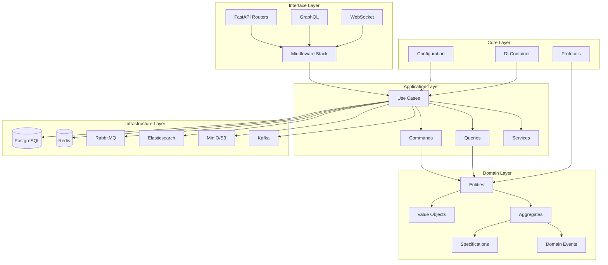
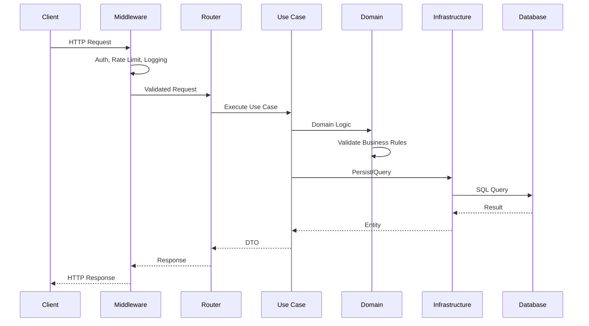

# Arquitetura do Sistema

## Visão Geral da Arquitetura

O Python API Base implementa uma arquitetura em camadas baseada em Clean Architecture, com forte influência de Domain-Driven Design (DDD) e padrões enterprise.

## Diagrama de Arquitetura



## Camadas da Arquitetura

### 1. Core Layer (Kernel)

O núcleo da aplicação contém configurações, protocolos e utilitários fundamentais.

```
src/core/
├── base/           # Classes base abstratas
├── config/         # Configurações centralizadas
│   ├── settings.py      # Settings principal
│   ├── database.py      # Config de banco
│   ├── security.py      # Config de segurança
│   └── observability.py # Config de observabilidade
├── di/             # Dependency Injection
├── errors/         # Exception handlers
├── protocols/      # Interfaces (Protocol classes)
├── shared/         # Utilitários compartilhados
│   └── logging.py       # Structured logging
└── types/          # Type definitions
```

#### Configuração (Pydantic Settings)

```python
class Settings(BaseSettings):
    model_config = SettingsConfigDict(
        env_file=".env",
        env_nested_delimiter="__",
    )
    
    app_name: str = "My API"
    database: DatabaseSettings
    security: SecuritySettings
    observability: ObservabilitySettings
```

#### Protocolos (Interfaces)

```python
class AsyncRepository[T, ID](Protocol):
    async def get(self, id: ID) -> T | None: ...
    async def create(self, entity: T) -> T: ...
    async def update(self, entity: T) -> T: ...
    async def delete(self, id: ID) -> bool: ...
```

### 2. Domain Layer

Contém a lógica de negócio pura, sem dependências externas.

```
src/domain/
├── common/
│   ├── specification.py  # Specification Pattern
│   ├── value_objects.py  # Value Objects base
│   └── events.py         # Domain Events
├── users/
│   ├── entities.py       # User entity
│   ├── repository.py     # Repository interface
│   └── events.py         # User domain events
└── items/
    ├── entities.py
    └── repository.py
```

#### Specification Pattern

```python
class Specification[T](ABC):
    @abstractmethod
    def is_satisfied_by(self, candidate: T) -> bool: ...
    
    def and_spec(self, other: "Specification[T]") -> "Specification[T]":
        return AndSpecification(self, other)
    
    def or_spec(self, other: "Specification[T]") -> "Specification[T]":
        return OrSpecification(self, other)
```

#### Operadores de Comparação

```python
class ComparisonOperator(Enum):
    EQ = "eq"
    NE = "ne"
    GT = "gt"
    GE = "ge"
    LT = "lt"
    LE = "le"
    CONTAINS = "contains"
    STARTS_WITH = "starts_with"
    IN = "in"
    IS_NULL = "is_null"
```

### 3. Application Layer

Orquestra casos de uso e coordena entre domínio e infraestrutura.

```
src/application/
├── common/
│   ├── cqrs/            # Command/Query Separation
│   │   ├── commands.py
│   │   ├── queries.py
│   │   └── bus.py
│   ├── middleware/      # Pipeline middleware
│   └── batch/           # Batch operations
├── services/
│   ├── feature_flags/   # Feature toggles
│   ├── file_upload/     # Upload handling
│   └── multitenancy/    # Tenant isolation
├── users/
│   ├── commands/        # Write operations
│   ├── queries/         # Read operations
│   └── dtos.py          # Data Transfer Objects
└── items/
    ├── commands/
    └── queries/
```

#### CQRS Pattern

```python
@dataclass
class CreateUserCommand(Command[User]):
    email: str
    name: str
    
    async def execute(self) -> Result[User, str]:
        # Business logic
        return Ok(user)

@dataclass
class GetUserQuery(Query[UserDTO]):
    user_id: str
    cacheable: bool = True
    
    async def execute(self) -> UserDTO:
        return await repository.get(self.user_id)
```

### 4. Infrastructure Layer

Implementações concretas de interfaces e integrações externas.

```
src/infrastructure/
├── audit/              # Audit trail
│   ├── models.py       # AuditRecord[T]
│   └── store.py        # AuditStore[TProvider]
├── auth/               # Authentication
│   ├── jwt.py          # JWT handling
│   └── password_policy.py
├── cache/              # Caching
│   ├── protocols.py    # CacheProvider[T]
│   ├── redis_provider.py
│   ├── memory_provider.py
│   └── decorators.py   # @cached
├── db/                 # Database
│   ├── session.py      # AsyncSession
│   ├── repository.py   # SQLAlchemy repository
│   └── query_builder/  # Query construction
├── elasticsearch/      # Search
│   ├── repository.py
│   └── query.py
├── kafka/              # Event streaming
│   ├── producer.py
│   └── transaction.py
├── minio/              # Object storage
│   ├── client.py
│   ├── upload_operations.py
│   └── download_operations.py
├── observability/      # Telemetry
│   ├── middleware.py
│   └── telemetry/
├── rbac/               # Authorization
│   └── checker.py
├── redis/              # Redis client
│   └── client.py
├── resilience/         # Fault tolerance
│   └── patterns.py     # CircuitBreaker, Retry, Bulkhead
├── storage/            # File storage
│   └── handlers.py
└── tasks/              # Background jobs
    ├── rabbitmq_queue.py
    ├── rabbitmq_worker.py
    └── rabbitmq_rpc.py
```

#### Cache Provider Protocol

```python
class CacheProvider[T](Protocol):
    async def get(self, key: str) -> T | None: ...
    async def set(self, key: str, value: T, ttl: int | None = None) -> None: ...
    async def delete(self, key: str) -> bool: ...
    async def exists(self, key: str) -> bool: ...
    async def clear_pattern(self, pattern: str) -> int: ...
    async def get_stats(self) -> CacheStats: ...
```

#### Resilience Patterns

```python
# Circuit Breaker
class CircuitBreaker[TConfig]:
    def __init__(self, config: CircuitBreakerConfig): ...
    async def execute(self, func: Callable) -> T: ...

# Retry with Backoff
class Retry[T]:
    def __init__(self, config: RetryConfig): ...
    async def execute(self, func: Callable[[], T]) -> T: ...

# Bulkhead (Concurrency Limiter)
class Bulkhead:
    def __init__(self, config: BulkheadConfig): ...
    async def execute(self, func: Callable) -> T: ...
```

### 5. Interface Layer

Exposição da API via HTTP, GraphQL e WebSocket.

```
src/interface/
├── errors/             # Error handlers
│   └── handlers.py     # RFC 7807 Problem Details
├── graphql/            # GraphQL
│   └── schema.py
├── middleware/         # HTTP Middleware
│   ├── production.py   # Production stack
│   └── security_headers.py
├── routes/             # Route definitions
├── v1/                 # API v1
│   ├── auth.py
│   ├── users.py
│   ├── items.py
│   └── health_router.py
├── v2/                 # API v2
├── versioning/         # Version management
│   └── strategies.py
├── websocket/          # WebSocket
│   └── handlers.py
├── dependencies.py     # FastAPI dependencies
├── openapi.py          # OpenAPI customization
├── router.py           # Main router
└── versioning.py       # Version utilities
```

## Fluxo de Dados



## Padrões de Design Utilizados

| Padrão | Localização | Propósito |
|--------|-------------|-----------|
| Repository | `infrastructure/db/` | Abstração de persistência |
| Specification | `domain/common/` | Regras de negócio composáveis |
| CQRS | `application/common/cqrs/` | Separação leitura/escrita |
| Circuit Breaker | `infrastructure/resilience/` | Tolerância a falhas |
| Decorator | `infrastructure/cache/` | Caching transparente |
| Factory | `tests/factories/` | Criação de objetos de teste |
| Strategy | `domain/common/specification.py` | Algoritmos intercambiáveis |
| Observer | `domain/common/events.py` | Domain events |
| Unit of Work | `infrastructure/db/` | Transações atômicas |

## Injeção de Dependência

O sistema utiliza `dependency-injector` para IoC:

```python
class Container(containers.DeclarativeContainer):
    config = providers.Configuration()
    
    db_session = providers.Factory(
        get_async_session,
        database_url=config.database.url,
    )
    
    user_repository = providers.Factory(
        UserRepository,
        session=db_session,
    )
    
    user_service = providers.Factory(
        UserService,
        repository=user_repository,
    )
```

## Segurança

### Middleware Stack

```python
# Ordem de execução (primeiro para último)
1. LoggingMiddleware      # Correlation ID, Request logging
2. CORSMiddleware         # Cross-Origin Resource Sharing
3. SecurityHeadersMiddleware  # CSP, HSTS, X-Frame-Options
4. RateLimitMiddleware    # Rate limiting
5. AuthMiddleware         # JWT validation
6. AuditMiddleware        # Audit trail
```

### Headers de Segurança

```python
SecurityHeadersMiddleware(
    content_security_policy="default-src 'self'",
    x_frame_options="DENY",
    x_content_type_options="nosniff",
    strict_transport_security="max-age=31536000; includeSubDomains",
    referrer_policy="strict-origin-when-cross-origin",
    permissions_policy="geolocation=(), microphone=(), camera=()",
)
```

## Observabilidade

### Tracing (OpenTelemetry)

```python
@traced(name="process_order", attributes={"service": "orders"})
async def process_order(order_id: str) -> Order:
    # Span criado automaticamente
    return await order_service.process(order_id)
```

### Logging (structlog)

```python
logger.info(
    "order_processed",
    order_id=order_id,
    total=order.total,
    items_count=len(order.items),
)
```

### Metrics (Prometheus)

```python
# Endpoint: /metrics
# Métricas automáticas:
- http_requests_total
- http_request_duration_seconds
- http_requests_in_progress
```
