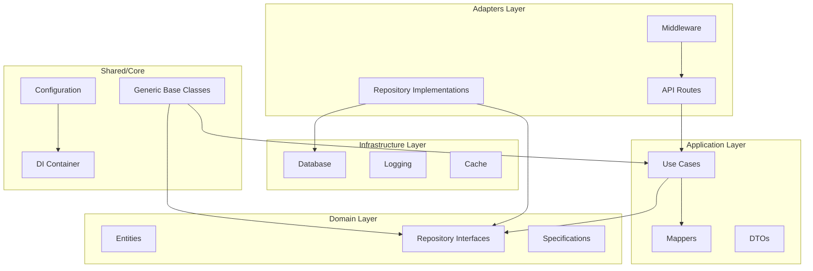
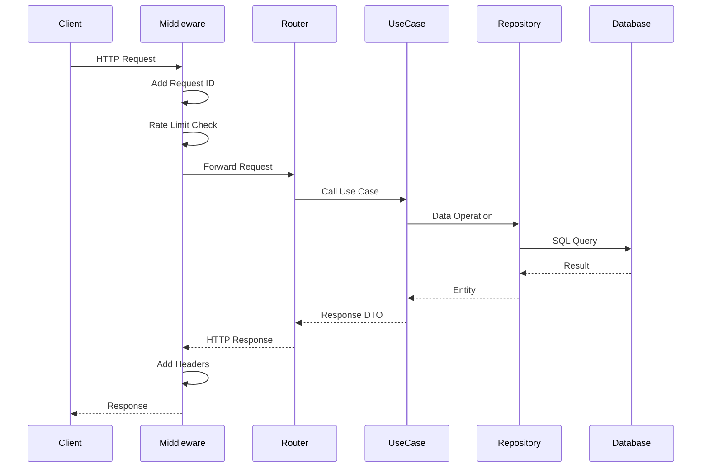
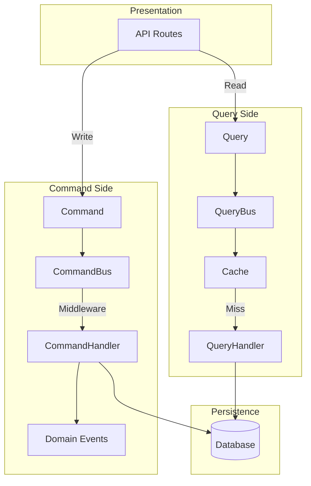

# Architecture

This project follows Clean Architecture principles with a focus on code reuse through Python Generics.

## Layer Diagram



## Request Flow



## Directory Structure

```
src/my_api/
├── core/                    # Application core
│   ├── config.py           # Pydantic Settings
│   ├── container.py        # DI Container
│   └── exceptions.py       # Domain exceptions
│
├── shared/                  # Reusable generics
│   ├── repository.py       # IRepository[T]
│   ├── use_case.py         # BaseUseCase[T]
│   ├── router.py           # GenericCRUDRouter[T]
│   ├── dto.py              # ApiResponse, PaginatedResponse
│   ├── mapper.py           # IMapper[T, DTO]
│   └── entity.py           # BaseEntity
│
├── domain/                  # Business domain
│   └── entities/           # Domain entities
│       └── item.py
│
├── application/             # Application logic
│   ├── use_cases/          # Business operations
│   └── mappers/            # Entity <-> DTO
│
├── adapters/                # External interfaces
│   ├── api/
│   │   ├── routes/         # FastAPI routers
│   │   └── middleware/     # Request processing
│   └── repositories/       # Data access
│
└── infrastructure/          # Technical concerns
    ├── database/           # DB session, migrations
    └── logging/            # Structured logging
```

## Key Design Decisions

### 1. Generic Base Classes
All CRUD operations are implemented once in generic base classes:
- `IRepository[T, CreateDTO, UpdateDTO]` - Data access interface
- `BaseUseCase[T, CreateDTO, UpdateDTO, ResponseDTO]` - Business logic
- `GenericCRUDRouter[T]` - API endpoints

### 2. Dependency Injection
Using `dependency-injector` for:
- Singleton configuration
- Factory-based session management
- Easy testing with overrides

### 3. Unit of Work Pattern
Transaction management through `IUnitOfWork`:
- Atomic operations across repositories
- Automatic rollback on errors

### 4. Result Pattern
Explicit error handling with `Result[T, E]`:
- `Ok[T]` for success
- `Err[E]` for failures
- No hidden exceptions

### 5. Property-Based Testing
Using Hypothesis for:
- Correctness properties
- Edge case discovery
- Round-trip validation

### 6. Domain Events
Decoupled communication through `EventBus`:
- `DomainEvent` base class for all events
- Async and sync handler support
- Global event bus for cross-cutting concerns

### 7. Resilience Patterns
For external service integration:
- `CircuitBreaker` - Prevents cascading failures
- `retry` decorator - Exponential backoff with jitter
- Configurable thresholds and timeouts

### 8. Code Generation
Entity scaffolding with `scripts/generate_entity.py`:
- Generates entity, mapper, use case, and routes
- Follows project conventions automatically
- Reduces boilerplate and ensures consistency
- `--with-events` flag for domain event generation
- `--with-cache` flag for cache decorator generation
- Generates property-based tests alongside implementation

### 9. Protocol-Based Interfaces
Using Python Protocols for structural subtyping:
- `Identifiable`, `Timestamped`, `SoftDeletable` protocols
- `AsyncRepository` protocol for data access
- `CacheProvider` protocol for cache backends
- Runtime checkable with `@runtime_checkable`

### 10. Advanced Specification Pattern
Composable business rules with SQL generation:
- `FieldSpecification` with comparison operators
- `CompositeSpecification` for AND/OR logic
- `NotSpecification` for negation
- `SpecificationBuilder` for fluent API
- `to_sql_condition()` for SQLAlchemy integration

### 11. Multi-Level Caching
Flexible caching with multiple backends:
- `InMemoryCacheProvider` with LRU eviction
- `RedisCacheProvider` with JSON serialization
- `@cached` decorator for function results
- Configurable TTL and key generation
- Graceful degradation on failures

### 12. OpenTelemetry Observability
Comprehensive observability with OpenTelemetry:
- `TelemetryProvider` for traces and metrics
- `@traced` decorator for custom spans
- `TracingMiddleware` for HTTP requests
- Log correlation with trace_id and span_id
- OTLP exporter support

### 13. CQRS Pattern
Command Query Responsibility Segregation:
- `Command` and `Query` base classes
- `CommandBus` with middleware support
- `QueryBus` with caching support
- Domain event emission after commands
- Handler registration by type

## Caching Architecture

```mermaid
graph TB
    subgraph "Application Layer"
        UC[Use Case]
        DEC[@cached Decorator]
    end
    
    subgraph "Cache Layer"
        L1[L1: InMemoryCache]
        L2[L2: RedisCache]
    end
    
    subgraph "Data Layer"
        DB[(Database)]
    end
    
    UC --> DEC
    DEC --> L1
    L1 -->|Miss| L2
    L2 -->|Miss| DB
    DB -->|Result| L2
    L2 -->|Result| L1
    L1 -->|Result| DEC
```

### Cache Flow
1. Request hits `@cached` decorator
2. Check L1 (in-memory) cache
3. On miss, check L2 (Redis) cache
4. On miss, execute function and store result
5. LRU eviction when L1 reaches max_size
6. TTL-based expiration for both layers

## Observability Architecture

```mermaid
graph TB
    subgraph "Application"
        REQ[HTTP Request]
        MW[TracingMiddleware]
        TRACED[@traced Functions]
        LOG[Structured Logs]
    end
    
    subgraph "OpenTelemetry SDK"
        TP[TracerProvider]
        MP[MeterProvider]
        PROC[Processors]
    end
    
    subgraph "Exporters"
        OTLP[OTLP Exporter]
    end
    
    subgraph "Backend"
        JAEGER[Jaeger/Tempo]
        PROM[Prometheus]
    end
    
    REQ --> MW
    MW --> TP
    TRACED --> TP
    LOG -->|trace_id, span_id| TP
    TP --> PROC
    MP --> PROC
    PROC --> OTLP
    OTLP --> JAEGER
    OTLP --> PROM
```

### Trace Context Flow
1. `TracingMiddleware` creates root span for HTTP requests
2. `@traced` decorator creates child spans for functions
3. `trace_id` and `span_id` injected into structured logs
4. Context propagated via W3C Trace Context headers
5. Metrics collected for request duration, status codes

## CQRS Architecture



### CQRS Flow
1. Commands for write operations, Queries for reads
2. CommandBus dispatches to registered handlers
3. Middleware chain for cross-cutting concerns
4. Domain events emitted after successful commands
5. QueryBus supports result caching
