# C4 Model Diagrams

## Level 1: System Context

```mermaid
graph TB
    subgraph "External Systems"
        USER[👤 User/Client]
        ADMIN[👤 Admin]
        EXT_SVC[External Services]
    end
    
    subgraph "Python API Base"
        API[Python API Base<br/>REST/GraphQL/WebSocket API]
    end
    
    subgraph "Data Stores"
        PG[(PostgreSQL)]
        REDIS[(Redis)]
        ES[(Elasticsearch)]
        MINIO[(MinIO/S3)]
    end
    
    subgraph "Messaging"
        KAFKA[Kafka]
        RABBIT[RabbitMQ]
    end
    
    USER -->|HTTP/WS| API
    ADMIN -->|HTTP| API
    API -->|HTTP| EXT_SVC
    API -->|SQL| PG
    API -->|Cache| REDIS
    API -->|Search| ES
    API -->|Storage| MINIO
    API -->|Events| KAFKA
    API -->|Tasks| RABBIT
```

## Level 2: Container Diagram

## Level 3: Component Diagram - Core Layer

## Level 3: Component Diagram - Infrastructure Layer

## Level 3: Component Diagram - Interface Layer

## Related Documentation

- [Data Flows](data-flows.md)
- [Dependencies](dependencies.md)
- [Layers Documentation](../layers/index.md)
